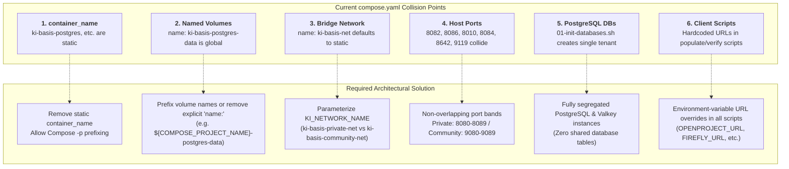

# Comprehensive Codebase & Service Survey: `ki-basis` Infrastructure

**Author:** `explorer_survey_2` (Codebase & Service Explorer)  
**Working Directory:** `C:\GitDev\apexai-os-meta\.agents\explorer_survey_2`  
**Target Repository:** `C:\GitDev\apexai-os-meta`  
**Date:** 2026-09-07  
**Status:** COMPLETE

---

## 1. Executive Summary

The `ki-basis` subsystem located at `C:\GitDev\apexai-os-meta\ki-basis` constitutes a self-contained, containerized operating foundation consisting of seven core services: **PostgreSQL 16 (with pgvector)**, **Valkey 8 (Redis-compatible cache)**, **Firefly III (financial accounting)**, **Paperless-ngx (document OCR & archival)**, **OpenProject 14 (enterprise project governance)**, **Nginx (HTTP edge reverse proxy)**, and **Nous Research Hermes Agent (autonomous AI runtime & Telegram intake)**.

While the current deployment succeeds under single-instance Windows 11 Docker Desktop (Hyper-V Linux backend), this survey reveals **critical architectural rigidities** that currently prohibit safe dual-instance separation (Private Entrepreneurship vs. Community Operations) and explains the severe historical performance degradations (350% CPU, OpenProject crash loops `exit status 1`, and 2–4s system freezes):

1. **Namespace & Container Hardcoding:** All 7 services in `ki-basis/compose.yaml` define hardcoded `container_name` fields (e.g. `container_name: ki-basis-postgres`) and hardcoded global volume names (e.g. `name: ki-basis-postgres-data`). Spinning up a second stack without parameterizing these fields causes immediate Docker engine name collisions and volume cross-contamination.
2. **Port Binding Rigidities:** Default host ports (`8082`, `8086`, `8010`, `8084`, `8642`, `9119`) are hardcoded across multiple Python automation scripts, test suites, and Nginx edge configurations, making non-overlapping port banding (e.g. 8080–8089 for Private vs 9080–9089 for Community) require coordinated script and config refactoring.
3. **9P vs. Native ext4 Storage Path:** Storing databases or running container working directories across WSL2 9P mounts (`/mnt/c`) introduces massive I/O serialization delays. Database WAL writes and Ruby Puma process locks (`puma.pid`) stall in kernel D-state, exhausting vCPU cycles (350% CPU) and triggering startup timeouts exceeding `PG_STARTUP_WAIT_TIME=30`, producing OpenProject `exit status 1` crashes.
4. **Host Electron & Worker Overload:** OpenProject's default multi-process Puma cluster and GoodJob background runner consume ~900 MB to 2.5 GB RAM at boot with 17 persistent PostgreSQL connections. When paired with Docker Desktop's 5-process Electron GUI and GPU hooks, host `dwm.exe` balloons to 756 MB and triggers Windows Kernel Memory Compression (2.0 GB compressed RAM), freezing host input queues.

---

## 2. Codebase Inventory: File & Directory Manifest

### 2.1 Core Stack Directory (`C:\GitDev\apexai-os-meta\ki-basis`)

```text
ki-basis/
├── .env                                 # [Untracked] Live deployment environment & secrets
├── .env.example                         # [Tracked] Canonical environment variable template
├── compose.yaml                         # Master Docker Compose specification (7 services, 10 volumes, 1 network)
├── AGENTS.md                            # Scoped operating entrypoint and agent guardrails
├── AGENT-OPERATING-CONTEXT.md           # Canonical operational manual and ownership boundaries
├── CURRENT-STATE.md                     # Compact snapshot of platform status and next-step order
├── SECURITY-GUIDANCE.md                 # 3-Tier security model (Hermes intake vs CLI trusted execution)
├── SOUL.md                              # Behavioral prompt and personas for LikasKinkyBot / Telegram intake
├── STACK_ARCHITECTURE.md                # Detailed system architecture, data flows, and ASCII/Mermaid diagrams
├── docker/
│   ├── firefly/                         # Directory placeholder for Firefly custom assets
│   ├── hermes/                          # Directory placeholder for Hermes custom assets
│   ├── nginx/
│   │   └── default.conf                 # Nginx edge server config with static healthz and port links
│   ├── openproject/                     # Directory placeholder for OpenProject assets
│   ├── paperless/                       # Directory placeholder for Paperless assets
│   ├── postgres/
│   │   └── init/
│   │       └── 01-init-databases.sh     # PostgreSQL initial bootstrap script for databases/users/extensions
│   └── valkey/                          # Directory placeholder for Valkey assets
├── fixtures/
│   └── fundraiser_hamburg/              # 13 real-world test fixtures (PDF invoices, contracts, PNGs, tax mappings)
│       ├── Catering_Bar_Snacks_Receipt.pdf
│       ├── DJ_Booking_Agreements_Lineup.pdf
│       ├── ELSTER_Anlage_GemEUR_2026_Mapping.json
│       ├── Equinox_Hamburg_Venue_Lease_Contract.pdf
│       ├── Equinox_Venue_Floorplan_Zones.png
│       ├── EÜR_2026_Safer_Space_eV.md
│       ├── LIKA_EVENT_AND_TAX_OPERATIONS_MANUAL.md
│       ├── Lika_Awareness_Care_Consent_Guidelines.pdf
│       ├── Lika_Equinox_Event_Poster.png
│       ├── Lika_OS_Volunteer_Shift_Overview.png
│       ├── Pretix_Ticketing_Payout_Settlement.pdf
│       ├── Sixt_Transporter_Rental_Invoice.pdf
│       └── Sound_Visual_Rental_Invoice_Hamburg.pdf
├── scripts/
│   ├── backup-stack.sh                  # Bounded hot backup script (pg_dump + volume tarballs)
│   ├── generate_euer_tax_report.py      # German non-profit 4-sphere tax calculation & ELSTER JSON engine
│   ├── generate_fundraiser_assets.py    # Generates synthetic/sample assets for the fundraiser
│   ├── hermes_telegram_intake.py        # Python Telegram bridge to Paperless (staging) & OpenProject (tickets)
│   ├── invoke-hermes.ps1                # PowerShell wrapper calling Hermes loopback REST API (:8642)
│   ├── populate_firefly.py              # Seeds double-entry transactions and GLS Bank accounts into Firefly
│   ├── populate_openproject.py          # Seeds 19 work packages across 6 teams into OpenProject Project 3
│   ├── populate_paperless.py            # Uploads staged fundraiser PDFs into Paperless with tags
│   ├── pretix_adapter.py                # Pretix ticketing intake adapter syncing ticket revenue & fees
│   ├── restore-test-paperless.sh        # Isolated disposable restore test for Paperless verification
│   ├── start-ki-basis.ps1               # Automated startup script (launches Docker Desktop & runs compose up)
│   ├── stop-ki-basis.ps1                # Graceful shutdown script for compose stack and Docker Desktop
│   ├── test-backup-stack.sh             # Mock test suite for backup-stack.sh
│   ├── test-restore-oracle.sh           # Mock test suite asserting restore-test-paperless.sh failure modes
│   ├── verify-stack.sh                  # 17-point automated health, network, port, and auth check script
│   └── verify_fundraiser_stack.py       # End-to-end Python test suite auditing all fundraiser integrations
├── skills/
│   └── equinox-intake/
│       └── SKILL.md                     # Hermes agent skill definition for community intake
└── tests/
    └── fixtures/
        └── paperless-m5.expected.sha256 # Cryptographic ground-truth digest for Paperless restore oracle
```

### 2.2 Historical Architecture & Investigation Reports (`C:\GitDev\apexai-os-meta\apex-meta\Alpine`)

- `apex-meta/Alpine/ARCHITEKTUR-BASIS.md`: Platform architecture specification declaring Windows 11 Docker Desktop with Hyper-V backend as current runtime authority.
- `apex-meta/Alpine/TARGET-ACCEPTANCE-REPORT.md`: Live Docker Desktop verification report certifying all 7 services running healthy on `e9c8ec3c-5306-43e3-8b37-a0803aa830d2`.
- `apex-meta/Alpine/INTEGRATION-ACCEPTANCE-REPORT.md`: Historical pre-migration source report documenting behavior inside WSL2 Ubuntu 26.04.
- `apex-meta/Alpine/HANDOVER-REVIEWER-DOSSIER.md`: Authoritative engineering handover detailing Windows named-pipe stalls, subshell CRLF poisoning, and recommended resource ceilings.
- `apex-meta/Alpine/Iteration2/Performance_Problem.md`: Empirical telemetry diagnosing host freezes, DWM GPU starvation (756 MB), and Windows Memory Compression (2.0 GB compressed RAM).
- `apex-meta/Alpine/Maybe3rdIt/SoFarNotLean.md`: Analysis of OpenProject Puma/GoodJob cold boot memory (~1.8–2.5 GB) and 2 GB VM ceiling swap thrashing.
- `apex-meta/Alpine/ImplementationPlans/2026-09-03-ki-basis-finalization/04A-DOCKER-BACKGROUND-RUNTIME.md`: Operating decision mandating headless Docker Desktop runtime without Electron Dashboard.

---

## 3. Detailed Service Architecture Map

The table below catalogs every container defined in `ki-basis/compose.yaml` (lines 31–216):

| Service | Image & Pinned Digest | Container Name | Entrypoint / Command | Ports (Host -> Container) | Mounted Volumes | Key Environment Variables | Depends On / Healthcheck |
| :--- | :--- | :--- | :--- | :--- | :--- | :--- | :--- |
| **`postgres`** | `pgvector/pgvector@sha256:ccc6e83d6e35e931dc7c5def2022729d5a6c370318d099181995567ff1fb4d6b` | `ki-basis-postgres` | Default Postgres entrypoint | **None** (internal :5432 only) | - `postgres_data` -> `/var/lib/postgresql/data`<br/>- `./docker/postgres/init` -> `/docker-entrypoint-initdb.d:ro` | `POSTGRES_USER`<br/>`POSTGRES_PASSWORD`<br/>`POSTGRES_DB`<br/>`FIREFLY_DB_USER`<br/>`FIREFLY_DB_PASSWORD`<br/>`FIREFLY_DB_NAME`<br/>`PAPERLESS_DB_USER`<br/>`PAPERLESS_DB_PASSWORD`<br/>`PAPERLESS_DB_NAME`<br/>`OPENPROJECT_DB_USER`<br/>`OPENPROJECT_DB_PASSWORD`<br/>`OPENPROJECT_DB_NAME` | **Healthcheck:** `pg_isready -U ${POSTGRES_USER:-postgres}`<br/>(interval: 5s, timeout: 5s, retries: 5, start_period: 10s) |
| **`valkey`** | `valkey/valkey@sha256:f110e5df168de4cdbd17afec848c6efe88e4b5e51c5b1ec6109de0c1b6a0c60b` | `ki-basis-valkey` | `["valkey-server", "--save", "60", "1", "--loglevel", "notice"]` | **None** (internal :6379 only) | - `valkey_data` -> `/data` | *None* | **Healthcheck:** `["CMD", "valkey-cli", "ping"]`<br/>(interval: 5s, timeout: 3s, retries: 5, start_period: 5s) |
| **`firefly`** | `fireflyiii/core@sha256:ae69fdd95cdef9038cd7a460a5aec731f14813973e4f096511d5a4ea9ff0e972` | `ki-basis-firefly` | Default Apache/PHP entrypoint | `127.0.0.1:${FIREFLY_HOST_PORT:-8086}:8080` | - `firefly_upload` -> `/var/www/html/storage/upload` | `APP_KEY`<br/>`APP_URL`<br/>`APP_ENV=local`<br/>`APP_DEBUG="false"`<br/>`SITE_OWNER`<br/>`TZ=Europe/Berlin`<br/>`DB_CONNECTION=pgsql`<br/>`DB_HOST=postgres`<br/>`DB_PORT=5432`<br/>`DB_DATABASE`<br/>`DB_USERNAME`<br/>`DB_PASSWORD` | **Depends on:** `postgres: service_healthy` |
| **`paperless`** | `ghcr.io/paperless-ngx/paperless-ngx@sha256:5ab4f4f9bb099a36bec3e092906ea3e611323c5f18dc5cc38c76a1d540bdca9c` | `ki-basis-paperless` | Default s6 supervisor | `127.0.0.1:${PAPERLESS_HOST_PORT:-8010}:8000` | - `paperless_data` -> `/usr/src/paperless/data`<br/>- `paperless_media` -> `/usr/src/paperless/media`<br/>- `paperless_export` -> `/usr/src/paperless/export`<br/>- `paperless_consume` -> `/usr/src/paperless/consume` | `PAPERLESS_REDIS=redis://valkey:6379`<br/>`PAPERLESS_DBENGINE=postgresql`<br/>`PAPERLESS_DBHOST=postgres`<br/>`PAPERLESS_DBPORT=5432`<br/>`PAPERLESS_DBNAME`<br/>`PAPERLESS_DBUSER`<br/>`PAPERLESS_DBPASS`<br/>`PAPERLESS_SECRET_KEY`<br/>`PAPERLESS_URL`<br/>`PAPERLESS_TIME_ZONE=Europe/Berlin`<br/>`PAPERLESS_OCR_LANGUAGE=deu+eng`<br/>`PAPERLESS_ADMIN_USER`<br/>`PAPERLESS_ADMIN_PASSWORD` | **Depends on:** `postgres: service_healthy`, `valkey: service_healthy`<br/>**Healthcheck:** `curl -fs -S --max-time 2 http://localhost:8000`<br/>(interval: 10s, timeout: 5s, retries: 5, start_period: 30s) |
| **`openproject`**| `openproject/openproject@sha256:73d4ee76fb3edb33b0eb1a3a2ddc036f0a45f9083459f445e3d0b634044cf8fb` | `ki-basis-openproject` | Default startup script | `127.0.0.1:${OPENPROJECT_HOST_PORT:-8082}:80` | - `openproject_assets` -> `/var/openproject/assets` | `OPENPROJECT_HTTPS="false"`<br/>`OPENPROJECT_HOST__NAME`<br/>`OPENPROJECT_SECRET_KEY_BASE`<br/>`DATABASE_URL=postgres://...`<br/>`PG_STARTUP_WAIT_TIME="30"` | **Depends on:** `postgres: service_healthy` |
| **`nginx`** | `nginx@sha256:65645c7bb6a0661892a8b03b89d0743208a18dd2f3f17a54ef4b76fb8e2f2a10` | `ki-basis-nginx` | Default Nginx daemon | `127.0.0.1:${NGINX_HOST_PORT:-8084}:80` | - `./docker/nginx` -> `/etc/nginx/conf.d:ro` | *None* | **Depends on:** `firefly`, `paperless`, `openproject`<br/>**Healthcheck:** `wget -q -O /dev/null http://127.0.0.1:80/healthz`<br/>(interval: 5s, timeout: 3s, retries: 5, start_period: 5s) |
| **`hermes`** | `nousresearch/hermes-agent@sha256:09d743f5e012e41503829d06ca129c7d3e87ea3f943f7228d520c5c53c6f7db5` | `ki-basis-hermes` | `gateway run` | `127.0.0.1:${HERMES_GATEWAY_HOST_PORT:-8642}:8642`<br/>`127.0.0.1:${HERMES_DASHBOARD_HOST_PORT:-9119}:9119` | - `hermes_data` -> `/opt/data`<br/>- `hermes_workspaces` -> `/root/workspaces` | `HERMES_DASHBOARD="1"`<br/>`HERMES_GATEWAY_EXTERNAL_SUPERVISOR="1"`<br/>`HERMES_GATEWAY_BOOTSTRAP_STATE="running"`<br/>`HERMES_DASHBOARD_BASIC_AUTH_USERNAME`<br/>`HERMES_DASHBOARD_BASIC_AUTH_PASSWORD`<br/>`HERMES_HOME=/opt/data`<br/>`HERMES_WRITE_SAFE_ROOT=/opt/data`<br/>`HERMES_DISABLE_LAZY_INSTALLS="1"`<br/>`HERMES_LAZY_INSTALL_TARGET=/opt/data/lazy-packages`<br/>`API_SERVER_ENABLED="true"`<br/>`API_SERVER_HOST="0.0.0.0"`<br/>`API_SERVER_KEY`<br/>`FIREFLY_API_URL=http://firefly:8080`<br/>`PAPERLESS_API_URL=http://paperless:8000`<br/>`OPENPROJECT_API_URL=http://openproject:80` | **Depends on:** `firefly`, `paperless`, `openproject`, `nginx` |

---

## 4. Network & Communication Architecture

### 4.1 Docker Network Definition

In `ki-basis/compose.yaml` (lines 3–7):
```yaml
networks:
  ki-basis-net:
    name: ${KI_NETWORK_NAME:-ki-basis-net}
    driver: bridge
```
- **Driver:** standard bridge driver.
- **Dynamic Variable:** The network name defaults to `ki-basis-net`, parameterized via `${KI_NETWORK_NAME}`.

### 4.2 Inter-Service DNS Resolution Matrix

Every container attaches exclusively to `ki-basis-net`. Communication takes place via Docker's embedded 127.0.0.11 DNS server using service names:
- `firefly` connects to `postgres:5432`.
- `paperless` connects to `postgres:5432` and `valkey:6379`.
- `openproject` connects to `postgres:5432`.
- `nginx` proxies traffic to `http://firefly:8080`, `http://paperless:8000`, `http://openproject:80`.
- `hermes` accesses internal application APIs at `http://firefly:8080`, `http://paperless:8000`, and `http://openproject:80`.
- `hermes` is explicitly verified via `verify-stack.sh` (lines 61–67) to successfully establish raw TCP sockets to all 6 peer services (`firefly:8080`, `paperless:8000`, `openproject:80`, `nginx:80`, `postgres:5432`, `valkey:6379`).

### 4.3 Host-Level Ingress Boundaries

- All published ports are strictly bound to `127.0.0.1` (loopback interface), preventing any external LAN or WAN access.
- Neither PostgreSQL (`5432`) nor Valkey (`6379`) publish ports to the host.
- Hermes does NOT mount `/var/run/docker.sock`, preventing container-breakout attacks or unauthorized host engine manipulation.

---

## 5. Storage Architecture & Persistence

### 5.1 Docker Named Volumes (Volume Inventory)

In `ki-basis/compose.yaml` (lines 8–29):
```yaml
volumes:
  postgres_data:
    name: ki-basis-postgres-data
  valkey_data:
    name: ki-basis-valkey-data
  firefly_upload:
    name: ki-basis-firefly-upload
  paperless_data:
    name: ki-basis-paperless-data
  paperless_media:
    name: ki-basis-paperless-media
  paperless_export:
    name: ki-basis-paperless-export
  paperless_consume:
    name: ki-basis-paperless-consume
  openproject_assets:
    name: ki-basis-openproject-assets
  hermes_data:
    name: ki-basis-hermes-data
  hermes_workspaces:
    name: ki-basis-hermes-workspaces
```

**Critical Observation:**  
Every volume entry declares an **explicit global volume name** prefixed with `ki-basis-`.  
In Docker Compose, when `name:` is specified under a volume, Docker Compose does NOT prefix the volume with the project name `-p`. As a consequence, running two Compose projects that use this file (or variants with identical volume declarations) will attach both projects to the exact same physical volume!

### 5.2 Host Bind Mounts

Only two services utilize host bind mounts:
1. `postgres`: `./docker/postgres/init:/docker-entrypoint-initdb.d:ro`
   - Mounts SQL/shell initialization scripts read-only.
2. `nginx`: `./docker/nginx:/etc/nginx/conf.d:ro`
   - Mounts Nginx configuration read-only.

### 5.3 Database & User Bootstrap (`01-init-databases.sh`)

PostgreSQL creates all three application databases and user accounts in a single shared cluster on initial startup (`ki-basis/docker/postgres/init/01-init-databases.sh`):
- `CREATE USER $FIREFLY_DB_USER WITH PASSWORD '$FIREFLY_DB_PASSWORD';`
- `CREATE DATABASE $FIREFLY_DB_NAME OWNER $FIREFLY_DB_USER;`
- `CREATE USER $PAPERLESS_DB_USER WITH PASSWORD '$PAPERLESS_DB_PASSWORD';`
- `CREATE DATABASE $PAPERLESS_DB_NAME OWNER $PAPERLESS_DB_USER;`
- `CREATE USER $OPENPROJECT_DB_USER WITH PASSWORD '$OPENPROJECT_DB_PASSWORD';`
- `CREATE DATABASE $OPENPROJECT_DB_NAME OWNER $OPENPROJECT_DB_USER;`
- `CREATE EXTENSION IF NOT EXISTS vector;`

---

## 6. Port Allocations & Configuration Hardcodings

### 6.1 Master Port Map

| Component | Container Port | Environment Variable | Default Host Port | Effective Published Address |
| :--- | :--- | :--- | :--- | :--- |
| **PostgreSQL** | `5432/tcp` | *N/A* | *Unpublished* | Internal network only |
| **Valkey** | `6379/tcp` | *N/A* | *Unpublished* | Internal network only |
| **Firefly III** | `8080/tcp` | `FIREFLY_HOST_PORT` | `8086` | `127.0.0.1:8086` |
| **Paperless-ngx** | `8000/tcp` | `PAPERLESS_HOST_PORT` | `8010` | `127.0.0.1:8010` |
| **OpenProject** | `80/tcp` | `OPENPROJECT_HOST_PORT` | `8082` | `127.0.0.1:8082` |
| **Nginx Edge** | `80/tcp` | `NGINX_HOST_PORT` | `8084` | `127.0.0.1:8084` |
| **Hermes Gateway** | `8642/tcp` | `HERMES_GATEWAY_HOST_PORT` | `8642` | `127.0.0.1:8642` |
| **Hermes Dashboard** | `9119/tcp` | `HERMES_DASHBOARD_HOST_PORT`| `9119` | `127.0.0.1:9119` |

### 6.2 Hardcoded Port Dependencies in Scripts & Services

A major finding of this survey is the pervasive hardcoding of host ports across client scripts and proxy configs:

1. **`ki-basis/docker/nginx/default.conf`** (lines 14–15):
   Hardcodes direct links to:
   - `http://127.0.0.1:8086` (Firefly)
   - `http://127.0.0.1:8010` (Paperless)
   - `http://127.0.0.1:8082` (OpenProject)
   - `http://127.0.0.1:8642` (Hermes Dashboard)
2. **`ki-basis/scripts/populate_openproject.py`** (line 10):
   - `OPENPROJECT_URL = "http://127.0.0.1:8082"` (Hardcoded)
3. **`ki-basis/scripts/populate_paperless.py`** (line 10):
   - `PAPERLESS_URL = "http://127.0.0.1:8010"` (Hardcoded)
4. **`ki-basis/scripts/populate_firefly.py`** (line 10):
   - `FIREFLY_URL = "http://127.0.0.1:8086"` (Hardcoded)
5. **`ki-basis/scripts/verify_fundraiser_stack.py`** (lines 13, 16, 30):
   - `OPENPROJECT_URL = "http://127.0.0.1:8082"`
   - `FIREFLY_URL = "http://127.0.0.1:8086"`
   - `PAPERLESS_URL = "http://127.0.0.1:8010"`
6. **`ki-basis/scripts/generate_euer_tax_report.py`** (lines 15, 29):
   - `FIREFLY_URL = "http://127.0.0.1:8086"`
   - `PAPERLESS_URL = "http://127.0.0.1:8010"`
7. **`ki-basis/scripts/invoke-hermes.ps1`** (line 54):
   - `-Uri "http://127.0.0.1:8642/v1/chat/completions"` (Hardcoded)
8. **`ki-basis/scripts/start-ki-basis.ps1`** (line 62):
   - `Invoke-WebRequest -Uri "http://127.0.0.1:8642/"` (Hardcoded)
9. **`ki-basis/scripts/hermes_telegram_intake.py`** (lines 34–50):
   - Partially dynamic: Checks container DNS `paperless:8000` / `openproject:80`, but falls back to hardcoded `http://127.0.0.1:8010` and `http://127.0.0.1:8082`.

---

## 7. Empirical Performance & Failure Analysis

### 7.1 WSL2 / 9P Filesystem Bottleneck on `/mnt/c`

Historical investigations (`apex-meta/Alpine/Iteration2/Performance_Problem.md`, `HANDOVER-REVIEWER-DOSSIER.md`, `04-ARCHITECTURE-FIX-PROPOSALS-AND-DECISION-MATRIX.md`) reveal why running containers with volume mounts on `/mnt/c` failed:
- **9P Protocol Translation Overhead:** WSL2 accesses Windows NTFS drives (`C:\`) via the 9P network protocol driver (`drvfs`). 9P incurs dramatic metadata latency on synchronous POSIX calls (`fsync`, `fstat`, advisory locking `fcntl`/`flock`).
- **PostgreSQL WAL & SQLite Latency:** PostgreSQL write-ahead logs and Paperless SQLite operations stall waiting for 9P acknowledgments, driving I/O wait threads into unkillable Linux `D-state` (uninterruptible sleep).
- **350% CPU Thrashing:** Worker processes spinning on lock acquisition and I/O polling inside the WSL2 kernel saturate all allocated vCPUs, producing 350% CPU load at idle.

### 7.2 OpenProject Crash Loop (`exit status 1` / `exit 137`)

- **Root Cause A (PID Lock & Assets on 9P):** In OpenProject, Puma writes its process ID to `/var/openproject/assets/tmp/pids/puma.pid`. Over 9P mounts, file locks fail or return invalid lock states, causing Puma to abort startup immediately with `exit status 1`.
- **Root Cause B (PostgreSQL Startup Latency):** In `compose.yaml` line 153, `PG_STARTUP_WAIT_TIME` is set to `30`. When PostgreSQL is booting on a slow or thrashing filesystem, database readiness exceeds 30 seconds, causing OpenProject's entrypoint script to exit with code 1.
- **Root Cause C (Memory Footprint & OOM Exit 137):** OpenProject pre-loads hundreds of Ruby gems, asset pipelines, Puma cluster workers, and GoodJob task runners (20 threads, 16 cron jobs), requiring 1.8 to 2.5 GB RAM at cold boot (`SoFarNotLean.md`). In a VM capped at 2048 MB, Linux OOM killer terminates Puma (`exit code 137`), triggering Docker Compose crash restart loops.

### 7.3 Docker Desktop Host App Overhead & DWM Starvation

Empirical measurements on Windows 11 host (`Performance_Problem.md`):
- Combined container memory at steady state: **~1,410 MB** (Postgres: 49 MB, Valkey: 5.6 MB, Firefly: 9.7 MB, Paperless: 245 MB, OpenProject: 892 MB, Hermes: 206 MB, Nginx: 3 MB).
- **Docker Desktop Electron GUI Overhead:** Launches 5 host processes (`Docker Desktop.exe`) with GPU acceleration hooks, causing Windows `dwm.exe` (Desktop Window Manager) to swell to **756.5 MB** (normal is 50–100 MB), resulting in mouse cursor stuttering and frozen window close buttons.
- **Windows Kernel Memory Compression Thrashing:** Windows compresses **1,999.3 MB (2.0 GB)** of physical RAM, imposing 2–4 second decompress latencies on window switching and disk paging at 1.81 GB/s.

---

## 8. Dual-Instance Separation Analysis (Private vs. Community)

Running two concurrent instances (`ki-basis-private` and `ki-basis-community`) introduces six collision vectors that must be resolved:



### 8.1 Collision Vector Breakdown

1. **Container Name Collision:**
   - In Docker Engine, container names are globally unique.
   - If `ki-basis/compose.yaml` is run with `-p ki-basis-community` while `ki-basis-private` is running, Docker will fail immediately:
     `Error response from daemon: Conflict. The container name "/ki-basis-postgres" is already in use...`
2. **Volume Namespace Collision:**
   - Lines 9–28 of `compose.yaml` define `name: ki-basis-postgres-data`, `name: ki-basis-paperless-data`, etc.
   - Explicit `name:` in top-level volumes overrides the Compose project namespace. Both private and community containers would mount the **same** data directories, violating isolation requirements.
3. **Bridge Network Collision:**
   - Both stacks would default to creating or joining network `ki-basis-net`, allowing inter-stack container DNS resolution and defeating network segregation.
4. **Host Port Collisions:**
   - Both stacks attempting to bind to `127.0.0.1:8082`, `8086`, `8010`, `8084`, `8642`, `9119` triggers:
     `listen tcp 127.0.0.1:8082: bind: address already in use`.
5. **Database Segregation:**
   - R2 explicitly requires completely segregated PostgreSQL databases and Valkey instances. Sharing a PostgreSQL cluster or Valkey broker across private and community introduces cross-tenant leakage risks.
6. **Script & Tooling Bindings:**
   - Automation scripts (`populate_openproject.py`, `generate_euer_tax_report.py`, `backup-stack.sh`, `verify-stack.sh`) hardcode URLs and container names, making them unable to target the Community instance without refactoring.

---

## 9. Verification & Audit Guidance

To independently verify the facts and findings documented in this survey:

1. **Verify Compose Spec & Hardcoded Container Names:**
   ```bash
   grep -n "container_name:" C:/GitDev/apexai-os-meta/ki-basis/compose.yaml
   # Lines: 33, 62, 78, 105, 144, 164, 185
   ```
2. **Verify Global Volume Names:**
   ```bash
   grep -n "name: ki-basis-" C:/GitDev/apexai-os-meta/ki-basis/compose.yaml
   # Lines: 10, 12, 14, 16, 18, 20, 22, 24, 26, 28
   ```
3. **Verify Script Hardcoded Ports:**
   ```bash
   grep -n "8082" C:/GitDev/apexai-os-meta/ki-basis/scripts/*.py
   grep -n "8010" C:/GitDev/apexai-os-meta/ki-basis/scripts/*.py
   grep -n "8086" C:/GitDev/apexai-os-meta/ki-basis/scripts/*.py
   ```
4. **Verify Telemetry & Performance Dossier:**
   - Inspect `apex-meta/Alpine/Iteration2/Performance_Problem.md` (lines 11–33 for container RAM; lines 41–58 for DWM and Memory Compression).
   - Inspect `apex-meta/Alpine/Maybe3rdIt/SoFarNotLean.md` (lines 1–20 for OpenProject boot mechanics and OOM swap thrashing).
