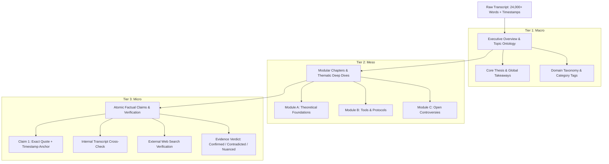

# Transcript Knowledge Extraction Architecture: Macro-Meso-Micro Pipeline & Research Report

## 1. Executive Summary & Objective

This document establishes the architectural standards, research findings, and deterministic workflows for converting raw audio transcripts (via Whisper) into verified, multi-tiered structured knowledge (Macro $\rightarrow$ Meso $\rightarrow$ Micro) for downstream AI agents, wikis, and knowledge graphs.

---

## 2. Part I: Whisper Raw Transcript Engineering Standard

To maximize the reliability of downstream AI processing, raw Whisper transcription must adhere to the following deterministic standards:

```
[Raw Audio Stream]
       │
       ▼ (1. Audio Conditioning: 16kHz Mono WAV / High-Bitrate MP3)
[VAD Filtering: Silero VAD] ──> Eliminates non-speech, background noise, silence loops
       │
       ▼ (2. Prompt Priming: Domain Acronyms, Tickers, Names via --initial_prompt)
[Whisper Engine: faster-whisper (CTranslate2 int8/float16)]
       │
       ▼ (3. Multi-Format Deterministic Artifact Generation)
 ┌──────────────────────┬──────────────────────┬──────────────────────┬──────────────────────┐
 │     .txt (Plain)     │     .srt (Timecodes) │    .json (Word/Seg)  │   .md (Anchor-Linked)│
 │ RAG Vector Indexing  │ Video Align & Clips  │ Programmatic Agent   │ Human & LLM Context  │
 └──────────────────────┴──────────────────────┴──────────────────────┴──────────────────────┘
```

### Optimal Ingestion Parameters

| Parameter | Recommended Setting | Purpose |
| :--- | :--- | :--- |
| **Model Quantization** | `int8` (CPU) / `float16` (GPU) | 50% RAM reduction, 4x speed, zero word error rate loss. |
| **VAD Filter** | `True` (`min_silence_duration_ms=500`) | Eliminates silence hallucination loops. |
| **Word Timestamps** | `True` | Word-level start/end precision for micro-level fact citations. |
| **Beam Search** | `beam_size=5`, `best_of=5` | Maximizes sentence coherence and syntax stability. |
| **Initial Prompt** | Contextual Keywords / Glossary | Prevents phonetic spelling errors of names and acronyms. |

---

## 3. Part II: The Macro $\rightarrow$ Meso $\rightarrow$ Micro Knowledge Extraction Framework

A monolithic summary loses critical details, while raw transcripts overwhelm context windows. The **Macro-Meso-Micro** pattern decomposes raw transcripts into three structured epistemic tiers:



### Tier 1: Macro Level (Global Synthesis & Taxonomy)
* **Goal**: Establish high-level situational awareness in < 500 words.
* **Outputs**:
  * **Core Thesis Statement**: The single central thesis of the audio.
  * **Global Takeaways**: 3–5 high-impact conclusions.
  * **Taxonomy & Graph Node Links**: Bidirectional wiki tags (`[[Category]]`, `[[Entity]]`).
  * **Speaker Profiles & Context**: Credentials, bias indicators, and perspective.

### Tier 2: Meso Level (Modular Deep Dives & Thematic Modules)
* **Goal**: Break the session into self-contained, modular knowledge blocks.
* **Outputs**:
  * **Thematic Modules**: Structured sections with timestamps `[HH:MM:SS - HH:MM:SS]`.
  * **Conceptual Arguments**: The premises, reasoning, and counterarguments.
  * **Protocol / Framework Extraction**: Step-by-step mechanisms, tools, or methodologies explained.
  * **Contextual Nuances**: Caveats, scope limits, and situational conditions.

### Tier 3: Micro Level (Atomic Claims, Timestamps & Automated Verification)
* **Goal**: Isolate and fact-check every testable assertion with forensic precision.
* **Outputs**:
  * **Atomic Proposition**: An isolated, falsifiable factual claim.
  * **Transcript Anchor**: Exact verbatim quote and timestamp `[HH:MM:SS]`.
  * **Internal Transcript Confidence**: Speaker certainty (hypothesis vs peer-reviewed vs anecdote).
  * **External Verification (Live Web Search)**:
    * Search query executed to verify claim against scientific literature / market data.
    * External Source Citation (URL, DOI, paper title).
    * Verdict: `[CONFIRMED]`, `[CONTRADICTED]`, `[MIXED / CONTROVERSIAL]`, or `[OPINION / UNVERIFIED]`.
    * Added Context: Subsequent research developments or counter-evidence.

---

## 4. Part III: Survey of Existing State-of-the-Art Workflows & Skills

| Framework / Tool | Core Strength | Relevance to this Pipeline |
| :--- | :--- | :--- |
| **Fabric (`danielmiessler/fabric`)** | Modular AI patterns (`extract_wisdom`, `create_summary`). | Best-in-class prompt patterns for extracting insights, ideas, quotes, and habits from transcripts. |
| **RAPTOR (Recursive Abstractive Processing)** | Tree-structured recursive chunk summarization. | Provides the mathematical/algorithmic backbone for hierarchical Macro-Meso clustering. |
| **WhisperX** | Forced phoneme alignment (Wav2Vec2) + PyAnnote Diarization. | Ultra-precise word-level timestamps and multi-speaker label assignment (`Speaker 0`, `Speaker 1`). |
| **Chain-of-Density (CoD)** | Progressive entity-dense summarization without losing clarity. | Prevents generic boilerplate summaries by incrementally condensing facts. |
| **Obsidian / Zettelkasten Automations** | Atomic notes with bidirectional `[[wikilinks]]`. | Turns transcript outputs into a connected knowledge base / Second Brain. |

---

## 5. Part IV: Autonomous AI Acquisition OKR Prompt

Copy-paste the prompt below into any AI agent (OpenClaw, Claude CLI, Antigravity, or ChatGPT) to autonomously research, benchmark, and implement state-of-the-art transcript extraction workflows:

````markdown
# OKR Research & Implementation Mission: Autonomous Transcript-to-Knowledge Engine

## Objective (O)
Build and deploy a deterministic, multi-tiered (Macro -> Meso -> Micro) knowledge extraction engine that transforms raw Whisper transcripts into verified, anchor-linked, fact-checked knowledge wiki artifacts with zero cloud API token waste.

## Key Results (KRs)
- **KR 1**: Identify, clone, and benchmark at least 3 state-of-the-art open-source transcript processing repositories (e.g. Fabric patterns, WhisperX, RAPTOR, Chain-of-Density).
- **KR 2**: Implement a deterministic 3-tier parsing skill:
  - **Macro**: Executive synthesis, thesis, taxonomy, and speaker ontology.
  - **Meso**: Timestamped modular chapters, conceptual mechanisms, and protocols.
  - **Micro**: Atomic proposition extraction, exact `[HH:MM:SS]` quote grounding, and automated search-verification hooks (`[CONFIRMED]`, `[CONTRADICTED]`, `[UNVERIFIED]`).
- **KR 3**: Structure output artifacts as bidirectional Wiki-linked Markdown notes (`[[Topic]]`, `[[Claim]]`) ready for Obsidian / Knowledge Graph ingestion.
- **KR 4**: Deliver a self-contained PowerShell / CLI tool package with end-to-end unit tests and zero external proprietary dependencies.

## Execution Instructions for the Agent
1. Scan GitHub, Hugging Face, and CLI package repositories for modular transcript analysis skills.
2. Evaluate each workflow using the metric: `(I<Impact> / E<Evidence> / R<Risk> : <Composite Score>)`.
3. Synthesize the winning components into a deterministic, scriptable pipeline.
4. Generate the code, prompt templates, and validation reports in the target repository.
````
