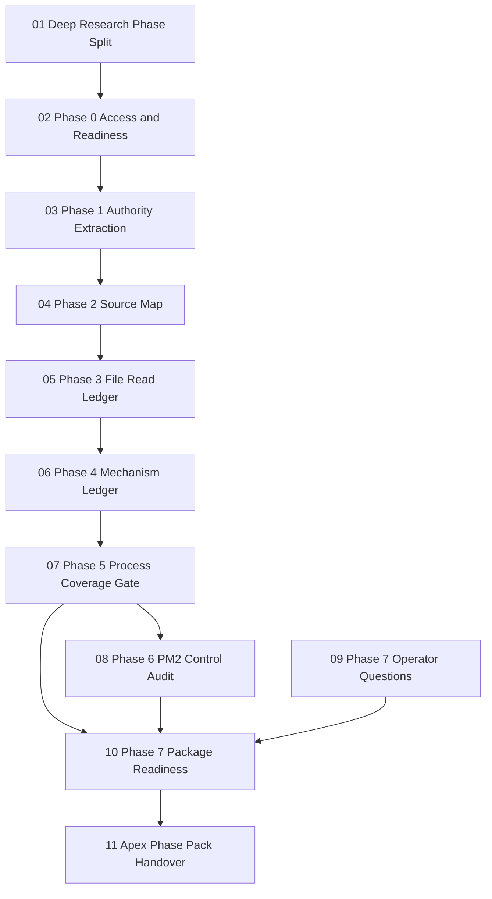

# Apex Phase Pack Meta Index

## 0. Purpose of this file

This file is the **meta index** for the Apex Harmonization phase-export pack.

It is **not** a raw extraction of one original Project Resource. It is a generated overview file that explains the phase chain before the individual phase documents are reconstructed as standalone downloadable Markdown files.

The phase pack exists to turn Project Resources that are currently accessible through the ChatGPT project/resource retrieval layer into a portable Markdown sequence:

```text
00_Apex_Phase_Pack_Meta_Index.md
01_Deep_Research_Phase_Split.md
02_Phase_0_Access_and_Readiness.md
03_Phase_1_Authority_Extraction.md
04_Phase_2_Source_Map.md
05_Phase_3_File_Read_Ledger.md
06_Phase_4_Mechanism_Ledger.md
07_Phase_5_Process_Coverage_Gate.md
08_Phase_6_PM2_Control_Audit.md
09_Phase_7_Operator_Questions.md
10_Phase_7_Package_Readiness.md
11_Apex_Phase_Pack_Handover.md
```

The goal is to make the phase outputs easier to store locally, give to another model, commit to Git, or use as the source basis for later `apex-plan`, `apex-session`, and `apex-sync` package generation.

---

## 1. What this phase pack is

The Apex Phase Pack is a **source-map / mechanism-ledger / readiness-gate record** for the Apex Harmonization work.

Its core question is:

> Are the source evidence, local repo mappings, mechanism extractions, and process-coverage gates sufficient to safely generate rich Claude-native Apex skill packages?

The pack covers the chain from initial access verification to final package readiness:

```yaml
phase_chain:
  phase_0: access_and_readiness
  phase_1: authority_extraction
  phase_2: source_url_label_to_local_path_map
  phase_3: file_read_ledger
  phase_4: mechanism_ledger_by_source
  phase_5: process_coverage_gate
  phase_6: PM2_control_audit
  phase_7: package_readiness_gate
```

The target skill packages evaluated by the chain are:

```text
.claude/skills/apex-plan/
.claude/skills/apex-sync/
.claude/skills/apex-session/
```

---

## 2. Why these files exist

These files exist because the workflow had to prevent three failure modes:

1. **Premature package generation**
   - The system should not generate `apex-plan`, `apex-sync`, or `apex-session` until the evidence base is clear.

2. **Unverified source copying**
   - Public source URLs, source labels, and ProThinking recommendations are not enough by themselves. The workflow requires local mirrored files to be mapped, opened, read, and converted into explicit mechanisms before claiming implementation evidence.

3. **Silent path drift or substitute use**
   - If a source path is missing, the workflow must record that gap. If a nearby substitute is used, the substitute must be labeled as such and not treated as the original source.

The phase pack therefore separates:

```yaml
separation_of_concerns:
  authority:
    role: decide what is binding
    main_phase: phase_1
  source_identity_mapping:
    role: connect source labels_or_urls_to_local_files
    main_phase: phase_2
  evidence_reading:
    role: prove that local files were actually opened/read
    main_phase: phase_3
  mechanism_extraction:
    role: turn source evidence into reusable COPY_ADAPT_CONCEPT_OMIT records
    main_phase: phase_4
  process_coverage:
    role: test whether PM_KB_PD processes are covered
    main_phase: phase_5
  control_audit:
    role: verify PM2 decomposition evidence through CCPM_Backlog_CrewAI
    main_phase: phase_6
  package_readiness:
    role: decide if apex_plan_apex_session_apex_sync are safe to generate
    main_phase: phase_7
```

---

## 3. Overall process

The process is evidence-gated and sequential.

### Step A - Establish the controller and phase structure

`Deep Research Phase Split` defines the workflow as a phase-based source-map and mechanism-ledger task. It sets the sequence and clarifies that this is not package generation yet.

### Step B - Verify access and readiness

Phase 0 / readiness verifies access to the repo, authority files, source folders, and selected control sources.

### Step C - Extract binding authority

Phase 1 extracts the authority hierarchy and locks H1-H7 decisions. It also extracts source IDs, process/source selections, clusters, and gaps.

### Step D - Resolve source identities to local repo paths

Phase 2 maps public source identities or labels to local mirrored repo paths. It records resolved, missing, substituted, and path-drift cases.

### Step E - Read files and record what was read

Phase 3 creates a file-read ledger. It records which local files were opened, what sections were read, what evidence was captured, and which missing sources remain.

### Step F - Extract mechanisms

Phase 4 converts read evidence into mechanism records by source, using the classification:

```yaml
mechanism_classification:
  COPY: "Can be carried into Apex with only naming/path adjustment."
  ADAPT: "Strong mechanism but must be changed for Apex constraints."
  CONCEPT: "Useful principle, but not enough direct implementation detail to copy."
  OMIT: "Do not use for Apex v1."
```

### Step G - Map mechanisms to processes

Phase 5 maps the extracted mechanisms across the 20 PM/KB/PD processes and assigns coverage status:

```yaml
coverage_status:
  FULL: "Enough locally read evidence exists to implement the mechanism."
  PARTIAL: "Useful evidence exists, but key source or exact mechanism is missing."
  BLOCKED_BY_MISSING_SOURCE: "Selected source depends on unresolved local evidence."
```

### Step H - Audit PM2 as a control sample

Phase 6 audits PM2 specifically because project decomposition is a central control process. The audit checks whether PM2 is grounded in:

```yaml
PM2_control_chain:
  - CCPM_decomposition_spine
  - Backlog_task_record_substrate
  - CrewAI_task_py_substitute_for_task_contract
```

### Step I - Decide package readiness

Phase 7 decides whether the three target packages are ready for generation:

```yaml
package_readiness_targets:
  apex-plan: A_PLAN_cluster
  apex-sync: B_SYNC_cluster
  apex-session: C_SESSION_cluster
```

The final readiness states used by the workflow are:

```yaml
readiness_status_values:
  - READY_FOR_GENERATION
  - READY_WITH_CUSTOM_PYTHON_WORK
  - PARTIAL_READY_WITH_GAPS
  - BLOCKED
```

---

## 4. Major findings

### 4.1 Phase chain is coherent and complete enough to export

The chain already has a clear progression:

```text
controller -> access -> authority -> source map -> file reads -> mechanisms -> coverage -> PM2 audit -> readiness
```

This means the Project Resources can be exported into a logically ordered Markdown pack.

### 4.2 H1-H7 are the binding implementation locks

The most important locked decisions are:

```yaml
H1_status_enum:
  - open
  - in-progress
  - blocked
  - done
  - deferred

H2_base_path:
  state_root: apex-meta/
  scripts_root: scripts/
  skills_root: .claude/skills/

H3_dependency_field:
  name: depends_on
  type: int_array

H4_script_language:
  language: Python only

H5_clusters:
  A_PLAN:
    - PM1
    - PM2
    - PM3
    - PD1
    - PD2
    - PD4
  B_SYNC:
    - PM4
    - PM5
    - PM7
    - PM8
    - KB4
    - KB5
  C_SESSION:
    - PM6
    - KB1
    - KB2
    - KB3
    - KB6
    - PD3
    - PD5
    - PD6

H6_handoff_format:
  files:
    - task_plan.md
    - findings.md
    - progress.md
    - next-session.md

H7_priority_urgency:
  priority:
    high: 3
    medium: 2
    low: 1
  urgency: due_date_days_until_due_or_999
```

These locks constrain the later packages and prevent drift into new schemas, paths, or non-Python scripts.

### 4.3 Source evidence is usable but not uniformly complete

The source evidence supports several strong imports:

```yaml
strong_source_families:
  CCPM:
    contributes:
      - lifecycle
      - epic_to_numbered_task_decomposition
      - task_frontmatter_and_body_structure
      - dependency_semantics
      - script_first_tracking_pattern

  Backlog:
    contributes:
      - markdown_task_record
      - task_schema
      - create_update_mutation_model
      - parser_mapping

  Task_Master:
    contributes:
      - dependency_satisfied_next_task_logic
      - ranking_algorithm_concepts

  planning_with_files:
    contributes:
      - task_plan_findings_progress_handoff_pattern
      - session_continuity
      - re_read_before_decisions

  llm_wiki:
    contributes:
      - KB_raw_wiki_index_log_audit_structure
      - entity_file_and_index_concepts

  CrewAI_task_py_substitute:
    contributes:
      - task_contract_fields
      - expected_output
      - context
      - output_file
      - human_input_or_operator_validation_concepts
```

But several sources remain missing, weak, or substitute-only:

```yaml
missing_or_caveated_sources:
  - exact_llm_wiki_update_index_py
  - kanban_blocker_and_card_scripts
  - OpenClaw_TaskFlow
  - CrewAI_getting_started_skill
  - Hermes_governance_sources
```

### 4.4 PM2 passed its control audit

PM2 is the decomposition process. It passed the control audit because:

```yaml
PM2_pass_basis:
  CCPM: "primary decomposition spine"
  Backlog: "task record and mutation substrate"
  CrewAI_task_py_substitute: "task contract and expected-output discipline"
```

Important caveat:

```yaml
PM2_caveat:
  CrewAI_task_py_is_substitute: true
  do_not_claim_it_is_original_CrewAI_skill_source: true
```

### 4.5 Process coverage is mixed

Phase 5's coverage result can be summarized as:

```yaml
process_coverage_summary:
  full:
    - PM1_capture_project
    - PM2_decompose_project
    - PM3_assign_dependencies
    - PM4_compute_next_action
    - PM6_update_status
    - KB1_write_session_progress
    - KB2_extract_state_deltas
    - KB3_maintain_entity_files
    - KB6_produce_next_session_context
    - PD1_score_priority_with_apex_rule
    - PD4_synthesize_focus_recommendation
    - PD5_validate_with_operator_using_crewai_substitute
    - PD6_feed_planning_layer
  partial:
    - PM5_detect_blockers
    - PM7_detect_stall
    - PM8_generate_work_registry
    - KB5_detect_drift
    - PD2_score_urgency
    - PD3_compute_unlock_depth
  blocked_by_missing_source:
    - KB4_rebuild_index
```

Cluster readiness follows from this:

```yaml
cluster_readiness:
  A_PLAN:
    status: mostly_ready
    note: "Strong planning and decomposition basis; PD2 urgency still needs custom/local rule acceptance."
  B_SYNC:
    status: not_fully_ready
    note: "Missing or incomplete blocker, index, drift, and registry mechanisms."
  C_SESSION:
    status: ready_with_one_custom_rule
    note: "Session and handoff logic are strong; reverse unlock depth must be custom."
```

### 4.6 Phase 7's likely package outcome

The expected readiness pattern is:

```yaml
expected_package_readiness:
  apex-plan:
    likely_status: READY_FOR_GENERATION
    reason: "A_PLAN has strong PM1_PM2_PM3_PD1_PD4 grounding and PM2 passed audit."
  apex-session:
    likely_status: READY_WITH_CUSTOM_PYTHON_WORK
    reason: "C_SESSION is mostly covered by planning-with-files, Backlog, and handoff logic; one custom rule remains."
  apex-sync:
    likely_status: PARTIAL_READY_WITH_GAPS
    reason: "B_SYNC has useful patterns, but exact index/blocker/drift mechanisms remain missing or custom."
```

The safe generation order is:

```yaml
recommended_generation_order:
  first: apex-plan
  second: apex-session
  third: apex-sync_only_after_custom_scope_or_gap_resolution
```

---

## 5. Target files and their contents

### 5.1 `00_Apex_Phase_Pack_Meta_Index.md`

**Type:** Generated meta file  
**Status:** This file  
**Purpose:** Explain the overall process, file sequence, findings, and how the exported phase documents connect.

**Contains:** phase-pack purpose, extraction limitations, overall phase chain, major findings, per-file content map, dependency graph, recommended read order, and recommended generation order.

### 5.2 `01_Deep_Research_Phase_Split.md`

**Type:** Controller / input file  
**Purpose:** Defines the original phase structure and the workflow contract.

**Expected contents:** source-map / mechanism-ledger framing, Phase 0-7 table, access/readiness logic, control-source setup, handoff into Phase 1, and rules against premature package generation.

**Connects to:** All later phases.

### 5.3 `02_Phase_0_Access_and_Readiness.md`

**Type:** Phase-output file  
**Purpose:** Verifies that the workflow can begin.

**Expected contents:** repo access status, authority-file access status, source-root checks, PM2 control-source prechecks, known path drift, and readiness verdict.

**Connects to:** Phase 1 by proving the system can safely extract authority and source mappings.

### 5.4 `03_Phase_1_Authority_Extraction.md`

**Type:** Phase-output file  
**Purpose:** Extracts binding decisions and source/process authority.

**Expected contents:** authority hierarchy, H1-H7 decisions, source ledger, evidence categories, process selections, cluster assignments, explicit gaps, and carry-forward rules.

**Connects to:** Phase 2 through the source ledger and local-path requirements; connects to all later files through H1-H7 constraints.

### 5.5 `04_Phase_2_Source_Map.md`

**Type:** Phase-output file  
**Purpose:** Maps source identities to local mirrored repo paths.

**Expected contents:** source IDs, public source labels / URLs as identities, expected local paths, resolved local paths, missing paths, substitute paths, and path-drift notes.

**Connects to:** Phase 3 by telling it what files to open/read.

### 5.6 `05_Phase_3_File_Read_Ledger.md`

**Type:** Phase-output file  
**Purpose:** Proves which files were actually opened and read.

**Expected contents:** local file-read ledger, read windows, evidence captured, readiness for mechanism extraction, evidence sufficiency by source family, and missing-source carry-forward notes.

**Connects to:** Phase 4 by defining which source evidence is valid for mechanism extraction.

### 5.7 `06_Phase_4_Mechanism_Ledger.md`

**Type:** Phase-output file  
**Purpose:** Converts read source evidence into reusable Apex mechanisms.

**Expected contents:** COPY / ADAPT / CONCEPT / OMIT key, mechanism IDs, mechanism-by-source tables, classification notes, source caveats, and missing-source caveats.

**Connects to:** Phase 5 by providing the mechanism pool to map onto PM/KB/PD processes.

### 5.8 `07_Phase_5_Process_Coverage_Gate.md`

**Type:** Phase-output file  
**Purpose:** Tests whether the extracted mechanisms cover the intended 20 PM/KB/PD processes.

**Expected contents:** coverage criteria, PM coverage, KB coverage, PD coverage, cluster readiness, process coverage summary, gate verdict, and package-readiness implications.

**Connects to:** Phase 6 by identifying the PM2 control audit basis; connects to Phase 7 by defining which clusters are ready or blocked.

### 5.9 `08_Phase_6_PM2_Control_Audit.md`

**Type:** Phase-output file  
**Purpose:** Audits PM2 decomposition as the control sample.

**Expected contents:** PM2 audit target, source access audit, CCPM decomposition contribution, Backlog task substrate contribution, CrewAI substitute contribution, PM2 verdict, and package-readiness implication for `apex-plan`.

**Connects to:** Phase 7 by strengthening `apex-plan` readiness.

### 5.10 `09_Phase_7_Operator_Questions.md`

**Type:** Controller / input file  
**Purpose:** Captures Phase-7 operator/resource questions and decisions.

**Expected contents:** resource questions, operator decision options, recommendations, accepted substitutes or custom-scope choices, and unresolved decisions.

**Connects to:** Phase 7 readiness by recording the human choices needed to interpret gaps safely.

### 5.11 `10_Phase_7_Package_Readiness.md`

**Type:** Phase-output file  
**Purpose:** Final readiness gate for skill-package generation.

**Expected contents:** readiness criteria, inputs reloaded, package readiness table, `apex-plan` readiness, `apex-session` readiness, `apex-sync` readiness, required custom work, recommended generation order, operator decisions needed, and gate verdict YAML.

**Connects to:** Later package-generation prompts.

### 5.12 `11_Apex_Phase_Pack_Handover.md`

**Type:** Optional handover file  
**Purpose:** Explains how the phase pack should be used by the next chat or package-generation workflow.

**Expected contents:** mission for next chat, completed phase summary, current workflow target, boundaries, recommended next action, and copy-paste prompt for continuation.

**Connects to:** The next package-generation or repo-writing workflow.

---

## 6. How the files connect to each other



Plain-language connection:

1. `01` defines the chain.
2. `02` proves access/readiness.
3. `03` locks authority and decisions.
4. `04` maps source identities to local paths.
5. `05` proves which local files were read.
6. `06` extracts mechanisms from valid evidence.
7. `07` maps mechanisms to PM/KB/PD coverage.
8. `08` audits PM2 specifically.
9. `09` carries operator questions into Phase 7.
10. `10` decides package readiness.
11. `11` hands the result to the next workflow.

---

## 7. Controller/input files vs phase-output files

### 7.1 Controller / input files

```yaml
controller_input_files:
  - 01_Deep_Research_Phase_Split.md
  - 09_Phase_7_Operator_Questions.md
  - 11_Apex_Phase_Pack_Handover.md
```

These define process structure, operator choices, or continuation instructions.

### 7.2 Phase-output files

```yaml
phase_output_files:
  - 02_Phase_0_Access_and_Readiness.md
  - 03_Phase_1_Authority_Extraction.md
  - 04_Phase_2_Source_Map.md
  - 05_Phase_3_File_Read_Ledger.md
  - 06_Phase_4_Mechanism_Ledger.md
  - 07_Phase_5_Process_Coverage_Gate.md
  - 08_Phase_6_PM2_Control_Audit.md
  - 10_Phase_7_Package_Readiness.md
```

These record executed phase results.

### 7.3 Generated meta file

```yaml
generated_meta_file:
  - 00_Apex_Phase_Pack_Meta_Index.md
```

This file explains the package and is not a raw extraction.

---

## 8. Extraction limitation

The original Project Resources are not guaranteed to be accessible as raw original files.

In this environment, Project Resources may be exposed through retrieval and search. That means the system can often access their content, but cannot necessarily recover:

```yaml
not_guaranteed:
  - byte_identical_original_file
  - original_line_endings
  - original_file_hash
  - original_file_timestamps
  - exact hidden formatting metadata
  - complete non-indexed content
```

Therefore, the exported Markdown files should be treated as:

```yaml
export_status:
  type: faithful_reconstruction
  target: preserve_all_retrievable_information
  not_claimed: byte_identical_original_copy
```

If a file has uncertainty, the export should append a reconstruction note.

---

## 9. Recommended order for reading exported files

Recommended read order:

```yaml
recommended_read_order:
  1: 00_Apex_Phase_Pack_Meta_Index.md
  2: 01_Deep_Research_Phase_Split.md
  3: 02_Phase_0_Access_and_Readiness.md
  4: 03_Phase_1_Authority_Extraction.md
  5: 04_Phase_2_Source_Map.md
  6: 05_Phase_3_File_Read_Ledger.md
  7: 06_Phase_4_Mechanism_Ledger.md
  8: 07_Phase_5_Process_Coverage_Gate.md
  9: 08_Phase_6_PM2_Control_Audit.md
  10: 09_Phase_7_Operator_Questions.md
  11: 10_Phase_7_Package_Readiness.md
  12: 11_Apex_Phase_Pack_Handover.md
```

Why this order:

- The meta index explains the package.
- The phase split explains the controller.
- Phases 0-6 build the evidence chain.
- Phase 7 operator questions clarify decisions.
- Phase 7 package readiness records the final gate.
- The handover tells the next workflow how to continue.

---

## 10. Recommended order for generating remaining downloadable Markdown artifacts

This meta file should be created first. Then generate exactly one file per prompt:

```yaml
generation_order:
  P0_done:
    file: 00_Apex_Phase_Pack_Meta_Index.md
    status: generated_meta_file
  P1:
    file: 01_Deep_Research_Phase_Split.md
    source_target: Deep Research Phase Split.txt
  P2:
    file: 02_Phase_0_Access_and_Readiness.md
    source_target: Phase 1 readiness or readiness output
  P3:
    file: 03_Phase_1_Authority_Extraction.md
    source_target: Phase 1 Authority Extraction
  P4:
    file: 04_Phase_2_Source_Map.md
    source_target: Phase 2 Source Map
  P5:
    file: 05_Phase_3_File_Read_Ledger.md
    source_target: Phase 3 File-Read Ledger
  P6:
    file: 06_Phase_4_Mechanism_Ledger.md
    source_target: Phase 4 mechanism ledger
  P7:
    file: 07_Phase_5_Process_Coverage_Gate.md
    source_target: Phase 5 Coverage Verdict or Process Coverage Gate
  P8:
    file: 08_Phase_6_PM2_Control_Audit.md
    source_target: PM2 control audit pass
  P9:
    file: 09_Phase_7_Operator_Questions.md
    source_target: Phase-7.txt
  P10:
    file: 10_Phase_7_Package_Readiness.md
    source_target: Phase 7 Package Readiness
  P11_optional:
    file: 11_Apex_Phase_Pack_Handover.md
    source_target: Handover - Apex Harmonization Source-Ledger Flow to Phase 7 Package Readiness
```

Only after all individual files exist and have been verified should a ZIP be created:

```yaml
zip_step:
  file: Apex_Phase_Pack_Extracted_Markdown.zip
  rule: do_not_recreate_or_rewrite_md_files_during_zip_creation
  include: only_existing_generated_markdown_files
```

---

## 11. What this meta file enables

This meta file enables the rest of the extraction flow by providing:

```yaml
meta_file_outputs:
  overview: "What the phase pack is"
  rationale: "Why these files exist"
  process_model: "How phases connect"
  findings: "Major readiness and evidence conclusions"
  file_map: "What each target file should contain"
  dependency_map: "How the files connect"
  classification: "Controller/input vs phase-output files"
  limitation_note: "Why exports are reconstructions, not byte-identical originals"
  read_order: "How to consume the pack"
  generation_order: "How to create the remaining artifacts"
```

The next prompt should execute `P1` and create:

```text
01_Deep_Research_Phase_Split.md
```
