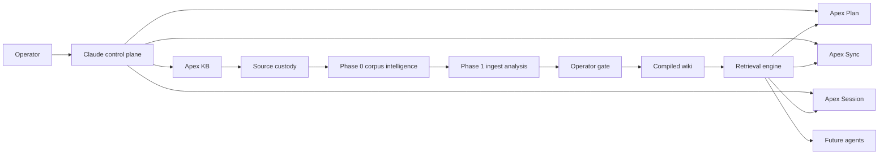
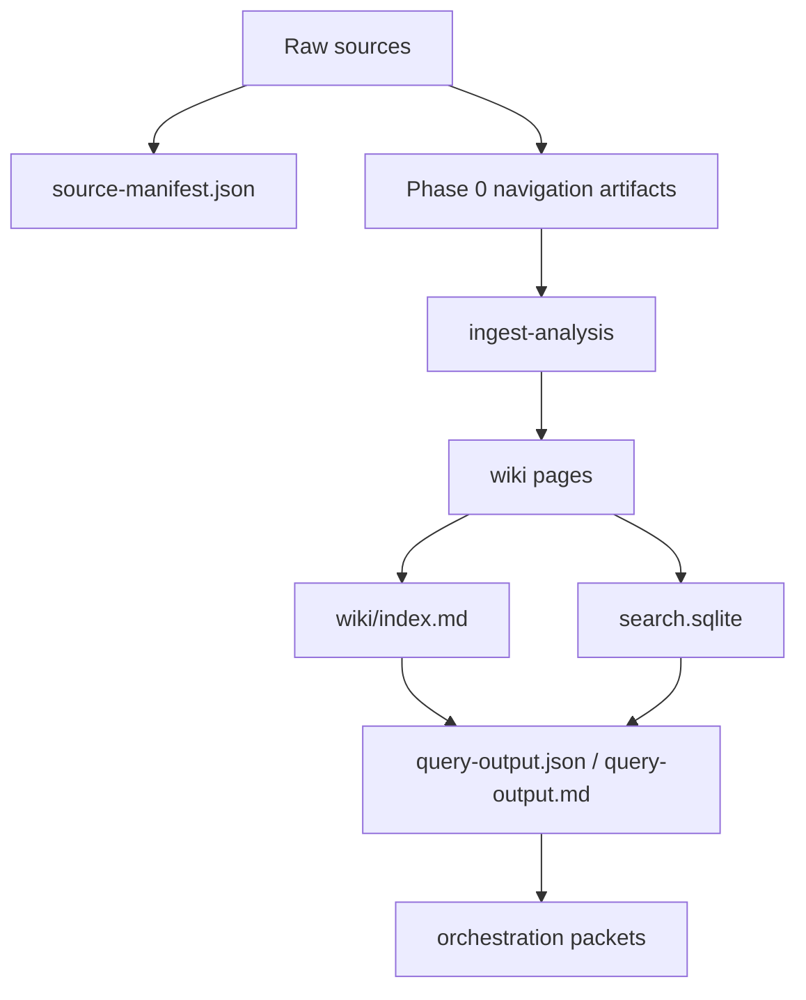

# Apex KB × Apex Orchestration Integration Map

## Verdict and evidence

**Executive verdict**

| Field | Assessment |
|---|---|
| Best architecture | **Apex KB should be the durable, source-custodied, operator-gated knowledge layer for Apex, with a strict split between deterministic corpus intelligence, LLM ingest analysis, compiled wiki generation, and a later local retrieval layer that serves orchestration without mutating it.** |
| Apex KB role | **Apex KB should own source custody, deterministic corpus mapping, ingest analysis, compiled pages, and retrieval artifacts; Apex Plan, Apex Session, and Apex Sync should consume those artifacts but not collapse into KB responsibilities.** |
| Retrieval stage | **Phase 0:** deterministic navigation only. **V1:** markdown index-first query over compiled pages. **V1.5:** SQLite FTS5/BM25 after a local runtime probe. **V2:** optional hybrid BM25/vector only if observed limits justify it.** |
| Immediate build priority | **Repository verification first; then Phase 0 corpus intelligence; then Phase 1 ingest analysis; then operator-gated Phase 2 wiki compilation.** |
| Do not build yet | **Do not build vector retrieval, hosted retrieval, or a global cross-KB index before the per-KB deterministic flow is working and auditable.** |
| Main risk | **Boundary drift:** if retrieval, planning, and durable synthesis are mixed too early, Apex KB becomes contaminated by status, opinion, and uncontrolled agent writes.** |
| Confidence | **Medium for the architectural recommendation; low for repo-specific implementation claims because the live repo could not be verified in this run.** |

**Repo verification status**

| Field | Value |
|---|---|
| live_repo_read | **false** |
| commit_or_branch_if_known | **unknown** |
| files_unavailable | `.claude/skills/apex-kb/SKILL.md`, `.claude/skills/apex-kb/package-manifest.md`, `.claude/skills/apex-kb/references/*`, `.claude/skills/apex-plan/SKILL.md`, `.claude/skills/apex-sync/SKILL.md`, `.claude/skills/apex-session/SKILL.md`, `apex-meta/scripts/apex_kb.py`, `apex-meta/kb/*`, the machine-readable KB index files |
| assumptions | **All Apex-specific file/path references below are treated as target paths from your brief, not repo-verified facts.** |

I could not complete the requested live-repo read against the named GitHub repository in this session. Public fetches of the repository root and the referenced raw file paths returned 404 responses, which means the repo is either private, inaccessible from public web, on another branch/path, or otherwise not publicly readable from this runtime. Accordingly, I have **not** treated the Apex file list as verified implementation state. citeturn8view0turn8view1turn8view2turn8view3

**Source-read ledger**

| Source | Path / URL | Read status | Why read | Key facts extracted | Used in architecture? |
|---|---|---:|---|---|---:|
| User research brief | In-chat prompt and screenshot | read_deeply | Defines scope, deliverables, contamination rules, and phase boundaries | Phase 0 must be navigation-only; FTS5 deferred to V1.5+; `--kb-root` must remain parameterized | Yes |
| GitHub repo root | `github.com/leela-spec/apexai-os-meta` | unavailable | Required live repo check | Public fetch returned 404 | Yes |
| Apex KB skill files | `.claude/skills/apex-kb/...` | unavailable | Needed to verify mode ownership and contracts | Could not verify in this run | Yes |
| Apex orchestration skill files | `.claude/skills/apex-plan/...`, `.claude/skills/apex-sync/...`, `.claude/skills/apex-session/...` | unavailable | Needed to verify handoffs and boundaries | Could not verify in this run | Yes |
| `apex-meta/scripts/apex_kb.py` | repo path from brief | unavailable | Needed to inspect current CLI/argparse/write policy | Could not verify in this run | Yes |
| Claude Code overview | Anthropic official docs | read_deeply | Clarifies control plane, skills, hooks, sessions, MCP, agent capabilities | CLAUDE.md loads every session; skills load on demand; hooks/subagents exist; Claude Code can act across code/tools | Yes citeturn2view0turn6view0 |
| Claude Code memory | Anthropic official docs | read_deeply | Clarifies instruction memory vs enforcement | CLAUDE.md is behavioral guidance, not hard enforcement; PreToolUse hooks enforce blockers; CLAUDE.md supports imports; auto memory loads partially each session | Yes citeturn4view2turn4view3 |
| Claude Code common workflows | Anthropic official docs | read_briefly | Confirms codebase-overview and subagent workflow patterns | Broad-to-narrow exploration is recommended; subagents used for delegated research | Yes citeturn3view2turn4view4 |
| Claude Code skills | Anthropic official docs | read_deeply | Primary source for skill architecture, loading, frontmatter, naming, nested discovery | Skills are progressively loaded and keep long procedures out of CLAUDE.md; location and path shape command names; nested skills are discovered on demand | Yes citeturn6view0turn6view1turn6view2turn6view3turn6view4 |
| Claude Code hooks | Anthropic official docs | read_briefly | Needed to map hard gates vs soft guidance | PreToolUse / PostToolUse and related lifecycle hooks exist as enforcement/control points | Yes citeturn6view6 |
| Claude Code subagents | Anthropic official docs | read_deeply | Needed for orchestration and token-efficiency design | Subagents isolate side-task context and return summaries, reducing main-thread context noise | Yes citeturn6view5 |
| Agent Skills overview/spec | agentskills.io | read_deeply | Needed for portable skill/package expectations | Skill = folder with `SKILL.md`; progressive disclosure; optional `scripts/`, `references/`, `assets/`; `allowed-tools` experimental | Yes citeturn16view0turn17view0 |
| SQLite FTS5 docs | sqlite.org official | read_deeply | Needed for retrieval backend design | FTS5 virtual tables, BM25 weighting, snippet/highlight, rank ordering, external-content pitfalls | Yes citeturn11view0turn11view1turn11view2turn11view3 |
| SQLite compile options / PRAGMA docs | sqlite.org official | read_deeply | Needed to validate runtime-probe requirement | `SQLITE_ENABLE_FTS5` is compile-time; `PRAGMA compile_options` returns compiled features | Yes citeturn15view0turn15view2 |
| Python sqlite3 docs | docs.python.org | read_briefly | Needed for Python-side implementation feasibility | Python `sqlite3` supports user-defined functions and deterministic flag handling, subject to underlying SQLite support | Yes citeturn11view5 |
| python-frontmatter | PyPI/project docs | read_deeply | Needed for frontmatter parsing options | Supports YAML and other frontmatter formats; current maintained package; supports BOM handling with `utf-8-sig` | Yes citeturn13view4turn3view6 |
| PyYAML docs | pyyaml.org official docs | read_deeply | Needed for safe YAML parsing assessment | `safe_load` and `safe_load_all` avoid arbitrary object construction and are intended for untrusted input safety | Yes citeturn13view2turn13view3 |
| markdown-it-py docs | project docs | read_deeply | Needed for Python markdown parser assessment | CommonMark baseline, plugin support, speed, security focus | Yes citeturn13view0 |
| unified / remark-parse docs | unifiedjs official | read_deeply | Needed only for the Node comparison path | unified builds syntax-tree pipelines; `remark-parse` supports plugin composition including frontmatter/MDX, but adds Node/ESM complexity | Yes citeturn20view0turn20view1 |

**Current Apex state**

Because the repo was not verifiable in this run, the only Apex-specific statements I can responsibly make are these:

- Your brief has already locked several **design constraints**: `--kb-root` must stay parameterized; `claude-skill-design` is only a first test KB; Phase 0 must not create wiki pages or semantic ingest artifacts; SQLite FTS5/BM25 is deferred until after a runtime probe; and project KB must stay separate from personal orchestration memory. Those are treated below as **binding operator rules**, not as already-implemented repo facts.
- The broader Claude-native environment is clear enough from official docs to support a strong recommendation: keep **facts and lightweight standing instructions in `CLAUDE.md`**, keep **procedures in skills**, use **subagents for noisy side investigations**, and use **hooks for hard enforcement rather than hoping instructions are obeyed consistently**. Anthropic’s docs are explicit that `CLAUDE.md` is context, not enforcement, while PreToolUse hooks are the right place for non-negotiable blocks. citeturn4view2turn6view0turn6view6

## External best-practice findings

The external evidence strongly supports a **local-first, progressively disclosed, deterministic-first** KB design.

Anthropic’s documentation draws a bright line between always-loaded project guidance and on-demand procedural instructions. `CLAUDE.md` is read at the start of every session, while skills load only when relevant, which is exactly the pattern Apex should use to keep orchestration instructions small and shift heavy KB procedures into `.claude/skills/apex-kb/`. Anthropic also recommends using skills for repeatable workflows and using subagents when a side task would otherwise flood the main conversation with search results or file content. citeturn4view2turn6view0turn6view5

The open Agent Skills standard reinforces the same direction. A skill is a directory rooted in `SKILL.md`, with optional `scripts/`, `references/`, and `assets/`, and it is designed around progressive disclosure: minimal startup metadata, then the full skill body only on activation, then referenced resources only as needed. That is a very good fit for Apex KB because it allows the ingestion contract, templates, retrieval specs, and helper scripts to sit beside the skill without burning tokens every session. citeturn16view0turn17view0

For retrieval, SQLite FTS5 is a strong **later-stage** local backend, not a first move. The official docs show that FTS5 provides local virtual tables, BM25 ranking, snippets, and weighted column ranking. They also show important operational caveats: FTS5 availability depends on compile-time support, which is discoverable through `PRAGMA compile_options`, and external-content tables can produce surprising or inconsistent results if the source content and index are not kept synchronized. That combination argues for a conservative rollout: per-KB markdown/index-first retrieval first, then FTS5 after a runtime probe and only over **derived compiled KB pages**, not raw source custody. citeturn11view0turn11view1turn11view2turn11view3turn15view0turn15view2

For parsing, the safe V1 path is also clear. `python-frontmatter` provides a thin, maintained frontmatter layer for YAML and other metadata formats, while PyYAML’s `safe_load` and `safe_load_all` are explicitly intended to avoid unsafe arbitrary object construction from untrusted YAML. For markdown structure, `markdown-it-py` gives a CommonMark-oriented Python parser with plugin support, speed, and a security focus. The Node `remark`/`unified` ecosystem is more expansive and handles MDX/frontmatter with plugins, but it also brings a second runtime and more maintenance overhead, which makes it a better V1.5+/special-case option than a default dependency for the first deterministic pass. citeturn13view4turn13view2turn13view3turn13view0turn20view0turn20view1

The practical implication is straightforward: **build Apex KB as a layered markdown-native knowledge substrate first, then add FTS5 as a derived retrieval accelerator, not as the canonical source of truth.** That recommendation aligns with Anthropic’s context-economy model, the Agent Skills progressive-disclosure model, and SQLite’s compile-time/runtime realities. citeturn6view0turn17view0turn15view0turn15view2

## Macro integration map

**Macro architecture**

| Layer | Includes | Primary owner | Canonical or derived | What it must not do |
|---|---|---|---|---|
| L0 operator and Claude control plane | `CLAUDE.md`, `.claude/skills/*`, workflows, hooks, operator gates | Operator + Claude runtime | Canonical control/config layer | Must not become the KB itself |
| L1 Apex orchestration | Apex Plan, Apex Sync, Apex Session | Orchestration skills | Canonical orchestration state/process | Must not own source custody or compiled knowledge pages |
| L2 Apex KB source custody | raw sources, source manifests, hashes, source pointers | Apex KB | **Canonical** | Must not rewrite source truth into summaries |
| L3 Apex KB compiled knowledge | `wiki/index.md`, summaries, concepts, entities, contradictions, open questions | Apex KB | **Derived durable knowledge** | Must not hide provenance or operator review state |
| L4 deterministic corpus intelligence | corpus profile, heading/frontmatter/link maps, keyword hits, topic-file map, navigation report | Deterministic Python | Derived | Must not perform semantic synthesis |
| L5 retrieval engine | markdown index-first query, later SQLite FTS5/BM25, saved query outputs, stale-index signals, optional future vector layer | Retrieval subsystem under Apex KB | Derived | Must not plan, mutate project state, or author wiki pages |
| L6 agent consumption | planning context packets, session handoff context, sync validation context, future agent retrieval packets | Consumers | Derived views | Must not write back to canonical KB without explicit ingest/update flow |

This arrangement follows Anthropic’s strong separation between persistent guidance in `CLAUDE.md`, on-demand procedures in skills, and isolated subagent workflows for context-heavy side work. It also matches the Agent Skills pattern of keeping rich procedural material in skill roots and references rather than bloating the control plane. citeturn4view2turn6view0turn6view1turn6view2turn17view0

**Data flow**

`sources → source manifest / hashes → Phase 0 corpus intelligence → Phase 1 ingest analysis → operator review gate → Phase 2 compiled wiki pages → wiki/index.md → query artifacts / retrieval packets → Apex Plan / Apex Session / Apex Sync / future agents`

**Ownership boundaries**

| Domain | Owns | Must not own |
|---|---|---|
| Apex KB | source custody; ingest analysis; compiled pages; contradictions/open questions; query/lint/audit; retrieval artifacts | project planning; status mutation; session decisions |
| Apex Plan | operator-gated planning; task decomposition proposals; work plans | durable knowledge synthesis; retrieval indexing |
| Apex Sync | deterministic read-side computation; blockers/next actions/drift/reporting | KB mutation; semantic synthesis |
| Apex Session | session mutation; handoff/state updates if present | source ingestion; compiled KB generation |
| Retrieval engine | ranked context selection; stale-index flags; retrieval packets | project planning; state mutation; authoritative synthesis |

**Rationale**

This boundary model is not arbitrary. Anthropic’s docs explicitly distinguish **behavior-shaping instructions** from **hard enforcement**, and they recommend hooks when something must be blocked regardless of the model’s judgment. That means Apex KB phase gates should not live only as prose in `CLAUDE.md`; they should be represented as operator review steps and, where appropriate, tool/hook boundaries. Likewise, Anthropic’s subagent model exists specifically to prevent side-task context from polluting the main working thread, which is exactly the failure mode Apex KB should prevent during research-heavy ingestion and retrieval. citeturn4view2turn6view5turn6view6

## Meso process architecture

| Step | Purpose | Inputs | Deterministic owner | LLM owner | Artifacts | Options | Risks | Acceptance criteria |
|---|---|---|---|---|---|---|---|---|
| S0 source intake | Preserve source identity | raw files, URLs, notes, metadata | Apex KB deterministic intake | none | source manifest, hashes, source pointers | json manifest, checksums, custody folders | source loss, provenance loss | every source has stable ID, path, checksum, type |
| S1 Phase 0 corpus intelligence | Deterministic navigation before semantic ingest | source set, path list, parser config | Python CLI | none | corpus profile, heading map, frontmatter map, link map, keyword hits, topic-file map, navigation report | state machine parser, markdown-it-py | accidental semantic synthesis; placeholder outputs | navigation report is populated, ranked, source-routed, and contains no semantic ingest text |
| S2 Phase 1 ingest analysis | Source analysis before wiki generation | Phase 0 artifacts; prioritized sources; source manifest | deterministic scaffolding for prompts/templates | Apex KB skill/subagent | ingest-analysis files | inline skill or subagent; template-driven | analysis drift; source omission | analysis cites sources, distinguishes fact/uncertainty, proposes target pages |
| S3 operator review gate | Prevent uncontrolled durable synthesis | ingest analyses, review flags | operator + gate logic | none | approval/reject/defer state | manual review; hook-enforced confirmation | silent durable writes | no Phase 2 write without explicit gate |
| S4 Phase 2 compiled page generation | Create/update summaries, concepts, entities, index | approved analyses, existing wiki pages | deterministic write helpers + validators | LLM page drafting | wiki pages, wiki/index, change manifests | append/update/replace policies | duplicate pages, stale synthesis, provenance loss | every page carries source section, generated timestamp, review state, links |
| S5 lint and audit | Health checks, contradictions, review flags | wiki tree, manifests, query logs | deterministic linter/auditor | optional LLM only for explanation | audit reports, lint reports, contradiction reports | strict/error/warn modes | false authority, broken links, stale pages | machine-readable report with severity and file pointers |
| S6 markdown index-first query | Use `wiki/index.md` plus selected pages | user query, wiki index, page metadata | deterministic query router | optional summarizer | query-output.json / .md | keyword route, section route, page shortlist | stale index, under-retrieval | small, cited page set is returned before broader search |
| S7 SQLite FTS5/BM25 retrieval | Local ranked retrieval over compiled pages | compiled wiki pages, indexable fields | deterministic indexer/query runner | optional summarizer | `search.sqlite`, snippets, ranked hits | plain FTS5, external-content table, contentless table | runtime unavailability, sync drift | runtime probe passes; rebuild path exists; hit list is ranked and source-addressable |
| S8 query packet generation | Save retrieval outputs for future agents | query result set, citations, summaries | deterministic serializer | optional summarizer | persisted query packets | JSON only, JSON + Markdown | packet bloat, stale packets | packet has query, selected docs, reasons, timestamps, freshness |
| S9 orchestration consumption | Feed Plan / Session / Sync without drift | query packets, wiki pages, audit reports | each orchestration skill on read side | task-specific reasoning | plan context, handoff context, sync validation context | direct page reads or packets | boundary collapse | consumer reads KB output but does not mutate KB directly |
| S10 future agent retrieval | Minimal-token packets for later agents | compiled KB, search index, query packets | retrieval subsystem | retrieval agent/subagent | context packets | per-KB only or routed multi-KB | packet contamination, too much context | packet is compact, cited, freshness-stamped, and task-scoped |

**Recommended deterministic vs LLM split**

| Concern | Deterministic owner | LLM owner |
|---|---|---|
| file discovery, hashing, manifests | Yes | No |
| parser output, headings, frontmatter maps, link maps | Yes | No |
| candidate-source ranking heuristics | Yes | No |
| semantic ingest analysis | No | Yes |
| page drafting and synthesis | No | Yes |
| schema validation, lint, stale/broken-link checks | Yes | No |
| retrieval ranking mechanics | Yes | No |
| answer synthesis from selected pages | Optional | Yes |

That split is consistent with the external evidence. Anthropic recommends procedural specialization through skills and subagents, but also warns that `CLAUDE.md` is not hard enforcement, which is why deterministic scaffolding and gates matter here. SQLite’s docs likewise show that retrieval mechanics have enough subtlety that they should be implemented as deterministic infrastructure rather than fuzzy prompts. citeturn4view2turn6view5turn11view1turn11view3

## Micro file script artifact contracts

Because the repo was not verifiable, the table below is a **recommended contract map**. When a path is named as “existing” in your brief but could not be verified, I mark it as **defer pending repo verification** rather than claiming it already exists.

| Path | Owner | Phase | Purpose | Canonical or derived | Inputs | Outputs | Must not do | Minimal fields or functions | Validation rule | Implementation status |
|---|---|---|---|---|---|---|---|---|---|---|
| `.claude/skills/apex-kb/SKILL.md` | Apex KB skill | Control plane | Entry point for ingest/query/lint/audit procedures | Canonical skill | brief instructions, references | activated procedure | must not embed huge reference corpus inline | description; owned modes; phase gates; handoffs; path rules | short description, concise body, references externalized | **defer pending repo verification** |
| `.claude/skills/apex-kb/package-manifest.md` | Apex KB skill | Control plane | Human-readable package inventory | Canonical | skill folder contents | manifest text | must not become source of truth for runtime logic | files, purpose, dependencies | must match folder reality | **defer pending repo verification** |
| `.claude/skills/apex-kb/references/kb-contract.md` | Apex KB | Control plane | Defines KB root/artifact contract | Canonical | operator decisions | contract doc | must not prescribe repo facts unless verified | root layout; canonical vs derived; write rules | path/schema consistency | **defer pending repo verification** |
| `.claude/skills/apex-kb/references/script-command-contract.md` | Apex KB | Control plane | CLI contract for deterministic scripts | Canonical | script surface | command spec | must not diverge from real argparse surface | commands, args, exit semantics | sync with script help output | **defer pending repo verification** |
| `.claude/skills/apex-kb/references/ingest-query-lint-audit-rules.md` | Apex KB | Control plane | Mode boundaries and behavior rules | Canonical | process policy | rule doc | must not conflate phases | mode ownership, no-mutation rules, gate rules | no conflicting instructions | **defer pending repo verification** |
| `.claude/skills/apex-kb/templates/ingest-analysis-template.md` | Apex KB | Phase 1 | Structured output for ingest analysis | Canonical template | selected sources, phase0 artifacts | filled ingest analysis | must not draft final wiki page directly | source roster, facts, contradictions, open questions, proposed page targets | every field present or explicitly n/a | **defer pending repo verification** |
| `.claude/skills/apex-kb/templates/wiki-page-templates.md` | Apex KB | Phase 2 | Target page schemas for summaries/concepts/entities | Canonical template | approved analyses | drafted wiki pages | must not erase provenance | page header, provenance, synthesis body, contradictions/open questions | schema-conformant headings | **defer pending repo verification** |
| `apex-meta/scripts/apex_kb.py` | Deterministic CLI | Phases 0–5 | Main KB command surface | Canonical script | CLI args, KB root | artifacts, reports | must not hardcode a single KB root | argparse; root resolution; read-only/list modes; validators; write policy helpers | `--kb-root` required where needed; safe exits | **defer pending repo verification** |
| `apex-meta/scripts/phase0_corpus_intelligence.py` | Deterministic CLI | Phase 0 | Produce navigation artifacts only | Derived generator | source tree | phase0 artifacts | must not perform semantic ingest or wiki generation | parse files, heading/frontmatter/link extraction, keyword hit generation, report writer | outputs complete and populated | **create_later** |
| `apex-meta/scripts/apex_kb_retrieval.py` | Deterministic CLI | V1–V1.5 | Query compiled KB and later FTS index | Derived generator | wiki pages, query args | query packets | must not write wiki pages | index-first query, FTS probe, snippet extraction, freshness checks | deterministic results and query packet schema | **create_later** |
| `apex-meta/kb/<slug>/kb-schema.md` | KB root | Canonical | Schema for page/artifact layout | Canonical | operator decisions | schema doc | must not contain mutable state | page classes, artifact folders, naming rules | lintable against disk layout | **extend_existing if present, else create_later** |
| `apex-meta/kb/<slug>/manifests/source-manifest.json` | KB root | Phase 0 | Source custody manifest | Canonical | raw source set | manifest JSON | must not contain synthesis fields | source_id, path/pointer, type, hash, acquisition time | no duplicate source IDs; hashes present | **extend_existing if present, else create_later** |
| `apex-meta/kb/<slug>/wiki/index.md` | KB root | Phase 2 | Top-level retrieval landing page | Derived durable | compiled pages | index page | must not become duplicate of all pages | KB summary, page roster, topic routing, freshness note | link completeness and freshness stamp | **extend_existing if present, else create_later** |
| `apex-meta/kb/<slug>/wiki/summaries/*` | KB root | Phase 2 | Entity/topic summaries | Derived durable | approved analyses | summary pages | must not hide provenance or uncertainty | source section; key claims; open questions | cite source pages and manifest IDs | **create_later** |
| `apex-meta/kb/<slug>/wiki/concepts/*` | KB root | Phase 2 | Concept pages | Derived durable | approved analyses | concept pages | must not silently fork duplicates | aliases, definition, related pages, sources | duplicate/alias lint passes | **create_later** |
| `apex-meta/kb/<slug>/wiki/entities/*` | KB root | Phase 2 | Entity pages | Derived durable | approved analyses | entity pages | must not merge identities without review | stable entity ID, aliases, roles, source evidence | merge/conflict checks pass | **create_later** |
| `apex-meta/kb/<slug>/ingest-analysis/*` | KB root | Phase 1 | Durable pre-wiki analysis outputs | Derived | phase0 + LLM analysis | analysis files | must not be mistaken for wiki truth | source coverage, facts, contradictions, page proposals | approved/rejected state recorded | **create_later** |
| `apex-meta/kb/<slug>/audit/*` | KB root | Phase 3 | Lint/audit reports | Derived | wiki + manifests + index | reports | must not alter content | stale pages, broken links, schema drift, contradictions | machine-readable severity levels | **create_later** |
| `apex-meta/kb/<slug>/outputs/queries/*` | KB root | V1+ | Saved query packets | Derived | query inputs + results | JSON/Markdown packets | must not become hidden source of truth | query, retrieved docs, reasons, timestamps | freshness metadata required | **create_later** |
| `apex-meta/kb/<slug>/phase0/corpus-profile.md` | KB root | Phase 0 | Corpus size/type synopsis | Derived | file scan | profile report | must not contain semantic conclusions | counts, types, anomalies | reproducible from same corpus | **create_later** |
| `apex-meta/kb/<slug>/phase0/heading-map.json` | KB root | Phase 0 | Heading inventory | Derived | parser run | JSON map | must not summarize content | file, heading path, level, offset | valid JSON and full coverage | **create_later** |
| `apex-meta/kb/<slug>/phase0/markdown-link-map.json` | KB root | Phase 0 | Explicit link graph | Derived | parser run | JSON map | must not invent semantic edges | src, dst, type, anchor | all links parseable or flagged | **create_later** |
| `apex-meta/kb/<slug>/phase0/frontmatter-map.json` | KB root | Phase 0 | Parsed frontmatter registry | Derived | frontmatter parser | JSON map | must not silently coerce malformed YAML | file, parse_status, keys, normalized subset | malformed files flagged, not swallowed | **create_later** |
| `apex-meta/kb/<slug>/phase0/keyword-hits.ndjson` | KB root | Phase 0 | Sparse keyword routing hits | Derived | seed terms + scan | NDJSON hits | must not claim semantic relevance | term, file, count, lines/sections | valid NDJSON | **create_later** |
| `apex-meta/kb/<slug>/phase0/topic-file-map.json` | KB root | Phase 0 | Deterministic file routing by topic seeds | Derived | parser outputs + rules | JSON routing map | must not perform semantic synthesis | topic, candidate files, score basis | score basis documented | **create_later** |
| `apex-meta/kb/<slug>/phase0/source-priority-candidates.md` | KB root | Phase 0 | Ranked reading shortlist | Derived | topic/file maps | shortlist | must not be placeholder text | why-read-first rationale, ranked files | non-empty and file-specific | **create_later** |
| `apex-meta/kb/<slug>/phase0/phase0-navigation-report.md` | KB root | Phase 0 | Operator-ready navigation artifact | Derived | all Phase 0 outputs | navigation report | must not be skeleton or ingest analysis | ranked guidance, anomalies, suggested read order | populated and source-routed | **create_later** |
| `apex-meta/kb/<slug>/search.sqlite` | Retrieval subsystem | V1.5 | Local search index over compiled pages | Derived | compiled pages | FTS database | must not be canonical source | docs table, FTS table, rebuild metadata | rebuildable from wiki pages | **create_later** |
| `apex-meta/kb/<slug>/outputs/query-output.json` | Retrieval subsystem | V1+ | Machine-readable query packet | Derived | query run | JSON packet | must not omit freshness info | query, hits, reasons, timestamps | schema validation | **create_later** |
| `apex-meta/kb/<slug>/outputs/query-output.md` | Retrieval subsystem | V1+ | Human-readable query packet | Derived | query run | Markdown packet | must not exceed intended compactness | summary, selected pages, next reads | length guard + links valid | **create_later** |
| `apex-meta/kb/<slug>/audit/stale-index-report.*` | Retrieval subsystem | V1+ | Detect stale retrieval artifacts | Derived | manifest/wiki/index mtimes | report | must not auto-mutate index silently | stale reason, affected scope, rebuild advice | accurate stale detection | **create_later** |
| `apex-meta/kb/<slug>/audit/retrieval-health-report.*` | Retrieval subsystem | V1.5 | Diagnose retrieval quality | Derived | query tests, index status | report | must not present guesses as metrics | probe status, rebuild status, sample hit quality | every query test produces ranked hits or explicit failure | **create_later** |

**Micro build guidance**

The safest micro-level principle is this: **treat raw sources and manifests as canonical, treat wiki pages as durable but derived, and treat search indexes and query packets as disposable/rebuildable.** That principle is directly supported by SQLite’s reality that FTS features are compile-time dependent and by Anthropic’s progressive loading model, where compact routing artifacts are far cheaper than re-reading large instruction corpora every session. citeturn15view0turn15view2turn6view0turn17view0

## Options, sequencing, and efficiency

**Options and fallback matrix**

### Frontmatter parsing

| Option | Correctness | Install friction | Corruption risk | Repo fit | Recommendation |
|---|---|---:|---:|---|---|
| stdlib strict subset | Low–medium | Lowest | High for malformed/edge YAML | Only if operator insists on near-stdlib-only | **Fallback only** |
| `python-frontmatter` | Medium–high | Low | Medium if paired with unsafe YAML loader; lower when paired safely | Strong V1 fit for markdown-heavy KBs | **Good default wrapper** citeturn13view4turn3view6 |
| PyYAML | High for YAML parsing | Low | Low when using `safe_load` / `safe_load_all` | Strong V1 fit | **Recommended parser core** citeturn13view2turn13view3 |
| `ruamel.yaml` | High | Medium | Low | Better for round-tripping/edit preservation than first-pass ingestion | Defer unless comment-preserving rewrite is needed |

**Recommended choice:** `python-frontmatter` for file handling plus **PyYAML `safe_load`/`safe_load_all`** for actual YAML parsing.  
**Fallback choice:** strict stdlib subset only if dependencies are explicitly disallowed by operator decision.  
**Defer until:** `ruamel.yaml` only if round-trip preservation becomes a real requirement.

### Markdown structure parser

| Option | V1 fit | V1.5 fit | MDX support | Maintenance | Recommendation |
|---|---|---|---|---|---|
| simple Python state machine | Good for headings/links only | Weak beyond basics | Poor | Low code, high edge-case risk | Use only for minimal scaffolding |
| `markdown-it-py` | Strong | Strong | Limited unless extended | Moderate | **Recommended V1 parser** citeturn13view0 |
| Node `remark` / `unified` | Medium | Strong | Strong with plugins | Higher due to second runtime | V1.5+ or special-case parser pipeline citeturn20view0turn20view1 |
| hybrid | Strong | Strong | Strong | Highest | Defer until needed |

**Recommended choice:** `markdown-it-py` in V1.  
**Fallback choice:** simple Python state machine for bare headings/links if dependency minimization is mandatory.  
**Defer until:** `remark`/`unified` only if MDX or richer AST transforms become required.

### Retrieval backend

| Option | Token efficiency | Local / cost-free | Determinism | Runtime complexity | Future extensibility | Recommendation |
|---|---:|---:|---:|---:|---:|---|
| markdown index only | Medium-low | High | High | Low | Medium | **V1 starting point** |
| Python JSON / inverted index | Medium-low | High | High | Medium | Medium | Optional bridge if needed |
| SQLite FTS5/BM25 | Very high | High | High | Medium, compile-option dependent | High | **V1.5 recommended** citeturn11view1turn15view0turn15view2 |
| hybrid BM25/vector | Low query cost, higher build cost | Medium | Medium | High | Very high | V2 only |
| hosted vector / file search | Low query cost | Low for locality/privacy | Lower operator control | High external complexity | High | Reject for first implementation |

**Recommended choice:** markdown index-first → SQLite FTS5/BM25 after runtime probe.  
**Fallback choice:** markdown index only.  
**Defer until:** hybrid/vector only if observed retrieval failures persist after BM25.

### Search index scope

| Option | Locality | Cross-KB routing | Rebuild safety | Query simplicity | Recommendation |
|---|---:|---:|---:|---:|---|
| per-KB index | High | Low | High | High | **Recommended first** |
| shared global index | Low | High | Low | Medium | Too early |
| hybrid per-KB plus global | Medium | High | Medium | Medium | Later if multiple KBs prove necessary |

**Recommended choice:** per-KB index.  
**Fallback choice:** none; keep query strictly within one KB root.  
**Defer until:** hybrid/global only after multiple KB roots are real and stable.

### Graph extraction

| Option | Deterministic value | False-negative risk | Phase placement | Recommendation |
|---|---:|---:|---|---|
| Markdown links only | Medium | High | Phase 0 | Too weak |
| Markdown + wikilinks | Medium-high | Medium | Phase 0 | Better but incomplete |
| YAML / path / process / contract edges | High | Low–medium | **Phase 0 recommended** | **Best deterministic choice** |
| semantic LLM graph | Medium | Low false negatives, higher false positives | Phase 2+ | Defer |

**Recommended choice:** deterministic extraction of Markdown links **plus** YAML/path/process/contract edges in Phase 0.  
**Fallback choice:** Markdown + wikilinks only if parser scope is constrained.  
**Defer until:** semantic graph extraction after the deterministic graph is stable.

**Phased build sequence**

| Phase | Name | Inputs | Outputs | Stop conditions | Acceptance tests | Operator gate | Main risks |
|---|---|---|---|---|---|---|---|
| Phase 0 | deterministic corpus intelligence | source set, KB root, parser config | navigation artifacts only | if parser coverage is incomplete or report is still skeletal | no wiki pages created; populated navigation report; heading/frontmatter/link outputs valid | operator confirms Phase 0 output quality | accidental semantic synthesis; placeholder reporting |
| Phase 1 | source ingest analysis | Phase 0 artifacts, prioritized sources | ingest-analysis only | if analyses blur into final wiki writing or source coverage is weak | each analysis distinguishes facts, uncertainties, page targets | yes, before any compiled pages | uncontrolled durable synthesis |
| Phase 2 | compiled KB generation | approved analyses, page templates | wiki pages, updated index, manifests | if duplicate page collisions/staleness rules unresolved | summaries/concepts/entities created with provenance and timestamps | yes | stale authority, duplicate pages |
| Phase 3 | lint, audit, query hardening | wiki tree, manifests, query scripts | lint/audit reports, contradiction flags | if health reports do not reliably identify drift | broken links, schema drift, stale pages surfaced deterministically | optional review on errors | hidden decay |
| Phase 4 | local retrieval engine | compiled pages, runtime probe | `search.sqlite`, retrieval health report, query packets | if FTS5 unavailable or consistency model not solid | runtime probe passes; index rebuild succeeds; ranked hit tests pass | yes for enabling by default | runtime mismatch; index drift |
| Phase 5 | hybrid retrieval and agent packets | BM25 system, observed failure cases | optional vector layer, richer packets | if BM25 is sufficient | measured improvement over BM25-only baseline | yes | complexity without payoff |

**Token-efficiency model**

Anthropic’s model gives the key design clue: material in `CLAUDE.md` is loaded every session, but skills and skill resources are progressively loaded. Agent Skills formalizes the same idea. So the KB should be organized to keep startup context tiny and move heavy material into callable structures. citeturn4view2turn6view0turn17view0

| Mode | Token cost | Determinism | Risk |
|---|---:|---:|---|
| Raw corpus reread | very high | low | hallucination, drift, repeated rereads |
| Markdown index-first | medium-low | medium-high | stale index |
| Phase 0 navigation + compiled pages | low | high | parser blind spots |
| SQLite FTS5/BM25 over compiled pages | very low | high | runtime FTS5 availability |
| Hybrid vector + BM25 | low at query time, higher build cost | medium | embedding/model complexity |

**Preferred anti-waste pattern**

| Avoid | Prefer |
|---|---|
| reading all raw sources per task | index-first routing |
| reading all research files each session | Phase 0 navigation artifacts |
| bloated `CLAUDE.md` | compact `CLAUDE.md` + Apex KB skill references |
| semantic ingest before navigation | deterministic map first |
| retrieval over raw source sprawl | retrieval over compiled pages |
| ad hoc ephemeral answers | saved query packets with freshness fields |

## Diagrams, risks, and final recommendation

**Macro data-flow diagram**



**Artifact-flow diagram**



The diagrams reflect a deliberate progressive-disclosure and boundary-safe design: always-loaded control files remain small, durable synthesis is operator-gated, and retrieval serves consumers through compact packets rather than raw corpus rereads. That design is supported by Anthropic’s loading model for `CLAUDE.md` and skills, and by the Agent Skills progressive-disclosure spec. citeturn4view2turn6view0turn17view0

**Risk register**

| ID | Name | Severity | Source | Failure mode | Prevention | Detection | Fallback | Affects phase |
|---|---|---|---|---|---|---|---|---|
| C01 | Fixed KB target contamination | Critical | user brief | hardcoding `claude-skill-design` as the only KB | require `--kb-root` everywhere | CLI tests; path lint | block write; require explicit root | 0–5 |
| C02 | Phase 0 creates wiki pages | Critical | user brief | navigation phase mutates durable wiki | hard no-write rule in Phase 0 | artifact path audit | fail run | 0 |
| C03 | Phase 0 creates semantic ingest analysis | Critical | user brief | deterministic stage leaks into LLM synthesis | separate commands and output dirs | phase artifact validator | reroute to Phase 1 | 0 |
| C04 | FTS5 treated as immediate V1 requirement | High | user brief + SQLite docs | retrieval work blocked by unavailable runtime | runtime probe first | `PRAGMA compile_options` check | stay on markdown index-first | 4 | 
| C05 | stdlib-only / no-PyYAML assumed without operator decision | High | user brief + parser evaluation | brittle parser and invalid YAML handling | explicit dependency decision | malformed-frontmatter tests | switch to PyYAML safe path | 0 |
| C06 | regex-only YAML parsing assumed safe | High | user brief + PyYAML docs | corrupted metadata, silent parse errors | safe parser with malformed detection | fixture tests on malformed YAML | mark parse_status=error | 0 |
| C07 | Graph limited to plain Markdown links | High | user brief | missing contract/process/path edges | extract YAML/path/process/contract edges too | graph coverage tests | add explicit edge extractors | 0 |
| C08 | Runtime assumptions copied from non-operator environment | Medium | user brief | false confidence about local tools | require operator-local probe | startup diagnostics | disable optional features | 4 |
| C09 | Provider claims reused without web verification | Medium | user brief | stale guidance | official web verification | dated source ledger | mark as open question | all |
| C10 | Patch packs assumed repo-verified | High | user brief | patch application against wrong state | live repo verification before implementation | preflight check | stop implementation | all |
| C11 | Old SOUL/Hermes language copied forward | Medium | user brief | terminology drift and path confusion | translate into Claude-native constructs | terminology lint | rewrite interfaces | all |
| C12 | Reading all historical research equally | High | user brief | wasted tokens, low signal | Phase A spine + route by topic | read ledger review | stop after sufficient evidence | research |
| C13 | `phase0-navigation-report.md` left skeletal | Critical | user brief | unusable routing artifact | required populated sections | report completeness check | fail phase | 0 |
| C14 | Personal orchestration memory mixed into project KB | Medium | user brief | contamination of project knowledge | separate domain roots and manifests | path/domain lint | split KBs | all |
| N15 | `CLAUDE.md` used as enforcement layer | High | Anthropic docs | brittle gates ignored by model | use hooks/settings/operator gates for hard blocks | behavior drift | move rule to hook/settings | all citeturn4view2turn6view6 |
| N16 | Skills grow into startup token bloat | Medium | Anthropic + Agent Skills docs | large SKILL bodies stay in-context too long | keep `SKILL.md` concise; push detail to references | token review / file size review | split into references | control plane citeturn6view3turn17view0 |
| N17 | External-content FTS tables drift from source pages | High | SQLite docs | inconsistent retrieval results | prefer rebuildable derived index or strong sync triggers | retrieval health report | rebuild index completely | 4 citeturn11view3 |
| N18 | Repo remains unverifiable during implementation | High | this run | design proceeds against unknown current state | reconnect GitHub access or provide export | repo read preflight | implementation limited to verification step only | before coding |

**Open operator decisions**

| Decision | Why it matters | Recommended answer |
|---|---|---|
| Should PyYAML be allowed? | Determines safe frontmatter handling in V1 | **Yes** |
| Should `markdown-it-py` be allowed in V1? | Determines robust structure parsing without a Node runtime | **Yes** |
| Is Windows-first operator runtime the target? | Affects shell behavior, paths, and FTS probe assumptions | **Confirm explicitly** |
| Should retrieval index be per-KB only at first? | Prevents global-index contamination | **Yes** |
| Should Phase 2 writes require explicit approval every run? | Controls durable synthesis risk | **Yes, initially** |
| Should search index include raw sources or compiled pages only? | Affects provenance, drift, and token economy | **Compiled pages only** |
| Should Session ever write into KB directly? | Prevents orchestration mutation from becoming durable knowledge | **No; require KB workflow entrypoint** |
| Can you provide direct repo access or a file export? | Required to convert this from architecture recommendation to repo-grounded implementation map | **Yes, needed next** |

**Final recommendation**

| Bucket | Recommendation |
|---|---|
| Build now | **Only the safe, verification-first slice:** repo verification, path inventory, `--kb-root` contract confirmation, and a deterministic Phase 0 spec/CLI plan |
| Build next | Phase 0 corpus intelligence artifacts and a populated navigation report; then Phase 1 ingest-analysis templates and command surface |
| Defer | SQLite FTS5/BM25 until the operator runtime probe passes and Phase 2 compiled pages exist |
| Reject | Hosted/vector-first retrieval, raw-source-as-search-index, global shared index as the first design |
| Decisions needed from operator | dependency policy; operator runtime target; whether repo access can be provided; whether Phase 2 remains explicitly gated |

The strongest evidence-backed conclusion from this run is that Apex KB should look much more like a **deterministic, source-custodied, skill-driven wiki compiler with a later local search layer** than like a monolithic RAG stack. That matches Anthropic’s own context-management model, fits the Agent Skills packaging standard, and avoids SQLite FTS5 pitfalls by keeping indexes derived and rebuildable. citeturn6view0turn6view5turn17view0turn11view1turn11view3turn15view2

**Next implementation prompt**

Use the next implementation step only to remove uncertainty and create the smallest safe foundation.

```text
Purpose:
Repo-verify Apex KB and implement only the deterministic Phase 0 scaffold.

Target:
Claude Code / Codex on the actual apexai-os-meta repository.

Copy-paste prompt:
Please do a repo-verification-first pass on apexai-os-meta and nothing broader.

Tasks:
1. Read and list the actual contents of:
   - .claude/skills/apex-kb/
   - .claude/skills/apex-plan/
   - .claude/skills/apex-sync/
   - .claude/skills/apex-session/ if present
   - apex-meta/scripts/
   - apex-meta/kb/

2. Confirm whether these files really exist and summarize them briefly:
   - .claude/skills/apex-kb/SKILL.md
   - package-manifest.md
   - references/kb-contract.md
   - references/script-command-contract.md
   - references/ingest-query-lint-audit-rules.md
   - templates/ingest-analysis-template.md
   - templates/wiki-page-templates.md
   - apex-meta/scripts/apex_kb.py

3. Do not patch anything yet.
   Do not implement retrieval yet.
   Do not create wiki pages.
   Do not do semantic ingest.

4. Produce only:
   - a repo-verified file ledger
   - a confirmed command/path contract for apex_kb.py
   - a proposed Phase 0 artifact contract
   - a list of gaps vs the intended architecture

5. Explicitly verify:
   - whether --kb-root is already parameterized
   - whether any code or docs incorrectly hardcode claude-skill-design
   - whether Phase 0 and Phase 1 are currently separated
   - whether any existing retrieval code already assumes SQLite FTS5

Return a concise, repo-grounded report with exact paths and no speculative claims.
```