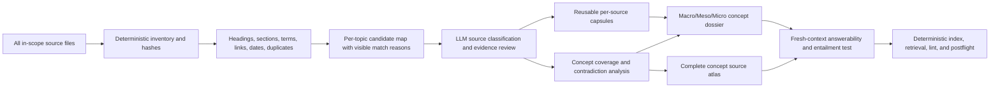

# Current Apex KB Failure Analysis

## Executive finding

The Apex KB architecture has the right high-level separation—raw evidence, deterministic structure, LLM synthesis, and derived retrieval—but the live lifecycle does not yet produce the corpus intelligence the operator intended.

The implementation snapshot at commit `d72f07f7b598` materially improves semantic stopping rules: it locks target queries, distinguishes candidate/read/used sources, prohibits unopened evidence, requires concept/entity disposition, and adds independent semantic acceptance. Deep Research must resolve current `main` at run start and verify whether these behaviors still exist before treating them as current implementation facts.

They do not repair the upstream deterministic source map. The LLM is still routed by a thin substring ranking and an empty navigation report, then asked to compensate through more semantic process and bookkeeping. This can produce a semantically accepted answer set while still failing the broader product: a concept-level map of the whole corpus, its versions, source roles, and individual file value.

## Intended value flow

The deterministic layer should make the LLM's reading selective and informed. It should not make the candidate set small by silently discarding files.

## Current implementation findings

| ID | Current behavior | Why it fails the target | Evidence | Required research decision |
|---|---|---|---|---|
| F01 | `rank_topic_sources()` lowercases registry keywords and counts substring matches line by line. | `tree` can match unrelated text; phrases, tokens, aliases, and field location are not distinguished. | `origin/main:apex-meta/scripts/apex_kb.py`, `rank_topic_sources`. | Define field-separated exact/normalized matching and candidate classes. |
| F02 | Topic results retain only the first 30 files after sorting by hit count. | The authoritative topic map can hide relevant files in large corpora. | `file_hits[:30]`. | Keep an exhaustive machine set; use bounded views only for navigation. |
| F03 | Filename, folder path, title/frontmatter, H1, headings, body, links, and co-occurrence are not scored separately. | A dedicated new specification and a long generic chat can appear equivalent or be ordered incorrectly. | Current ranking record has only `path`, `hit_count`, and one sample. | Preserve an inspectable sort vector and each signal's pointers. |
| F04 | Generic term frequency keeps only 60 terms and filters a small English stopword list. | It is useful for corpus orientation but not a topic-specific inverted index or complete posting map. | `generic_term_frequency(top_n=60)`. | Decide whether to add exhaustive postings with normalized aliases and section spans. |
| F05 | `source-priority-candidates.md` scores significant-word volume, heading count, and file size. | Long files receive a structural advantage independent of topic relevance or authority. | `file_hit_totals // 50 + heading_count + size_bonus`. | Replace or demote this global heuristic; require topic-specific reasons. |
| F06 | `phase0-navigation-report.md` lists artifacts and the phase boundary only. | The primary intended LLM-facing artifact contains no read-first files, topic bundles, duplicates, authority candidates, or batches. | `phase0_report()` implementation. | Implement the populated contract from the Phase 0 decision research. |
| F07 | Runtime emits `term-frequency.json` and `topic-source-rankings.json`; active rules still name `keyword-hits.ndjson` and `topic-file-map.json`. | Contract/runtime drift makes downstream instructions unreliable and obscures missing capabilities. | `cmd_phase0()` versus `ingest-query-lint-audit-rules.md`. | Select one final artifact contract and migrate compatibility outputs explicitly. |
| F08 | Duplicate hashes are reported in the corpus profile but not integrated into topic routing or semantic reuse. | Duplicate paths remain token traps, while version families and normalized duplicates are not classified. | `corpus_profile()` only. | Add duplicate representatives and version-family evidence to topic maps. |
| F09 | Phase 0 has no freshness, lifecycle, or authority-hint configuration. | New/current, prototype, historical, archive, implementation, and proposal files are not distinguished before reading. | No corresponding runtime fields. | Define deterministic hints as evidence signals, with LLM authority judgment retained. |
| F10 | Phase 0 parses Markdown structure but not a full concept-to-source atlas. | The LLM cannot see all files that cover a concept and why without repeating corpus searches. | Current artifacts and schemas. | Make exhaustive per-topic maps a first-class output. |
| F11 | Semantic v2 starts with target queries and a per-topic ledger, but the ledger is populated after a candidate ranking that may already be incomplete. | Better stopping rules cannot recover sources hidden by weak discovery. | `semantic-value-contract.md` and Phase 0 runtime. | Couple semantic coverage to exhaustive deterministic candidate visibility. |
| F12 | Semantic v2 optimizes for answer-bearing pages, not necessarily a complete source atlas. | A future AI may answer predefined questions but still cannot inspect the concept's full documentary history and source value efficiently. | Current Phase 2 template has used sources only; unopened candidates stay in the ledger. | Decide a durable, queryable atlas format covering every candidate without treating all as evidence. |
| F13 | Source analyses are path/slug files rather than a clearly reusable content-hash capsule layer. | Shared and duplicate sources can be reread across topics or copies. | Phase 1 template and current paths. | Define hash-keyed reusable source capsules plus topic-specific dispositions. |
| F14 | The templates require repeated YAML blocks and many governance fields. | Traceability is useful, but instruction and writing overhead can displace source reading and actual knowledge. | Current Phase 1/2 templates and connector audit. | Minimize mandatory semantic fields to those that create retrieval or handoff value. |
| F15 | Deterministic quality still checks structural proxies and declared wiring. | It can detect missing contracts, not whether the whole corpus was mapped or the page is useful. | Current quality contract and prior structural pass. | Keep structural checks honest; make semantic tests and corpus coverage separately mandatory. |
| F16 | Retrieval correctly indexes compiled page chunks and supports FTS5 fallback. | Retrieval faithfully amplifies whatever the wiki contains; it cannot repair omitted knowledge. | `apex_kb_retrieval.py` and `retrieval-contract.md`. | Gate index/postflight on semantic and source-atlas acceptance. |
| F17 | Prior research and implementation planning used V1/V1.5/defer language. | Valuable capabilities could be treated as unspecified future work and never executed, even when the operator requested the complete system. | Prior Phase 0 and lifecycle research terminology. | Design one final architecture; use configuration for run scope and `requires_evidence_probe` for unresolved technical facts. |
| F18 | Research access assumed a working repository route. | A Deep Research run can lose current-state evidence or fail after consuming its research opportunity. | Connector access history and operator feedback. | Define GitHub app → public GitHub → raw GitHub → Project Sources → architecture-only evidence modes. |
| F19 | Capabilities were split across versions rather than represented as switches inside one system. | Non-Markdown extraction, source-priority coverage, semantic depth, graph work, and acceptance depth can disappear from later execution. | Prior mode/version behavior. | Define independent configuration axes and named profiles inside one final architecture. |
| F20 | Codex, ChatGPT web, and deterministic runtime ownership is not fully designed. | Orchestrators may duplicate semantic work, browser models may be asked to perform local actions, and completion may rely on unsupported claims. | Operator target and current process gap. | Design a low-token Codex orchestration loop with bounded semantic save batches and explicit ownership. |
| F21 | Micro file and script recommendations are not systematically grounded in Claude skill/orchestration design evidence. | Correct macro architecture can still produce weak SKILL.md, workflow, script, template, loading, or handoff patterns. | Current research routing gap. | Require relevant Claude skill/orchestration evidence for every micro design record. |

## What the recorded implementation snapshot fixed and what remains

| Area | Verified in snapshot `d72f07f7b598` | Still unresolved or requiring current-`main` verification |
|---|---|---|
| Completion definition | `compiled_minimal` means minimum page topology, not shallow content. | No explicit whole-corpus concept/source-atlas completion requirement. |
| Query target | Critical/routine target queries are locked before semantic compilation. | Query design can omit documentary-history and all-source-map questions. |
| Source use | Unopened sources cannot appear as evidence; readable canonical evidence blocks completion. | Phase 0 may fail to surface a source or truncate it outside top 30. |
| Page value | Pages must answer declared questions directly. | Templates do not require an individual snapshot and value classification for every candidate source. |
| Candidate promotion | Concepts/entities need explicit disposition. | Source candidates need a similarly complete, lean disposition in the final source atlas. |
| Acceptance | Clean-context page-only and claim-entailment evaluation is required. | No independent test that deterministic topic discovery found the complete configured candidate set. |
| Connector resilience | Repository-local runbook and partial state exist. | Ledger/template overhead may still consume connector context without reducing source-reading work enough. |

## Root causal chain

1. The Phase 0 research intended a rich navigation layer.
2. The runtime implemented the easy structural parts but reduced topic routing to substring counts.
3. The main navigation report remained a shell.
4. Semantic executors received a ranked shortlist without a reliable map of the corpus.
5. Broad high-ranking sources were reused across topics because they were convenient and context-efficient.
6. Templates and deterministic checks made the resulting files look complete.
7. Retrieval returned the shallow compiled pages efficiently.
8. Later Apex skills then treated those pages as knowledge, propagating the original omissions.
9. Version-stage language made complete capabilities appear optional or indefinitely postponed.
10. Missing execution-profile architecture fragmented source formats, source priorities, and semantic depth across separate versions.
11. Single-route repository assumptions made the research process fragile when connector access failed.
12. Missing micro-design source routing allowed file-level recommendations to drift from proven Claude skill/orchestration patterns.

## Priority improvement hypotheses for Deep Research to test

| Hypothesis | Expected value | Main risk |
|---|---|---|
| H01: Replace top-30 substring ranking with exhaustive, field-separated topic maps. | Restores deterministic whole-corpus visibility at low recurring token cost. | Large machine artifacts need a compact LLM view. |
| H02: Add explicit corpus scope and path-based lifecycle/authority hints. | Makes current/prototype/historical routing visible before reading. | Path/date signals can be mistaken for semantic truth. |
| H03: Add exact and normalized duplicate/version families. | Prevents repeat reading while retaining every path. | Near-duplicate detection can over-group without transparent evidence. |
| H04: Use hash-keyed source capsules plus one topic analysis. | Reuses expensive source understanding across topics. | Capsule invalidation must be deterministic and simple. |
| H05: Compile one concept dossier plus one source atlas by default for broad topics. | Gives future AIs both the answer and the whole-corpus route map. | Atlas size can become noisy unless compact and classified. |
| H06: Replace most semantic ledger fields with a concise candidate disposition table. | Preserves restartability and coverage while reducing context/write cost. | Removing fields without tracing their consumer can break validation. |
| H07: Keep semantic v2 query and entailment gates, but add discovery/atlas acceptance. | Preserves the strongest recent fix and closes the missing product target. | More gates can become process theater unless each blocks a demonstrated failure. |
| H08: Load only a short startup contract, one topic map, relevant capsules, and unresolved sources. | Maximizes tokens for actual reading and wiki writing. | Requires reliable deterministic routing and restart state. |

## Product acceptance, not process acceptance

A final design is acceptable only if a Skill Tree-like canary proves all of the following:

- deterministic output identifies every configured candidate, including old, prototype, update, user-story, cross-feature, implementation, duplicate, and incidental files;
- a new/current dedicated file is distinguishable from a long generic file;
- exact duplicates require one read but every path remains visible;
- the LLM classifies every candidate and reads every core/current unique source;
- the concept dossier explains definition, hierarchy, data, workflow, contracts, interconnections, current state, prototypes, contradictions, examples, and edge cases where sources support them;
- the source atlas gives an individual snapshot and value for every candidate;
- future AIs can answer routine concept and source-location questions from compiled pages alone;
- compiled output plus deterministic maps materially reduces repeat reading and total tokens;
- the ordinary instruction route is concise and does not require the LLM to read the full Apex skill package.
