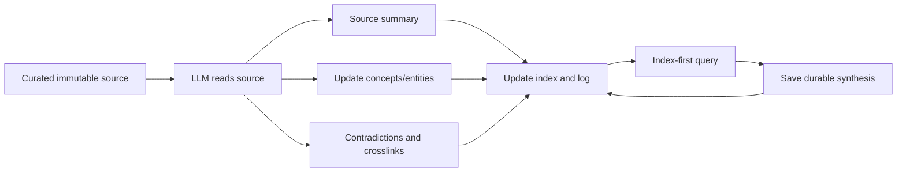

# LLM-Wiki Repository Value and Process Guide

## Combined verdict

The three sources agree on the product that Apex KB must preserve:

> Raw documents are not the final AI interface. An LLM reads them once, compiles persistent interlinked knowledge, updates that knowledge when new sources arrive, and lets future queries begin from the compiled wiki.

Their strongest mechanisms are complementary:

- the original idea supplies the compounding product target;
- `llm-wiki-main` supplies operational routing, hashing, two-phase ingest, index-first query, and deterministic health scripts;
- `llm-wiki-skill-main` supplies a typed hierarchical wiki, per-source summaries, compile/ingest/query/lint/audit operations, and durable human feedback.

None provides the complete Apex target by itself: exhaustive deterministic concept-to-file discovery, explicit freshness/authority/version assessment, and a per-concept atlas describing every relevant file.

## Source representation rule

The repository-style names in this guide (`source-knowledge/ProjectRepos/llm-wiki`, `llm-wiki-main`, `llm-wiki-skill-main`) are logical provenance identities. The research run may read the three source families directly from standalone roots named `llm-wiki`, `llm-wiki-main`, and `llm-wiki-skill-main`. It must not require a physical `source-knowledge/ProjectRepos/` wrapper in Google Drive or Project Sources.

When a standalone representation is read, record both:

- the displayed source route actually opened; and
- the inferred repository-relative identity used by this guide.

Do not count standalone and repository-shaped copies of the same file as separate evidence.

## Recurring module-consultation rule

LLM-Wiki evidence is not a one-time comparison chapter. Every lifecycle module must identify the relevant LLM-Wiki mechanisms, the concrete files/scripts/workflows that demonstrate them, what Apex should copy or adapt, and what is missing relative to the final target.

Every micro recommendation about SKILL.md, references, templates, workflows, scripts, hooks, agents, loading, browser handoffs, or recovery must also consult the relevant Claude skill/orchestration design evidence indexed in files `04` and `05`.

Use these dispositions:

- `copy` — mechanism already fits the Apex target;
- `adapt` — preserve value while changing interfaces or ownership;
- `combine` — multiple sources jointly provide the target behavior;
- `configurable` — valuable and fully designed, selectable per execution;
- `reject` — insufficient target value relative to cost, with explicit reasoning;
- `requires_evidence_probe` — a named technical fact must be tested before implementation choice.

Do not use later-version or deferred-product labels.

## 1. `source-knowledge/ProjectRepos/llm-wiki`

### What it is

This repository contains one abstract idea file, `llm-wiki.md`. It deliberately leaves implementation details to the user and LLM.

### Value created

| Mechanism | Value |
|---|---|
| Persistent compiled wiki | Knowledge is synthesized once and maintained instead of re-derived from raw chunks on every query. |
| Raw/wiki/schema separation | Raw sources stay immutable; the LLM owns generated wiki pages; a schema governs behavior. |
| Multi-page ingest | One source can revise a summary, multiple concepts/entities, cross-references, contradictions, and the index. |
| Index-first query | A catalog narrows routine reads to a few compiled pages at moderate scale. |
| Save useful answers | Good query syntheses become durable pages, so exploration compounds. |
| Lint | Contradictions, stale claims, orphans, missing pages, links, and knowledge gaps are maintained over time. |
| Git-native Markdown | History, branching, and collaboration come from ordinary files. |

### Process

### What Apex should copy

- The wiki—not the raw corpus or retrieval database—is the primary future-AI read surface.
- A source normally affects all knowledge pages to which it contributes; it is not confined to one rewrite.
- Query outputs can become durable knowledge after evidence-aware review.
- Maintenance is part of the product, not an afterthought.

### What is missing

- no deterministic corpus intelligence implementation;
- no source hash/idempotency contract;
- no source freshness/authority/version model;
- no complete concept-source atlas;
- no independent semantic acceptance;
- no concrete connector recovery path.

## 2. `source-knowledge/ProjectRepos/llm-wiki-main`

### What it is

An operational Claude Code package with an entry skill, slash commands, workflow files, Bash helpers, templates, hooks, and schema. It is strongest at repeatable workflow routing and deterministic bookkeeping around LLM semantic work.

### Core process

| Operation | LLM work | Deterministic/script work | Durable result |
|---|---|---|---|
| Scaffold | none/minimal | initialize wiki metadata, config, index, cache, manifest, review files | working wiki tree |
| Ingest Phase 1 | read context/source; extract claims, concepts, people, structure, contradictions, crosslinks | hash source and check prior ingestion | reviewable analysis |
| Ingest Phase 2 | create/update article, concept, and person pages; crosslink and preserve contradictions | update manifest/sentinel; health checks | changed wiki graph and index |
| Query | select 3–5 pages from index; read fully; synthesize answer | stale-index check | cited answer and optional synthesis page |
| Quick lint | none | frontmatter, broken links, orphans, stale index, naming | structural report |
| Full lint | contradictions, quality, language, drift, gaps | quick lint first; queue storage | semantic review items |
| Review | interpret queued issue and apply accepted resolution | queue update | corrected page and resolved record |
| Graph | mostly no semantic judgment | extract links and generate JSON/HTML | visualization |

### File-level best practices

| File | Best practice to apply in Apex | Adaptation needed |
|---|---|---|
| `llm-wiki/SKILL.md` | Short entrypoint routes to workflows and scripts; LLM owns meaning, scripts own hashing/listing/validation. | Remove proactive always-check behavior if it causes unrelated context loading; keep explicit KB query routing. |
| `workflows/ingest.md` | Hash before work, read source completely, analyze before generation, detect contradictions, update all affected pages, use restart state for large sources. | Replace flat per-source page creation with exhaustive topic maps, source capsules, concept dossier, and atlas. Avoid one operator pause per file in large controlled runs. |
| `workflows/query.md` | Read index, select a small page set, read pages fully, state contradictions/gaps, offer durable save. | Use deterministic chunk retrieval when large; raw source should not be routine fallback. |
| `workflows/lint.md` | Separate zero/low-token structural checks from expensive semantic review. | Trigger semantic review by changes/affected pages, not mandatory whole-wiki scans. |
| `WIKI_SCHEMA.md` | Explicit page types, required metadata, index shape, contradiction format. | Flat namespace and bilingual fields are not Apex requirements. Reduce duplicated metadata. |
| `hash-files.sh` | Stable SHA-256 prevents unchanged source re-ingest. | Port semantics to cross-platform Python already present in Apex. |
| `check-stale.sh` | Derived index freshness is checked before query. | Hash-based freshness is stronger than timestamp-only checks. |
| `validate-frontmatter.sh` | Cheap schema errors are script-owned. | Use robust parser/schema validation rather than brittle Bash extraction. |
| `find-broken-links.sh` | Resolve aliases and report dead wikilinks. | Support nested typed paths and Apex page conventions. |
| `find-orphans.sh` | Discover pages that cannot be reached. | An atlas or intentionally leaf evidence page may need explicit orphan exemptions. |
| `init-wiki.sh` / `setup-project.sh` | Bootstrap should be deterministic and idempotent. | Avoid invasive hook/`CLAUDE.md` writes; current Apex scaffold is the base. |
| session hooks/hot cache | Persist compact progress across contexts. | Do not load large hot caches automatically or make hooks mandatory. |

### Strongest contributions

- source hash and sentinel idempotency;
- two-phase semantic work;
- workflow progressive disclosure;
- index-first 3–5-page query;
- quick versus full lint separation;
- explicit large-source interruption handling;
- manifest/index updates as part of ingest completion.

### Limitations relative to Apex target

- source traversal is not a whole-corpus, concept-specific deterministic atlas;
- the LLM still decides relevance from index/tags/titles without exhaustive field-separated postings;
- no per-file freshness/authority/value classification for every concept candidate;
- per-source processing can become serial and expensive at hundreds of files;
- Bash-first tooling is less portable on Windows;
- auto-generated index workflow is described more strongly than it is implemented by a dedicated verified script in this snapshot.

## 3. `source-knowledge/ProjectRepos/llm-wiki-skill-main`

### What it is

A richer typed wiki package with Python scaffold/lint/audit scripts, hierarchical concept folders, per-source summaries, daily logs, an audit feedback protocol, and optional Obsidian/web viewers.

### Core process

| Operation | Steps that create value |
|---|---|
| `compile` | inspect a target subtree, split oversized mixed topics, merge near duplicates, rebuild index, log operation |
| `ingest` | save source, read fully, write concise source summary, update concepts/entities, update index, log all touched pages |
| `query` | read index, follow one level of links, answer from wiki, save query, promote durable synthesis |
| `lint` | run seven-pass deterministic health script and propose bounded fixes |
| `audit` | resolve anchored human feedback as accept/partial/reject/defer, preserve resolution history |

### File-level best practices

| File | Best practice to apply in Apex | Adaptation needed |
|---|---|---|
| `llm-wiki/SKILL.md` | Typed `concepts/`, `entities/`, `summaries/`; one source changes multiple pages; explicit operations; source policy. | Keep an Apex-neutral schema file rather than always-loaded topic `CLAUDE.md`; remove mandatory UI/tooling details from the core route. |
| `references/article-guide.md` | Dense pages, focused subpages, source summary not rewrite, contradiction preservation, link first mention. | Use question/retrieval boundaries rather than a hard 1200-word ceiling. Add Macro/Meso/Micro and source atlas. |
| `references/schema-guide.md` | Scope, naming, current page list, open questions, gaps, audit backlog. | Registry and generated index should own machine state; do not manually maintain duplicate page lists. |
| `references/audit-guide.md` | File-per-feedback, robust anchor window, immutable resolution history. | Keep file format; make Obsidian/web UI optional. |
| `scripts/scaffold.py` | Small stdlib bootstrap with predictable tree. | Compare only for simplification; current Apex scaffold exists. |
| `scripts/lint_wiki.py` | Dead links, orphans, index omissions, missing frequent links, log/audit shape, target resolution. | Add reason codes and vNext source-atlas consistency. |
| `scripts/audit_review.py` | Groups open/resolved feedback by target and severity. | Reuse protocol where it reduces human review cost. |
| `plugins/obsidian-audit/` and `web/` | Two UIs write the same portable audit format. | Optional later; setup and maintenance are high for core KB value. |

### Strongest contributions

- a concept is a durable navigable structure, not merely a topic summary;
- per-source summaries preserve source-level understanding;
- large topics can become an index plus focused subpages;
- one source is expected to update 5–15 pages where relevant;
- human corrections persist as first-class audit files;
- Python scripts are easier to adapt cross-platform than Bash helpers.

### Limitations relative to Apex target

- fixed word-count guidance can become a proxy and fragment pages unnecessarily;
- source summaries are not content-hash reusable capsules with topic-specific dispositions;
- no deterministic exhaustive concept candidate map;
- no freshness/authority/version lineage per source;
- no page-only and claim-entailment acceptance;
- UI, graph, mermaid, and KaTeX rules add optional context that should not burden basic compilation.

## Comparative assessment seed

The table below must be rebuilt by Deep Research using separate 1–100 dimensions for target contribution, achievable value, token savings, resilience, implementation cost, recurring cost, and evidence confidence. Do not reuse the former 1–5 ratings.

| Source | Strongest evidenced contribution | Main limitation relative to Apex | Required module use |
|---|---|---|---|
| Original `llm-wiki.md` | Compounding persistent-wiki product target | Abstract; lacks deterministic discovery and acceptance implementation | Product value and source-to-many-pages reasoning |
| `llm-wiki-main` | Hashing, workflow routing, two-phase ingest, index-first query, deterministic health | Flat/source-serial tendencies and incomplete concept candidate mapping | Workflow, script, state, and query patterns |
| `llm-wiki-skill-main` | Typed hierarchy, source summaries, compile/audit model, Python utilities | No exhaustive deterministic candidate map or authority/version model | Page topology, audit, source-summary, and Python patterns |
| Current Apex implementation | Source custody, deterministic runtime, semantic stopping rules, retrieval | Must be verified on current `main`; known source-map and atlas gaps | Current mismatch and migration analysis |
| Required final Apex design | Complete durable source intelligence plus high-value compiled knowledge | Must be designed and justified by the research run | Integrated final architecture |

## Missing capability matrix

| Required target capability | Original idea | Main | Skill-main | Current Apex | Required final state |
|---|---:|---:|---:|---:|---|
| Complete scoped inventory | no | partial | no | yes | keep |
| Exact hashes/idempotency | no | yes | no | yes | keep and reuse by source hash |
| Heading/section map | no | no | no | partial | expand with section spans |
| Field-separated term postings | no | no | no | no | add |
| Exhaustive per-topic candidate map | no | no | no | no/top-30 | add |
| Duplicate/version family routing | no | partial exact | no | partial exact | add transparently |
| Per-source semantic capsule | abstract summary | Phase 1/article | summary | Phase 1 analysis | make hash-reusable |
| Macro/Meso/Micro concept dossier | no | no | partial concept | yes template | make answer-first and concise |
| Complete per-concept source atlas | no | no | no | no | add |
| Target questions | implicit | query-driven | open questions | yes | keep and add source-coverage queries |
| Independent semantic acceptance | no | no | no | yes | keep and extend to atlas coverage |
| Local lexical/FTS retrieval | optional | scripts mostly health | qmd optional | yes | keep derived |
| Human audit loop | conceptual lint | review queue | strong audit files/UI | yes | keep file core; UI optional |
| Incremental affected-page rebuild | conceptual | sentinel per source | log/manual | partial | add dependency-driven impact set |

## Final synthesis guidance

The Deep Research design should not combine mechanisms indiscriminately. For every module it must preserve only value that advances the locked target and must state the producer, consumer, failure prevented, repeat work removed, and recurring cost.

Recurring evidence families include:

1. the original compounding wiki target;
2. Apex source custody, deterministic validation, and semantic acceptance;
3. `llm-wiki-main` hashing/idempotency and progressive workflow disclosure;
4. `llm-wiki-skill-main` typed concept/source structures and audit protocol;
5. Phase 0 deterministic structure and topic navigation;
6. the locked concept dossier plus durable complete source-atlas target;
7. Claude skill/orchestration evidence for actual file, workflow, script, agent, and loading patterns.

Static-site publishing, viewers, Obsidian plugins, vector search, Node AST stacks, global graphs, and other high-cost capabilities must receive an evidence-based `configurable`, `reject`, or `requires_evidence_probe` disposition. Complexity alone is not grounds for exclusion; insufficient target value relative to cost is.
