```mermaid
flowchart LR
    A["Complete corpus scope"] --> B["Deterministic inventory"]
    B --> C["Structure and term index"]
    C --> D["Duplicate, version, date and authority facts"]
    D --> E["Per-topic corpus map: every candidate and why it matched"]
    E --> F["LLM source review: full core reads, targeted contextual reads"]
    F --> G["Reusable source capsules"]
    F --> H["Topic analysis and complete source disposition"]
    G --> I["Concept dossier plus source atlas"]
    H --> I
    I --> J["Fresh-context page-only evaluation"]
    J --> K["Deterministic validation and retrieval rebuild"]
    K --> L["query_ready"]
```

# Apex KB Whole-Corpus Intelligence and Wiki-Value Repair

## Summary and Target Lock

Rebuild Apex KB around the intended value:

> Deterministically map the complete corpus, then let an LLM efficiently synthesize source-grounded concept dossiers that explain the concept, its evolution, contradictions, and every relevant source.

Current truth:

- Local `main` at `28ca8998` is one commit behind `origin/main`.
- Remote `main` at `d72f07f7` improves semantic completion through target questions, reviewed-source rules, and independent acceptance. Preserve those principles.
- The deterministic core remains inadequate:
    - topic ranking is substring hit counting;
    - generic terms such as `tree`, `scope`, and `chunk` distort relevance;
    - filename, path, heading, body, date, authority, duplicates, and graph relationships are not scored separately;
    - rankings are truncated to 30 files;
    - `phase0-navigation-report.md` is effectively an artifact list;
    - quality still relies heavily on structural proxies.
- In Leela, 130 original files mention Skill Tree—39 under `Upgrades` and 25 under `Prototyp Spark`—but the compiled page used only two analyzed sources and represented an unopened source as support.
- Commit `d72f07f7` is an improvement, not a ruin, but it repairs the semantic stopping rule without restoring the intended corpus-intelligence engine.
- The repaired process will combine:
    - Phase 0 navigation and populated reporting from the Apex research;
    - per-file authority/freshness/routing from the machine-readable research indexes;
    - compounding multi-page integration from the original LLM Wiki;
    - hash/idempotency and source manifests from `llm-wiki-main`;
    - hierarchical concept/source navigation from `llm-wiki-skill-main`.

Default decisions:

- Exhaustive candidate mapping with full reads for core sources and targeted section reads for contextual sources.
- Lean semantic contract v3 with migration support for v1/v2 KBs.
- Skill Tree canary first, followed by all nine Leela topics.

## Architecture and Public Interfaces

````

````

### Deterministic corpus intelligence

Add a single bounded Phase 0 implementation module, delegated to by the existing CLI. `phase0` remains the operator command; no fragmented command sequence is required.

Canonical inputs:

- `manifests/corpus-scope.json`
    - source roots;
    - explicit exclusions with reasons;
    - KB-output-root exclusion;
    - path-based authority/lifecycle rules;
    - optional Git-metadata policy.
- `manifests/topic-registry.json` v3
    - stable topic ID and name;
    - primary phrases and normalized aliases;
    - supporting terms;
    - priority questions and answer requirements;
    - expected concept and source-atlas routes.

Generated Phase 0 outputs:

- `source-inventory.ndjson`: every file, including unsupported formats, with path, type, bytes, hash, extraction status, dates, and explicit exclusion state.
- Existing heading, link, and frontmatter maps, upgraded with section spans.
- `duplicate-map.json`: exact hash duplicates, normalized-text duplicates, and possible filename/version families.
- `term-postings.ndjson`: exhaustive term-to-file counts separated by path, filename, title, heading, and body.
- `topic-maps/<topic>.json`: every candidate source without top-N truncation.
- `topic-maps/<topic>.md`: compact LLM navigation view.
- A populated `phase0-navigation-report.md` containing coverage totals, extraction gaps, duplicates, direct sources, contextual sources, historical sources, and recommended read order.

Each topic-map row records:

- source ID and path;
- hash and duplicate representative;
- file type, size, filesystem date, and Git last-change date when available;
- configured authority hint and lifecycle class;
- exact-match signals for path, filename, title, H1, headings, body, links, and co-occurring identifiers;
- exact section/line pointers and compact snippets;
- deterministic candidate class:
    - `direct`;
    - `section_primary`;
    - `dense_body`;
    - `contextual`;
    - `linked`;
    - `duplicate`;
- an inspectable sort vector rather than one opaque relevance score.

Deterministic output guarantees exhaustive matching for the configured topic vocabulary. It does not claim semantic relevance or authority.

### Supported source formats

- Markdown, text, JSON, YAML, CSV, and source code: complete text and structure indexing.
- DOCX and PPTX: deterministic paragraph/slide extraction with stable pointers.
- XLSX: sheet names, populated cell text, and cell coordinates.
- PDF: deterministic text extraction when the configured local parser is available; otherwise `blocked_parser_unavailable`.
- Images and scanned documents: inventory and metadata only unless a semantic visual-reading tool is explicitly used.
- Unsupported or unreadable files remain visible. They cannot disappear silently or be counted as reviewed evidence.

### Lean semantic artifacts

Replace the mandatory all-purpose semantic-run ledger with two useful layers:

- `ingest-analysis/sources/<source-hash>.analysis.md`
    - created only for unique, materially relevant, fully reviewed sources;
    - reusable across topics while the hash remains unchanged;
    - prevents repeated full-source reads.
- `ingest-analysis/topics/<topic>.analysis.md`
    - target-question coverage;
    - one disposition for every Phase 0 candidate;
    - review mode: `full`, `targeted`, `duplicate_representative`, `incidental`, `unreadable`;
    - authority and freshness assessment;
    - one-sentence content snapshot;
    - individual value for the topic;
    - supersession, contradiction, and contribution;
    - precise evidence pointers;
    - proposed page topology.

A tiny optional connector progress marker may record only completed candidate IDs and the next candidate. It is a recovery aid, never semantic evidence or an acceptance requirement.

### Compiled wiki target

Broad topics such as Skill Tree normally produce:

- `wiki/concepts/skill-tree.md`
    - direct current-state answer;
    - Macro/Meso/Micro synthesis;
    - hierarchy and data model;
    - workflow and ownership;
    - contracts and interconnections;
    - current versus prototype versus historical separation;
    - contradictions and unresolved questions;
    - routes to related concepts and the source atlas.
- `wiki/summaries/skill-tree-source-atlas.md`
    - every candidate source;
    - date and version evidence;
    - authority/freshness assessment;
    - review mode;
    - individual content snapshot;
    - individual value;
    - duplicate/supersession relationship;
    - exact relevant pointers.

For smaller topics, the atlas may be embedded in the concept page. Page topology is minimized; source and answer coverage are not.

Every Phase 0 candidate must appear exactly once in the topic analysis and source atlas. Incidental and duplicate files are classified, not treated as supporting evidence.

### Semantic contract v3

Retain from remote semantic v2:

- locked target questions;
- rankings as navigation only;
- unopened sources prohibited as evidence;
- readable current evidence as a continuation condition;
- independent page-only evaluation;
- `compiled_unvalidated` and `query_ready` boundaries.

Simplify:

- one short `START-HERE.md` with an eight-step compile flow;
- one topic-analysis template;
- one shared concept/source-atlas template instead of three repetitive page templates;
- machine schemas remain available to validators but are not required reading for the LLM;
- query-eval packs are derived from the registry;
- remove v3 word-count, fixed claim-count, and source-count gates as semantic proxies;
- keep those checks only as legacy diagnostics for v1/v2 pages.

Instruction targets:

- always-loaded `SKILL.md`: no more than approximately 1,200 words;
- repository-local startup/runbook material: no more than approximately 2,000 words before topic-specific inputs;
- no account-level Skill requirement;
- no Apex repository access required by a browser semantic executor.

## Implementation Process

1. Create an isolated worktree from `origin/main` commit `d72f07f7` on `codex/apex-kb-whole-corpus-compiler`. Do not modify or clean the existing dirty checkout.
    
2. Implement the Phase 0 engine before changing semantic templates:
    
    - complete inventory and extraction coverage;
    - exhaustive field-separated term postings;
    - duplicate/version families;
    - configured authority and lifecycle hints;
    - all-candidate topic maps;
    - populated navigation report;
    - deterministic hashes and byte-identical rerun behavior.
3. Replace the current flat `rank_topic_sources()` behavior:
    
    - normalize case, separators, and camel-case variants;
    - distinguish primary phrases from broad supporting terms;
    - never combine all signals into an unexplained hit count;
    - never truncate the authoritative machine candidate set;
    - retain `topic-source-rankings.json` only as a deprecated compatibility projection.
4. Introduce semantic contract v3:
    
    - source capsules keyed by content hash;
    - topic-level analysis with complete candidate disposition;
    - concept dossier and source-atlas output;
    - independent semantic acceptance;
    - v1/v2 pages remain readable but cannot newly become `query_ready` without migration.
5. Rewrite the repository-local browser package into three copy-paste prompts:
    
    - topic compilation;
    - fresh-context evaluation;
    - deterministic handoff.
    
    The compile prompt instructs the browser AI to read only `START-HERE.md`, the selected topic map, reusable source capsules, and unresolved sources. It must not read the full Apex package.
    
6. Use the appropriate execution modes:
    
    - deterministic Phase 0 and postflight: local terminal agent;
    - Phase 1/2: high-reasoning agent mode or Pro/extended-thinking mode with repository access;
    - semantic acceptance: separate fresh high-reasoning context;
    - Deep Research only when external web research is explicitly required, never for a repository-only compile.
7. Restore incremental LLM-Wiki behavior:
    
    - a changed source is hashed once;
    - Phase 0 identifies affected topics;
    - one reusable source capsule is updated;
    - all affected concept dossiers and atlases are revised;
    - contradictions and supersession are preserved;
    - unchanged sources are not reread.

## Test and Leela Canary Plan

### Deterministic fixtures

Tests must prove:

- inventory count equals all files under configured roots minus explicit exclusions;
- every exclusion has a reason;
- repeated runs are byte-identical;
- exact token/file counts match hand-calculated fixtures;
- path, filename, title, heading, and body signals remain distinct;
- a dedicated current file outranks a generic long file with broad supporting terms;
- every candidate remains in the machine map beyond rank 30;
- exact and normalized duplicates are grouped;
- authority hints come only from configuration;
- unsupported formats are reported;
- navigation reports contain populated topic guidance;
- the graph contributes explicit linked/contextual candidates without asserting semantic relevance.

### Semantic fixtures

Replace “the contract has fields and rules” with a multi-file fixture containing:

- one current specification;
- one older conflicting specification;
- one prototype;
- one implementation artifact;
- one duplicate;
- one contextual source;
- one irrelevant file with many generic keyword hits.

The fixture passes only when:

- every deterministic candidate is dispositioned;
- the current specification is fully reviewed;
- prototype and historical claims are labelled correctly;
- duplicates are not reread;
- the concept page answers all priority questions;
- the source atlas describes every candidate;
- an independent evaluator can answer from compiled pages;
- sampled claims are entailed by source passages.

### Skill Tree hard canary

Run Phase 0 over the complete `LeelaAppDevelopment` corpus, excluding only the nested KB output root and explicitly reasoned non-source artifacts.

The new Skill Tree map must surface and classify at minimum:

- `Upgrades/IndexOfUptoDateFolders/Index1.md`;
- `Upgrades/Night4/Updates new/Skill Tree Update N4 v1.md`;
- the Spatial Skill Tree and Path prompt sequence and internal flow;
- dedicated Skill Tree specifications and build packs;
- MVP/user-story coverage;
- cross-feature contract sources;
- older `01_Features` material;
- Prototype Spark variants;
- archive and duplicate variants;
- contextual interconnection sources.

Skill Tree acceptance questions cover:

- what the Skill Tree currently is;
- Epic/Block/Chunk hierarchy and data;
- UX and navigation behavior;
- selection and Path handoff contracts;
- current implementation versus target specification;
- prototype and historical differences;
- contradictions and unresolved decisions;
- which files cover the concept and the individual value of each.

The canary passes only when:

- every candidate file has a source-atlas disposition;
- routine questions require no raw-source reopening;
- retrieval returns answer-bearing sections;
- the current architecture is not inferred from prototypes;
- the explicit current Update and prompt-chain sources are represented;
- page-only and claim-entailment evaluation passes;
- the compiled answer packet is materially smaller than the reviewed unique source corpus, with measured input/output token counts recorded.

### Full Leela closure

After Skill Tree passes unchanged criteria:

- build all nine registered topic maps;
- reuse valid source capsules across topics;
- rebuild the nine concept dossiers and required source atlases;
- create additional concept/entity pages only when they remove repeated definitions or answer recurring independent questions;
- run fresh-context semantic acceptance per topic;
- rebuild wiki index and retrieval;
- run strict structural validation and postflight;
- repeat the six previously failed queries plus topic-specific tests;
- claim `query_ready` only after semantic acceptance and deterministic postflight both pass.

Use separate commits for:

1. deterministic corpus-intelligence runtime and fixtures;
2. lean skill/contract v3 and migration;
3. Leela Skill Tree canary;
4. remaining Leela topics and final postflight.

Push or merge to `main` only after the corresponding repository gates pass.

## Assumptions

- “Whole corpus” means every file is inventoried and eligible for topic mapping; relevance is filtered after deterministic visibility, not by silent intake omission.
- Exact duplicates require one semantic read, but every duplicate path remains visible.
- Core/current sources receive whole-file reads; contextual sources receive deterministic section-targeted review; incidental sources receive an explicit non-evidence disposition.
- Path names and modification dates are evidence signals, not semantic authority by themselves.
- The three user-prioritized Leela areas—`Upgrades`, `MVP, User Stories & Flows`, and `Prototyp Spark`—receive explicit authority/lifecycle rules, while archives remain visible as historical evidence.
- No fixed source count, page count, word count, or artifact count can establish semantic success.