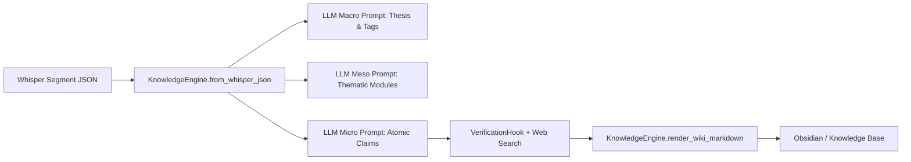

# Comparative Analysis & Improvement Report: External AI Transcript Engine

## 1. Executive Summary

This report evaluates the code artifacts delivered by the external AI (`transcript_engine.py` and `test_transcript_engine.py`) and outlines concrete engineering improvements to integrate these data structures directly into the live Whisper pipeline.

---

## 2. Strengths of the Other AI's Work

1. **Zero External Dependency Architecture**:
   * Uses only standard library modules (`re`, `json`, `dataclasses`, `pathlib`, `datetime`). Zero bloat, instant cold start.
2. **Strict Schema Validation & Typing**:
   * `@dataclass` models enforce strong contracts.
   * `MicroClaim.__post_init__` strictly validates timecodes and limits `verdict` to the allowed tuple: `("CONFIRMED", "CONTRADICTED", "MIXED", "UNVERIFIED")`.
3. **Pluggable `VerificationHook` Interface**:
   * Decoupled design: search mechanisms are injected as callables (`Callable[[str], list]`). This keeps the engine agnostic of whether web search is performed by Google API, Tavily, SearxNG, or local agent scraping.
4. **Obsidian / Second-Brain Friendly Markdown**:
   * Renders bidirectional wiki links (`[[Claim-1]]`, `[[TaxonomyTag]]`) and Markdown callouts natively.
5. **High Test Hygiene**:
   * 10 robust unit tests covering edge cases (invalid timestamps, unverified default state, JSON serialization roundtrips).

---

## 3. Gaps, Flaws & Areas for Improvement

### Flaw 1: Rigid Timestamp Regex (`HH:MM:SS` only)
* **Problem**: `hhmmss_to_seconds` strictly expects `[HH:MM:SS]` (3 pairs of digits).
* **Issue**: Audio under 1 hour or standard Whisper/VTT segments commonly output `MM:SS` (e.g. `04:15`). Passing `04:15` throws an unhandled `ValueError`.
* **Fix**: Support both `(?:(\d{1,2}):)?(\d{2}):(\d{2})` so `04:15` $\rightarrow$ `00:04:15` without throwing errors.

### Flaw 2: Missing LLM Ingestion Layer
* **Problem**: The other AI built the *data models* (containers), but did not provide the *parser/prompt engine* that takes raw transcript text and calls an LLM to populate `MacroResult`, `MesoModule`, and `MicroClaim`.
* **Fix**: Provide structured JSON extraction prompt templates (Fabric-style) with Pydantic/JSON schema validation to populate the engine automatically.

### Flaw 3: Shallow Verification Hook (URL Assignment without Verification)
* **Problem**: `VerificationHook.verify()` queries search results and extracts up to 3 URLs, but leaves the verdict as `UNVERIFIED` and does not cross-check the claim text against the source contents.
* **Fix**: Add a two-pass verification method:
  1. Web Search query extraction.
  2. Text comparison prompt comparing `<Claim>` vs `<Scraped Web Snippets>` to deterministically output `[CONFIRMED]` / `[CONTRADICTED]` with rationale in `added_context`.

### Flaw 4: No Direct Bridge to Whisper's JSON/SRT Artifacts
* **Problem**: The engine cannot directly ingest the output generated by `faster-whisper` (`P-h5WSQG1Sw.json`).
* **Fix**: Add a classmethod `KnowledgeEngine.from_whisper_json(filepath)` that clusters segments by silence/topics into initial Meso chapter candidates.

---

## 4. Synthesis & Upgrade Blueprint

