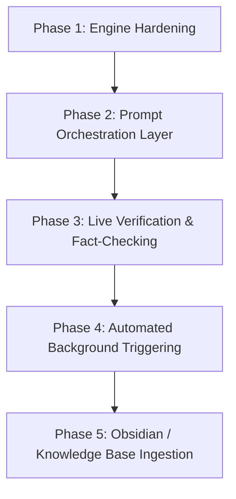

# Implementation Roadmap & Next Steps

## 1. Overview
This roadmap defines the sequential engineering phases to synthesize the local Whisper ingestion pipeline with the external AI's Macro-Meso-Micro knowledge extraction engine.

---

## 2. Phased Action Plan

### Phase 1: Engine Hardening & Bridge to Whisper Output
- [ ] **Flexible Timestamp Parser**: Update `hhmmss_to_seconds` in `transcript_engine.py` to seamlessly parse both `MM:SS` (e.g. `04:15`) and `HH:MM:SS` (`00:04:15`) formats without raising errors.
- [ ] **Direct JSON Ingestion**: Implement `KnowledgeEngine.from_whisper_json(filepath)` to automatically parse the raw `.json` segment files generated by `faster-whisper`.
- [ ] **Extend Unit Test Suite**: Add test cases for `MM:SS` parsing and Whisper JSON ingestion to `test_transcript_engine.py`.

### Phase 2: Prompt Orchestration Layer (Fabric-Style Patterns)
- [ ] **Macro Extraction Prompt (`extract_macro.md`)**: Prompt template instructing the LLM to output valid JSON matching `MacroResult` (Thesis, 3–5 Takeaways, Taxonomy `[[Tags]]`, Speaker ontology).
- [ ] **Meso Extraction Prompt (`extract_meso.md`)**: Prompt template for decomposing the audio into timestamped thematic modules and step-by-step protocols.
- [ ] **Micro Extraction Prompt (`extract_micro.md`)**: Prompt template for isolating falsifiable atomic claims with exact quote anchors.

### Phase 3: Automated Fact-Checking & Search Verification
- [ ] **Two-Pass Verification Hook**: Upgrade `VerificationHook` to not only fetch URLs but pass `<Claim>` + `<Web Page Snippets>` into an evaluator prompt that assigns `[CONFIRMED]` / `[CONTRADICTED]` / `[MIXED]` with supporting rationale.
- [ ] **Pluggable Search Backend**: Connect to Tavily, Google Search API, or local browser automation.

### Phase 4: Full End-to-End Orchestration
- [ ] **Unified Pipeline Script**: Connect `Run-YouTubeWhisperPipeline.ps1` directly to `transcript_engine.py` so that downloading audio $\rightarrow$ Whisper transcription $\rightarrow$ Macro-Meso-Micro Wiki extraction runs in a single command.
- [ ] **Windows Task Scheduler Integration**: Register a background scheduled task that polls monitored sources every 30–60 minutes and executes the entire pipeline automatically on new uploads.

### Phase 5: Multi-Repo & Knowledge Graph Ingestion
- [ ] **Obsidian / Markdown Wiki Sync**: Export verified structured notes directly to target project knowledge repositories.
- [ ] **OpenClaw Skill Interface**: Expose the pipeline as a native tool for local agent execution.

---

## 3. Ready for Next Research Batch
* The research environment and index are organized and ready to ingest the next set of documents, repos, or specifications.
