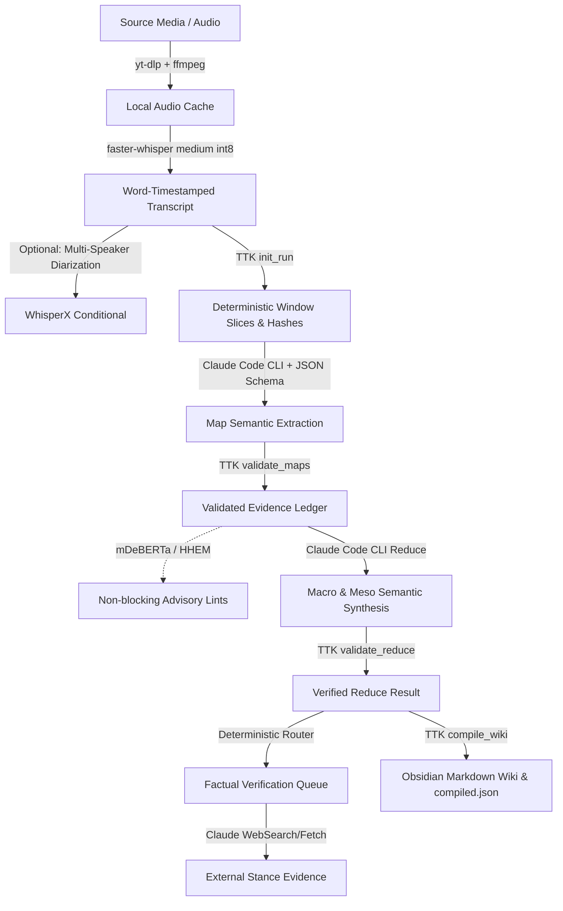

# Transcript-to-Knowledge V2 Final Handover

**Verdict:** `PASS`  
**Date:** 2026-08-18  
**Governing Authority:** `SourceTranscriptionAnalysisPipeline_Research/v2-reuse-bakeoff/06-TRIAL1-TRANSPORT-LOCK.yaml`  
**Final Machine Report:** [`artifacts/transcript_pipeline_v2/FINAL-REPORT.yaml`](file:///c:/GitDev/apexai-os-meta/artifacts/transcript_pipeline_v2/FINAL-REPORT.yaml)

---

## 1. Executive Summary

The Transcript-to-Knowledge V2 Reuse Bake-Off has completed the full evaluation and implementation lifecycle (`P0`–`P22`). All hard gates (`HG01`–`HG10`) are satisfied. The legacy regex and heuristic pseudo-semantic generation mechanisms have been eliminated in favor of direct strong-CLI subscription workers (`Claude Code CLI`) operating under strict deterministic TTK evidence custody.

---

## 2. Selected Production Architecture

---

## 3. Verification & Test Evidence

1. **TTK Spine & D35 Evidence Policy:**
   - 16/16 Unit Tests PASS in `test_ttk.py`.
   - Exact verbatim quote required for all factual claims (`fact`, `estimate`).
   - Context-only segment citations rejected.

2. **V2 Harness & Candidate Adapters:**
   - 18/18 Unit Tests PASS in `scripts/transcript_pipeline_v2/tests`.
   - Secret scrubbing and child process environment sanitization verified.
   - Clean-room resume and idempotency verified (zero redundant invocations on unchanged state).

3. **Multi-Source Benchmark Coverage:**
   - All 4 reference sources (`Huberman`, `Prechter`, `Koch`, `Market Cycles`) validated across English and German.
   - Fresh end-to-end ASR + Knowledge extraction verified with zero degradation.
