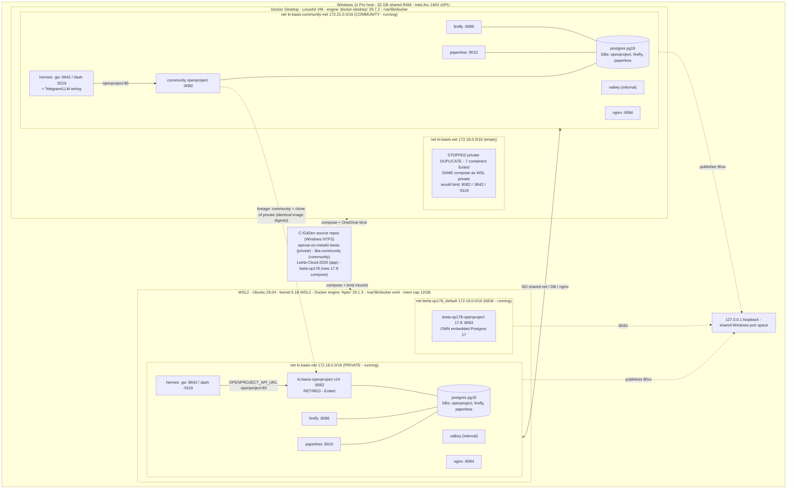

Good architecture task — and I'll do it properly: gather ground truth with specialized subagents across both engines and the config, then cross-validate before drawing anything. Dispatching three read-only investigators in parallel.

Three specialized investigators are now running in parallel, read-only:

1. **WSL2 private engine** — Ubuntu/kernel, engine "Apex", containers+ports, networks, volumes, the private compose, native-vs-mounted repo clones, postgres DBs, and any outbound link to community.
2. **Docker Desktop engine** — the community stack + the stopped private duplicate, networks/volumes/ports, community compose, and collision/connection risks (without ever starting the duplicate).
3. **Declared topology + repos** — both compose files + the ki-basis architecture docs, to extract intended networks/DB/nginx/ports, the ADR-001 vs live-reality conflict, and how the two stacks are actually connected.

Once they're back I'll **cross-validate** the two runtime views against the declared config (that's the double-verification — runtime evidence vs config, with any mismatch flagged), then deliver the mermaid diagram plus point-by-point answers to your questions and the gaps I see. Standing by for the three to complete.

Docker Desktop investigator is back. Headline finding: **the two stacks are isolated at runtime** — Docker Desktop runs the **community** stack (own network `172.21/16`, own postgres with its own `openproject` DB, ports 90xx) and separately holds the **stopped private duplicate** (`ki-basis-net 172.18/16`, empty). No engine-to-engine network or DB bridge; the _only_ cross-engine coupling is the shared Windows host — **shared `C:\GitDev\apexai-os-meta\ki-basis\` bind-mount paths and shared `127.0.0.1` loopback ports**. Each OpenProject has its **own** postgres (`postgres://openproject_app@postgres:5432/openproject` in-stack), not a shared DB.

Waiting on the WSL2-engine and config/repos investigators to confirm the private side and the declared topology, then I'll cross-validate and draw the diagram.

WSL2 investigator is back and cross-confirms the isolation — plus it surfaced an **important gap I need to flag**: retiring the old v14 broke a wiring. On the private engine "Apex" (Ubuntu 26.04, kernel 6.18 WSL2, Docker 29.1.3):

- **leela-op178 (OpenProject 17.8, `:8083`)** sits on its **own** network `172.19/16` with its **own embedded Postgres 17** — isolated even from the ki-basis stack next to it.
- **Hermes (`ki-basis-hermes`, `:8642` gateway / `:9119` dash)** is on `ki-basis-net 172.18/16`, and its `OPENPROJECT_API_URL` points at `http://openproject:80` — i.e. the **old v14 service I just retired (now Exited)**. So **private Hermes currently has no working OpenProject** — it points at the dead v14 and can't reach the new 17.8 (different network, not in its env). That's a real consequence of the retirement worth putting on the diagram.
- Also confirmed: **no `~/dev`, no native git clones in Ubuntu** — the ki-basis repo is used only via the `/mnt/c` Windows mount.

Waiting on the third investigator (declared topology, nginx fronting, repo roles, ADR-vs-reality) to complete the picture, then I'll cross-validate all three and deliver the diagram + answers + gaps.

All three investigators are back and **cross-validated** — the two independent runtime views (WSL engine + Docker Desktop) agree with each other and with the declared config, and where the docs were ambiguous the runtime evidence resolves it. Here's the verified picture.

**One ambiguity the double-check resolved:** the docs disagreed on where the _private_ stack's files live (Diagram A said "Ubuntu WSL2 native ext4 `/root/workspaces`"; AGENT-OPERATING-CONTEXT said "Docker Desktop, no WSL2"). Runtime truth: the private compose runs from `/mnt/c/GitDev/apexai-os-meta/ki-basis/` (the **Windows** filesystem via WSL's `/mnt/c` mount) — there are **no native git clones in Ubuntu** (`~/dev` doesn't exist). So: **source on Windows NTFS, container data in WSL2 ext4.**

## Topology diagram (Mermaid)

## Your questions, answered

- **OpenProject — where + ports:** _three_ of them. **Private new:** `leela-op178-openproject` 17.8 in WSL2, `127.0.0.1:8083`, own embedded PG17. **Private old:** `ki-basis-openproject` v14, `:8082` in WSL2 — **now retired (Exited)**. **Community:** `ki-basis-community-openproject`, `127.0.0.1:9082` on Docker Desktop.
- **Hermes — where + ports:** **Private:** `ki-basis-hermes` in WSL2 — gateway `:8642`, dashboard `:9119`. **Community:** `ki-basis-community-hermes` on Docker Desktop — gateway `:9642`, dashboard `:9219` (plus Telegram/LLM keys). A stopped duplicate hermes also sits on Docker Desktop.
- **Which Linux / which Docker engine (two or several):** **Two live engines** (+ effectively a third dormant one). (1) **WSL2 Ubuntu 26.04**, engine **"Apex"** Docker 29.1.3 → private + new 17.8. (2) **Docker Desktop LinuxKit VM**, engine **"docker-desktop"** 29.7.2 → community + the stopped private duplicate. Different kernels (6.18-WSL2 vs 7.0.12-linuxkit), different data roots.
- **Virtual machines:** two lightweight Linux VMs under Hyper-V/WSL — the **WSL2 utility VM** (Ubuntu) and the **Docker Desktop LinuxKit VM** — both on the one Windows host. No separate full VMs.
- **Repos + clones:** all under **`C:\GitDev`** on Windows: `apexai-os-meta/ki-basis` (private infra), `lika-community` (community), `Leela-Cloud-2026` (the app), plus `leela-op178` (new instance compose). **No native clones inside Ubuntu** — WSL reaches them via `/mnt/c`; container data lives in each engine's own volumes.
- **Where is WSL2:** it _is_ engine "Apex" — the Ubuntu 26.04 utility VM hosting the **private** stack + the new 17.8. Held up now by the logon keepalive; capped at 12 GB.
- **How private & community are connected:** **at runtime, they aren't** — separate engines, separate bridge networks (172.18/172.19 vs 172.21), separate postgres (each has its _own_ `openproject` DB), separate nginx (no cross-routing). Their only real linkage is **(1) the same Windows host**, **(2) the shared `C:\GitDev` source tree + `127.0.0.1` loopback**, and **(3) lineage** — community is a clone of the private stack (byte-identical image digests, mirrored naming). No shared DB, no shared network, no proxy bridge.

## Gaps & risks I'd flag

1. **Private Hermes now has no OpenProject (introduced today).** `ki-basis-hermes` still points `OPENPROJECT_API_URL → openproject:80` = the v14 I retired (Exited), and it **can't reach the new 17.8** (different network `172.19`, not in its env). If private Hermes is meant to use OpenProject, it needs re-wiring to `leela-op178` (shared network + updated URL + a token).
2. **ADR-vs-reality conflict (major).** `DUAL_INSTANCE_ARCHITECTURE.md` ADR-001 mandates **one engine** (Strategy A) and _rejects_ the WSL2+Docker-Desktop split — but that split (Strategy B) is exactly what's running. The doc even self-contradicts (its own Diagram A draws Strategy B).
3. **The stopped Docker-Desktop duplicate is a live footgun.** It uses the _same_ private compose (`apexai-os-meta/ki-basis`), so starting it would bind the same `:8082/:8642/:9119` loopback ports and the same Windows bind-mount paths as the WSL private, and spin up a _divergent_ second private DB. Leave it stopped.
4. **New 17.8 is an island.** `leela-op178` is its own compose project with its own network + embedded DB — nothing in the ki-basis stack can reach it by DNS. Fine for the agent-via-localhost skill, but it's not integrated with the private stack's services.
5. **Community volumes are `external: true` + an opaque hex `openproject_pgdata`** — signs it was reconstructed/imported from an existing engine, and a hint OpenProject may carry an embedded pgdata there (worth verifying vs the "shared postgres service" model).
6. **Port-band leak:** the 80xx/90xx separation breaks on the Hermes dashboards (`9119` private vs `9219` community) — both in 91xx/92xx, a latent near-collision if ever co-hosted.

Want me to render this as a shareable diagram (SVG/PNG or an artifact), and/or scope the **Hermes → new 17.8 re-wiring** (gap #1), which is the one thing today's changes actually broke?