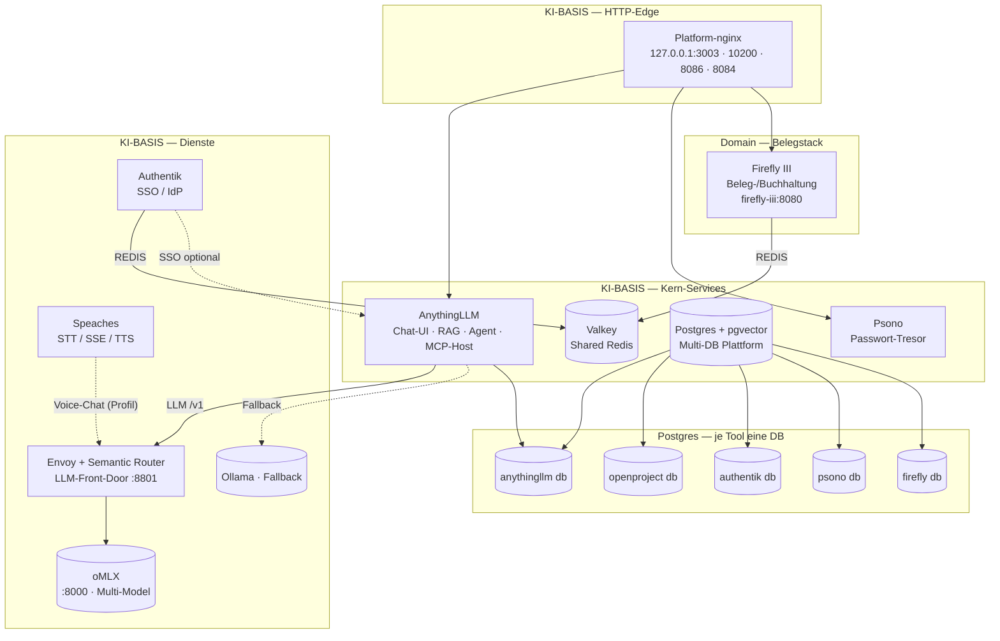

# ki-basis — Platform-Architektur (Startpunkt)

> **Startpunkt-Diagramm** für den Full-Stack. ki-basis ist die **gemeinsame Platform**,
> auf der Domain-Stacks wie [ki-pm](~/dev/ki-pm) aufsetzen.
> Full-Stack-Architektur (ki-basis + ki-pm, **alles via MCP**): siehe
> [`~/dev/ki-pm/docs/FULL-STACK-ARCHITEKTUR.md`](~/dev/ki-pm/docs/FULL-STACK-ARCHITEKTUR.md).

> **Kern-Service-Linie (`bash docker/scripts/start-basis.sh`):**
> `postgres`, `valkey`, `anythingllm`, `psono`, `authentik`, `semantic-router`, `envoy`, `nginx`;
> optional per Profil `ollama` (+`--ollama`), `speaches`.
> Firefly III: Domain `belegstack` (nicht Kern) — siehe [FIREFLY.md](FIREFLY.md).
>
> **LLM-Default:** Host-natives **oMLX** (Metal) — optional hinter **Envoy + Semantic Router** in Compose.
> Chat-Clients: `http://envoy:8801/v1` oder direkt `http://host.docker.internal:8000/v1`.
> Host-Port `:8000` für oMLX und lokale Healthchecks — siehe [DEC-0031](knowledge/decisions/dec-0031-semantic-router-compose-front-door.md).

### Betreffende Doku
- [docs/DOCKER.md](DOCKER.md) · [docs/NGINX.md](NGINX.md)
- [docs/SPEACHES.md](SPEACHES.md)
- [docs/PSONO.md](PSONO.md) · [docs/FIREFLY.md](FIREFLY.md) · [docs/DATENBANK.md](DATENBANK.md)
- [docs/ANYTHINGLLM.md](ANYTHINGLLM.md) (Workspaces, RAG, MCP `autoStart`)
- [config/semantic-router/README.md](../config/semantic-router/README.md) · [DEC-0031](knowledge/decisions/dec-0031-semantic-router-compose-front-door.md)
