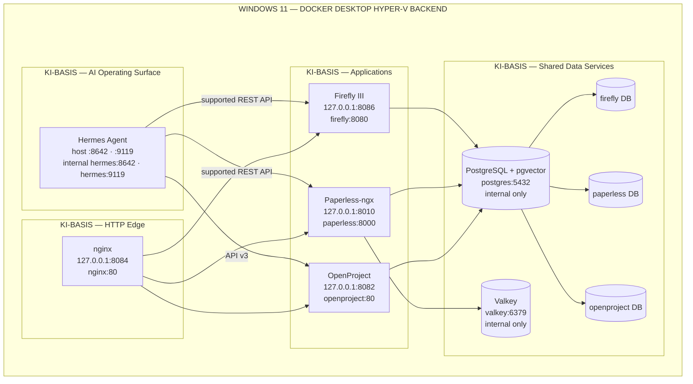

# ki-basis — Current Platform Architecture

> **Current runtime authority:** `ki-basis/compose.yaml`.  
> This document describes the implemented local Docker stack on Windows 11 with Docker Desktop (Hyper-V backend). The older AnythingLLM/Psono/Authentik/Envoy/oMLX/Ollama/Speaches topology is superseded for the current runtime and remains available through Git history for provenance.

> **Current service line (`ki-basis/compose.yaml`):**
> `postgres`, `valkey`, `firefly`, `paperless`, `openproject`, `nginx`, `hermes`.
>
> **Target host/runtime:** Windows 11 with Docker Desktop's Hyper-V Linux-container backend and one Docker Engine. Routine operation is CLI-first/background-only: the Docker Dashboard is kept closed. Fully stopping Docker Desktop stops the current managed Linux runtime; a genuine no-Desktop Docker Engine would require a separate Linux-VM migration.
>
> **Network:** all services join `ki-basis-net` and use Docker service-name DNS. PostgreSQL and Valkey are internal-only.
>
> **Persistence:** PostgreSQL, Valkey, Firefly uploads, Paperless data/media/export/consume, OpenProject assets, and Hermes `/opt/data` are persisted into target-local Docker volumes.
>
> **Hermes role:** Hermes is the canonical local routing/execution plane for future application skills. heavy-reasoning CLI agents call Hermes through its authenticated loopback API server; Hermes then performs its own provider-backed routing/tool execution. The final product skill set is intentionally deferred until the real skills are supplied. Hermes does not mount a Docker socket or rely on Ubuntu WSL filesystem binds.
>
> **Alpine policy:** Alpine is an image choice, not the platform architecture. nginx and Valkey use Alpine-compatible upstream images; complex vendor applications retain supported upstream images.

### Deferred performance tuning — measure first

**Status:** future candidate / no runtime change now.

Do not add hard container CPU/RAM ceilings, reduce Paperless/OpenProject workers, or tune PostgreSQL/Valkey solely from generic recommendations. Open a dedicated tuning module only after measurements show a real bottleneck. Minimum evidence: `docker stats --no-stream` and product symptoms during idle, normal Hermes use, Paperless OCR, OpenProject use, backup, and restore. If no bottleneck is observed, the correct outcome is `NO_CHANGE_REQUIRED`. In particular, do not apply Valkey `allkeys-lru` eviction merely to cap memory because Valkey participates in Paperless' operational path.

### Current authority / evidence
- Runtime: [`../../ki-basis/compose.yaml`](../../ki-basis/compose.yaml)
- Stack environment template: [`../../ki-basis/.env.example`](../../ki-basis/.env.example)
- Current target acceptance: [`TARGET-ACCEPTANCE-REPORT.md`](TARGET-ACCEPTANCE-REPORT.md)
- Historical pre-migration source evidence: [`INTEGRATION-ACCEPTANCE-REPORT.md`](INTEGRATION-ACCEPTANCE-REPORT.md)
- Antigravity implementation authority: [`ImplementationPlans/00-START-HERE.md`](ImplementationPlans/00-START-HERE.md)
- Alpine image-build reference: [`2026-09-01-alpine-image-build.md`](2026-09-01-alpine-image-build.md)
- Docker Desktop/Windows performance research input (non-authoritative): [`research/Docker-Desktop-Windows.md`](research/Docker-Desktop-Windows.md)

