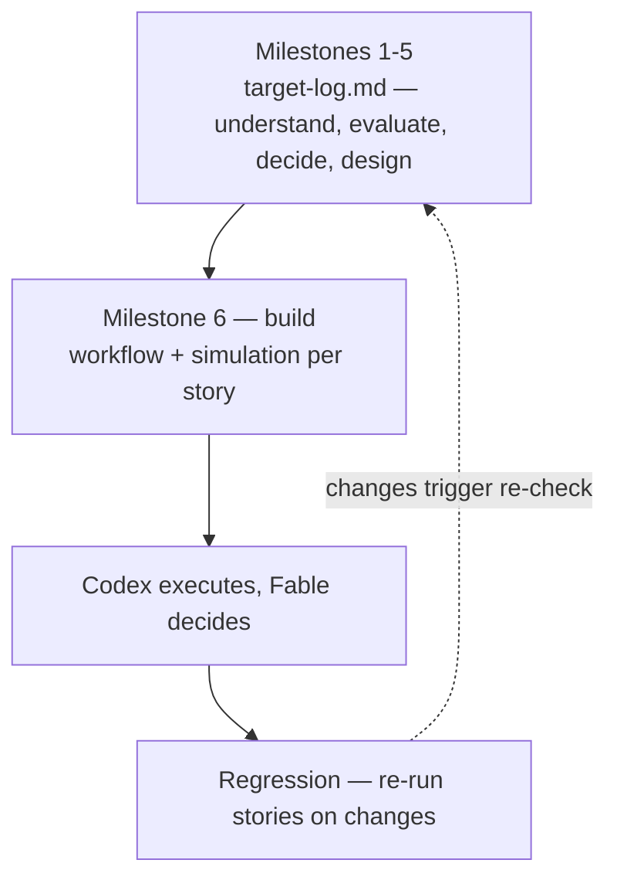

# Build Plan

## Flow



Milestones 1–5 (understand intent, understand resilience best-practice, evaluate soundness/impact/resilience, resolve open questions, draft architecture) live in `target-log.md` — they are the real "what to build" work, not restated here. This file picks up once milestone 5's architecture is drafted.

```yaml
workflow_and_simulation:
  goal: >
    For each user story in APEX_Orchestration_User_Stories/user-stories.md, draft the concrete workflow per process-blueprint.md,
    run it once for real against real content, record pass/partial/fail.
  output: apex-meta/fable-orchestrator/simulations/ (one file per story)
  gate: a workflow isn't adopted until its simulation record exists and passed.

build:
  goal: Implement the actual skills/subagents/scaffolding, using verified workflows as spec.
  method: Codex for pure execution (apex-meta/CODEX_EXECUTION_STANDARD.md), Fable for judgment.

regression:
  goal: Re-run APEX_Orchestration_User_Stories/user-stories.md whenever the KB/skills/scaffolding change.
```

## What counts as a "simulation"

```yaml
simulation_definition:
  is: "An actual attempt to satisfy the user story using real repo content, real result recorded — pass, partial, or fail, honestly."
  is_not:
    - a hypothetical walkthrough
    - a design doc describing how it should work in principle
  minimum_record_shape:
    - the user story being tested
    - the actual steps taken (real tool calls, real files read)
    - the actual result (quote or cite it)
    - verdict: pass / partial / fail, with the reason
```

## Worked example (already run once, proves the discipline works)

**User story:** As a future orchestrator agent, when I need to decide subagent-vs-inline-work, I want `claude-code-orchestration-design` to give me a real, source-cited answer.

**Result:** `wiki/summaries/agent-vs-subagent-vs-skill.md` answers it directly, with real quoted claims and line-number source pointers, and honestly flags two unresolved uncertainty triggers instead of overclaiming. Verdict: PASS.

## Where the logs live

```yaml
target_and_milestones: apex-meta/fable-orchestrator/target-log.md
decisions: apex-meta/fable-orchestrator/decisions.md
user_stories: apex-meta/fable-orchestrator/APEX_Orchestration_User_Stories/user-stories.md
simulation_records: apex-meta/fable-orchestrator/simulations/    # not yet created
kb_authoring_status: apex-meta/kb/claude-code-orchestration-design/log/lifecycle-completion-report-20260710.md
kb_open_work: apex-meta/handoff/Apex-Kb_Lifecycle_Analysis/orchestrator-education-targeting-handover.md
repo_wide_map: apex-meta/ORCHESTRATION-SYSTEMS-INDEX.md
```

## Still genuinely open

1. `simulations/` doesn't exist yet — no story has been run as a real session.
2. The `max-run-20260709/` vs. root wiki-page duplication in `claude-code-orchestration-design` is deferred, not fixed.
3. `query-eval-pack.json` still has zero authored queries.
