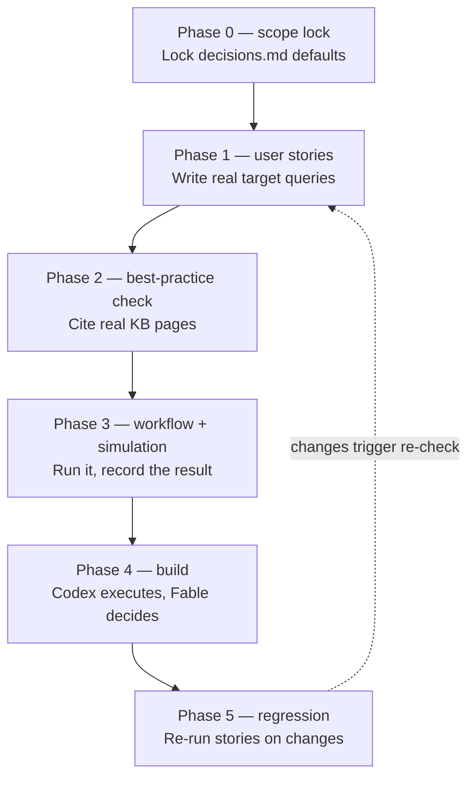
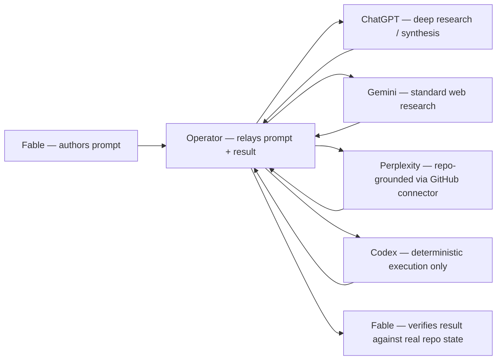

# Process Overview

## The flow (mermaid — renders in most viewers; also shown as an inline diagram in chat)



Inside phase 3 specifically, the model-routing loop runs (see `fable-execution-best-practices.md` §2–3):



## What / how / with what / how verified — one table

| Step | What | How | Tool used | Verification |
|---|---|---|---|---|
| 0 | Lock the process blueprint | Accept defaults in `chosen-blueprint-processes.md` unless operator overrides | Fable writes `decisions.md` | None needed — this is the gate itself |
| 1 | Define what "done" means | Write concrete user stories (not capability lists) | Fable authors `user-stories.md` | Each story must be answerable in principle before it's kept |
| 2 | Check against best practice | Find the real page/claim in `claude-code-orchestration-design` (or another indexed KB) that should answer each story | Fable searches/reads the KB directly | Fail condition: no source found = real gap, don't invent one |
| 3 | Prove it works | Draft the concrete workflow, run it once for real, record pass/partial/fail | Fable + external models per the routing table + Codex | The simulation record itself (see `build-plan-recommendation.md` §4–5) |
| 4 | Build | Implement the actual skills/subagents/scaffolding from verified workflows | Codex for execution (`apex-meta/CODEX_EXECUTION_STANDARD.md`), Fable for judgment | Deterministic postflight per `apex-kb` skill where applicable |
| 5 | Keep it honest over time | Re-run phase-1 stories whenever the KB/skills/scaffolding change | Fable, on a recurring basis | A story that used to pass and now fails is a regression, not noise |

## Where the logs and decisions actually live

```yaml
decisions: apex-meta/fable-orchestrator/decisions.md          # not yet created — Fable writes it in phase 0
user_stories: apex-meta/fable-orchestrator/user-stories.md      # not yet created — Fable writes it in phase 1
simulation_records: apex-meta/fable-orchestrator/simulations/    # one file per story, created in phase 3
kb_authoring_status: apex-meta/kb/claude-code-orchestration-design/log/lifecycle-completion-report-20260710.md
kb_open_work: apex-meta/handoff/Apex-Kb_Lifecycle_Analysis/orchestrator-education-targeting-handover.md
process_blueprint_reasoning: apex-meta/fable-orchestrator/process-blueprint-qa.md   # the "why", not the decision itself
process_blueprint_decision: apex-meta/fable-orchestrator/chosen-blueprint-processes.md  # the actual ranked choice
execution_best_practices: apex-meta/fable-orchestrator/fable-execution-best-practices.md
repo_wide_map: apex-meta/ORCHESTRATION-SYSTEMS-INDEX.md
git_history: "every write in this initiative is a normal commit — git log is the audit trail of record, nothing here replaces it"
```

## Sense-check — does this actually hold together?

Yes, and it holds together for a specific reason: every layer of this design reduces to the same two-part pattern (orchestrator-worker delegation + a real verification gate before anything counts as done), just applied at a different scale each time —

- At the **architecture layer**: the three existing orchestration KBs converge on a small control plane + deterministic/semantic split + independent validation (`agent-skill-system-research/best-practice-report.md`).
- At the **process layer**: the chosen blueprint is orchestrator-worker fan-out + handoff-with-guardrails + chain-of-verification, ranked #1–3 out of 20 candidates (`chosen-blueprint-processes.md`).
- At the **execution layer**: Fable delegates to external models and Codex, then verifies every result itself before acting (`fable-execution-best-practices.md` §2–4).
- At the **build-discipline layer**: every design decision needs a real citation plus a real simulation before it's trusted (`build-plan-recommendation.md`).

Nothing here invents a new pattern at each layer — it's the same pattern, recursively applied. That repetition is the actual argument for why this design is sound, not just internally consistent by accident.

**What's still genuinely open, not resolved by this document:**
1. `decisions.md`, `user-stories.md`, and the simulation records don't exist yet — this file describes where they'll live, phase 0–3 haven't been run as a real session yet.
2. The `max-run-20260709/` vs. root wiki-page duplication in `claude-code-orchestration-design` is explicitly deferred, not fixed.
3. `query-eval-pack.json` still has zero authored queries — phase 1's user stories are meant to become these, but that hasn't happened yet either.

This document is a map of a well-reasoned plan, not a report of work already done. Don't read it as more finished than it is.
