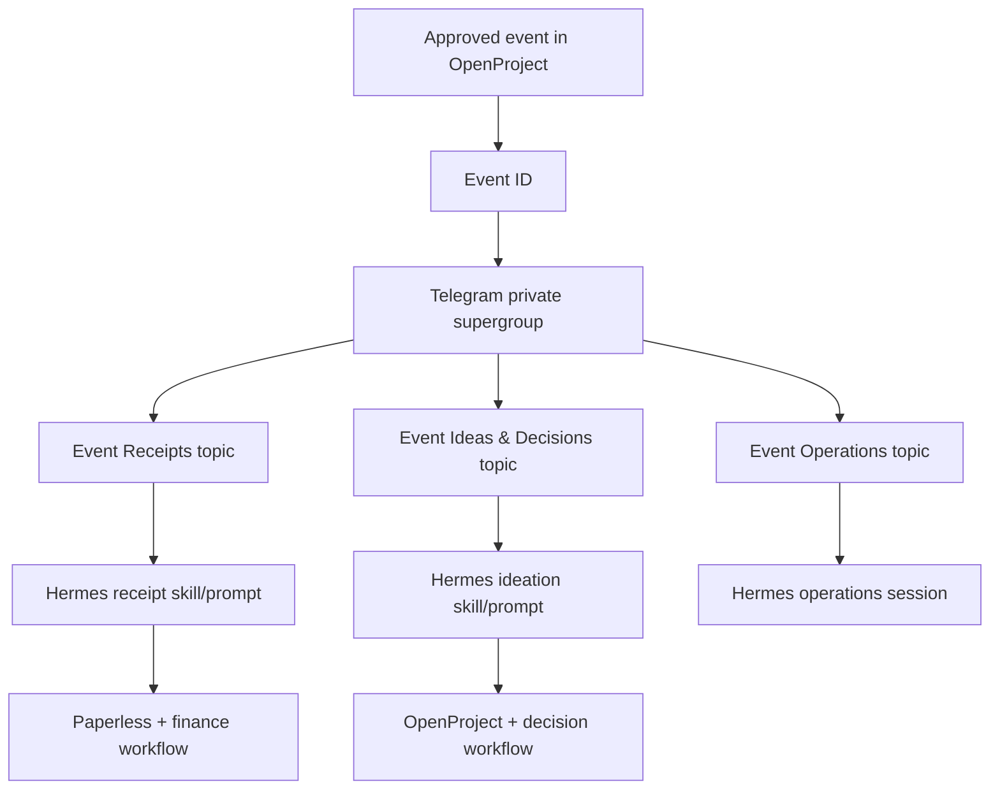
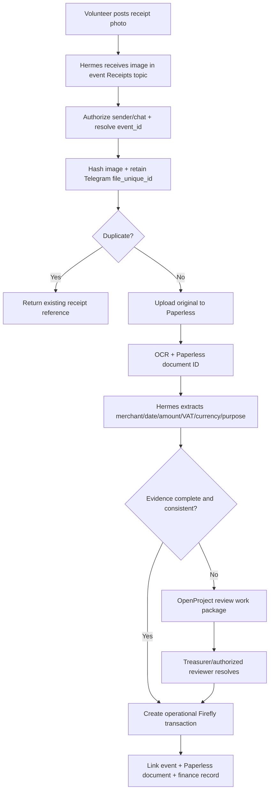
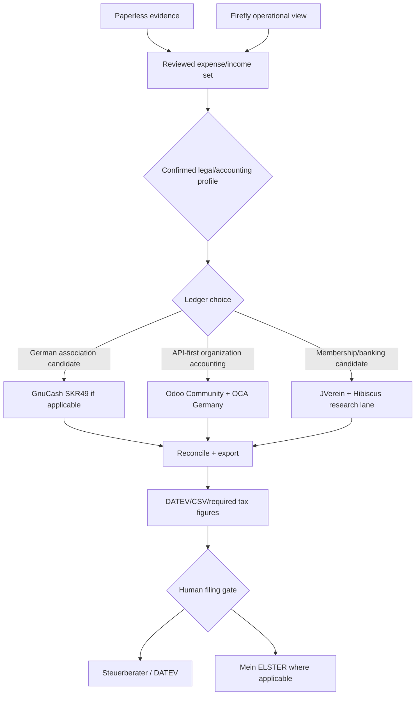
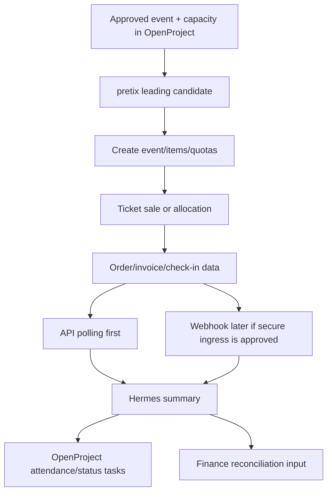
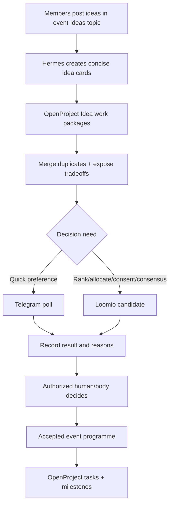

# Workflow Architecture

## Current stack boundary

Use the existing `ki-basis` services as separate systems of record. Do not turn Hermes into a new database.

| Component | Charity role |
|---|---|
| Hermes | Telegram interaction, image understanding, extraction, API orchestration |
| Paperless-ngx | Original receipt evidence, OCR, tags, custom fields |
| Firefly III | Operational expense/income view; not tax authority |
| OpenProject | Event plan, volunteer tasks, receipt reviews, decision follow-through |
| PostgreSQL + pgvector | Existing substrate; use only for proven integration state or later retrieval needs |
| Nginx | Local edge; keep public exposure closed by default |

## W1 — Charity supergroup and event-topic system

For the first pilot, an admin creates topics and records thread IDs. Target automation may later call Telegram `createForumTopic` after the permissions and mapping workflow is proven.

## W2 — Volunteer receipt photo

The photo should be easy for volunteers; review complexity belongs with the authorized finance role.

## W3 — Bookkeeping and German tax handoff

GnuCash documents SKR49 for German associations. This is only a candidate until Lika's legal and tax profile is confirmed. JVerein is open-source association administration with Hibiscus integration, but it is not yet selected as the accounting/tax backbone.

## W4 — Ticketing

pretix has the strongest verified API fit. Alf.io is an open-source ticketing alternative. `tixlr.de` remains an option only after official API evidence is obtained.

## W5 — Ideation, voting, and event programme

Telegram remains the easy participation surface. OpenProject remains the execution surface. Loomio is the first challenger when decision quality needs more than a simple poll. Decidim is reserved for broader public participation.

## Security and governance rules

- Use Telegram user/chat allowlists.
- Grant only required bot admin permissions.
- Store tokens outside Git.
- Keep original receipts immutable in Paperless.
- Keep human review for ambiguous accounting fields.
- Keep formal governance authority with the organization, not Hermes.
- Prefer polling before opening public webhooks into the loopback-only stack.

## Evidence anchors

- Telegram Bot API: https://core.telegram.org/bots/api
- Hermes Telegram: https://hermes-agent.nousresearch.com/docs/user-guide/messaging/telegram
- Paperless API: https://docs.paperless-ngx.com/api/
- OpenProject API v3: https://www.openproject.org/docs/api/
- pretix API: https://docs.pretix.eu/dev/api/
- GnuCash German account frameworks: https://wiki.gnucash.org/wiki/De/Referenz
- JVerein: https://www.jverein.de/
- OCA Germany: https://github.com/OCA/l10n-germany
- Loomio: https://www.loomio.com/docs/en/user_manual/polls/intro_to_decisions
