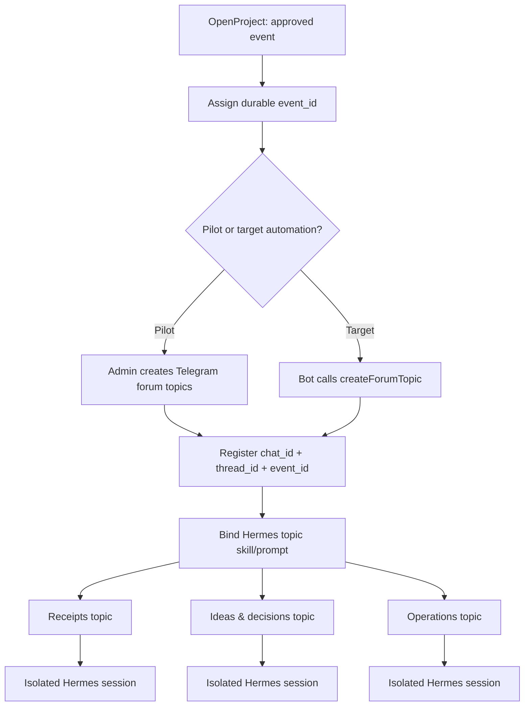
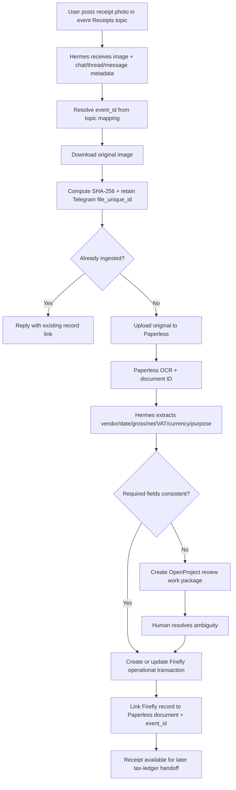
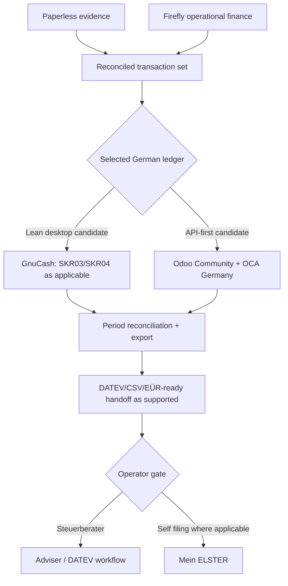
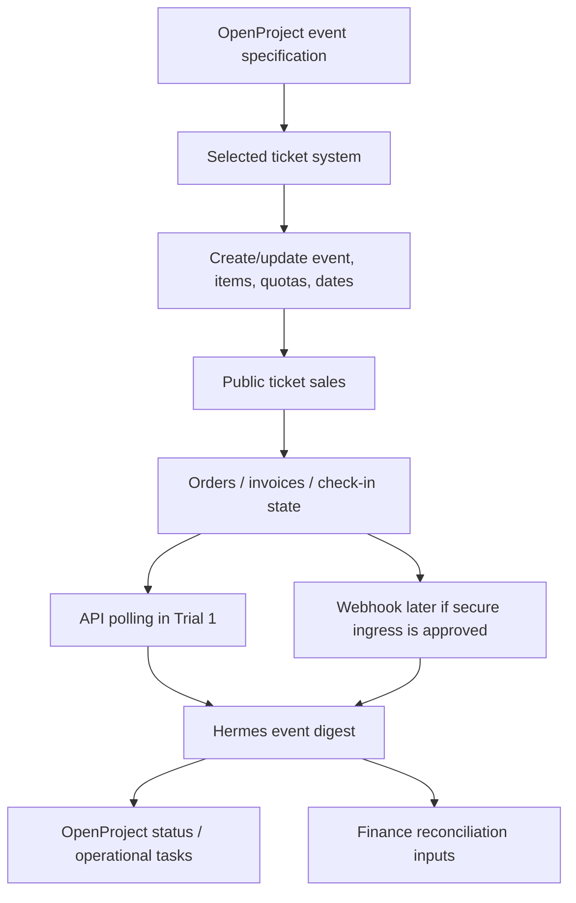
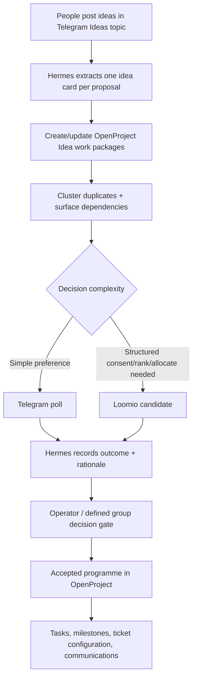

# Workflow Architecture

## Current stack boundary

`ki-basis` currently provides PostgreSQL/pgvector, Valkey, Firefly III, Paperless-ngx, OpenProject, Nginx, and Hermes. Hermes already receives internal API URLs for Firefly, Paperless, and OpenProject in `compose.yaml`.

| Component | Current role | Workflow use |
|---|---|---|
| Hermes | Agent execution and messaging gateway | Telegram intake, extraction, routing, API orchestration |
| Paperless-ngx | Document storage and OCR | Receipt evidence and searchable source document |
| Firefly III | Personal-finance application with API | Operational expense/income view; not the tax ledger |
| OpenProject | Project/work-package system with API v3 | Event, task, review, milestone, and decision follow-through |
| PostgreSQL + pgvector | Internal data substrate | Reuse only when a concrete integration record is required; no new KB by default |
| Valkey | Internal cache | Existing application dependency |
| Nginx | Loopback edge proxy | Keep local by default; public webhook ingress is a separate decision |

## W1 — Event workspace and Telegram supergroup

Target: one Telegram supergroup with forum topics. Each event receives scoped operational topics.

Telegram supports forum topics. Hermes already isolates group sessions by topic and supports topic skill bindings. The pilot should prove topic routing before automating topic creation.

## W2 — Receipt photo to evidence and operational bookkeeping

Do not infer tax category or VAT when evidence is ambiguous. Paperless owns the original document; Firefly owns only the operational finance view.

## W3 — Operational bookkeeping to German tax workflow

GnuCash and Odoo/OCA are candidates, not installed stack components. Select the ledger after a real export/import proof. Keep final filing outside autonomous execution for the first release.

## W4 — Ticketing integration

**Leading candidate:** pretix. Its documented REST API covers events, orders, invoices, transactions, check-in, exporters, and webhooks. `tixlr.de` currently has no public API documentation verified for this project. Alf.io is a valid open-source ticketing challenger, not an ideation tool.

## W5 — Ideation, voting, and final event programme

Start with Telegram + OpenProject. Add Loomio only when the group needs richer proposals, ranking, allocation, consent, or an auditable decision process. Decidim is a later option for broad public participation, not the first internal-team tool.

## Integration rules

- Store secrets outside Git.
- Allowlist Telegram users/chats.
- Keep Telegram group privacy and bot admin permissions explicit.
- Use idempotency keys for receipt and ticket mutations.
- Prefer polling before opening public webhook ingress.
- Use OpenProject for review queues instead of inventing another task database.
- Keep `pgvector` unused until a measured retrieval need justifies a semantic index.

## Evidence anchors

- Telegram Bot API: https://core.telegram.org/bots/api
- Hermes Telegram: https://hermes-agent.nousresearch.com/docs/user-guide/messaging/telegram
- Paperless API: https://docs.paperless-ngx.com/api/
- OpenProject API v3: https://www.openproject.org/docs/api/
- pretix API: https://docs.pretix.eu/dev/api/
- GnuCash German account frameworks: https://wiki.gnucash.org/wiki/De/Referenz
- OCA German localization: https://github.com/OCA/l10n-germany
- Mein ELSTER: https://www.elster.de/
