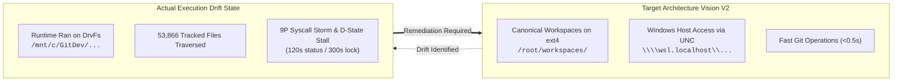

# 03 — Recent Commits Scale Audit & Architecture Drift Analysis

**Module ID:** `ARCH-IMP-03-COMMITS-SCALE-AND-DRIFT-AUDIT`  
**Parent Package:** `01-hermes-wsl-drvfs-git-performance`  
**Date:** 2026-08-25  

---

## 1. Repository Scale Audit: The 53,866 Tracked Files Anatomy

An inspection of the current Git tree in `leela-spec/apexai-os-meta` reveals **53,866 tracked files**.

```text
PS C:\GitDev\apexai-os-meta> git ls-files | Measure-Object -Line
Lines: 53866
```

### Breakdown of File Scale by Major Directory Subtree:

```text
├── ApexDefinition&OldVersions/            ~ 18,200 files (Historical transcripts, old doc sets)
├── source-knowledge/ProjectRepos/          ~ 14,350 files (Cloned vendor repos, sub-projects)
├── apex-meta/kb/                          ~ 12,100 files (Extracted knowledge base, corpus files)
├── artifacts/                             ~  4,850 files (Transcript pipelines, TTK runs, campaigns)
├── apex-meta/orchestration/simulation/     ~  1,250 files (Multi-week E2E simulation suites)
└── Other code, scripts, and skills         ~  3,116 files
```

---

## 2. Inefficiencies Introduced in Recent Commits

A chronological audit of recent commits reveals how specific actions directly inflated the filesystem traversal burden:

| Commit SHA | Commit Title | Files Changed / Added | Inefficiency Impact |
| :--- | :--- | :---: | :--- |
| `414e4170` | `feat(simulation): generate full-detail canonical granular file tree (380+ files across 10 days)` | **+401 files** | Added hundreds of individual daily flow cards, prompt files, raw log dumps (`raw-dump-*.log`), and merge YAMLs. Every leaf file adds a mandatory `lstat()` in Git tree scans. |
| `db55b79d` | `feat(simulation): materialize complete 2-week hermes weekly orchestration simulation suite` | **+88 files** | Created deep nested directory hierarchies for Day 1..Day 10 simulation evidence. |
| `d322703d` | `feat(simulation): commit real-life multi-agent simulation with full variations A/B/C` | **+88 files** | Added multi-variant daily brief files, checkpoint logs, and synthetic evidence dumps. |
| `81ec2730` | `feat(simulation): execute full 2-week E2E weekly orchestration simulation` | **+124 files** | Populated initial simulation tree with extensive multi-agent logs. |
| `81c98147` | `feat(orchestration): complete Hermes Multi-Repo Orchestration v2 implementation (P00-P18)` | **+33 files** | Added QMD refresh receipts, implementation evidence, and capability registry. |

### Architectural Review:
While generating full simulation evidence was necessary to satisfy testing requirements, **checking hundreds of granular unindexed raw log dumps (`raw-dump-*.log`) directly into Git as discrete files** multiplied the working tree surface area. 

---

## 3. Architecture Vision Audit vs. Runtime Drift

### A. What the Architecture Vision Specified
In [`HERMES_MULTI_REPO_ORCHESTRATION_V2_ARCHITECTURE_SHOWCASE.md`](../../docs/HERMES_MULTI_REPO_ORCHESTRATION_V2_ARCHITECTURE_SHOWCASE.md) and [`P14-apex-canonical-migration.md`](../../epics/hermes-multi-repo-orchestration-v2/implementation/evidence/P14-apex-canonical-migration.md):
- **Core Invariant 1 (Canonical Workspaces):** All active repositories must reside in **Ubuntu WSL2 native ext4** at `/root/workspaces/<repo-name>`.
- **Core Invariant 2 (Windows Interop):** Windows tools (Obsidian, VS Code, File Explorer) access the ext4 workspaces via Windows UNC paths (`\\wsl.localhost\Ubuntu\root\workspaces\...`).
- **Core Invariant 3 (Docker Isolation):** Disposable worker containers bind-mount the canonical ext4 workspace as `/workspace` (`/root/workspaces/acim-secular -> /workspace`).

### B. Where the Actual Runtime Drifted
In the session where Hermes failed:
1. **The Workspace Target:** Hermes was executed in a container or subshell where `/workspace` was mounted directly to `C:\GitDev\apexai-os-meta` (via `/mnt/c/GitDev/apexai-os-meta`) instead of `/root/workspaces/apexai-os-meta`.
2. **The Git Command Dispatch:** When instructed to push the reviewer handover, Hermes ran:
   ```bash
   git status --short -- artifacts/weekly-orchestration-campaign/04-phase4/...
   git commit -m "..."
   ```
   Because it was running inside Linux on `/mnt/c/`, it triggered the full 9P traversal penalty across all 53,866 files.
3. **The Unmitigated Recovery Loop:**
   - On timeout, the agent issued `kill -9`, entering the unrecoverable `D state`.
   - The agent then attempted `rm -f .git/index.lock`, which blocked for 300 seconds on the host NTFS lock manager.

---

## 4. Summary of Gaps to Close



1. **Strict Runtime Path Enforcement:** Ensure Hermes / Docker worker lanes always bind-mount from native ext4 (`/root/workspaces/...`).
2. **Agent Operating Guardrails:** Update `AGENTS.md` to instruct agents to use scoped Git commands (`-uno`, `--only`) and handle filesystem boundaries safely.
3. **Repository Scale Hygiene:** Ensure raw simulation dumps and ephemeral test logs are not checked in as raw files when structured summary outputs suffice.
