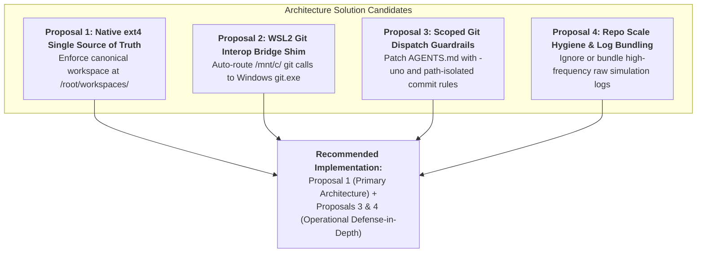

# 04 — Architecture Fix Proposals & Decision Matrix

**Module ID:** `ARCH-IMP-04-PROPOSALS-AND-DECISION-MATRIX`  
**Parent Package:** `01-hermes-wsl-drvfs-git-performance`  
**Date:** 2026-08-25  

---

## 1. Solution Space Overview

To permanently prevent the Hermes agent from stalling on Git operations and filesystem locks, four complementary architectural solutions have been evaluated:



---

## 2. Detailed Proposal Specifications

### Proposal 1: Canonical Native ext4 Enforcement (Primary Architectural Target)
* **Design:** Ensure that Hermes agents, disposable Docker worker sandboxes, and automated background runners execute exclusively within the **WSL2 ext4 filesystem** (`/root/workspaces/<repo-name>`).
* **Mechanism:**
  - When launching Hermes or spawning containers, bind-mount `/root/workspaces/<repo> -> /workspace`.
  - The Windows host environment (Obsidian, VS Code, File Explorer) accesses these exact workspaces via the high-speed UNC path `\\wsl.localhost\Ubuntu\root\workspaces\<repo>`.
* **Latency Profile:** `git status` on 53k files runs in **0.15s – 0.45s** (pure in-kernel ext4 VFS cache).
* **Pros:** 
  - 100% immune to 9P latency and cross-OS D-state lock hangs.
  - Exactly aligns with the already approved Hermes Multi-Repo Architecture V2.
* **Cons:** Requires enforcing that agent sessions do not accidentally start from Windows host paths (`C:\GitDev\...`).

---

### Proposal 2: WSL2 Git Interop Shim (Host Path Fallback)
* **Design:** In the agent's Linux shell environment (`/root/.bashrc` or container entrypoint), inject a wrapper function for `git` that automatically delegates to `git.exe` whenever the current working directory resides under `/mnt/*`.
* **Mechanism:**
  ```bash
  function git() {
      if [[ $(pwd -P) == /mnt/* ]]; then
          git.exe "$@"
      else
          command git "$@"
      fi
  }
  ```
* **Latency Profile:** `git status` on 53k files runs in **~0.8s – 1.2s**.
* **Pros:** Acts as an automatic safety net if an agent is accidentally invoked in `/mnt/c/`.
* **Cons:** Adds ~100ms process startup overhead for Windows binaries called from WSL; requires CRLF/LF line-ending consistency.

---

### Proposal 3: Scoped Agent Git Dispatch Guardrails (In `AGENTS.md`)
* **Design:** Update [`AGENTS.md`](file:///c:/GitDev/apexai-os-meta/AGENTS.md) and agent prompts with explicit execution rules for large repositories and cross-filesystem environments.
* **Rules to Add:**
  1. **Direct Path-Scoped Commits:** When staging and committing known files, avoid full `git status` sweeps; use `git add -- <path>` followed by `git commit -m "..." -- <path>` or `git commit -o <path>`.
  2. **Untracked Scans Suppression:** When checking status, always pass `-uno` (`git status --short -uno`) to skip full directory tree scans.
  3. **No Blind `kill -9` on Git:** If a Git command is slow, never issue `kill -9` immediately; check process state with `ps aux`. If in `D state`, wait for socket release.
* **Latency Profile:** Reduces DrvFs `git status` time from **120s down to ~5s**.
* **Pros:** Immediate defense-in-depth across all agent types (Hermes, Claude, Codex, Antigravity).
* **Cons:** Relies on prompt/instruction adherence.

---

### Proposal 4: Repository Scale Hygiene & Simulation Artifact Policy
* **Design:** Establish a clear boundary between permanent knowledge/code assets and ephemeral/simulation raw dump logs.
* **Rules to Add:**
  1. Add `.gitignore` rules for unindexed simulation raw logs (`apex-meta/orchestration/simulation/**/raw-evidence/*.log`).
  2. For multi-day simulation benchmarks, emit consolidated JSON/YAML summary ledgers rather than checking in hundreds of standalone leaf `.log` and `.md` files.
* **Impact:** Prevents the tracked file count from growing beyond 60,000+ files, keeping Git tree traversals lightweight.

---

## 3. Decision & Trade-Off Evaluation Matrix

| Evaluation Criterion | Proposal 1 (ext4 Canonical) | Proposal 2 (git.exe Shim) | Proposal 3 (AGENTS.md Guardrails) | Proposal 4 (Repo Scale Hygiene) |
| :--- | :---: | :---: | :---: | :---: |
| **I/O Latency Reduction** | **99.8% (0.2s)** | 98.0% (1.0s) | 90.0% (5.0s) | 30.0% |
| **D-State Hang Prevention** | **100% (Immune)** | 95% | 75% | 40% |
| **Implementation Effort** | Low (Already verified in P14) | Very Low (1 bash function) | Very Low (Patch AGENTS.md) | Low (Update .gitignore) |
| **Cross-Platform Safety** | High | Medium (Windows interop dependency) | High | High |
| **Architectural Purity** | **Highest (Native Linux)** | Pragmatic Bridge | High (Policy Level) | High (Repository Health) |

---

## 4. Architectural Decision Verdict

The recommended architecture adopts a **Defense-in-Depth Composite Strategy**:

1. **Primary Standard (Proposal 1):** Strict adherence to the **Native ext4 Canonical Workspace** (`/root/workspaces/`). All Docker worker sandboxes and background runners must mount from ext4.
2. **Operational Policy (Proposal 3):** Patch `AGENTS.md` with **Scoped Git Dispatch Rules** (`-uno`, direct path commits).
3. **Repository Scale Defense (Proposal 4):** Apply `.gitignore` rules for raw simulation dumps (`*.log`).
4. **Safety Net (Proposal 2):** Provide the `git.exe` interop snippet in setup documentation for developers running manual interactive WSL sessions on `/mnt/c/`.
