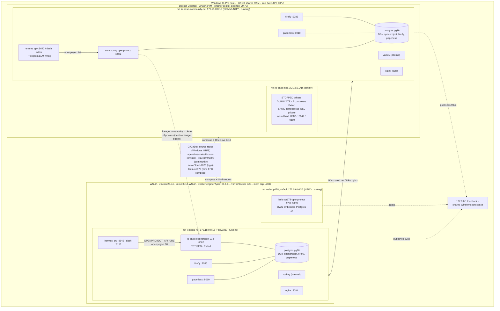

# Current-state architecture and gaps

Verified 2026-09-26 by three independent read-only investigators (WSL2 engine, Docker Desktop
engine, declared config) that cross-agreed. Where the docs were ambiguous, runtime evidence
resolved it. This is the baseline the [execution plan](03-execution-plan.md) migrates from.

## Host

- **Windows 11 Pro**, ~31.6 GB RAM (DDR5), **Intel Arc 140V iGPU that shares the same system RAM**
  (so effective headroom is tighter than 32 GB implies).
- Two lightweight Linux VMs run concurrently today (the inefficiency this bundle removes):
  the **WSL2 utility VM** and the **Docker Desktop LinuxKit VM**.

## Two live Docker engines (+ one dormant duplicate)

| Engine | Host | Version | Kernel / root | Hosts |
|---|---|---|---|---|
| **"Apex"** (WSL2-native dockerd) | Ubuntu 26.04 in WSL2 | 29.1.3 | 6.18-WSL2 · /var/lib/docker (ext4) | PRIVATE ki-basis stack + new leela-op178 (OpenProject 17.8) |
| **"docker-desktop"** | Docker Desktop LinuxKit VM | 29.7.2 | 7.0.12-linuxkit · /var/lib/docker | COMMUNITY stack + a **stopped private duplicate** |

Container data lives in each engine's own volumes. Repo *source* lives on Windows NTFS under
`C:\GitDev` and is reached from WSL via `/mnt/c` — **there are no native git clones inside Ubuntu**
(`~/dev` does not exist).

## Topology (verified)

## Where things are (answers to the standing questions)

- **OpenProject:** three. Private *new* `leela-op178-openproject` 17.8 in WSL2 `:8083` (own embedded
  PG17). Private *old* `ki-basis-openproject` v14 `:8082` in WSL2 — **retired (Exited) 2026-09-26**.
  Community `ki-basis-community-openproject` `:9082` on Docker Desktop.
- **Hermes:** private `ki-basis-hermes` in WSL2 — gateway `:8642`, dashboard `:9119`. Community
  `ki-basis-community-hermes` on Docker Desktop — gateway `:9642`, dashboard `:9219` (+ Telegram/LLM).
- **Linux / engines:** two live (Apex WSL2-native, docker-desktop LinuxKit) + the dormant duplicate.
- **VMs:** the WSL2 utility VM (Ubuntu) and the Docker Desktop LinuxKit VM. No separate full VMs.
- **Repos:** all under `C:\GitDev` (Windows NTFS) — `apexai-os-meta/ki-basis` (private infra),
  `lika-community` (community), `Leela-Cloud-2026` (app), `leela-op178` (new instance compose).
  Reached from WSL via `/mnt/c`; no native ext4 clones.
- **WSL2:** it *is* the "Apex" engine hosting private + the new 17.8; kept up by a logon keepalive,
  capped at 12 GB (`.wslconfig`).
- **How private ↔ community connect today:** at runtime they do **not** — separate engines, separate
  bridge networks (172.18/172.19 vs 172.21), **each stack has its own postgres with its own
  `openproject`/`firefly`/`paperless` databases**, separate nginx (no cross-routing). The only real
  linkage is (1) the same Windows host, (2) the shared `C:\GitDev` source tree + `127.0.0.1`
  loopback, and (3) **lineage** — community is a clone of the private stack (byte-identical image
  digests, mirrored naming). No shared DB, no shared network, no proxy bridge.

## Gaps & risks

1. **Private Hermes has no working OpenProject (introduced 2026-09-26).** `ki-basis-hermes`
   `OPENPROJECT_API_URL → openproject:80` targets the retired v14 (Exited) and cannot reach the new
   17.8 (`leela-op178`, a different network, not in its env). Needs re-wiring if private Hermes must
   use OpenProject.[^runtime-wsl]
2. **ADR-vs-reality conflict (major).** ADR-001 mandates one engine (Strategy A) and *rejects* the
   WSL2 + Docker-Desktop split — but that rejected split is exactly what runs. The doc even
   self-contradicts (ADR rejects Strategy B while its own Diagram A depicts it).[^dual-instance-adr]
3. **The stopped Docker-Desktop duplicate is a footgun.** It uses the *same* private compose, so
   starting it would bind the same `:8082/:8642/:9119` loopback ports and the same Windows
   bind-mount paths as the WSL private, and spin up a *divergent* second private DB. Leave it
   stopped; the migration should decommission it.[^runtime-dd]
4. **New 17.8 is an island.** `leela-op178` is its own compose project (own network + embedded DB);
   nothing in the ki-basis stack can reach it by DNS. Fine for the localhost agent skill, not yet
   integrated with the private stack.
5. **Community volumes are `external: true` + an opaque hex `openproject_pgdata`** — signs it was
   reconstructed/imported from an existing engine; a hint OpenProject may carry an embedded pgdata
   there, an inconsistency with the shared-postgres model to verify during backup.[^community-compose]
6. **Port-band leak.** The 80xx/90xx separation breaks on the Hermes dashboards (`9119` private vs
   `9219` community) — both 91xx/92xx, a latent near-collision when co-hosted.
7. **Unintended OneDrive coupling (community Hermes).** Community Hermes bind-mounts a
   **OneDrive-synced** host folder
   (`C:/Users/gehma/OneDrive/Dokumente/Terminal/outputs/call-agenda-demo → /opt/data/call-agenda`) as the
   agenda skill's data. Never intended. It adds a cloud-sync **layer**: the OneDrive client syncs every
   container write to Microsoft cloud (extra CPU/network/I/O), risks file-lock and on-demand-placeholder
   stalls that break container I/O, and sends the bot's agenda data off-machine (privacy/data-residency).
   Eliminate by moving to a local Docker **named volume** on ext4 (D-11; execution plan Phase 5).[^onedrive]

[^onedrive]: Community Hermes mount, verified 2026-09-26 via `docker inspect`.
[^runtime-wsl]: WSL2 engine read-only inspection, 2026-09-26.
[^runtime-dd]: Docker Desktop engine read-only inspection, 2026-09-26.
[^dual-instance-adr]: `DUAL_INSTANCE_ARCHITECTURE.md` ADR-001 vs its Diagram A.
[^community-compose]: `lika-community/compose.yaml` — all volumes `external: true`, opaque `openproject_pgdata` hex name.
