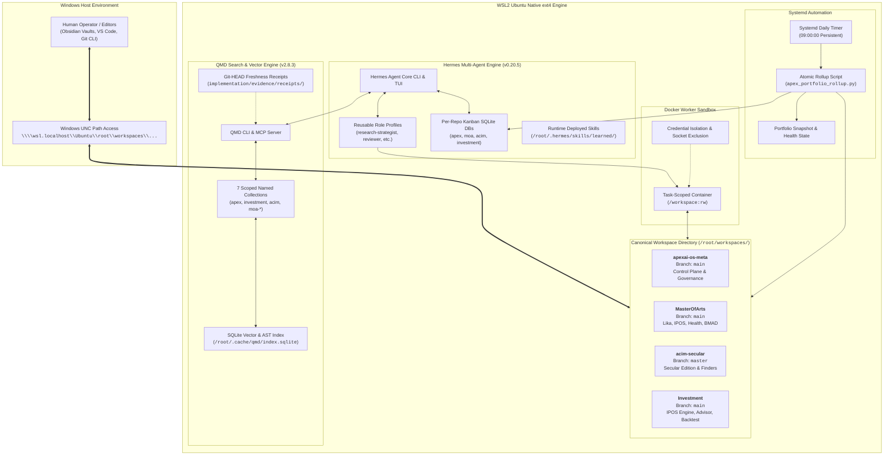
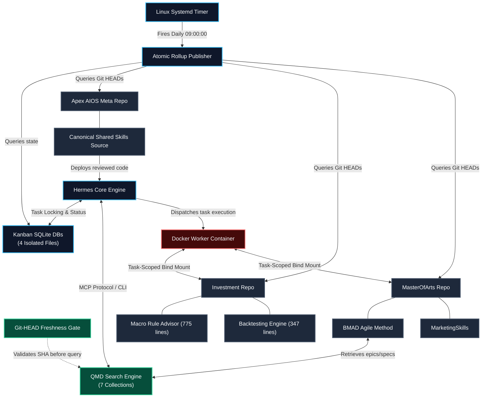
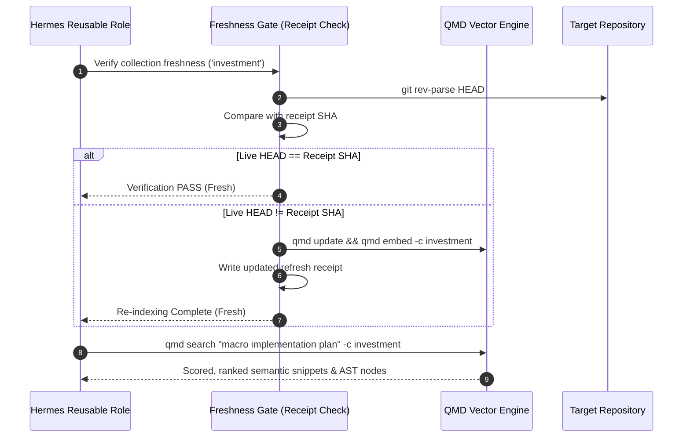
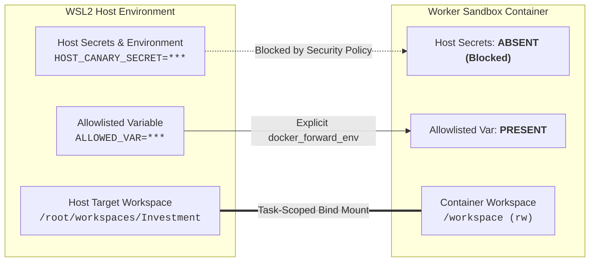
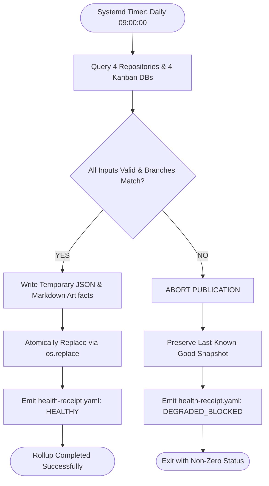
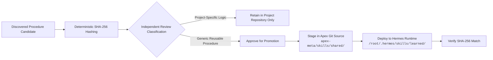

# Hermes Multi-Repo Orchestration — Current State Architecture & Interaction Showcase

A technical architecture showcase and interaction blueprint of the live multi-repository AI agent orchestration system.

---

## 1. System Topology & Architecture Overview

The system operates across a dual-environment topology: a **Windows Host Environment** for operator tools and an **Ubuntu WSL2 Environment** running on native Linux ext4 as the canonical execution engine.

---

## 2. Component Matrix & Workspace Registry

| Repository | Remote URL | WSL Canonical Workspace | Windows UNC Path | Active Branch | Primary Responsibilities |
|---|---|---|---|:--:|---|
| **`apex`** | `leela-spec/apexai-os-meta` | `/root/workspaces/apexai-os-meta` | `\\wsl.localhost\Ubuntu\root\workspaces\apexai-os-meta` | `main` | Global control plane, shared skill canonical source, portfolio status aggregation. |
| **`masterofarts`** | `leela-spec/MasterOfArts` | `/root/workspaces/MasterOfArts` | `\\wsl.localhost\Ubuntu\root\workspaces\MasterOfArts` | `main` | Multi-domain hub: Lika Shift Planning, Health dossiers, BMAD agile framework, MarketingSkills. |
| **`acim`** | `leela-spec/acim-secular` | `/root/workspaces/acim-secular` | `\\wsl.localhost\Ubuntu\root\workspaces\acim-secular` | `master` | Secular ACIM text processing and practice finders. |
| **`investment`** | `leela-spec/Investment` | `/root/workspaces/Investment` | `\\wsl.localhost\Ubuntu\root\workspaces\Investment` | `main` | IPOS Quantitative Macro Engine, 126-rule advisor, backtesting suite, DuckDB warehouse. |

---

## 3. Module Connection Blueprints

---

### Detailed Interaction Specifications

#### A. Hermes $\longleftrightarrow$ Kanban Task Isolation
- **Storage:** Dedicated SQLite databases at `/root/.hermes/kanban/boards/<board>/kanban.db`.
- **Concurrency Contract:** `review_dispatch: false` is locked across all profile configs. Tasks are executed sequentially by active worker lanes.
- **Data Boundary:** Boards are strictly siloed; tasks in one board cannot query or alter tasks in another.

#### B. Hermes / Profiles $\longleftrightarrow$ QMD Semantic Search
- **Integration:** Reusable profiles (`research-strategist`, `independent-reviewer`) interface with QMD via Model Context Protocol (MCP) and direct CLI search.
- **Collection Scope:** Queries are directed to specific collections:
  - `apex` $\rightarrow$ Control plane docs & epics.
  - `investment` $\rightarrow$ IPOS macro plans, indicators, and scoring models.
  - `acim` $\rightarrow$ Secular ACIM text and tools.
  - `moa-lika`, `moa-ipos`, `moa-acim`, `moa-health` $\rightarrow$ Specialized MasterOfArts domains.
- **Freshness Gate:** Each collection maintains a deterministic receipt (`qmd-refresh-receipt-<collection>.yaml`). Queries check live `git rev-parse HEAD` against the receipt; stale collections trigger re-indexing before retrieval.

#### C. BMAD Method & MarketingSkills $\longleftrightarrow$ MasterOfArts & QMD
- **Scoping Rule:** BMAD (Agile Method / Sprint Planning) and MarketingSkills are strictly **repo-local** to `MasterOfArts`.
- **Interaction with QMD:** Inside `MasterOfArts`, BMAD agents query sprint backlogs and epics through scoped QMD collections (`moa-lika`, `moa-ipos`, `moa-acim`, `moa-health`).
- **Isolation:** Agents working in `acim-secular` or `Investment` do not load BMAD or Marketing tools.

#### D. Docker Sandbox $\longleftrightarrow$ Workspace & Credential Security
- **Task-Scoped Bind Mounting:** Docker worker containers bind only the active task workspace (`-v /root/workspaces/<repo>:/workspace:rw`). Sibling repository mounts are excluded.
- **Host Persistence:** File modifications and Git commits created inside `/workspace` persist on the host filesystem immediately upon container completion.
- **Credential Boundary:** Host environment variables are blocked by default. Only explicit entries in `terminal.docker_forward_env` pass into the container.
- **Docker Socket Security:** `/var/run/docker.sock` is absent from worker containers to prevent host privilege escalation.

#### E. Linux Systemd $\longleftrightarrow$ Atomic Portfolio Rollup Publisher
- **Execution:** Managed by a native Linux systemd timer (`apex-portfolio-rollup.timer`) executing daily at 09:00:00 (`Persistent=true`).
- **Resource Footprint:** Pure Python, Git CLI, and SQLite queries; consumes **0 LLM tokens**.
- **Atomic Swap:** Outputs `portfolio-snapshot.json` and `portfolio-snapshot.md` via `tempfile` + `os.replace`.
- **Fail-Closed Protection:** If any repository branch mismatches or a board query fails, the publication halts, the existing valid snapshot remains untouched, and a degraded receipt (`health-receipt.yaml`) is emitted.

#### F. Shared-Skill Promotion & Deployment Pipeline
- **Candidate Ingestion:** Procedural skills are hashed with SHA-256.
- **Independent Classification:** An independent reviewer evaluates whether the procedure is **generic** or **project-specific**.
- **Repository Boundary:** Project-specific logic remains within the source repository. Generic procedures are staged in the Apex Git control plane (`apex-meta/skills/shared/<name>/SKILL.md`).
- **Runtime Deployment:** Staged skills are deployed into `/root/.hermes/skills/learned/<name>/SKILL.md` and verified against the canonical hash.

---

## 4. Current Operating Principles

1. **Native ext4 Execution:** All active agent operations, builds, Docker runs, and QMD vector indexing execute within `/root/workspaces/` on Linux ext4. Windows tools access these checkouts directly via UNC paths (`\\wsl.localhost\Ubuntu\root\workspaces\...`).
2. **Single Trunk Discipline:** Commits are made directly to `main` (or `master` for `acim-secular`). Long-lived feature branches and worktrees are avoided to maintain trunk clarity.
3. **Living State Discipline:** Working sessions end by updating the repository living index (`PROJECT_STATE.md` / `AGENTS.md`), ensuring full operational continuity without dependence on chat transcripts.
4. **Deterministic Computation:** Mathematical calculations, signal transformations, backtests, and score aggregations are computed entirely by Python and DuckDB. LLMs perform strictly last-mile narrative synthesis.
5. **Fail-Closed State Management:** Partial failures halt automated publication rather than generating synthetic or degraded replacement figures.

---

## 5. Technical Constraints & Future Research

### Current System Constraints
- **Gateway Concurrency Scoping:** Hermes evaluates worker concurrency limits per Kanban board rather than across the entire gateway process. To ensure isolation, the system operates in sequential single-role execution.
- **Profile Memory Walls:** Hermes does not implement multi-tenant memory sandboxing in its central daemon. Fact persistence is managed via repository files while profile `memories/` directories remain empty.
- **CWD Normalization:** Profile working directories are normalized to `.` with empty volume binds to ensure task-specific Docker mounts always govern container execution.

### High-Value Research Frontiers
1. **Multi-Repo AST Knowledge Graph Retrieval:** Developing multi-hop cross-repository graph search by traversing QMD AST nodes and symbol references.
2. **Automated Deterministic Patch Engine:** Advancing dry-run exact-match patch application logic to automatically validate multi-file diffs against live repositories before operator review.
3. **Continuous Quantitative Backtesting Pipelines:** Integrating the IPOS backtesting engine (`ipos/backtest/engine.py`) into scheduled systemd workflows for weekly walk-forward parameter simulation.
