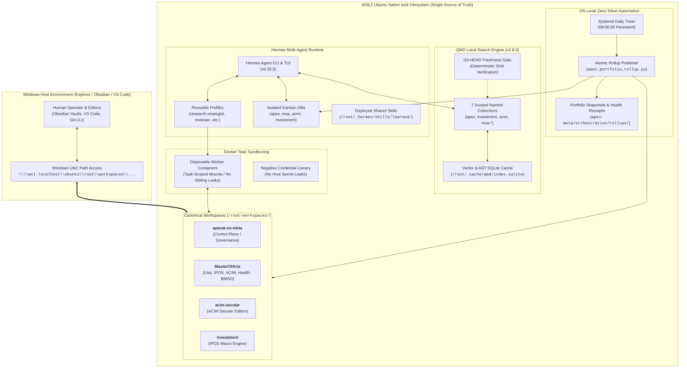
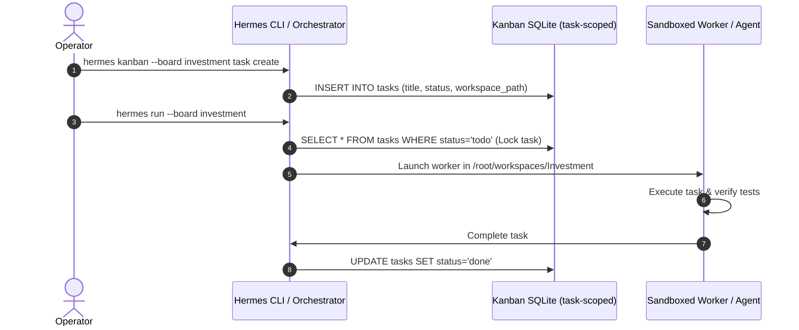
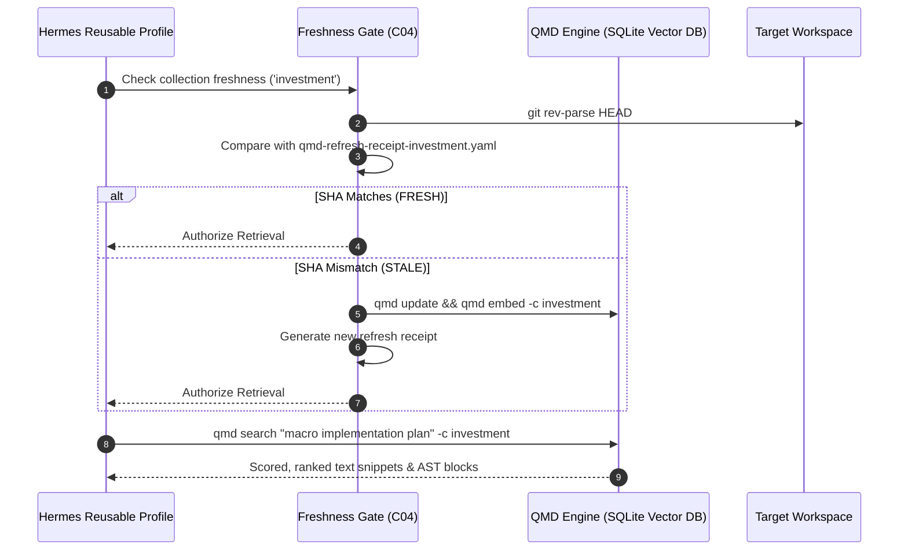
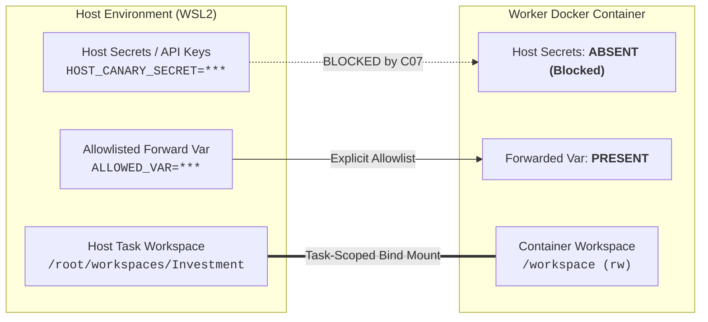
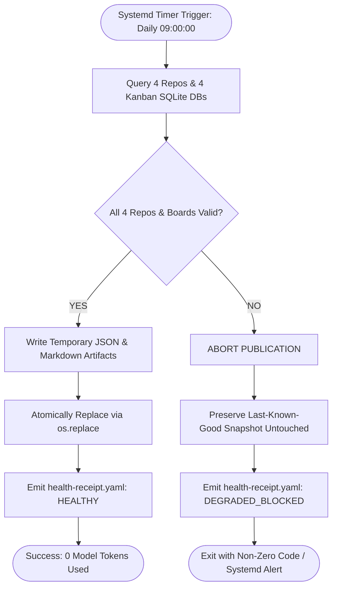
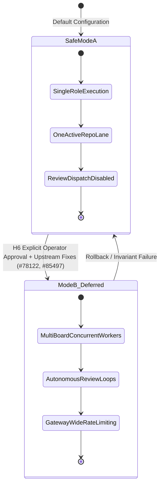

# Hermes Multi-Repo Orchestration v2 — Architecture & Interaction Showcase

A comprehensive architectural blueprint, interaction guide, and operational reference for the multi-repository AI agent orchestration system powered by **Hermes Agent**, **QMD Semantic Search**, **Linux Systemd**, and **Google Antigravity**.

---

## 1. Executive Summary & Architecture Topology

The **Hermes Multi-Repo Orchestration v2** framework provides a robust, token-efficient, and secure environment for managing multiple specialized codebases and research projects under a unified AI control plane.

### The Core Architectural Problems Solved
1. **Filesystem Latency & Locking (NTFS vs. ext4):** Eliminated the 10×–50× WSL cross-filesystem translation lag (`/mnt/c/`) by establishing the native Linux ext4 filesystem as the **Single Source of Truth** (`/root/workspaces/`), accessible seamlessly from Windows via UNC paths (`\\wsl.localhost\Ubuntu\root\workspaces\...`).
2. **Context & Memory Bleed:** Reusable AI profiles (`research-strategist`, `independent-reviewer`, `workshop-designer`, `marketing-executive`) are strictly stateless regarding project facts; raw memories are never synchronized across repositories.
3. **Uncontrolled Background Mutation:** Dangerous autonomous background dispatch and review loops are disabled (`review_dispatch: false`), enforcing deterministic **Safe Mode A** (single-role sequential execution).
4. **Scope Creep & Shadow Skills:** Domain-specific frameworks (such as **BMAD Agile Method** and **MarketingSkills**) are strictly locked to their authorized repositories (`MasterOfArts`), while generic skills follow a formal **Reviewed Promotion Lifecycle**.
5. **Partial Data Overwrite Risk:** Automated portfolio rollups use a zero-token, fail-closed atomic publisher (`apex_portfolio_rollup.py`) driven by native Linux systemd timers.



---

## 2. System Components & Repository Matrix

| Repository Slug | Remote Git Repository | Canonical WSL Path | Windows UNC Access Path | Default Branch | Key Responsibility |
|---|---|---|---|:--:|---|
| **apex** | `leela-spec/apexai-os-meta` | `/root/workspaces/apexai-os-meta` | `\\wsl.localhost\Ubuntu\root\workspaces\apexai-os-meta` | `main` | Global control plane, decision logs, shared skill canonical sources, portfolio rollups. |
| **masterofarts** | `leela-spec/MasterOfArts` | `/root/workspaces/MasterOfArts` | `\\wsl.localhost\Ubuntu\root\workspaces\MasterOfArts` | `main` | Multi-domain hub: Lika Shift OS, Health dossiers, BMAD agile framework, MarketingSkills. |
| **acim** | `leela-spec/acim-secular` | `/root/workspaces/acim-secular` | `\\wsl.localhost\Ubuntu\root\workspaces\acim-secular` | `master` | Secular edition of ACIM, text processors, practice finders. |
| **investment** | `leela-spec/Investment` | `/root/workspaces/Investment` | `\\wsl.localhost\Ubuntu\root\workspaces\Investment` | `main` | IPOS Quantitative Macro Engine, rule advisors, backtesters, DuckDB warehouse. |

---

## 3. Subsystem Connections & Interaction Blueprints

### A. Hermes <—> Kanban / SQLite Task Boards
- **Mechanism:** Each repository possesses a dedicated, isolated SQLite database at `/root/.hermes/kanban/boards/<slug>/kanban.db`.
- **Isolation Policy:** Tasks created in one board never bleed into sibling boards. 
- **Concurrency Control:** `review_dispatch: false` is hard-locked across all profile configurations to prevent uncoordinated agent swarms.



---

### B. Hermes / Agents <—> QMD Semantic Search Engine
- **Mechanism:** QMD (Local Embedding + AST Chunking engine) indexes markdown knowledge into 7 distinct named collections.
- **MCP & CLI Integration:** Reusable profiles (`research-strategist`, `independent-reviewer`) invoke QMD via MCP (`command: qmd, args: [mcp]`) or direct CLI (`qmd search "<query>" -c <collection>`).
- **CWD Independence:** Agents can execute queries from any directory without losing collection context.
- **Git-HEAD Freshness Gate (C04):** Before querying, the agent or tool verifies that the repository's live `git rev-parse HEAD` matches the collection's `qmd-refresh-receipt-<collection>.yaml`. If stale, re-indexing is triggered.



---

### C. BMAD Method & MarketingSkills <—> Hermes & QMD
- **Scoping Rule (Decision D06):** BMAD (Agile Method / Sprint Planning) and MarketingSkills are **repo-local** to `MasterOfArts`. They are prohibited from global `/root/.hermes/skills/` or general profile directories.
- **BMAD <—> QMD Interaction:** When operating in `MasterOfArts`, BMAD agents query epics and user stories through the scoped collections (`moa-lika`, `moa-ipos`, `moa-acim`, `moa-health`).
- **Zero Cross-Contamination:** Agents working in `acim-secular` or `Investment` do not load or see BMAD/MarketingSkills tools, keeping their context windows lean and deterministic.

---

### D. Docker Sandbox <—> Workspaces & Credential Boundaries
- **Task-Scoped Bounding (Correction C01):** Docker containers receive only the explicitly authorized task workspace bound to `/workspace:rw` (e.g. `-v /root/workspaces/acim-secular:/workspace`). No static `/root/MasterOfArts` or sibling repo mounts are permitted.
- **Persistence:** Host files and git commits created inside the container persist on the host upon container exit.
- **Negative Credential Canary (Correction C07):** Host environment variables (e.g., `HOST_CANARY_SECRET`) are strictly blocked from entering the container unless explicitly allowlisted in `terminal.docker_forward_env`.
- **Docker Socket Security:** `/var/run/docker.sock` is excluded from worker containers to prevent container breakout.



---

### E. Linux Systemd <—> Atomic Fail-Closed Portfolio Rollup
- **Mechanism:** A native Linux systemd timer (`apex-portfolio-rollup.timer`) fires daily at 09:00:00 (with `Persistent=true` catch-up).
- **Zero Model Calls:** Runs `scripts/hermes/apex_portfolio_rollup.py` purely with Python, Git CLI, and SQLite (0 tokens, 0 LLM API calls).
- **Atomic Publication (Correction C03):** 
  1. Inspects all 4 repos, validates branch names, resolves Git HEADs, queries all 4 Kanban DBs.
  2. Renders output into temporary files.
  3. Uses `os.replace` to atomically publish `portfolio-snapshot.json` and `portfolio-snapshot.md`.
  4. If any single repo or board query fails, publication aborts immediately, the last-known-good snapshot is preserved untouched, and a degraded receipt (`health-receipt.yaml`) is emitted.



---

### F. Learning-Promotion & Shared-Skill Pipeline (D04 + D05)
- **Problem:** AI agents learn ad-hoc tricks or procedures during execution. If synced naively, project-specific secrets or assumptions pollute other projects.
- **The v2 Pipeline:**
  1. **Candidate Ingestion:** Procedural skills are hashed deterministically.
  2. **Independent Review:** An independent reviewer evaluates whether the skill is **deliberately generic** (e.g. `markdown-table-lint`) or **project-specific** (e.g. `ipos-cot-scoring`).
  3. **Rejection of Project Facts:** Project-specific facts stay inside the project repository.
  4. **Canonical Staging:** Generic procedures are staged in the Apex control repository (`apex-meta/skills/shared/<name>/SKILL.md`).
  5. **Runtime Deployment:** Approved skills are deployed to `/root/.hermes/skills/learned/<name>/SKILL.md`.

```mermaid
flowchart LR
    Candidate[New Discovered Procedure / Candidate] --> Hash[Deterministic SHA-256 Hashing]
    Hash --> Reviewer{Independent Review Classification}
    
    Reviewer -- "Project-Specific Fact" --> Reject[REJECT from Shared Layer<br/>(Keep in Project Repo)]
    Reviewer -- "Generic Reusable Procedure" --> Approve[APPROVE for Promotion]
    
    Approve --> ApexStage[Stage in Apex Git Source<br/><code>apex-meta/skills/shared/</code>]
    ApexStage --> Deploy[Deploy to Runtime<br/><code>/root/.hermes/skills/learned/</code>]
    Deploy --> Verify[Verify SHA-256 Match & 0 Memory Bleed]
```

---

## 4. Operational Modes: Safe Mode A vs Mode B



- **Safe Mode A (Current Production):**
  - Background autonomous review dispatch disabled (`review_dispatch: false`).
  - Single-writer per profile enforced sequentially.
  - 100% resilient against upstream concurrency defects (`#78122`, `#85497`, `#73556`).
- **Mode B (Full Multi-Board Autonomous Dispatch — D10 Deferred):**
  - Requires explicit operator gate `H6`.
  - Requires upstream resolution of gateway-wide concurrency throttling and tenant memory isolation.

---

## 5. Architectural Best Practices & Non-Negotiables

1. **Work in Native ext4 (`/root/workspaces/`):** Always access repositories from Windows via `\\wsl.localhost\Ubuntu\root\workspaces\...` or Linux CLI. Never run heavy agent tools directly across `/mnt/c/`.
2. **Commit Directly to `main` (Single Trunk Discipline):** Keep branches short-lived or commit directly to trunk. Avoid abandoned feature branches and worktrees that obscure the single source of truth.
3. **Session Closeout Requirement:** Update the project's living index (`PROJECT_STATE.md` or `AGENTS.md`) at the end of every agent session. This keeps the project completely independent of chat transcript memory.
4. **Code Computes, LLM Narrates:** Numeric calculations, backtests, scoring, and data pulls must be performed by deterministic Python/DuckDB code. The LLM is strictly a last-mile summarizer.
5. **Freshness Before Retrieval:** Always ensure QMD collections are synchronized with the live Git HEAD before executing context-sensitive agent prompts.
6. **Fail-Closed Over Fallback Fabrication:** Never fabricate data or overwrite snapshots on partial failures. Maintain last-known-good states and emit degraded health alerts.

---

## 6. Architectural Flaws, Limitations & Future Research

### Identified Upstream Limitations
- **Hermes Gateway Cross-Board Throttling (`#78122`):** Concurrency limits are currently evaluated per-board rather than across the whole gateway. *Mitigation:* Safe Mode A serializes execution.
- **Tenant Memory Isolation (`#85497`):** Hermes lacks native multi-tenant memory walls in the gateway daemon. *Mitigation:* We keep raw profile memories completely empty (`memories/ = []`) and store facts in repository markdown files.
- **Profile CWD Override (`#73556`):** Profile configs declaring static `cwd` can override task-specific workspace mounts. *Mitigation:* All profile `cwd` entries are normalized to `.` with empty volume mounts.

### High-Value Future Research Areas
1. **Multi-Repo Cross-Linker via QMD Graph Walks:** Exploring multi-hop graph queries across different repositories using QMD AST vector embeddings.
2. **Automated Exact-Match Patch Verifier:** Enhancing Antigravity's dry-run exact-match patch application engine to autonomously validate multi-file diffs before operator confirmation.
3. **Local In-Sample Backtesting Pipelines:** Expanding the IPOS `ipos/backtest/engine.py` to run weekly automated walk-forward simulation runs triggered by systemd timers.
