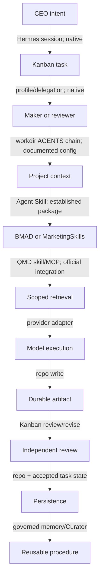

# R00 — Verified Current Pipeline Baseline — Result

Date: 2026-08-23  
Verdict: **BASELINE_READY_FOR_COMPARISON**  
Review: **PASS** — the control distinguishes verified mechanisms from configured, inferred, and live-unproven behavior.

## Executive finding

The control architecture remains Hermes-centered, with the repository as canonical project truth. Hermes owns runtime orchestration and Kanban task/review state; concise hierarchical `AGENTS.md` files are the intended project-context chain; profiles and Agent Skills provide reusable identities and procedures; BMAD and MarketingSkills provide method content; QMD is a local, derived retrieval index; Hermes memory and Curator are governed learning layers rather than factual truth. The completed research verifies that these mechanisms exist upstream. It does **not** prove that this repository has installed and exercised them: the target remains pre-install.

## Evidence-backed flow

| From → to | Exact mechanism | Mode | State | Evidence status |
|---|---|---|---|---|
| Intent → task | Hermes Kanban create/assign/dependency/review | hybrid | Hermes Kanban | VERIFIED_CAPABILITY |
| Task → specialist | named profile or delegated task | hybrid | profile config + task | VERIFIED_CAPABILITY |
| Specialist → context | workdir plus root/family/micro `AGENTS.md` discovery | deterministic load + AI use | repo | VERIFIED_MECHANISM_NEEDS_CONFIGURATION |
| Context → procedure | Hermes Agent Skills; BMAD/MarketingSkills as skill content | hybrid | upstream package/cache | VERIFIED_MECHANISM_NEEDS_CONFIGURATION |
| Procedure → retrieval | official Hermes QMD skill/MCP tools | deterministic retrieval + AI query use | QMD derived index | SUPPORTED_INFERENCE_REQUIRES_QA |
| Retrieval → model | Hermes provider adapter, including Codex OAuth or local provider | remote/local | provider/session | VERIFIED_CAPABILITY |
| Model → artifact | filesystem write under project workdir | hybrid | repo | PROVEN_NOW |
| Artifact → review | separate reviewer profile plus Kanban request-changes cycle | hybrid | task/review state | VERIFIED_MECHANISM_NEEDS_CONFIGURATION |
| Accepted work → learning | governed memory/Curator proposal and approval path | hybrid | memory/procedure files | VERIFIED_MECHANISM_NEEDS_CONFIGURATION |

## Capability inventory

| Module | Status today | Established value and limitation |
|---|---|---|
| Hermes runtime/orchestration | PROVEN_NOW upstream; not installed here | One execution center with tools, profiles, providers, plugins and delegation. |
| Kanban/dependencies/review/retry/recovery | VERIFIED_MECHANISM_NEEDS_CONFIGURATION | Durable task state and explicit review are documented; MoA recovery remains a QA obligation. |
| Root/family/micro context | VERIFIED_MECHANISM_NEEDS_CONFIGURATION | Workdir-relative hierarchical instructions are supported; the files are not yet configured. |
| Repository truth/artifacts | PROVEN_NOW | Existing MoA files and ADRs are durable and client-portable. |
| Shared Hermes profiles | VERIFIED_MECHANISM_NEEDS_CONFIGURATION | Stable specialist identity/process separation; usefulness is not live-proven. |
| BMAD methods/personas | VERIFIED_MECHANISM_NEEDS_CONFIGURATION | Reusable planning/review methods; overlap must be controlled. |
| MarketingSkills | SUPPORTED_INFERENCE_REQUIRES_QA | Skill content is verified; family-relative invocation across two workdirs needs QA. |
| QMD retrieval | SUPPORTED_INFERENCE_REQUIRES_QA | Official Hermes integration exists; current MCP schema and WSL behavior need runtime validation. |
| Memory | VERIFIED_MECHANISM_NEEDS_CONFIGURATION | Useful for preferences/procedures, never canonical project facts. |
| Curator/learning | VERIFIED_MECHANISM_NEEDS_CONFIGURATION | Governed curation exists; dry-run and approval boundaries are required. |
| Provider/subscription/local models | VERIFIED_CAPABILITY | Codex/ChatGPT subscription OAuth and local providers are documented; exact subscription quota semantics are OPEN. |
| Safety controls | VERIFIED_MECHANISM_NEEDS_CONFIGURATION | WSL2, workdir, approvals, plugin allowlist, secret and egress controls require configured validation. |
| Web-AI artifact portability | PROVEN_NOW | Markdown/repo artifacts remain consumable without sharing runtime databases. |

## Responsibility ownership

| Responsibility | Current owner | Canonical state | Derived/runtime state | Known overlap |
|---|---|---|---|---|
| Project facts/artifacts | repository | tracked files | model context | AnythingLLM ingestion would duplicate |
| Task/review/retry | Hermes Kanban | Kanban store | active worker/session | CrewAI Flows would duplicate |
| Specialist identity | Hermes profiles | profile config | selected prompt | Agency Agents/BMAD personas |
| Procedures | Agent Skills | skill files/package | loaded skill text | BMAD, MarketingSkills, Superpowers |
| Retrieval | QMD | repo remains truth | QMD collection/index | AnythingLLM vector DB |
| Routing | Hermes task/profile/skill choice | task/profile config | AI selection | Semantic Router/Agency router |
| Memory/learning | Hermes memory + Curator | governed learned records | session memory | CrewAI/AnythingLLM memory |
| Model execution | Hermes provider layer | provider config | session/API state | every additional runtime |

## Cost, privacy and platform baseline

| Dimension | Evidence-adjusted baseline |
|---|---|
| License/software cost | Hermes, QMD and selected skill packages are open-source; provider charges or subscriptions remain separate. |
| Model cost drivers | worker/reviewer calls, retrieval query formation, optional memory/Curator calls; no separate orchestration runtime calls are required. |
| Local path | local providers and local QMD keep content local when selected. |
| Egress | occurs only through enabled remote model/providers or explicitly enabled network tools. |
| Persistent stores | repository, Hermes task state, QMD derived index, governed memory; each has a distinct owner. |
| Windows/WSL | target is WSL2; path, permissions, service startup and browser/OAuth callbacks require QA. |
| Maintenance | Hermes plus selected skills/QMD and provider configuration; upstream updates remain a controlled surface. |

## Seven user-story traces

1. Research → workshop: task/profile/context/skill/QMD/model/artifact are verified mechanisms; the installed end-to-end chain is not yet proven.
2. Marketing specialist across families: shared profile + per-workdir context + MarketingSkills is a supported inference requiring a two-family QA.
3. Maker → reviewer → revise → accept: Kanban review state and separate profiles are verified mechanisms needing configured validation.
4. Interruption/recovery: durable task state is verified; exact subprocess/provider recovery requires fault-injection QA.
5. Project-scoped retrieval: separate QMD collections/workdirs are supported; schema and isolation need runtime QA.
6. Reusable procedural learning: memory/Curator can preserve procedures; governance and promotion boundaries need dry-run QA.
7. Private/local execution: local providers and local retrieval are documented; acceptable model quality and WSL resource use are unproven.

## Legitimate candidate entry points

- CrewAI: only a bounded workflow runtime where event/state behavior is materially better than Kanban—not a presumptive replacement.
- Agency Agents: on-demand specialist breadth where profiles/BMAD/MarketingSkills have a demonstrated roster gap.
- Superpowers: only a compatible workflow-method skill subset that adds non-duplicative discipline.
- Semantic Router: only after measured routing errors justify a new routing component.
- AnythingLLM: only a human-facing knowledge UI or workflow use case that preserves repo truth and avoids duplicate retrieval state.

## Source registry

- B-ADR — repository `ADR-002-full-functional-hermes-target.md` and accepted R01–R07 reports at main commit `d74f168aac7aa51fb495fab63ce784c252637465`.
- B-HERMES — [Hermes documentation](https://hermes-agent.nousresearch.com/docs/).
- B-KANBAN — [Hermes Kanban](https://hermes-agent.nousresearch.com/docs/user-guide/features/kanban).
- B-A2A — [Hermes A2A](https://hermes-agent.nousresearch.com/docs/user-guide/messaging/a2a).
- B-PROVIDERS — [Hermes providers](https://hermes-agent.nousresearch.com/docs/integrations/providers).
- B-QMD — current QMD repository/source and the accepted R03 Hermes–QMD report.

## Review record

All required capability rows, ownership boundaries, seven stories, cost/privacy constraints and insertion points are present. MarketingSkills, QMD and learning are not promoted from research finding to installed proof. **PASS**.
