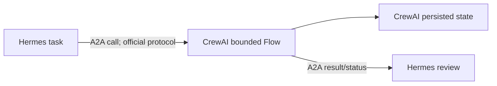

# R02 — CrewAI Integration and Fit — Result

Date: 2026-08-23  
Decision: **CREWAI_DEFER**  
Review: **PASS**

## Architecture and current state

CrewAI `f4731f5025f861c78e3af0487cc80bf5e7c64782` (docs version 1.15.17, MIT, Python `>=3.10,<3.14`) is a separate Python agent runtime. Crews coordinate agents/tasks; event-driven Flows carry typed state, persist execution and can pause for human feedback; memory and knowledge maintain additional stores; tools support MCP; A2A client and server configuration expose agents across runtimes. These are verified technical capabilities, not proof that a second runtime improves MoA.

## Replacement analysis

| Baseline owner | CrewAI relation | Finding |
|---|---|---|
| Hermes runtime | alternate full runtime | DIFFERENT_ROLE: CrewAI is code-defined workflow infrastructure; Hermes is the selected interactive tool/provider/plugin center |
| Hermes Kanban | Flow state/persistence | EQUIVALENT for some flow-state needs, WEAKER/OPEN for the exact MoA task/review/retry UX |
| Profiles/specialists | CrewAI agents | DIFFERENT_ROLE and duplicate identity/config |
| Hierarchical repo context | knowledge/input supplied to agents | WEAKER: no native reuse of the selected `AGENTS.md` context chain was found |
| BMAD methods | workflow definitions/prompts | DIFFERENT_ROLE; implementation rather than reusable method content |
| QMD | CrewAI knowledge/vector store or MCP tool | duplicate unless QMD is explicitly called through MCP |
| Memory/Curator | CrewAI memory | DIFFERENT_ROLE; LanceDB/default model-assisted recall creates second learning state without MoA governance |

No row is `BETTER_VERIFIED` for the current MoA control requirement.

## Integration patterns

| Pattern | Edge/class | State/recovery | Result |
|---|---|---|---|
| CrewAI replaces Hermes | separate process/config | CrewAI owns all flow state | technically possible but loses the chosen Hermes integration center; no replacement value case |
| Hermes delegates bounded workflow | Hermes A2A client → CrewAI A2A server; OFFICIAL_PROTOCOL_BOTH_SIDES | CrewAI owns internal flow state; Hermes owns calling task/review | viable protocol hypothesis; live version/auth/context QA required |
| CrewAI delegates to Hermes | CrewAI A2A client → Hermes A2A server; OFFICIAL_PROTOCOL_BOTH_SIDES | caller owns outer retry; Hermes owns delegated session | viable protocol hypothesis, not a complete MoA workflow integration |
| custom Python/API wrapper | CUSTOM_REQUIRED | bespoke | rejected under project law |

CrewAI documents both `A2AClientConfig` and `A2AServerConfig`, authentication options, streaming/polling/push updates and a default protocol version of 0.3.0. Hermes documents outbound and inbound A2A, Agent Cards, JSON-RPC/SSE/push and v1.0. This establishes a standards-based product edge, but the default-version difference and exact Agent Card negotiation remain a bounded QA obligation.

## Knowledge and state ownership for the only viable supplement

| Concern | Owner |
|---|---|
| Project truth and artifacts | MoA repository |
| Outer task/review/acceptance | Hermes Kanban |
| Bounded Flow event/checkpoint state | CrewAI persistence (SQLite by default for Flow persistence) |
| Specialist identity | CrewAI only inside the bounded Flow; Hermes profiles elsewhere |
| Retrieval | QMD through a verified MCP call, or explicit repo inputs; do not create CrewAI knowledge by default |
| Model calls | CrewAI provider configuration inside Flow, Hermes provider outside |

## Six story simulations

1. Research-to-workshop: Hermes could A2A-call a predefined CrewAI Flow and review the returned artifact. Capability is verified; the Flow definition and MoA benefit are not.
2. Marketing across families: separate CrewAI knowledge/agent inputs must be populated per run; this is less direct than shared Hermes profile plus workdir context.
3. Maker/reviewer: CrewAI human-feedback pause can request feedback and persisted Flow state can resume; Hermes already has the selected review owner, so adding both duplicates status unless boundaries are explicit.
4. Interruption: Flow persistence can reload state; recovery of external A2A calls, model side effects and exact-once artifact writes remains QA.
5. Hermes handoff: A2A Agent Card/discovery/call/status is the only no-custom-glue path. Input context must be explicit and returned result is reviewed by Hermes.
6. Private/local: CrewAI can use Ollama/local models and local persistence. Model adequacy, embeddings and resource use are unproven.

## Cost, token, privacy, platform

| Dimension | Finding |
|---|---|
| Software/license | MIT core; enterprise/cloud features are separate and not credited |
| Provider economics | API/local provider configuration; no current evidence CrewAI directly consumes ChatGPT/Codex subscription OAuth |
| Token drivers | agent role/task context, delegation, query rewriting, memory deep recall and multi-agent turns can add calls |
| Stores | Flow persistence plus optional LanceDB memory, Chroma knowledge and logs |
| Egress | configured model, embedding, observability and A2A endpoints |
| Windows/WSL | supported Python range is compatible in principle; dependencies/services need QA |
| Operations | second runtime, workflow code, provider credentials, state backups, A2A auth and failure ownership |

## Maturity, limitations and duplication

Current documentation, tests, releases and breadth establish an active technical framework. Adoption metrics and first-party “production-ready” claims are not treated as reliability or MoA outcome evidence. Relevant limitations are: a second state/model/runtime plane; memory/knowledge defaults that may add provider calls; A2A version/config compatibility not live-tested; and no concrete MoA workflow shown to outperform Hermes Kanban plus skills.

## Decision and switching conditions

**CREWAI_DEFER.** Do not replace Hermes and do not add a generic CrewAI service. Switch to **CREWAI_PILOT_BOUNDED_WORKFLOW** only if all are true:

1. a named recurring workflow needs event/state semantics Hermes QA cannot meet;
2. a predefined CrewAI Flow demonstrates recovery and review value;
3. A2A Agent Card/version/auth compatibility passes without bridge code;
4. repository truth and Hermes outer task state remain canonical;
5. added runtime, provider calls and stores have an accepted owner/budget.

## Sources

- C-REPO — [CrewAI audited commit](https://github.com/crewAIInc/crewAI/tree/f4731f5025f861c78e3af0487cc80bf5e7c64782).
- C-A2A — [CrewAI A2A source documentation](https://github.com/crewAIInc/crewAI/blob/f4731f5025f861c78e3af0487cc80bf5e7c64782/docs/edge/en/learn/a2a-agent-delegation.mdx).
- C-FLOWS — [CrewAI Flows documentation](https://docs.crewai.com/en/concepts/flows).
- C-HUMAN — [Human feedback in Flows](https://docs.crewai.com/en/learn/human-feedback-in-flows).
- C-MEMORY — [CrewAI memory](https://docs.crewai.com/en/concepts/memory).
- C-KNOWLEDGE — [CrewAI knowledge](https://docs.crewai.com/en/concepts/knowledge).
- H-A2A — [Hermes A2A](https://hermes-agent.nousresearch.com/docs/user-guide/messaging/a2a).

The report identifies an upstream-supported edge but no present value case. It does not design a wrapper. **PASS**.
