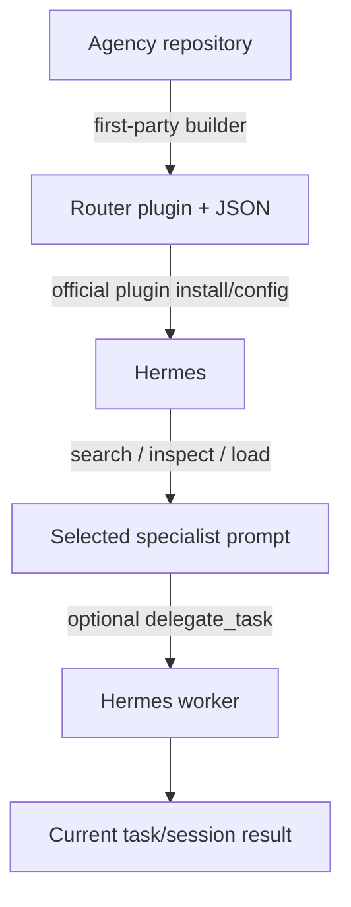

# R03 — Agency Agents Integration and Fit — Result

Date: 2026-08-23  
Recommendation: **PILOT**, limited to search/inspect/load and default delegation without optional toolset forwarding  
Review: **PASS**

## Current architecture

Agency Agents at `ebe9c99acb5c96f9468de368d8bead775387d1a7` is an MIT collection of 270 generated specialist definitions. Its first-party Hermes builder produces one lazy `agency-agents-router` plugin installed under `${HERMES_HOME:-~/.hermes}/plugins/` and enabled in `plugins.enabled`. The plugin keeps the roster in JSON on disk and exposes four fixed tool schemas instead of preloading every prompt.

## Exact official Hermes flow

| Step | Mechanism/class | Evidence status |
|---|---|---|
| source → generated router | `scripts/build-hermes-plugin.py`; ESTABLISHED_PACKAGE | VERIFIED_CAPABILITY |
| router → Hermes | documented install and enablement; OFFICIAL_PLUGIN | VERIFIED_INTEGRATION |
| search | `agency_agents_search(query, division?, limit?)`; deterministic lexical scoring | VERIFIED_CAPABILITY |
| inspect | `agency_agents_inspect(agent|slug, include_body?)` | VERIFIED_CAPABILITY |
| load | `agency_agents_load(agent|slug, task?)` | VERIFIED_CAPABILITY |
| delegate | `agency_agents_delegate(agent|slug, task, toolsets?)` dispatches Hermes `delegate_task` | VERIFIED_LIMITATION: default dispatch is plausible, but optional `toolsets` naming conflicts with current Hermes `enabled_toolsets` evidence and is not exercised by the checker |

The checker validates plugin registration, schemas, search and inspect. It does not run a live Hermes delegation.

## Representative specialist audit

| MoA need | Sample/current search result | Quality/overlap finding |
|---|---|---|
| marketing/content | email/content/brand specialists | specific tasks and output expectations; overlaps MarketingSkills and should be used only for a demonstrated gap |
| research/strategy | product-trend/UX research roles | useful structured prompt content but often product/software oriented |
| project/program management | senior project manager | detailed process role; overlaps BMAD planning and Hermes project owner |
| operations/business | operations manager | plausible non-code breadth; tool assumptions need inspection before load |
| workshop/education | no strong dedicated match in search sample | roster size does not solve a central MoA workshop/learning gap |
| independent review/QA | no general independent-review role found | Hermes reviewer profile remains primary; legal/software QA roles are not substitutes |
| software/product bridge | many strong specialized roles | deepest portion of roster, but not the dominant non-software MoA requirement |

Definitions are more specific than names alone, but they are static upstream prompts—not proven expert outcomes. They can conflict with project context, BMAD method instructions or reviewer separation; the active Hermes task must govern.

## Specialist-layer ownership

| Layer | Primary owner after pilot | Agency role |
|---|---|---|
| stable identity/process separation | Hermes profiles | none |
| project facts/context | repo + `AGENTS.md` + QMD | consumed only after one prompt is selected |
| domain procedure | BMAD/MarketingSkills/approved skills | optional specialist framing; cannot override procedure or truth |
| gap roster | Agency router | search/inspect/load one definition on demand |
| review/acceptance | independent Hermes reviewer + Kanban | no replacement |
| learning | Hermes memory/Curator under governance | Agency source remains immutable upstream content |

## Context/token behavior

Startup context contains only four tool schemas and plugin metadata. The JSON roster is loaded on disk and lexical search scores fields without an LLM. Full body text enters context only on inspect-with-body, load or delegate. Delegation adds the chosen body and task to the delegated prompt and triggers another model execution. This is materially leaner than preloading 270 agents, but not zero-cost; chosen prompt length and multi-specialist calls remain per-use overhead.

## Six stories

1. Ambiguous marketing task: Hermes searches, inspects top candidates, loads one only if it fills a gap; MarketingSkills remains the procedure owner.
2. Same role across Projects A/B: plugin definition is shared; each Hermes workdir supplies separate context/QMD collection. No project facts are written into the roster.
3. Multi-disciplinary task: repeated lexical searches can select a small set; do not preload all bodies. Hermes Kanban owns decomposition and result merge.
4. Artifact review: Agency-framed maker produces the artifact; a separate Hermes reviewer requests changes and the original task revises.
5. Bad selection: inspect before load, narrow division/query, or fall back to a named Hermes profile. Router confidence is lexical, not semantic assurance.
6. Plugin/schema failure: disable optional Agency use and continue with baseline profiles/skills. Search/inspect/load and a no-`toolsets` delegate require live QA; no production dependency is allowed before that.

## Reliability, cost, security and updates

- MIT, local prompt data and no extra model service for search.
- First-party builder/checker and current Hermes instructions are positive integration evidence.
- “production-ready” and “battle-tested” remain vendor claims; no MoA outcome evidence was found.
- The live delegate path is not covered by the checker. The optional forwarded `toolsets` key matches the same stale naming pattern independently reported against current Hermes elsewhere; omit it in a bounded pilot and verify upstream behavior rather than patching.
- Definitions update with the upstream package. Curator must not mutate installed plugin content; durable local improvements belong in governed MoA skills/profiles.
- Prompt/tool instructions are untrusted upstream content and require allowlisted tools, workdir limits and reviewer control.

## Recommendation and switching conditions

**PILOT** in the existing pre-install QA only. Scope: install unchanged upstream plugin in an isolated QA environment; verify the four schemas; exercise search/inspect/load; sample at least six MoA-relevant roles; test project isolation; and test `delegate_task` first without optional toolsets. Do not promote it to default specialist ownership.

Switch to **ADD_NOW** only if the pilot demonstrates at least two recurring roster gaps, acceptable prompt quality, unchanged project isolation, successful restart/delegation and lower context cost than maintaining equivalent profiles. Switch to **DEFER/REJECT** if role value is mostly software-biased/duplicative, selection errors are frequent, or current Hermes compatibility fails.

## Sources

- A-REPO — [Agency Agents audited commit](https://github.com/msitarzewski/agency-agents/tree/ebe9c99acb5c96f9468de368d8bead775387d1a7).
- A-HERMES — [First-party Hermes integration](https://github.com/msitarzewski/agency-agents/blob/ebe9c99acb5c96f9468de368d8bead775387d1a7/integrations/hermes/README.md).
- A-BUILDER — [Hermes plugin builder](https://github.com/msitarzewski/agency-agents/blob/ebe9c99acb5c96f9468de368d8bead775387d1a7/scripts/build-hermes-plugin.py).
- A-CHECK — [Hermes integration checker](https://github.com/msitarzewski/agency-agents/blob/ebe9c99acb5c96f9468de368d8bead775387d1a7/scripts/check-hermes-integration.py).

The conclusion is tied to actual plugin code, representative roster evidence and the untested delegation boundary. **PASS**.
