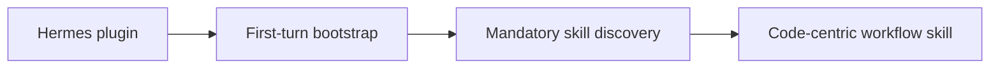

# R04 — Superpowers Integration and Fit — Result

Date: 2026-08-23  
Recommendation: **DEFER**  
Review: **PASS**

## What Superpowers is

Superpowers `b36e0829c6d0140e93cfef2ca599b1b07d4a7797`, package/plugin v6.3.0, MIT, is explicitly a software-development methodology delivered as mandatory-discovery skills: brainstorming/specification, planning, isolated git worktrees, subagent-driven implementation, TDD, systematic debugging, verification, review and branch finishing. The first-party Hermes plugin registers skills and injects a bootstrap on the first turn.

## Hermes path and current reliability

The manifest, registration code and tests establish an **OFFICIAL_PLUGIN** path. Tests cover registration, bootstrap injection, layout and bootstrap-size constraints, but not live tool execution. Open issue [#2157](https://github.com/obra/superpowers/issues/2157), updated 2026-08-22 for Superpowers 6.3.0/Hermes 0.20.1, reports decision-changing drift that remains visible in audited main: stale `toolsets` versus current `enabled_toolsets`, inconsistent unqualified `skill_view("brainstorming")`, and unconditional web tool names. Hermes also lacks the post-compaction hook available in some other clients, so the README recommends a fresh session if bootstrap instructions are lost.

| Claim | Evidence state |
|---|---|
| Hermes plugin can register skills | VERIFIED_INTEGRATION |
| shipped workflows execute reliably on current Hermes | CONTRADICTED by current source/issue for mapped tool names |
| methodology improves non-software MoA work | OPEN; no operational evidence found |
| bootstrap is context-bounded | VERIFIED by package test, but behavioral overhead remains |

## Method overlap and fit

| Superpowers method | Baseline owner | MoA fit |
|---|---|---|
| brainstorming/spec | BMAD + project context | substantial overlap; potentially reusable but not unique |
| planning | BMAD + Kanban | duplicate state/method risk |
| subagent development | Hermes delegation/profiles | code-centric duplicate |
| TDD/debugging | software projects only | useful for code, not general workshop/research/operations |
| review/verification | Hermes maker/reviewer/Kanban | overlap; current baseline is more domain-neutral |
| worktrees/branch finish | repository software workflow | can conflict with direct durable-artifact work and is irrelevant to many projects |

`using-superpowers` requires skill checking before any response/action. This global behavioral rule adds recurring context/decision overhead and can conflict with the launcher’s explicit autonomous continuation and named human gates. Selective skill use would be safer, but the package’s intended operating model is not selective.

## Story checks

1. Research/workshop: brainstorming/planning can frame work, but BMAD already covers the method layer and Superpowers offers no workshop specialist evidence.
2. Marketing across families: no specialist or project-isolation advantage.
3. Maker/reviewer: verification/review overlaps the separate Hermes reviewer; it does not own durable task state.
4. Recovery: skills guide process but do not replace Kanban persistence; compaction bootstrap is weaker on Hermes.
5. Software subproject: TDD/debugging/worktree methods could be useful, but current tool-name drift blocks reliable adoption.
6. Failure: plugin can be disabled and baseline methods remain; no project law permits patching the package.

## Cost, privacy, platform and maintenance

- No separate model runtime or database, but repeated skill discovery/bootstrap and code workflows add prompt/tool calls.
- Skill content is local; egress follows Hermes tools/providers.
- Install/update surface is one plugin, yet compatibility drift is currently verified.
- Git/worktree/test commands expand tool permissions and are unsuitable as a default for non-software work.
- Windows/WSL behavior follows Hermes and local development tools; no MoA-specific QA evidence exists.

## Decision and switching conditions

**DEFER.** Do not add Superpowers to the Hermes target now. It is neither an established-value replacement for BMAD nor currently reliable on Hermes as shipped.

Reconsider only after: (1) issue #2157 is fixed in an upstream release; (2) unchanged plugin passes current-Hermes live tool tests; (3) a code-only MoA subproject is named; and (4) a bounded comparison shows unique value beyond BMAD + Kanban + reviewer. Even then, scope it to the software family rather than global bootstrap.

## Sources

- S-REPO — [Superpowers audited commit](https://github.com/obra/superpowers/tree/b36e0829c6d0140e93cfef2ca599b1b07d4a7797).
- S-HERMES — [Hermes plugin source](https://github.com/obra/superpowers/tree/b36e0829c6d0140e93cfef2ca599b1b07d4a7797/.hermes-plugin).
- S-USING — [Mandatory skill-use instruction](https://github.com/obra/superpowers/blob/b36e0829c6d0140e93cfef2ca599b1b07d4a7797/skills/using-superpowers/SKILL.md).
- S-ISSUE — [Current Hermes integration issue #2157](https://github.com/obra/superpowers/issues/2157).

The report does not treat plugin existence as reliability and does not generalize code value to MoA. **PASS**.
