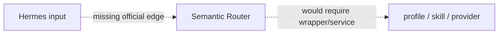

# R05 — Semantic Router Integration and Fit — Result

Date: 2026-08-23  
Recommendation: **REJECT_CUSTOM_INTEGRATION_REQUIRED**  
Review: **PASS**

## Current capability

Semantic Router `a4576168d9589397a7e0c6ff77f5d05469a56e2e`, package 0.1.16, MIT, Python `>=3.9,<3.14`, is a routing library. Routes contain utterance examples; encoders embed input; indexes compare similarity; a static route can return a route or no route; dynamic routes can invoke an LLM. Local encoders are optional and the local index is in-process array state, while remote index choices add services.

That is a verified routing capability. No official Hermes plugin, Agent Skill, MCP server/client relationship, A2A edge, or Agency Agents integration was found in current official source.

## Insertion analysis

| Proposed use | Current evidence | Class/action |
|---|---|---|
| replace Hermes task/profile selection | would require a new service/wrapper, route schema and handoff | CUSTOM_REQUIRED — reject |
| route Agency Agents specialists | Agency router already implements deterministic lexical search; no official connection | CUSTOM_REQUIRED — reject |
| route model providers | Hermes provider selection already owns execution; no official connection | CUSTOM_REQUIRED — reject |
| route QMD collections | QMD scope is explicit configuration/workdir; no current measured ambiguity | CUSTOM_REQUIRED — reject |

## Value and state audit

Adoption would introduce route definitions, utterance training examples, thresholds, an encoder/model, an index, evaluation data, service lifecycle and fallback ownership. Static local routing can reduce LLM calls once calibrated, but calibration quality and route misses must be measured. Dynamic routing adds model calls. None of this solves a demonstrated MoA failure today: Hermes can explicitly choose tasks/profiles/skills; Agency’s candidate plugin already searches its own roster; QMD collections are project scoped.

The component therefore fails hard filters for an upstream-supported integration, no-custom-glue, and verified incremental value. It does not fail because routing is unimportant; it fails because the selected system has no measured routing defect and no established edge.

## Story checks

1. CEO intent routing: possible at library level, but integration and threshold/fallback state would be custom.
2. Marketing across projects: route classification does not provide project context isolation.
3. Multi-specialist selection: would require a bespoke route taxonomy; Agency already has its own search mechanism.
4. Maker/reviewer: no task/review persistence.
5. Recovery: local in-memory index must be rebuilt; a service owner would be new.
6. Private/local: local encoder is technically possible, but model downloads/resources and routing accuracy remain unproven.

## Cost/privacy/platform

MIT and local execution are positives. Costs are encoder compute, optional LLM calls, calibration/evaluation work and a new Python runtime. Remote encoders/indexes create data egress and credentials. Windows/WSL is plausible within supported Python versions but not an integration proof.

## Decision and switching conditions

**REJECT_CUSTOM_INTEGRATION_REQUIRED** for the current program. No subsystem is designed or installed.

Re-open only if production evidence records a material routing error rate or cost problem, and an official Hermes/plugin/protocol package then exists. The minimum switching evidence is a labeled MoA routing set, baseline error/cost measurement, official edge, and a bounded evaluation that preserves explicit fallback and state ownership.

## Sources

- SR-REPO — [Semantic Router audited commit](https://github.com/aurelio-labs/semantic-router/tree/a4576168d9589397a7e0c6ff77f5d05469a56e2e).
- SR-PROJECT — [Package configuration](https://github.com/aurelio-labs/semantic-router/blob/a4576168d9589397a7e0c6ff77f5d05469a56e2e/pyproject.toml).
- SR-README — [Routing architecture and examples](https://github.com/aurelio-labs/semantic-router/blob/a4576168d9589397a7e0c6ff77f5d05469a56e2e/README.md).

The negative result is based on an exhaustive official-edge check and explicit cost/state analysis, not model-designed composability. **PASS**.
