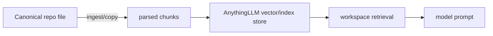

# R06 — AnythingLLM Integration and Fit — Result

Date: 2026-08-23  
Recommendation: **DEFER** (`USE_AS_SEPARATE_UI_ONLY` only after a named UI requirement)  
Review: **PASS**

## Current architecture

AnythingLLM `72aabbd15481ae405434efd4c83d46026eef1173`, version 1.16.0, MIT, Node >=18, is a separate desktop or Docker/server application. It offers workspaces, document ingestion/chunking/vector RAG, chat/workspace memory, agents, no-code Agent Flows, model/provider routing, scheduled jobs and an MCP client. Desktop supports Windows/macOS/Linux; Docker adds multi-user/server administration.

## Module overlap

| AnythingLLM module | Baseline relation | Finding |
|---|---|---|
| workspaces | repo family/micro context | DUPLICATE; workspace state is not canonical repo context |
| ingestion/vector RAG | QMD | DUPLICATE if native index used |
| agents/flows | Hermes profiles/Kanban | DUPLICATE second runtime/state plane |
| chat/workspace memory | Hermes memory/Curator | DUPLICATE with different governance |
| skills/tools | Agent Skills/BMAD/MarketingSkills | overlap; portability unverified |
| model router | Hermes providers | DUPLICATE provider credentials/economics |
| scheduled jobs | Hermes task scheduling/automation context | overlap; no selected-stack edge |
| MCP client | QMD MCP server | SUPPLEMENT edge technically supported |

## Knowledge truth and freshness

The repository remains canonical; chunks, embeddings, workspace associations and chat state are derived copies. Live document sync is currently beta, watches individual files rather than directories, requires the app to remain running, and re-embeds on its cadence. A moved/deleted source can leave embeddings in place while the source becomes unwatched. Therefore native ingestion has a weaker explicit freshness story than controlled QMD update/rebuild for repo truth.

## Hermes/QMD integration evidence

| Pattern | Evidence/class | Finding |
|---|---|---|
| replace QMD and Hermes calls AnythingLLM | no official Hermes consumer edge found | NO_INTEGRATION_FOUND |
| AnythingLLM consumes QMD | AnythingLLM is an MCP client; QMD is an MCP server | OFFICIAL_PROTOCOL_BOTH_SIDES; generic config/runtime QA required |
| Hermes consumes AnythingLLM MCP/API | no official Hermes-specific endpoint/edge found | NO_INTEGRATION_FOUND |
| separate apps share repo | files only | not an integration; synchronization burden remains |

AnythingLLM’s source boots configured stdio/SSE/streamable MCP servers, lists tools and calls arbitrary MCP tools. Thus it can in principle call QMD’s query/get/status without a custom protocol bridge. This avoids a second vector index, but still adds AnythingLLM runtime, workspace/chat state, provider configuration and a second user interface. No QMD-specific official recipe or MoA operational proof was found.

## Project isolation and seven stories

1. Workshop retrieval: native ingestion works technically, but duplicates QMD and must manage source freshness; MCP-to-QMD is the cleaner technical edge.
2. Source update/delete: beta sync may lag and deletions/moves can leave stale embeddings; explicit re-sync/rebuild governance is required.
3. Marketing across projects: separate workspaces can scope documents/chats, but shared global app/provider/tool resources and prompt ownership require permissions QA; baseline workdirs are simpler.
4. Maker/reviewer: Agent Flows can orchestrate steps, but there is no evidence they reproduce Hermes independent reviewer/Kanban acceptance semantics without duplicate status.
5. Local/private: local models and local/default LanceDB are supported; tool/model egress follows configuration.
6. Hermes interaction: none is verified. AnythingLLM → QMD MCP is not Hermes ↔ AnythingLLM.
7. Restart: application DB/vector/workspace state persists, but backup/rebuild and active MCP process recovery become additional operator responsibilities.

## Security, economics and operations

- Desktop may run without multi-user auth; Docker/server auth and roles are operator choices. Developer API keys are effectively administrative and must be protected.
- Enabled agent/MCP tools can perform broad actions; OS/database permissions are the real boundary.
- Local LLMs/vector DB can keep content local; cloud models/embeddings and telemetry/configured integrations create egress.
- No current evidence supports direct ChatGPT/Codex subscription OAuth; use of cloud models generally requires provider keys/billing.
- Native ingestion adds SQLite/vector storage; MCP-to-QMD avoids the duplicate vector index but not application state.
- Windows desktop is native; server deployment adds Docker, updates, backup and permission surfaces.

## Established value and limitations

The current product is broad, active and technically capable. This proves application maturity more than the exact MoA fit. The decision-changing limitations are beta file sync semantics, second control-plane state, no official Hermes edge, powerful tool/key security, and no demonstrated UI requirement that QMD/Hermes cannot meet.

## Decision and switching conditions

**DEFER.** Do not replace QMD, Hermes, repo context or memory. Reconsider **USE_AS_SEPARATE_UI_ONLY** when a named human audience needs a workspace/chat UI unavailable in Hermes and accepts a separate application. In that case first pilot AnythingLLM → QMD over MCP so the repo/QMD index remain the knowledge owners; verify isolation, permissions, tool allowlists, backups, local/provider economics and graceful QMD/MCP failure. Switch to native ingestion only if a controlled freshness test beats QMD and removes—not duplicates—the QMD owner.

## Sources

- AL-REPO — [AnythingLLM audited commit](https://github.com/Mintplex-Labs/anything-llm/tree/72aabbd15481ae405434efd4c83d46026eef1173).
- AL-MCP — [MCP compatibility overview](https://docs.anythingllm.com/mcp-compatibility/overview).
- AL-MCP-SOURCE — [MCP client source](https://github.com/Mintplex-Labs/anything-llm/tree/72aabbd15481ae405434efd4c83d46026eef1173/server/utils/MCP).
- AL-SYNC — [Live document sync](https://docs.anythingllm.com/beta-preview/active-features/live-document-sync).
- AL-SECURITY — [Security and access](https://docs.anythingllm.com/features/security-and-access).

The report preserves protocol direction, freshness limitations and separate-state costs. **PASS**.
