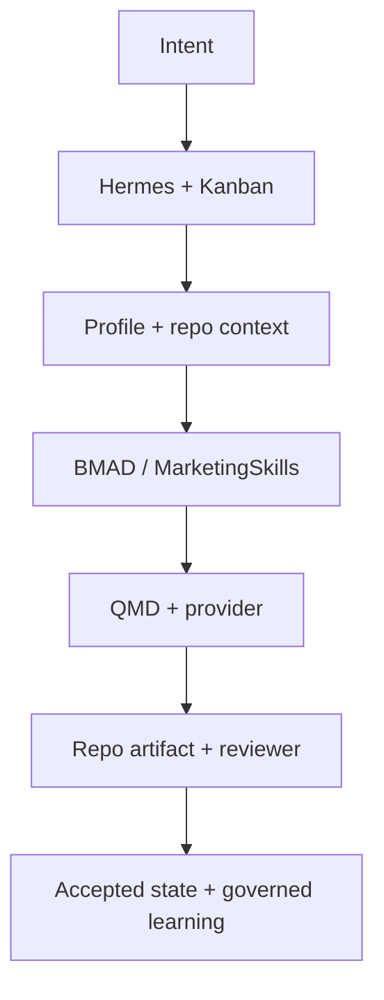
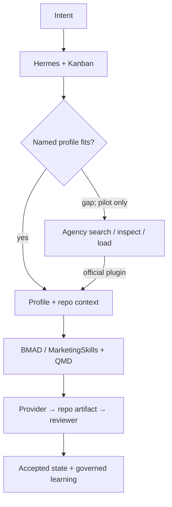

# R09 — Sophisticated V2 Synthesis and Recommendation — Result

Date: 2026-08-23  
Final status: **V2_DECISION_READY**  
Review: **PASS**

## Executive recommendation

Keep the Hermes-centered target intact. Do not replace any baseline module and do not add a second runtime, state store, knowledge application or custom router. Advance exactly one optional candidate: a **bounded, pre-install Agency Agents pilot** for lazy specialist-gap discovery. The pilot is not production adoption; Hermes profiles, repository context, Kanban, QMD, BMAD/MarketingSkills, reviewer separation and governed learning remain the owners. Defer CrewAI, Superpowers and AnythingLLM; reject the current Semantic Router insertion because it requires prohibited custom infrastructure.

This is a conservative evidence-adjusted improvement: it tests the only candidate with a direct Hermes plugin and plausible incremental breadth while preserving a complete fallback.

## Candidate actions

| Candidate | Action | Exact scope and rationale |
|---|---|---|
| CrewAI | DEFER | A2A roles exist, but no named Flow earns a second runtime/state/provider plane; live protocol compatibility is unverified |
| Agency Agents | PILOT | unchanged official router; search/inspect/load, role sample and no-toolsets-first delegation QA only |
| Superpowers | DEFER | software-method overlap plus current Hermes mapping contradiction |
| Semantic Router | REJECT | no official selected-stack edge; custom wrapper/service prohibited and no measured routing defect |
| AnythingLLM | DEFER | no Hermes edge, native sync/duplicate-state burden; separate UI only after a named requirement, preferably consuming QMD via MCP |

## Module action table

| Module | V2 action | Owner |
|---|---|---|
| primary orchestration/runtime | KEEP | Hermes |
| durable task/review/recovery state | KEEP | Hermes Kanban |
| macro/meso/micro project context | KEEP | repo `AGENTS.md` chain |
| factual truth and artifacts | KEEP | repository |
| semantic/project retrieval | KEEP | QMD derived index |
| stable specialist identity | KEEP | Hermes profiles |
| optional specialist gaps | PILOT | Agency lazy router, never canonical |
| workflow/method skills | KEEP | BMAD + approved Agent Skills |
| marketing method | KEEP | MarketingSkills |
| semantic router | REJECT addition | Hermes explicit task/profile/skill choice |
| knowledge/RAG application | DEFER addition | none; QMD remains retrieval owner |
| learning/memory | KEEP | Hermes memory + governed Curator |
| maker/reviewer separation | KEEP | named Hermes profiles + Kanban |
| provider/model execution | KEEP | Hermes providers |
| safety controls | KEEP | WSL/workdir/permissions/allowlists/review |

## Before and after

### Current verified baseline

### Recommended V2 decision

The dashed-away candidates are intentionally absent; no decorative integration arrows are permitted.

## Exact connection matrix

| From → to | Trigger | Mechanism | Inputs → outputs | Local/remote/model | Persistent owner and recovery | Egress/class/evidence |
|---|---|---|---|---|---|---|
| CEO → Hermes task | explicit request | native session/Kanban | intent → task/dependencies | local control; model later | Kanban; Hermes resumes/retries | provider only when invoked; NATIVE; B-HERMES/B-KANBAN |
| task → profile | assignment/delegation | native named profile | task + allowed tools → worker | local config + provider | Kanban outer state | NATIVE; B-ADR |
| workdir → context | worker start | hierarchical `AGENTS.md` discovery | repo instructions → prompt context | local; no model required | repo; reload on restart | DOCUMENTED_CONFIGURATION; B-ADR |
| profile → Agency router | only a demonstrated role gap in pilot | four official plugin tools | query/slug/task → selected static prompt | local search; model only on delegation | Agency JSON derived; Hermes task recovery | OFFICIAL_PLUGIN; A-HERMES/A-BUILDER |
| context → Agent Skill | task needs method | Hermes skill loading | skill name + task → procedure context | local content | upstream/package cache; reload | ESTABLISHED_PACKAGE; B-ADR |
| worker → QMD | scoped evidence need | official QMD skill/MCP | collection/query/path → ranked snippets/document | local retrieval; optional query model behavior | QMD derived index; rebuild from repo | OFFICIAL_PLUGIN; B-QMD |
| Hermes → provider | model turn | provider adapter/OAuth/API/local | prompt/tools → completion/tool calls | remote or local | session/provider; Hermes retry rules | NATIVE; B-PROVIDERS |
| worker → repository | artifact ready | filesystem write | content → durable file | local | repository; version history/review | NATIVE; B-ADR |
| artifact → reviewer | Kanban review state | separate named profile | artifact/criteria → accept or changes | provider call | Kanban review state; retry/reassign | NATIVE; B-KANBAN |
| accepted result → learning | explicit governed capture | memory/Curator workflow | reusable procedure, not facts → governed record | local/optional model | memory/skill governance; rollback by source control | DOCUMENTED_CONFIGURATION; B-ADR |

No required V2 edge is `CUSTOM_REQUIRED`.

## One owner per responsibility

| Responsibility | Primary owner | Secondary/derived consumer | Canonical state | Why no duplicate truth |
|---|---|---|---|---|
| project facts/artifacts | repository | QMD, models, optional router prompt | repo files | all other forms are derived/read-only |
| task/review/recovery | Hermes Kanban | workers/reviewer | Kanban | no CrewAI/AnythingLLM production state |
| project context | repo instruction chain | active profile | repo | no workspace copies |
| retrieval | QMD | Hermes skills/models | rebuildable index | AnythingLLM native RAG not adopted |
| specialist identity | Hermes profiles | Agency prompt in pilot | profile config | Agency is optional upstream framing, not identity/memory |
| procedures | approved Agent Skills | profiles | skill files/package | BMAD/MarketingSkills have named scopes |
| marketing | MarketingSkills | marketing profile | package + repo outputs | Agency cannot override method owner |
| routing | Hermes task/profile/skill choice | Agency lexical search for roster only | task/profile config | no Semantic Router state |
| memory/learning | Hermes memory/Curator | future sessions | governed records | project facts forbidden from learning store |
| provider execution | Hermes provider layer | profiles/delegates | provider config | no second runtime provider plane |

## Ten end-to-end story proofs

1. CEO intent: Hermes creates/scopes a Kanban task, selects a family workdir and assigns a profile. Explicit task/profile choice is the routing mechanism.
2. Research → workshop: profile loads repo context and approved research/workshop method, queries the project QMD collection, writes the workshop artifact, and sends it to a separate reviewer.
3. Marketing across families: one shared marketing profile and MarketingSkills run from Project A then B; each workdir context/QMD collection isolates facts; outputs return to each family.
4. Multi-specialist task: Hermes decomposes dependencies. In the optional pilot it may search/inspect/load one Agency definition per demonstrated gap; Kanban owns merge and acceptance.
5. Maker/reviewer: maker writes, reviewer reads criteria/artifact, requests changes, maker revises, reviewer accepts; durable states remain in Kanban/repo.
6. Interruption: repo artifacts and Kanban state survive worker/provider interruption; QA must inject failure and confirm resume/retry/no duplicate writes.
7. Procedure learned A → B: accepted generic procedure is proposed through governed memory/Curator, stripped of Project A facts, approved, then invoked in B with B-local context.
8. Private/local: local QMD and a configured local provider avoid content egress; tool/network allowlists remain active. Model quality/resource fit requires QA.
9. Web subscription AI: durable Markdown/repo artifacts can be consumed in a web client without exporting Hermes/QMD databases; any uploads remain explicit user actions.
10. Optional component failure: Agency tool/plugin error causes immediate fallback to named Hermes profiles/BMAD/MarketingSkills; no task, truth or retrieval state is lost.

## Final MCDA, sensitivity and switches

Hard filters leave Agency roster pilot viable now; CrewAI Flow and AnythingLLM UI are conditional opportunities lacking a triggering requirement; Superpowers and Semantic Router fail current hard filters. The corrected swing model is reproduced from R07/R08:

| Optional pilot opportunity | Evidence-adjusted value | Current gate | Final action |
|---|---:|---|---|
| Agency lazy roster | 72.50 | live plugin/quality/isolation sample | PILOT |
| AnythingLLM separate UI using QMD MCP | 49.25 | named human UI requirement | DEFER |
| CrewAI bounded A2A Flow | 47.25 | named unmet Flow + version/recovery QA | DEFER |

Simplicity, privacy and subscription-first scenarios choose baseline-only. Specialist-first permits Agency pilot. Knowledge-first switches only when UI value is a formal requirement and QMD-MCP/isolation/security pass. Autonomy-first switches CrewAI only when a bounded event Flow is materially required and A2A/recovery pass. Agency switches to DEFER if fewer than two recurring non-duplicative roles pass, isolation fails, or unchanged current plugin cannot recover cleanly. No further research is warranted for Superpowers or Semantic Router until upstream integration conditions change.

## Technical possibility versus established value

| Candidate | Technical capability | Integration | Operational/maturity evidence | MoA-specific value | Action |
|---|---|---|---|---|---|
| CrewAI | verified broad runtime | protocol-backed A2A, live-open | active/tested framework | not established | DEFER |
| Agency | verified roster/lazy router | official Hermes plugin; delegate conditional | checker + source, no live MoA run | plausible; pilot required | PILOT |
| Superpowers | verified code methodology | official plugin, currently contradicted mappings | tests plus open defect | not established outside code | DEFER |
| Semantic Router | verified routing library | none; custom required | active package | no measured need | REJECT |
| AnythingLLM | verified RAG/UI/agents/MCP client | QMD MCP roles only; no Hermes edge | mature app, beta sync limitations | UI value not requested | DEFER |

## Cost, privacy and maintenance delta

The production V2 adds zero runtimes, services, canonical stores, provider planes or required model calls. The optional Agency QA pilot adds one local plugin/JSON package, four startup tool schemas, on-demand selected prompt context and optional delegation model calls. It adds an upstream update/security-review surface but no database or project-truth copy. Data egress continues to follow Hermes provider/tool policy. WSL compatibility and restart behavior are pilot checks. Because the component is optional, rollback is disable/remove from QA configuration; no production architecture migration exists.

## Remaining uncertainty

Decision-relevant: Agency current-Hermes live schemas/delegation, representative non-software role quality, two-family isolation and failure fallback. These are bounded pilot questions, not research blockers. Baseline QA uncertainties from ADR-002 remain: context files, QMD schema/WSL, MarketingSkills cross-family path, Curator governance, provider quota semantics. No unresolved research contradiction requires a human decision gate before this report.

## Realization / QA handoff

No installation was performed. Amend the existing `QA-VALIDATION-RUNBOOK-v2.md` process before any installation validation with one isolated optional lane:

1. **READY_FOR_EXISTING_QA:** all retained Hermes/Kanban/context/QMD/profile/BMAD/MarketingSkills/memory/provider/safety checks from ADR-002.
2. **NEEDS_BOUNDED_PREINSTALL_PILOT:** install unchanged Agency router only in disposable QA; record upstream commit/hash; verify plugin enable/disable and four schemas; search/inspect/load six representative roles; quantify selected-prompt context; run Project A/B isolation; test ambiguous/bad selection; test delegation first without optional toolsets; inject plugin/restart failure; confirm baseline fallback; security-review prompt/tool assumptions.
3. **Acceptance threshold:** at least two recurring specialist gaps show material method/output value beyond existing profiles/BMAD/MarketingSkills; no factual leakage; no canonical state; live restart/delegation succeeds; disable restores baseline.
4. **DEFERRED:** CrewAI, Superpowers and AnythingLLM. Add no QA install lane until their switching requirement is met.
5. **REJECTED:** Semantic Router current insertion. Do not design a wrapper.
6. Any promotion from PILOT to ADD is an installation/architecture decision and therefore returns to the explicit human gate.

## Source registry

R00–R08 source registries and audited commit pins are incorporated. Decisive live sources are [Hermes A2A](https://hermes-agent.nousresearch.com/docs/user-guide/messaging/a2a), [Hermes providers](https://hermes-agent.nousresearch.com/docs/integrations/providers), [CrewAI audited source](https://github.com/crewAIInc/crewAI/tree/f4731f5025f861c78e3af0487cc80bf5e7c64782), [Agency audited source](https://github.com/msitarzewski/agency-agents/tree/ebe9c99acb5c96f9468de368d8bead775387d1a7), [Superpowers issue #2157](https://github.com/obra/superpowers/issues/2157), [Semantic Router audited source](https://github.com/aurelio-labs/semantic-router/tree/a4576168d9589397a7e0c6ff77f5d05469a56e2e), [AnythingLLM audited source](https://github.com/Mintplex-Labs/anything-llm/tree/72aabbd15481ae405434efd4c83d46026eef1173), [Green Book 2026](https://www.gov.uk/government/publications/the-green-book-appraisal-and-evaluation-in-central-government/the-green-book-2026) and [NASA Decision Analysis](https://www.nasa.gov/reference/6-8-decision-analysis/).

Every recommended component and arrow is evidence-backed; no custom subsystem or hidden duplicate state is introduced. **V2_DECISION_READY — PASS**.
