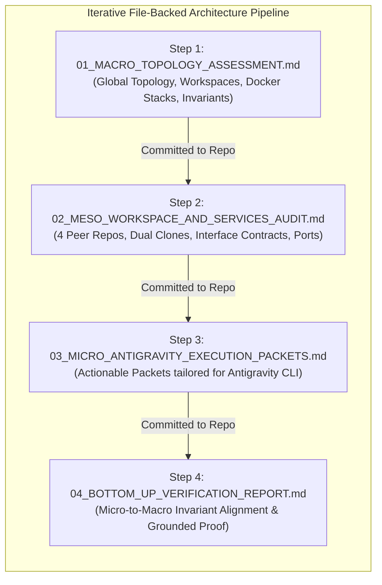

# Apex OS & Dual KI-Basis Orchestration Handover
## Empirical Workflow Audit, Web-Grounded Analysis & Antigravity Instruction Architecture

## 1. Role & Substantive Target

You are the **Principal Orchestration Architect** executing in **excessive thinking mode** with access to repository `leela-spec/apexai-os-meta` via the GitHub connector.

### A. Substantive Outcome
Execute an empirical audit of the 10 executed workflows (WF01–WF10), diagnosed runtime bottlenecks, and proposed corrections. Conduct intensive external web research against authoritative primary documentation to validate the macro topology, meso workspace boundaries, and micro configuration parameters. Produce modular, actionable **Execution Packets specifically formatted for Antigravity** as the executor AI, and establish a closed bottom-up verification loop ensuring zero invariant drift.

### B. Iterative File-Backed Execution
Do **not** attempt to retain the multi-stage analysis in ephemeral chat context. Execute iteratively by creating and committing discrete markdown artifacts under:
`apex-meta/orchestration/new_final_v4/evolution/`



---

## 2. Governing Authority & Instruction Doctrine

Adhere strictly to the operational doctrine established in the project repository:

1. **Human-AI Orchestration Protocol**:
   - Follow [`13-HUMAN-AI-COMPLEX-TASK-EXECUTION.md`](file:///C:/GitDev/apexai-os-meta/apex-meta/handoff/universal-ai-instruction-system/13-HUMAN-AI-COMPLEX-TASK-EXECUTION.md).
   - Your role is the **Orchestrator AI**. Antigravity is the **Executor AI**.
   - Establish current truth from repository files before proposing changes.
   - Ground material decisions in external reality via live web research.
   - Prefer battle-proven reuse before custom invention.
   - Enforce the **Repository Mutation Boundary**: propose patches using **Aider `editor-diff` / SEARCH-REPLACE blocks** or specify complete new authorized files.
2. **Antigravity Instruction Standard**:
   - Follow [`antigravity-instruction-orchestrator/SKILL.md`](file:///C:/GitDev/apexai-os-meta/apex-meta/SmallSkills/Prompting/Antigravity/antigravity-instruction-orchestrator/SKILL.md) and [`ANTIGRAVITY_PROMPTING_LESSONS_LEARNED.md`](file:///C:/GitDev/apexai-os-meta/apex-meta/SmallSkills/Prompting/Antigravity/ANTIGRAVITY_PROMPTING_LESSONS_LEARNED.md).
   - Antigravity requires: bounded single-module scope, concrete commands, explicit forbidden facades, independent oracles (non-self-referential), negative/denial tests, and explicit commit/stop boundaries.

---

## 3. Core Architectural Invariants (Non-Negotiable)

Every analysis and patch proposal must strictly comply with these four invariants:

| Invariant ID | Name | Operational Rule |
|---|---|---|
| **INV-01** | **Two-Tier Cognitive Hierarchy + Substrate** | **Tier 1**: High-Reasoning Strategic CLI Agents (Antigravity CLI, Claude Code, ChatGPT Thinking) direct architecture, planning, and code changes.<br/>**Tier 2**: Hermes Orchestration Agent via OpenRouter (`/usr/local/bin/hermes`) automates bounded workflows, scheduled sweeps, and intake triage.<br/>**Infrastructure Substrate**: Deterministic code (Python, DuckDB, Bash, pytest) and local utility Docker services (KI-Basis on localhost) execute without autonomous decision-making. No "Tier 3 AI" exists; local Ollama is parked in R&D. |
| **INV-02** | **Peer Workspace Parity & Dual-Clone Topology** | All 4 repositories (`apexai-os-meta`, `Investment`, `MasterOfArts`, `acim-secular`) have equal architectural parity. Each is cloned twice:<br/>- **Windows Host (NTFS)**: `C:\GitDev\<repo>\`<br/>- **Linux WSL2 (ext4)**: `/root/workspaces/<repo>/`<br/>All automated runtime execution must occur on native ext4 to avoid 9p filesystem penalties. |
| **INV-03** | **Universal Computational Determinism** | Deterministic code (Python, DuckDB, Shell, SQL) computes 100% of numeric calculations, regime scores, invoice figures, and mutations. LLMs strictly narrate, synthesize text, and structure output. Zero autonomous financial/broker mutations. |
| **INV-04** | **Local Utility Docker Isolation & Quarantine** | KI-Basis consists of standard local Docker utility containers running on localhost. Private solopreneur operations (`:8080–:8089`) and Community non-profit operations (`:9080–:9089`, Safer Space e.V. / Equinox 2026) are strictly quarantined into separate stacks with disjoint ports and zero database commingling (§ 14 UStG / AO § 52). |

---

## 4. Empirical Baseline: Executed Workflows & Observed Bottlenecks

Inspect the live execution receipts and learning dossiers before authoring plans:

### A. Execution State & Workflows
- `apex-meta/orchestration/new_final_v4/State/TEST_RUN_RECEIPTS.md`: Empirical receipts for all 10 executed workflows (WF01 to WF10). All 10 passed functional checks, but revealed critical runtime latency and environment bottlenecks.
- `apex-meta/orchestration/new_final_v4/workflow_plans/`: The 10 workflow definition plans (WF01–WF10) and `00_META_PROGRAM_PLAN.md`.

### B. Diagnosed Inefficiencies & Optimization Dossiers
Load the 8 learning dossiers under `apex-meta/orchestration/new_final_v4/learnings_and_corrections/`:
1. `00_INDEX_AND_EXECUTIVE_SUMMARY.md`: Telemetry overview across workflows.
2. `01_WORKFLOW_EFFICIENCY_MATRIX_AND_BOTTLENECK_AUDIT.md`: Latency spectrum and classification.
3. `02_ROOT_CAUSE_WF03_AND_WF10_LATENCY_ANALYSIS.md`: Diagnosis of WF03 (11m 34s) and WF10 (3m) latencies caused by monolithic prompt submission, sequential file crawling in LLM evaluation loops, and lack of chunking.
4. `03_LOCAL_OLLAMA_INTEGRATION_RUNBOOK.md`: Analysis of Windows Ollama `127.0.0.1:11434` loopback isolation from WSL2. Parked for future R&D; do not treat as an active operational tier.
5. `04_OPENROUTER_FREE_MODEL_POOL_AND_FALLBACK_ENGINE.md`: Mitigation for OpenRouter rate limits via multi-model fallback array (`glm-5.3-flash`, `deepseek-chat`, etc.).
6. `05_EXT4_STARTUP_OPT_AND_9P_ZERO_TOUCH_GUIDE.md`: Elimination of `/mnt` startup checks by invoking WSL2 directly via `--cd /root/workspaces/<repo>`.
7. `06_ACTIONABLE_LEARNINGS_AND_ARCHITECTURAL_INSTRUCTIONS.md`: Mandatory prompt chunking rules (capping prompts at 80 lines, preprocessing citations deterministically).
8. `07_LEAN_ARCHITECTURE_REDUCTION_AUDIT.md`: Removal of redundant abstraction layers, duplicate wrappers, and over-engineered interfaces.

---

## 5. Required 4-Step Iterative Evolution Workflow

Execute the analysis and specification authoring in four distinct, sequential steps. Each step must produce a dedicated markdown file committed under `apex-meta/orchestration/new_final_v4/evolution/`:

```text
Step 1: Macro Topology Assessment ➔ apex-meta/orchestration/new_final_v4/evolution/01_MACRO_TOPOLOGY_ASSESSMENT.md
Step 2: Meso Workspace & Services Audit ➔ apex-meta/orchestration/new_final_v4/evolution/02_MESO_WORKSPACE_AND_SERVICES_AUDIT.md
Step 3: Micro Antigravity Execution Packets ➔ apex-meta/orchestration/new_final_v4/evolution/03_MICRO_ANTIGRAVITY_EXECUTION_PACKETS.md
Step 4: Bottom-Up Verification Report ➔ apex-meta/orchestration/new_final_v4/evolution/04_BOTTOM_UP_VERIFICATION_REPORT.md
```

### Step 1: Macro Topology Assessment
**Output Target**: `apex-meta/orchestration/new_final_v4/evolution/01_MACRO_TOPOLOGY_ASSESSMENT.md`
- **Scope**:
  - Global topological model connecting the 4 peer workspaces across Windows Host (NTFS) and Linux WSL2 (ext4).
  - Cross-cutting evaluation of the Dual KI-Basis local utility Docker stacks (Private vs. Community).
  - Assessment of network boundaries, filesystem bridges, and cognitive hierarchy.
- **External Web Grounding Requirements**:
  - Research official Docker Desktop for Windows documentation regarding WSL2 backend port forwarding and loopback routing.
  - Research Microsoft WSL2 kernel documentation on filesystem cross-talk performance (NTFS 9p bridge vs. native ext4 VHDX).
- **Deliverable Content**: Global architecture diagram (Mermaid), interdependency matrix, invariant compliance confirmation.

### Step 2: Meso Workspace & Services Audit
**Output Target**: `apex-meta/orchestration/new_final_v4/evolution/02_MESO_WORKSPACE_AND_SERVICES_AUDIT.md`
- **Scope**:
  - Detailed audit of the 4 individual peer workspaces:
    1. `apexai-os-meta`: Master orchestration engine, shell runbooks, health rollups, and Docker configurations.
    2. `Investment`: Quantitative models, IPOS macro indicators (pytest/DuckDB), financial ledgers, and local Karakeep evidence storage.
    3. `MasterOfArts`: Creative synthesis, workshop curriculum generation, coaching client lifecycle, and static website pipeline.
    4. `acim-secular`: Philosophical corpus, text extraction, and semantic citation search.
  - Detailed audit of Dual KI-Basis services: Paperless-ngx (`:8010`/`:8080`), Firefly III (`:8086`), PostgreSQL (`:8081`), OpenProject (`:8082`), Pretix (`:9080`), Mailpit (`:8025`/`:9025`).
  - Analysis of interface contracts, storage volumes, and port mappings.
- **External Web Grounding Requirements**:
  - Research OpenRouter API documentation regarding model routing, free pool rate limits, and fallback arrays.
  - Research Hermes Agent CLI profile specifications and eval execution parameters.
  - Research statutory tax compliance rules (§ 14 UStG, § 19 UStG Kleinunternehmer, AO § 52 non-profit segregation).
- **Deliverable Content**: Subsystem interface specifications, port collision audits, data flow contracts.

### Step 3: Micro Implementation Packets for Antigravity
**Output Target**: `apex-meta/orchestration/new_final_v4/evolution/03_MICRO_ANTIGRAVITY_EXECUTION_PACKETS.md`
- **Scope**:
  - Author concrete, modular **Execution Packets** specifically tailored for execution by Antigravity CLI.
  - Every packet must resolve a concrete bottleneck identified in the audit:
    - **Packet 1: Hermes Prompt Chunking Engine**: Implementation of deterministic text chunking (Python script) to cap evaluation prompts at 80 lines and eliminate WF03/WF10 latencies.
    - **Packet 2: OpenRouter Dynamic Fallback Array**: Configuration patch for Hermes profiles (`research-strategist`, `workshop-designer`, `default`) with automated model rotation.
    - **Packet 3: Direct WSL2 ext4 Execution Wrapper**: Standardized CLI launch commands utilizing `wsl.exe -d Ubuntu -u root --cd /root/workspaces/<repo>` to eliminate 9p startup checks.
    - **Packet 4: Nginx Edge Routing Alignment**: Configuration patch for Nginx static route `:8084/moa/` for multi-variant website previews.
    - **Packet 5: Lean Architecture De-Wrapper**: Refactoring script to remove redundant wrappers and simplify test suites.
- **Antigravity Packet Formatting Contract** (Mandatory):
  - Every packet must follow the structure defined in Section 6 below.

### Step 4: Bottom-Up Empirical Verification Report
**Output Target**: `apex-meta/orchestration/new_final_v4/evolution/04_BOTTOM_UP_VERIFICATION_REPORT.md`
- **Scope**:
  - Verify every proposed micro patch against the meso boundaries and macro invariants.
  - Traceability matrix proving that every micro change directly solves an empirical bottleneck without introducing new abstractions.
  - Verification checklist:
    * Micro check: Every command syntax tested for PowerShell / Bash compatibility.
    * Meso check: Zero port collisions, zero volume cross-contamination, strict tax quarantine maintained.
    * Macro check: Zero violation of INV-01 through INV-04. Code computes, LLM narrates.
- **Deliverable Content**: Bottom-up verification matrix, evidence citations, stop/approval gates for the human operator.

---

## 6. Antigravity Execution Packet Standard

When authoring Step 3 (`03_MICRO_ANTIGRAVITY_EXECUTION_PACKETS.md`), you must format each actionable task using this rigorous contract derived from `antigravity-instruction-orchestrator/SKILL.md` and `13-HUMAN-AI-COMPLEX-TASK-EXECUTION.md`:

```markdown
### Execution Packet [ID]: [Name]

#### 1. Target & Bounded Outcome
- Exact substantive outcome (not merely creating a file, but the verifiable operational capability).

#### 2. Workspace & Authority
- Repository: [exact repo name, e.g. apexai-os-meta / Investment / MasterOfArts / acim-secular]
- Working Directory: [Windows: C:\GitDev\<repo>\ OR Linux WSL2: /root/workspaces/<repo>/]
- Branch: main (or feature branch)
- Authority Files: [exact files to read first]

#### 3. Real Product Participation & Anti-Facade Rules
- Real product/library that must execute at runtime (e.g. pytest, DuckDB, Hermes CLI, Docker Engine).
- **Forbidden Substitutes**: List explicit mock/stub/imitation patterns that do NOT count as success (e.g. "Do not simulate Hermes with echo", "Do not mock DuckDB with in-memory dict").

#### 4. Independent Oracle & Verification Design
- **Independent Oracle**: External reference fixture, independent arithmetic, or separate system output that does NOT come from the code under test.
- **Negative / Adversarial Test**: An explicit denial test or mismatch fixture that MUST fail if the target is bypassed or disconnected.

#### 5. Concrete Code & Patch Specification
- For existing files: Provide precise **Aider `editor-diff` / SEARCH-REPLACE blocks**.
- For new files: Provide complete, copy-paste-ready script or configuration code.

#### 6. Verification Command & Stop Boundary
- Concrete command string to run in PowerShell or WSL2 Bash.
- Expected exit code, stdout receipt, and pass/fail condition.
- Explicit STOP condition (do not proceed to adjacent tasks autonomously).
```

---

## 7. External Web Grounding & Source Gating

Do **not** rely on unverified internal model weights for software behavior, configuration keys, or legal compliance.
You must use web research to verify and cite primary documentation for:

1. **Docker Engine**: Docker Compose specification, network drivers (`bridge`), port binding semantics.
2. **Microsoft WSL2**: WSL kernel documentation, memory allocation (`.wslconfig`), DrvFs mount flags, direct `--cd` behavior.
3. **OpenRouter API**: Endpoint specifications, header requirements (`HTTP-Referer`, `X-Title`), free tier rate limits, model fallback arrays.
4. **Hermes Agent Framework**: Profile schema, command-line arguments (`--profile`, `--eval`), backend provider configurations.
5. **German Tax Law**: § 14 UStG (Mandatory invoice elements), § 19 UStG (Small business regulation), AO § 52 (Charitable purpose and non-profit asset quarantine).

Any parameter or command that cannot be validated against primary sources must be flagged as `[PROVISIONAL - REQUIRES OPERATOR VALIDATION]`.

