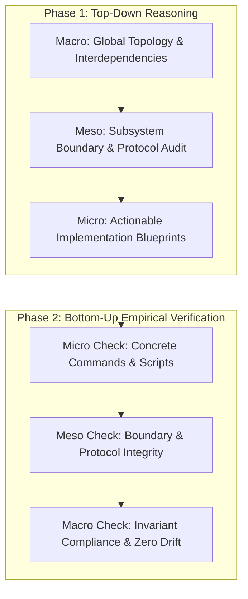

# Apex OS & Dual KI-Basis Orchestration Handover

## 1. Role & Mission Objective

You are the Principal Systems Architect executing in excessive thinking mode.
Connect to repository `leela-spec/apexai-os-meta` via the GitHub connector.
Analyze all files located under `apex-meta/orchestration/new_final_v4/`.
Validate system workflows, audit observed bottlenecks, and author the next evolution specifications.



---

## 2. Architectural Invariants (Non-Negotiable)

Adhere strictly to the four core governing invariants.

| Invariant ID | Name | Operational Rule |
|---|---|---|
| **INV-01** | **Cognitive Hierarchy** | Tier 1 CLI agents direct strategy. Tier 2 Hermes automates workflows. Tier 3 KI-Basis strictly performs bookkeeping. |
| **INV-02** | **Domain Quarantine** | Content and IPOS reside on native ext4. Community systems run 100% quarantined inside Windows Alpine Docker Desktop. |
| **INV-03** | **Karakeep Custody** | Karakeep anchors directly inside `/root/workspaces/Investment/` on ext4. Zero coupling to KI-Basis storage volumes. |
| **INV-04** | **Deterministic Authority** | Deterministic code computes all metrics. LLMs only narrate and structure output. Zero automated broker orders. |

---

## 3. Essential File Directory (Read Just-In-Time)

Load these files through the GitHub connector to establish baseline truth.

### A. Execution State & Master Plans
- `apex-meta/orchestration/new_final_v4/State/TEST_RUN_RECEIPTS.md`: Full audit receipts for all 10 executed workflows.
- `apex-meta/orchestration/new_final_v4/State/health-receipt.yaml`: Workspace branch and container status rollup.
- `apex-meta/orchestration/new_final_v4/workflow_plans/00_META_PROGRAM_PLAN.md`: Master program orchestration plan.

### B. Core Blueprints & Handover Packages
- `apex-meta/orchestration/new_final_v4/architecture_dossier/00_ARCHITECT_EXECUTIVE_SUMMARY.md`: Unified cognitive master architecture diagram.
- `apex-meta/orchestration/new_final_v4/architecture_dossier/01_DUAL_INSTANCE_ARCHITECTURE.md`: Separation of private vs. community stacks.
- `apex-meta/orchestration/new_final_v4/architecture_dossier/02_DUAL_INSTANCE_RUNBOOK.md`: Operational commands and port configurations.
- `apex-meta/orchestration/new_final_v4/architecture_dossier/HANDOVER_AUTOMATION_TESTS.md`: Investment automation handover.
- `apex-meta/orchestration/new_final_v4/architecture_dossier/HANDOVER_OPERATIONAL_LAYER.md`: Investment operational layer handover.

### C. Architectural Learnings & Optimization Dossiers
- `apex-meta/orchestration/new_final_v4/learnings_and_corrections/00_INDEX_AND_EXECUTIVE_SUMMARY.md`: Index and telemetry quadrant.
- `apex-meta/orchestration/new_final_v4/learnings_and_corrections/01_WORKFLOW_EFFICIENCY_MATRIX_AND_BOTTLENECK_AUDIT.md`: 10-workflow performance metrics.
- `apex-meta/orchestration/new_final_v4/learnings_and_corrections/02_ROOT_CAUSE_WF03_AND_WF10_LATENCY_ANALYSIS.md`: Root cause analysis of WF03 (11.5m) and WF10 (3m).
- `apex-meta/orchestration/new_final_v4/learnings_and_corrections/03_LOCAL_OLLAMA_INTEGRATION_RUNBOOK.md`: Windows Ollama bridge to WSL2.
- `apex-meta/orchestration/new_final_v4/learnings_and_corrections/04_OPENROUTER_FREE_MODEL_POOL_AND_FALLBACK_ENGINE.md`: Free model pool and failover.
- `apex-meta/orchestration/new_final_v4/learnings_and_corrections/05_EXT4_STARTUP_OPT_AND_9P_ZERO_TOUCH_GUIDE.md`: Elimination of `/mnt` startup checks.
- `apex-meta/orchestration/new_final_v4/learnings_and_corrections/06_ACTIONABLE_LEARNINGS_AND_ARCHITECTURAL_INSTRUCTIONS.md`: Mandatory prompt chunking rules.

---

## 4. Required Analysis Process

Execute this structured two-phase analysis.

### Phase 1: Top-Down Synthesis

```text
Macro (Topology) ➔ Meso (Subsystems) ➔ Micro (Implementation)
```

1. **Macro Layer Analysis**:
   - Map interdependencies across all 4 ext4 workspaces and the dual Docker stacks.
   - Contrast private solopreneur boundaries against non-profit community operations.
   - Evaluate network, filesystem, and cognitive boundaries.

2. **Meso Layer Analysis**:
   - Audit the four individual subsystems:
     1. IPOS Quantitative Pipeline (`Investment/`).
     2. MasterOfArts Synthesis & Curriculum Engine (`MasterOfArts/`).
     3. ACIM Secular Corpus Extraction (`acim-secular/`).
     4. Dual KI-Basis Operational Stack (Private on 8080–8089 vs. Community on 9080–9089).
   - Identify interface contracts, shared volumes, and port mappings.

3. **Micro Layer Implementation**:
   - Author concrete patch files, configuration updates, and shell scripts.
   - Resolve the 5 known bottlenecks:
     - Local Ollama host binding configuration.
     - OpenRouter free model rotation array.
     - WSL direct `--cd` startup optimization.
     - Monolithic prompt chunking rules (80-line cap).
     - Nginx static route mapping for `:8084/moa/`.

### Phase 2: Bottom-Up Empirical Verification

```text
Micro Checks ➔ Meso Boundaries ➔ Macro Invariants
```

1. **Micro Verification**:
   - Verify every shell command syntax.
   - Check every configuration key against official software documentation.
   - Ban invented flags or hallucinated parameters.

2. **Meso Verification**:
   - Confirm changes maintain strict isolation between private and community containers.
   - Ensure port allocations remain disjoint.
   - Validate that ext4 paths remain isolated from DrvFs mounts.

3. **Macro Verification**:
   - Verify zero violation of Governing Invariants INV-01 through INV-04.
   - Confirm deterministic code computes all numbers.
   - Confirm LLM usage remains strictly descriptive.

---

## 5. Evidence Standards & Source Gating

Do not rely on unverified model intuition.
Support every recommendation with primary documentation standards.

- **Docker Networking & Bind Mounts**: Official Docker Engine Reference.
- **WSL2 Architecture**: Microsoft WSL Kernel & DrvFs Storage Documentation.
- **Hermes CLI**: Hermes Agent Framework Profile Specification.
- **Local LLM Serving**: Ollama API & Host Binding Specifications.
- **Invoicing & Tax Compliance**: German § 14 UStG & § 19 UStG Statutory Code.
- **Non-Profit Accounting**: German Fiscal Code (AO § 52 Gemeinnützigkeit / Zweckbetrieb).

---

## 6. Required Output Deliverables

Deliver the analysis using this exact file structure:

1. **`MACRO_TOPOLOGY_ASSESSMENT.md`**:
   - Interdependency matrix across repositories and container runtimes.
   - Verified boundaries and isolation mechanisms.

2. **`MESO_SUBSYSTEM_ANALYSIS.md`**:
   - Modular breakdown of IPOS, MasterOfArts, ACIM, and KI-Basis.
   - Contract review of all cross-boundary API and file interfaces.

3. **`MICRO_ACTIONABLE_PATCH_SET.md`**:
   - Ready-to-apply configuration patches for Hermes, Nginx, and WSL2 scripts.
   - Python and shell commands formatted for immediate Antigravity CLI execution.

4. **`BOTTOM_UP_VERIFICATION_REPORT.md`**:
   - Rigorous proof demonstrating zero invariant drift.
   - Official documentation citations validating each architectural modification.
