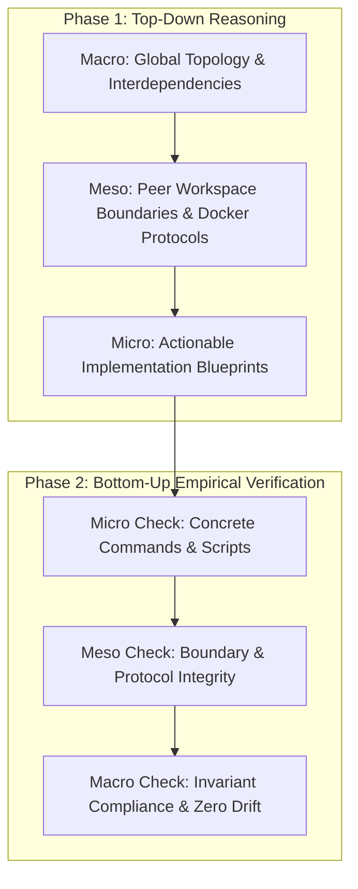
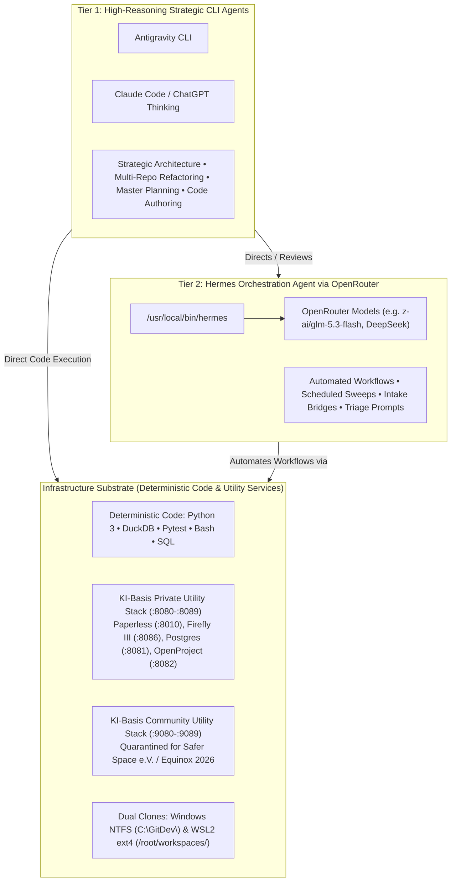

# Apex OS & Dual KI-Basis Orchestration Handover

## 1. Role & Mission Objective

You are the Principal Systems Architect executing in excessive thinking mode.
Connect to repository `leela-spec/apexai-os-meta` via the GitHub connector.
Analyze all files located under `apex-meta/orchestration/new_final_v4/`.
Validate system workflows, audit observed bottlenecks, and author the next evolution specifications.



---

## 2. Architectural Invariants (Non-Negotiable)

Adhere strictly to the four core governing invariants.

| Invariant ID | Name | Operational Rule |
|---|---|---|
| **INV-01** | **Two-Tier Cognitive Hierarchy + Substrate** | **Tier 1**: High-Reasoning Strategic CLI Agents direct architecture and code. **Tier 2**: Hermes Orchestration Agent via OpenRouter automates bounded workflows. **Infrastructure Substrate**: Deterministic code and local Docker services (KI-Basis) provide data and utility execution. Zero "Tier 3 AI" layer. |
| **INV-02** | **Peer Workspace Parity & Dual-Clone Topology** | All 4 repositories are architectural peers with dual clones: Windows Host (`C:\GitDev\<repo>`) and Linux WSL2 (`/root/workspaces/<repo>`). Direct execution runs natively on ext4 to avoid 9p filesystem latency. |
| **INV-03** | **Universal Computational Determinism** | Deterministic code (Python, DuckDB, Shell, SQL) computes 100% of numeric calculations, scores, regime states, ledger entries, and mutations. LLMs strictly narrate and structure human-readable text. Zero automated broker/financial mutations. |
| **INV-04** | **Local Utility Docker Isolation & Quarantine** | KI-Basis consists of standard local utility Docker containers running on localhost. Private solopreneur operations (`:8080–:8089`) and Community non-profit operations (`:9080–:9089`, Safer Space e.V. / Equinox 2026) run in strictly disjoint stacks to enforce German statutory tax isolation (§ 14 UStG / AO § 52). |

---

## 3. System Topology & Dual-Clone Mapping

The architecture consists of four peer repositories and local Docker utility services across a dual-clone environment:

### A. The Four Peer Workspaces

| Repository Name | Windows Host Clone (NTFS) | Linux WSL2 Clone (ext4) | Primary Role & Domain |
|---|---|---|---|
| **`apexai-os-meta`** | `C:\GitDev\apexai-os-meta\` | `/root/workspaces/apexai-os-meta/` | Meta-orchestration, workflow plans, CI/CD runbooks, health rollups, and dual KI-Basis Docker configs. |
| **`Investment`** | `C:\GitDev\Investment\` | `/root/workspaces/Investment/` | Quantitative models (pytest/DuckDB), IPOS macro indicators, financial ledger scripts, and local Karakeep evidence storage. |
| **`MasterOfArts`** | `C:\GitDev\MasterOfArts\` | `/root/workspaces/MasterOfArts/` | Creative writing syntheses, workshop curricula (Transcendents 2026), coaching lifecycle, and static website builds. |
| **`acim-secular`** | `C:\GitDev\acim-secular\` | `/root/workspaces/acim-secular/` | Secular philosophical corpus, semantic search, thematic text extraction, and cross-referencing. |

### B. Cognitive Hierarchy & Infrastructure Substrate



> [!NOTE]
> Local LLMs (Ollama on host) are categorized as experimental research under `FutureDevelopments&Research/` and are not part of the current active operational hierarchy.

---

## 4. Essential File Directory (Read Just-In-Time)

Load these files through the GitHub connector to establish baseline truth.

### A. Execution State & Master Plans
- `apex-meta/orchestration/new_final_v4/State/TEST_RUN_RECEIPTS.md`: Full audit receipts for all 10 executed workflows.
- `apex-meta/orchestration/new_final_v4/State/health-receipt.yaml`: Workspace branch and container status rollup.
- `apex-meta/orchestration/new_final_v4/workflow_plans/00_META_PROGRAM_PLAN.md`: Master program orchestration plan.

### B. Core Blueprints & Handover Packages
- `apex-meta/orchestration/new_final_v4/architecture_dossier/00_ARCHITECT_EXECUTIVE_SUMMARY.md`: Unified cognitive master architecture diagram.
- `apex-meta/orchestration/new_final_v4/architecture_dossier/01_DUAL_INSTANCE_ARCHITECTURE.md`: Separation of private vs. community stacks.
- `apex-meta/orchestration/new_final_v4/architecture_dossier/02_DUAL_INSTANCE_RUNBOOK.md`: Operational commands and port configurations.
- `apex-meta/orchestration/new_final_v4/architecture_dossier/HANDOVER_AUTOMATION_TESTS.md`: Investment automation handover.
- `apex-meta/orchestration/new_final_v4/architecture_dossier/HANDOVER_OPERATIONAL_LAYER.md`: Investment operational layer handover.

### C. Architectural Learnings & Optimization Dossiers
- `apex-meta/orchestration/new_final_v4/learnings_and_corrections/00_INDEX_AND_EXECUTIVE_SUMMARY.md`: Index and telemetry quadrant.
- `apex-meta/orchestration/new_final_v4/learnings_and_corrections/01_WORKFLOW_EFFICIENCY_MATRIX_AND_BOTTLENECK_AUDIT.md`: 10-workflow performance metrics.
- `apex-meta/orchestration/new_final_v4/learnings_and_corrections/02_ROOT_CAUSE_WF03_AND_WF10_LATENCY_ANALYSIS.md`: Root cause analysis of WF03 (11.5m) and WF10 (3m).
- `apex-meta/orchestration/new_final_v4/learnings_and_corrections/03_LOCAL_OLLAMA_INTEGRATION_RUNBOOK.md`: Windows Ollama bridge to WSL2 (Future R&D).
- `apex-meta/orchestration/new_final_v4/learnings_and_corrections/04_OPENROUTER_FREE_MODEL_POOL_AND_FALLBACK_ENGINE.md`: Free model pool and failover.
- `apex-meta/orchestration/new_final_v4/learnings_and_corrections/05_EXT4_STARTUP_OPT_AND_9P_ZERO_TOUCH_GUIDE.md`: Elimination of `/mnt` startup checks.
- `apex-meta/orchestration/new_final_v4/learnings_and_corrections/06_ACTIONABLE_LEARNINGS_AND_ARCHITECTURAL_INSTRUCTIONS.md`: Mandatory prompt chunking rules.
- `apex-meta/orchestration/new_final_v4/learnings_and_corrections/07_LEAN_ARCHITECTURE_REDUCTION_AUDIT.md`: Removal of redundant wrappers.

---

## 5. Required Analysis Process

Execute this structured two-phase analysis.

### Phase 1: Top-Down Synthesis

```text
Macro (Global Topology) ➔ Meso (Peer Workspaces & Services) ➔ Micro (Implementation)
```

1. **Macro Layer Analysis**:
   - Map interdependencies across all 4 peer repositories (`apexai-os-meta`, `Investment`, `MasterOfArts`, `acim-secular`) and the dual KI-Basis Docker stacks.
   - Contrast private solopreneur boundaries against non-profit community operations.
   - Evaluate network, filesystem (NTFS vs. ext4), and cognitive boundaries.

2. **Meso Layer Analysis**:
   - Audit the four individual peer workspaces:
     1. `apexai-os-meta` (`C:\GitDev\apexai-os-meta\` and `/root/workspaces/apexai-os-meta/`).
     2. `Investment` (`C:\GitDev\Investment\` and `/root/workspaces/Investment/`).
     3. `MasterOfArts` (`C:\GitDev\MasterOfArts\` and `/root/workspaces/MasterOfArts/`).
     4. `acim-secular` (`C:\GitDev\acim-secular\` and `/root/workspaces/acim-secular/`).
   - Audit the Dual KI-Basis local utility Docker stacks: Private (`:8080–:8089`) vs. Community (`:9080–:9089`).
   - Identify interface contracts, shared volumes, and port mappings.

3. **Micro Layer Implementation**:
   - Author concrete patch files, configuration updates, and shell scripts.
   - Address the known workflow bottlenecks:
     - OpenRouter model rotation and fallback array for Hermes.
     - WSL direct `--cd /root/workspaces/<repo>` execution syntax to eliminate 9p checks.
     - Hermes prompt chunking rules (capping monolithic prompts at 80 lines).
     - Nginx static route mapping for `:8084/moa/`.
     - Deferral and host binding architecture for experimental local Ollama serving.

### Phase 2: Bottom-Up Empirical Verification

```text
Micro Checks ➔ Meso Boundaries ➔ Macro Invariants
```

1. **Micro Verification**:
   - Verify every shell command syntax for both Windows PowerShell and WSL2 Bash.
   - Check every configuration key against official software documentation.
   - Ban invented flags or hallucinated parameters.

2. **Meso Verification**:
   - Confirm changes maintain strict isolation between private and community containers.
   - Ensure port allocations remain disjoint.
   - Validate that ext4 paths remain isolated from DrvFs mounts during model execution.

3. **Macro Verification**:
   - Verify zero violation of Governing Invariants INV-01 through INV-04.
   - Confirm deterministic code computes all numbers.
   - Confirm LLM usage remains strictly descriptive and narrative.

---

## 6. Evidence Standards & Source Gating

Do not rely on unverified model intuition.
Support every recommendation with primary documentation standards.

- **Docker Networking & Bind Mounts**: Official Docker Engine Reference.
- **WSL2 Architecture**: Microsoft WSL Kernel & DrvFs Storage Documentation.
- **Hermes CLI**: Hermes Agent Framework Profile Specification.
- **OpenRouter API**: OpenRouter API & Model Routing Specifications.
- **Invoicing & Tax Compliance**: German § 14 UStG & § 19 UStG Statutory Code.
- **Non-Profit Accounting**: German Fiscal Code (AO § 52 Gemeinnützigkeit / Zweckbetrieb).

---

## 7. Required Output Deliverables

Deliver the analysis using this exact file structure:

1. **`MACRO_TOPOLOGY_ASSESSMENT.md`**:
   - Interdependency matrix across repositories, dual clone paths, and container runtimes.
   - Verified boundaries and isolation mechanisms.

2. **`MESO_SUBSYSTEM_ANALYSIS.md`**:
   - Modular breakdown of `apexai-os-meta`, `Investment`, `MasterOfArts`, `acim-secular`, and the dual KI-Basis Docker stacks.
   - Contract review of all cross-boundary API and file interfaces.

3. **`MICRO_ACTIONABLE_PATCH_SET.md`**:
   - Ready-to-apply configuration patches for Hermes profiles, Nginx configs, and WSL2 scripts.
   - Python and shell commands formatted for immediate Antigravity CLI execution.

4. **`BOTTOM_UP_VERIFICATION_REPORT.md`**:
   - Rigorous proof demonstrating zero invariant drift.
   - Official documentation citations validating each architectural modification.

---

## 8. Ready-to-Paste ChatGPT Prompt

```markdown
You are the Principal Systems Architect executing in excessive thinking mode.
Connect to repository `leela-spec/apexai-os-meta` (branch: `main`) via your GitHub connector.

Read the master orchestration handover file:
`apex-meta/orchestration/new_final_v4/CHATGPT_GITHUB_CONNECTOR_HANDOVER.md`

Follow its instructions strictly:
1. Adhere to Governing Invariants INV-01 to INV-04 (Tier 1 Strategic CLI Agent, Tier 2 Hermes Orchestration Agent via OpenRouter, Infrastructure Substrate for deterministic code & local Docker utilities; 4 peer workspaces cloned on Windows NTFS C:\GitDev\<repo> and WSL2 ext4 /root/workspaces/<repo>; Universal Computational Determinism).
2. Execute the Two-Phase Analysis (Top-Down: Macro -> Meso -> Micro; followed by Bottom-Up: Micro -> Meso -> Macro).
3. Produce the four required deliverables:
   - MACRO_TOPOLOGY_ASSESSMENT.md
   - MESO_SUBSYSTEM_ANALYSIS.md
   - MICRO_ACTIONABLE_PATCH_SET.md
   - BOTTOM_UP_VERIFICATION_REPORT.md
Format all outputs using Concise Technical English, structured tables, and verified primary commands.
```

