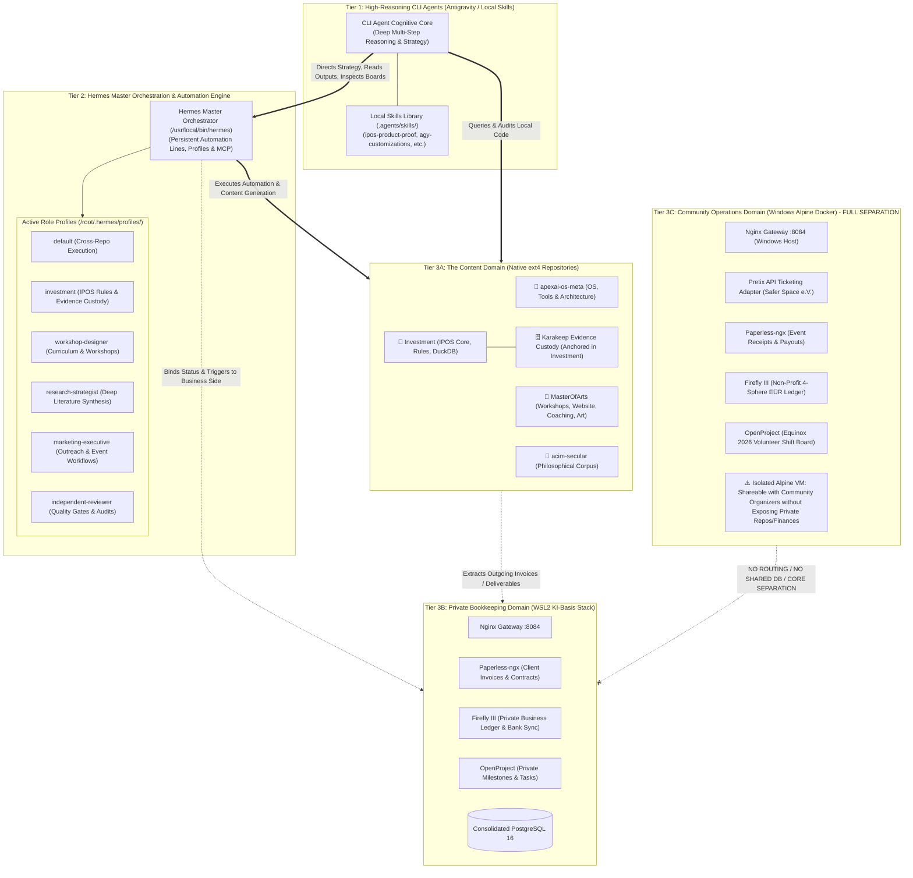
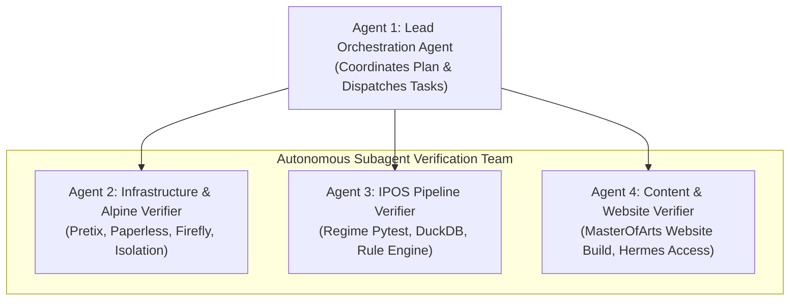

# Autonomous Multi-Agent Handover: Automation Architecture, 10 Workflows & Simulation Test Suite

**Date:** 2026-09-07  
**Prepared For:** Autonomous Multi-Agent Orchestration Team (Next Chat Session)  
**Execution Authority:** Multi-Agent CLI Team (Lead Orchestrator, Infra Verifier, IPOS Verifier, Community Verifier)  
**System Scope:** Three-Tier Cognitive Architecture, Clean Separation of Content vs. Bookkeeping, Isolated Community Alpine Stack, 10 Verified Workflows, and Autonomous Execution Protocol.

---

## 1. The Three-Tier Cognitive & Operational Architecture

The system operates across three strictly delineated layers of cognition and responsibility:

### Key Architectural Truths:
1. **CLI Agents = The Cognitive Brain**:
   * CLI agents possess high-reasoning capacity and execute deep research, complex refactors, and strategic synthesis.
   * They access local skills (`.agents/skills/`), inspect Hermes logs, review OpenProject Kanban boards, and direct Hermes automation.
2. **Hermes = The Persistent Automation Line**:
   * Hermes maintains long-running state, role profiles, crons, and MCP tool connections.
   * It handles scheduled executions, repetitive pipelines, and programmatic queries.
3. **Content vs. Bookkeeping Division**:
   * **Content Side (Hermes + ext4 Repos)**: Workshops, website creation, ideas, research pipelines, algorithmic backtests.
   * **Bookkeeping Side (KI-Basis)**: Strictly the receiving end for invoices, banking reconciliation, and administrative accounting.
4. **Community Operations Quarantined in Alpine Docker**:
   * The Equinox 2026 ticketing, Safer Space e.V. non-profit accounting, and volunteer shift planning live **strictly in the Windows Alpine Docker Desktop environment**.
   * It is 100% segregated so it can be shared with club collaborators without ever exposing private source code or personal business financials.

---

## 2. Execution Reality: Schedulers, Offline Queues & Catch-Up Mechanics

### 1. Who Initiates and Holds the Automation?
* **Windows Task Scheduler (`scripts/register_scheduler.ps1`)**:
  Holds `IPOS Weekly Pipeline`. Configured with `-StartWhenAvailable` to catch up missed runs.
* **Linux Cron / Systemd (`scripts/run_weekly_cron.sh`)**:
  Executes in Ubuntu WSL2 under `flock -n /tmp/ipos-weekly.lock` to prevent concurrent database writes.
* **Hermes Event Loop (`ki-basis-hermes`)**:
  Listens for incoming webhooks and API triggers on `127.0.0.1:8642`.

### 2. What Happens When the Laptop is Offline or Asleep?
* **Hardware State**: Local CPU is paused during sleep/off states.
* **Windows Scheduler Catch-Up**:
  If the laptop was asleep during the 05:00 Saturday schedule, Windows detects the missed event upon wake and triggers the pipeline immediately.
* **Telegram Cloud Message Queue**:
  Telegram Bot API servers store messages for 24+ hours. When `hermes_telegram_intake.py` reconnects, it retrieves updates with the last known `offset`, processing all missed receipts and ideas in chronological order without loss.
* **Pretix Cloud Queue**:
  Pretix retains all ticket sales and transaction logs in the cloud. Upon reconnection, `pretix_adapter.py` queries by timestamp and reconciles the backlog into Firefly III and Paperless.

---

## 3. 10 Concrete Cross-Repository Workflows

| # | Workflow Name | Dominant Cognitive Layer | Target Repositories & Stacks | Core Function & Operational Flow |
|---|---|---|---|---|
| **1** | Weekly Meta-Orchestration Sweep | **CLI Agent** (Heavy Reasoning + Skills) directing **Hermes** | All 4 Repos (`/root/workspaces/*`) + KI-Basis OpenProject | CLI agent gathers Hermes logs, inspects Kanban boards, evaluates git statuses across all repos, runs `backup-stack.sh`, and compiles `health-receipt.yaml`. |
| **2** | Creative Writing & Thematic Synthesis | **Hermes** (`research-strategist`) | `MasterOfArts/Art/` & `MasterOfArts/Awakening/` | Synthesizes draft chapters and artistic essays from internal notes with zero web distraction. |
| **3** | "Transcendents" Workshop Concept Generator | **Hermes** (`workshop-designer`) | `acim-secular` -> `MasterOfArts/workshops/` | Translates philosophical source texts into an 8-module retreat curriculum, complete with interactive exercises and syllabi. |
| **4** | Multi-Variant Business Website Pipeline | Python Engine (`build_all_websites.py`) | `MasterOfArts/WEbsite/` + Nginx Edge | Builds 3 distinct aesthetic variations ("Zen Minimalist", "Vibrant", "Modern") and serves them behind the local Nginx gateway (:8084). |
| **5** | IPOS Saturday Macro Indicator Pipeline | Task Scheduler -> **Hermes** (`investment`) | `Investment/` (22 Indicators, DuckDB, Telegram) | Autonomous Saturday 05:00 run evaluating 126 seminar rules, updating the Action/Watch Register, and dispatching the Telegram digest. |
| **6** | IPOS Evidence Invalidation Watchdog | **Hermes** (`investment`) + Karakeep | `Investment/` (Karakeep ext4 custody) | Watches newly archived research for macro regime counter-evidence before capital allocation decisions. |
| **7** | Private Coaching Onboarding & Invoicing | **CLI Agent** (Offer) + **KI-Basis** (Bookkeeping) | `MasterOfArts/Coaching/` + Paperless + Firefly | Generates coaching agreement, issues compliant PDF invoice into Paperless (`COACHING-INVOICE-OUTGOING`), matches bank wire in Firefly, and triggers overdue payment drafts. |
| **8** | Equinox 2026 Pretix Ticketing Settlement | **Alpine Community KI-Basis Stack** | Windows Docker Desktop (`safer-space-ev`) | Ingests Pretix orders, splits fees (€11,300 gross -> €10,833.90 net), archives payout slip PDF in Paperless, and logs non-profit tax entries in Firefly. |
| **9** | Social Initiative Telegram Intake Bridge | **Hermes** + Telegram Bot API | `apexai-os-meta/ki-basis/` | Ingests volunteer receipts and ideas from Telegram, catches up offline backlogs, uploads to Paperless, and creates OpenProject tasks. |
| **10** | Secular Corpus Semantic Cross-Referencing | **Hermes** CLI (`default`) | `acim-secular` + SQLite FTS5 | Extracts precise citations and conceptual parallels from the secular corpus to feed into coaching and workshop curricula. |

---

## 4. Multi-Agent Autonomous Simulation & Test Protocol (For Next Chat Session)

**Instructions for the incoming Multi-Agent Team:**
Do NOT ask the operator to run terminal commands manually. Deploy a team of specialized subagents to execute, observe, and verify the following test suite autonomously:

### Agent Runbook: 5 Autonomous Test Tasks

#### Task 1: Autonomous Infrastructure & Pretix Audit (Assigned to: InfraAgent)
* **Command**: `python C:\GitDevpexai-os-meta\ki-basis\scriptserify_fundraiser_stack.py`
* **Pass Criteria**:
  - Pretix module confirms 320 attendees, €11,300 gross, €10,833.90 net payout.
  - OpenProject returns >= 24 work packages across Project 3.
  - Firefly III returns >= 19 transactions.
  - Paperless returns >= 10 documents.
  - Final log output: `ALL AUDIT VERIFICATIONS PASSED WITH ZERO ERRORS!`.

#### Task 2: Autonomous Dual-Instance Isolation Challenge (Assigned to: InfraAgent)
* **Command**: `python C:\GitDevpexai-os-meta\ki-basis\scriptserify_dual_isolation.py`
* **Pass Criteria**:
  - Verifies zero port overlap between Private (8080-8089) and Community (9080-9089).
  - Verifies network bridge boundaries.

#### Task 3: Autonomous IPOS Deterministic Regime Test Suite (Assigned to: IPOSAgent)
* **Command**: `C:\GitDev\Investment\.venv\Scripts\python.exe -m pytest -q C:\GitDev\Investment	ests	est_regime.py C:\GitDev\Investment	ests	est_scoring.py`
* **Pass Criteria**:
  - Pytest executes 17 test cases.
  - All 17 pass (100% pass rate) in < 30 seconds.

#### Task 4: Autonomous MasterOfArts Website Build Pipeline (Assigned to: ContentAgent)
* **Command**: `python C:\GitDev\MasterOfArts\WEbsiteuild_all_websites.py`
* **Pass Criteria**:
  - Compiles `C:\GitDev\MasterOfArts\WEbsite\index.html`.
  - Verifies output directories exist: `variation-a-zen/`, `variation-b-vibrant/`, `variation-c-modern/`.

#### Task 5: Autonomous Hermes Global CLI Cross-Repo Verification (Assigned to: ContentAgent)
* **Command**: `wsl.exe -d Ubuntu -u root -e bash -c "/usr/local/bin/hermes --version && ls -la /root/workspaces"`
* **Pass Criteria**:
  - Returns Hermes CLI version (`v0.20.5`).
  - Confirms all 4 repositories (`apexai-os-meta`, `Investment`, `MasterOfArts`, `acim-secular`) exist and are accessible on native ext4.
