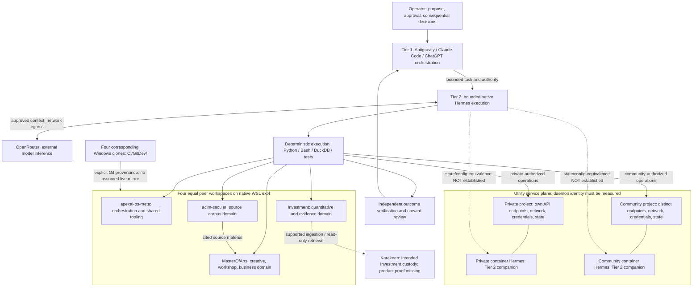

# Step 1 - Macro Topology Assessment

## 1. Decision and verified baseline

**Retain the intended architecture. Repair evidence quality and boundary violations before adopting the proposed performance changes.** The repository establishes a viable two-tier design. It does not establish that ten complete workflows passed, that two runtime stacks are isolated, or that host and container Hermes share state.

This is a dated audit record, not a replacement authority or an implementation launcher. The current handover governs architectural intent. Source code establishes declared configuration. Recorded receipts establish what earlier agents reported, not fresh workstation observations. [A1] [A2] [A3]

### Baseline identity

| Field | Verified value or explicit limitation |
|---|---|
| Repository and branch | `leela-spec/apexai-os-meta`, `main`, read through the GitHub connector |
| Pinned baseline | `9f858778e41602673cd729f808ed486a6dccd642` |
| Baseline commit time | `2026-09-07T16:23:10Z`, equivalent to 18:23:10 Europe/Berlin |
| Baseline commit message | `docs(handover): restructure handover for empirical audit, web grounding, and Antigravity execution packets` |
| Governing handover | Version 5.0.0; blob `7cf57b02d1db0db38cc1119aaea6a49afe1a6548` |
| Workflow receipts | Dated September 7, 2026, approximately 15:25-16:14 Europe/Berlin; these precede the baseline commit |
| Destination at baseline | `evolution/` contained only `.gitkeep`; this assessment is a genuinely new file |
| Actual audit surface | GitHub reads, primary documentation research, and independent local arithmetic/hash checks |
| Unavailable observation | No connection to the operator's Windows host, WSL distributions, Docker daemons, private service APIs, or installed Hermes process |
| Mutation boundary | New assessment file only. No existing-file replacement, installation, deployment, migration, secret rotation, or financial action |

Baseline identity is established by the GitHub branch/commit response and the pinned evolution tree. [B1] [B2]

At the publication check, `main` had advanced to `5a6d3a7c7f8d7d97ad64e1ac3032a72a8d93faa1`. The comparison contained only three A12 communication-economy documentation changes. None of this assessment's source files or its destination changed. The pinned evidence remains applicable; the new assessment is added on top of that work. [B3]

### Reading scope

Read completely: the three requested authorities; the linked Antigravity prompting lessons; the meta-program and all ten workflow plans; the test receipts; all eight learning dossiers; `ki-basis/compose.yaml`; and `verify_dual_isolation.py`. Root `AGENTS.md` and the informatics index/standard were also read. The architecture executive summary was inspected through its first 120 lines, including its four direct architectural answers. Its remaining sections and eleven agent transcripts were not audited in full. [A1] [A2] [A3] [A4] [A5] [A6] [P0] [R1] [L0] [C1] [C2] [D1]

The other three repositories and their current remote heads were not independently audited. Their role descriptions and local branch observations below come from this repository's pinned evidence.

## 2. Authority reconciliation

The handover's INV-01 to INV-04 remain the assessment constraints. Older plans and learning proposals do not silently override them. The complex-task guide additionally requires real-world grounding, outcome verification, and Aider SEARCH/REPLACE handoffs for existing-file changes. [A1] [A2]

| Conflict | Evidence | Step 1 disposition |
|---|---|---|
| Two AI tiers versus older three-tier labels | Current handover defines Tier 1 and Tier 2. Older workflow/dossier material uses three-tier and Tier 3B labels. | Retain two AI tiers. Databases, scripts, schedulers, and Docker utilities are infrastructure, not another intelligence tier. |
| Parked Ollama versus active local-model migration | INV-01 parks Ollama. Learning 03 recommends local installation, model activation, and broader host binding. | Do not activate the runbook. No local model installation or firewall change is authorized by this assessment. |
| Separate private/community stacks versus one shared network/database environment | INV-04 requires separate stacks. Learning 07 proposes a unified network and shared database engine. | Reject cross-domain consolidation as an adopted change. Reusing one Compose template is compatible with deploying distinct projects. |
| Declared port bands versus actual configuration | INV-04 names 8080-8089 and 9080-9089. The template/checker also use 8010/9010, 8642/9642, and 9119/9219. | Preserve the discrepancy. Either an explicit exception list or a separately authorized port correction is required. Do not quietly call those ports compliant. |
| Claimed shared Hermes state versus declared volumes | Executive summary claims host-state and workspace bind mounts. Compose declares Docker-managed named volumes instead. | Treat state sharing and host-repository access as unproven. Do not add a broad mount merely to make the diagram true. |
| Input prompt cap versus output cap | Handover proposes prompt chunking; learning 06 specifies an output limit of 80 lines or 4 KB. | Resolve input/output semantics before implementation. Splitting input at line 80 does not bound generated output or prove reliability. |
| Learning-file navigation | Handover names `07_LEAN_ARCHITECTURE_REDUCTION_AUDIT.md`; the index links `07_LEARNING_OVERENGINEERING_VS_LEAN_ARCHITECTURE.md`. | Use the file actually linked and read. Record the navigation defect without renaming history. |

Sources: [A1] [P0] [P7] [L3] [L6] [L7] [L0] [C1] [C2] [D1].

## 3. Macro topology and dependency boundaries

### Intended topology, not a certified as-built diagram

Solid arrows show intended functional contracts. Dashed arrows show synchronization or integration edges requiring verification. Private/community placement inside one or several Docker engines remains unresolved. This diagram does not authorize changing that placement.



The four repositories remain peers. Storing shared tooling in `apexai-os-meta` does not make the other repositories subordinate. Their individual branch histories and content authorities remain intact. Neither a model profile nor a friendly folder name proves an operating-system permission boundary. [A1] [D1]

### Interdependency matrix

| Producer / consumer | Contract | Custody and permitted effect | Evidence gap |
|---|---|---|---|
| Tier 1 / Tier 2 | Bounded job with authority, evidence, and stop condition | No autonomous expansion into unrelated repositories or business decisions | Installed profile/tool permissions and actual launches are not captured |
| Windows clone / matching ext4 clone | Git history and explicit revisions | Runtime work stays on ext4; no blind overwrite, reset, or synchronization | No paired clone SHAs, dirty-state reconciliation, or filesystem measurements |
| `acim-secular` / `MasterOfArts` | Cited excerpts used for workshop and writing work | Source remains source; reviewed derivatives belong to `MasterOfArts` | Receipt citations exist, but source blobs and derivative commits were not independently inspected |
| `Investment` / deterministic engine | Inputs, scores, rule outputs, stored results | Numeric calculations remain deterministic; no broker orders | Seventeen unit tests do not prove scheduled ingestion and persistence |
| `Investment` / Karakeep | Actual product ingestion and read-only retrieval | Preserve source bytes and provenance; no model-authored archive receipt as substitute | Hash drill never crosses Karakeep |
| Private workflow / private utility APIs | Invoice/document/task records with approved source evidence | No community records or autonomous settlement authority | Recorded coaching APIs have product IDs, but bank and approval evidence are missing |
| Community workflow / community utility APIs | Ticketing, staging, and treasurer review | No private account/database crossover; no unsolicited external dispatch | WF08 explicitly targets private endpoints; Telegram live polling is unproved |
| Native Hermes / container Hermes | Explicit instance, configuration, and state contract | No assumed shared session store or unrestricted host mounts | Named volumes contradict claimed host bind mounts |
| Hermes / OpenRouter | Version-supported request and fallback configuration | Approved egress, model allowlist, bounded cost and retries | Model availability, installed schema, and effective fallback behavior unverified |

Evidence: [A1] [R1] [P2] [P3] [P5] [P6] [P7] [P8] [P9] [C1] [D1].

### What the pinned configuration actually declares

`ki-basis/compose.yaml` declares seven services and ten named volumes. It is parameterized for reuse; it is not proof of two running deployments. Its default project is `ki-basis`, matching the unqualified names shown in WF01. [C1] [R1]

| Service | Template's host binding | Community port expected by static checker | Interpretation |
|---|---:|---:|---|
| Nginx | `127.0.0.1:8084 -> 80` | 9084 | Edge root health does not prove `/moa/` content routing |
| OpenProject | `127.0.0.1:8082 -> 80` | 9082 | Project IDs must be associated with an identified instance |
| Paperless | `127.0.0.1:8010 -> 8000` | 9010 | Outside the literal handover bands |
| Firefly III | `127.0.0.1:8086 -> 8080` | 9086 | Different accounts within one instance do not establish separate stacks |
| Hermes API | `127.0.0.1:8642 -> 8642` | 9642 | Outside the literal bands; container listener and host publication are different boundaries |
| Hermes dashboard | `127.0.0.1:9119 -> 9119` | 9219 | Outside the literal bands |
| PostgreSQL | No host port; container port 5432 | No host port expected | The audited template does not publish a PostgreSQL port at 8081 |
| Valkey | No host port; container port 6379 | No host port expected | Internal service address, not a host-browser endpoint |

The checker expects these community values; their effective deployment is not verified. Karakeep, Activepieces, Pretix, and Mailpit are not services in this template. This does not establish their absence elsewhere. [C1] [C2]

Hermes mounts `hermes_data:/opt/data` and `hermes_workspaces:/root/workspaces`. These do not bind `/root/.hermes` or the host's four clones. Docker documents named volumes as Docker-managed storage, distinct from explicitly binding a host directory. Existing data could have been copied into a volume, but no such provenance is demonstrated here. [C1] [D1] [W7]

## 4. Empirical audit of the ten workflow claims

### Outcome coverage

The following verdicts assess the complete claimed workflow, not merely whether its narrow test returned zero. All durations are reported measurements, not fresh benchmarks. [R1] [L1]

| Workflow | Reported duration | What the evidence actually supports | Full-workflow assessment |
|---|---:|---|---|
| WF01 - infrastructure | 19.1 s | Four WSL Git status outputs; one context-unspecified seven-container listing; backup syntax/help checks | **CORRECTION_REQUIRED:** two environments and successful backup/restore are not demonstrated |
| WF02 - writing | 90 s | Hermes-generated three-part outline and claimed local corpus grounding | **PASS_WITH_LIMITATIONS for outline drill only:** archival, source independence, and review gate remain open; cloud inference is not offline execution |
| WF03 - workshops | 694 s | Two generated modules, reported 214 lines / 19,792 bytes, following a corrupted earlier write | **PASS_WITH_LIMITATIONS for two-module drill only:** not the full eight-module outcome; corruption cause and independent content verification remain open |
| WF04 - website | 2.2 s | Windows build, four existence checks, claimed 22-page output; receipt admits `/moa/` is unmapped | **CORRECTION_REQUIRED:** build is not edge deployment; Windows execution conflicts with current ext4 requirement |
| WF05 - investment | 9.7 s | Seventeen regime/scoring tests run through Windows Python | **CORRECTION_REQUIRED:** useful unit evidence, not scheduler/data pull/DuckDB/register/notification proof; ext4 mismatch |
| WF06 - custody | 0.8 s | Python hashes dummy bytes and prints a locally constructed `ARCHIVED` JSON object | **CORRECTION_REQUIRED:** zero demonstrated Karakeep ingestion, SingleFile capture, MCP retrieval, or watchdog action |
| WF07 - coaching | 6.2 s | Recorded Paperless task/document IDs and a Firefly transaction; invoice settlement asserted | **CORRECTION_REQUIRED:** independent bank matching, authority, invoice compliance, and domain isolation are not established |
| WF08 - ticketing | 2.07 s | Fundraiser verification explicitly reports `Target Instance: private` and private API endpoints | **CORRECTION_REQUIRED:** contradicts community quarantine; actual Pretix participation and bank settlement are not independently established |
| WF09 - Telegram | 5.1 s | Local CLI staging simulations, claimed Paperless/OpenProject objects; Firefly count unchanged | **BLOCKED_HUMAN_GATE for live Telegram:** token/group and live event proof absent; count equality cannot exclude edits to existing ledger records |
| WF10 - corpus | 180 s | Three quotations and synthesis; source checking asserted in the receipt | **PASS_WITH_LIMITATIONS for retrieval drill only:** fresh source verification and SQLite FTS5 participation are not demonstrated |

These findings do not imply that every component is broken. They establish that successful subtests were promoted into broader completion claims. The program's explicit schedule is WF01, WF05, WF06, WF02, WF03, WF04, WF10, WF07, WF08, WF09. Receipts follow that schedule; their nonnumeric order is not itself a defect. [P0] [R1]

### Highest-consequence findings

**M-01 - Community/private routing contradiction.** WF08 addresses OpenProject 8082, Firefly 8086, and Paperless 8010 while declaring `Target Instance: private`. WF07 uses those same private services. Separate bank-account names, project names, or document tags do not prove distinct database instances. This is a recorded rehearsal contradiction, not a freshly observed production breach. The next audit must identify actual service instances and classify fixture versus real records before any cleanup or migration. [R1] [C1] [C2]

**M-02 - Credential exposure in committed evidence.** A plaintext Paperless authorization token appears in both the receipt and WF07 plan. Its value and personal financial details are deliberately excluded here. Whether the token remains valid is unknown. The owner should revoke/rotate it and verify rejection of the old credential. Existing-file redaction requires an authorized patch; history rewriting is a separate consequential operation. Neither action was performed during Step 1. [R1] [P7]

**M-03 - Product proof is replaced by a local hash.** WF06's digest is mathematically correct, but its command does not contact Karakeep. The plan itself defines this inadequate test. This is therefore a verification-design defect, not merely executor noncompliance. Product-generated identifiers, independent retrieval, and dependency-denial evidence are required. [P6] [R1] [A3]

**M-04 - Isolation checker overstates its reach.** `verify_dual_isolation.py` parses environment files, interpolates YAML, and inspects dictionaries. It does not query Docker. Distinct strings cannot prove active networks, volume filesystem types, denied cross-domain access, or secret entropy. Its `${VAR:-default}` implementation also keeps an empty string, unlike Compose's documented fallback behavior. Retain useful static checks, but use native Compose rendering as the configuration oracle and runtime observations as a separate gate. [C2] [W5] [W6]

**M-05 - Runtime location and identity are unresolved.** WF04/WF05 and other commands run directly from Windows paths, despite INV-02. Other runs start under `/mnt` and reportedly pivot to ext4. A `docker` command executed from Ubuntu can target a Desktop engine; it does not prove native Ubuntu `dockerd`. Record resolved executable paths, filesystem types, Docker contexts, and server identities before making placement claims. [R1] [W1] [W2] [W8]

**M-06 - Corruption was classified too confidently.** WF03's own output describes garbled text and a fake injected out-of-band fragment. The learning dossier attributes the incident to an SSE timeout, without preserved transport/error evidence in the audited material. Treat transport failure, model output corruption, and instruction-contamination hypotheses separately. Preserve failed payloads securely; inspect untrusted-source boundaries; do not certify a chunk size as eliminating the issue. [R1] [L2]

**M-07 - Unproven state-sharing assumptions.** The executive summary describes one shared host/container Hermes configuration and SQLite state. The actual Compose mounts do not implement that claim. The next audit should establish the necessary interface contract, not force a shared database or broad workspace mount. [D1] [C1]

### Reproducible local checks

These checks were executed in the audit container, not the operator's workstation:

```python
import hashlib
from decimal import Decimal

payload = (
    b"Federal Reserve signals unexpected rate hikes amid persistent sticky core inflation."
)
expected = "505e55934d9ddc9010193117f42e14c368fabbcc273aeec74c8ecdc84996608e"
assert hashlib.sha256(payload).hexdigest() == expected

deterministic = sum(map(Decimal, ["19.1", "9.7", "0.8", "2.2", "6.2", "2.07", "5.1"]))
generative = Decimal(90 + 694 + 180)
total = deterministic + generative
print(deterministic, generative, total)
print(round(100 * generative / total, 4))
print(round(100 * Decimal(694) / total, 4))
```

Observed result: deterministic drills **45.17 s**; generative runs **964 s**; sum **1,009.17 s**. Generative share is **95.5240%**; WF03 alone is **68.7694%**. The WF06 digest matches. Inputs come from [L1] and [R1].

This confirms arithmetic, not product correctness. The sums describe selected heterogeneous operations. They exclude unmeasured setup, review, and integration work. They do not establish a 50-300x causal advantage or an end-to-end system duration.

## 5. Primary-grounded macro decisions

### D1 - Preserve the two-tier model and four-peer structure

Retain INV-01 and INV-02. Keep Ollama parked. Preserve each peer's content ownership and branch history. The recorded Investment clone is on `ipos-modular-rebuild-2026-08-28`, nine commits ahead; `acim-secular` is on `master`. These are historical local observations, not authority to reset either repository. This audit's own writes remain on `apexai-os-meta/main`. [A1] [R1]

### D2 - Reuse configuration without merging trust domains

Reuse the existing Compose template for separate private/community projects. Do not add a new isolation framework or consolidate the two domains into shared operational state. Docker's network `name` is used literally, without project-name scoping. Therefore `KI_NETWORK_NAME` must be explicitly distinct for each deployment; changing only the project name is insufficient with this template. [C1] [W4]

This is an architecture recommendation under INV-04, not proof that the current deployments satisfy it. A shared workstation administrator remains able to affect both domains. Project separation is not protection against a compromised host administrator.

### D3 - Establish engine identity before changing Docker placement

Docker contexts identify daemon endpoints. Docker Desktop's WSL integration can expose its engine from Ubuntu. Docker's documentation also warns that separately installed Engine/CLI components in WSL can conflict with Desktop integration. Consequently, the older two-engine narrative must be measured rather than adopted as a prerequisite. [W2] [W8]

Do not uninstall Docker Desktop, add native `dockerd`, move volumes, or start a second full stack to satisfy a diagram. First identify the existing servers and the operator's intended placement. No migration is authorized here.

### D4 - Require actual ext4 execution, not a reassuring launch message

Microsoft recommends keeping files on the filesystem used by the working tools. Docker likewise recommends Linux filesystem sources for Linux container bind mounts. This supports the handover's ext4 policy. It does not quantify this machine's startup or application latency. [W1] [W3]

Direct launch into `/root/workspaces/<repo>` is the candidate pattern. Its installation-specific command is **[PROVISIONAL - REQUIRES OPERATOR VALIDATION]** until installed WSL help and behavior are inspected. A correct working directory is insufficient if executables, source files, output paths, or mounts still resolve across `/mnt/c`.

Do not disable interoperability, automounts, or Windows PATH integration globally as a substitute for measuring the actual path. `.wslconfig` changes can affect all WSL2 distributions; resource and networking changes therefore need measured justification. [W9]

### D5 - Test exposure from each actual network namespace

Preserve loopback publication unless a separately approved interface requires otherwise. Docker distinguishes container listeners from published host ports. An internal `API_SERVER_HOST=0.0.0.0` is not equivalent to publishing that API on every host interface. Docker also documents a localhost-publication caveat for Engine releases older than 28.0.0. Installed versions matter. [C1] [W10]

Microsoft documents different Windows/WSL connectivity for NAT and mirrored modes. A host loopback address, a container loopback address, and a service DNS name are not interchangeable. Verify intended host access and unintended LAN/cross-domain access separately. Do not apply the Ollama runbook's broad inbound firewall rule. [W11] [L3]

### D6 - Prefer real provider support over a custom fallback wrapper

Current Hermes documentation describes top-level `fallback_providers` entries with `provider` and `model`; it also documents a legacy `fallback_model` key. The dossier's `model.fallbacks` and custom `routing_policy` are not established by that documentation. Current docs do not prove the installed version supports the current schema. Capture its version, configuration parser, and effective request behavior first. [W12] [L4]

OpenRouter separately documents API-level `models` fallback and billing for the model ultimately used. That request-level facility is not automatically a valid Hermes YAML key. Choose one supported failover mechanism after verifying the integration. Avoid layered retry multiplication. [W13]

OpenRouter distinguishes platform quotas, provider rate limits, and credit limits. It explicitly says additional keys/accounts do not increase capacity limits. Model rotation is not an unlimited free-tier guarantee. Use a verified eligible model set, explicit spend limits, and bounded failure handling. Do not infer zero cost from an account-balance assertion. [W14]

### D7 - Make latency experiments causal and quality-preserving

Prioritize WF03 because it represents 68.77% of listed durations. Test bounded output generation with durable intermediate artifacts and deterministic assembly. For WF10, test deterministic candidate retrieval followed by synthesis. Preserve citation exactness and substantive content quality as acceptance criteria. [L1] [L2] [L6]

These are testable hypotheses, not measured improvements. Record startup, retrieval, model time-to-first-token, generation, tool calls, retries, output size, and successful completion. Hold model, source fixture, and requested outcome constant. Repeat runs to distinguish typical performance from outliers. No under-five-second or zero-timeout promise is accepted.

Current Hermes documentation includes query-from-file input, which may avoid fragile nested shell quoting. Treat installed support as **[PROVISIONAL - REQUIRES OPERATOR VALIDATION]**. Reuse supported input handling before inventing another wrapper. [W15]

### D8 - Keep human financial authority independent from deterministic arithmetic

A deterministic script can still make an unauthorized or duplicated ledger mutation. Require independent source records, authorized target-instance identity, and explicit approval where the invariant demands it. Failed/retried generation must not replay durable financial effects. A fixed transaction count is not proof that existing entries were unchanged. [A1] [A2] [R1]

AO section 52 concerns charitable purposes; AO section 63 requires proper income/expense records. UStG section 14 governs invoicing. These provisions do not prescribe Docker port bands or certify this architecture. INV-04 is the project's technical separation policy. Legal/tax compliance and actual payout verification remain separate judgments, not outcomes of HTTP 200 or a generated PDF filename. [W16] [W17] [W18]

## 6. Bottom-up implications for INV-01 to INV-04

This is the Step 1 alignment map, not the final Step 4 verification report.

| Invariant | Current assessment | Evidence needed for upward closure |
|---|---|---|
| INV-01 - two AI tiers, Ollama parked | Intended design retained. Conflicting learning proposals and legacy tier labels remain. Installed bounded execution is unverified. | Versioned profiles and actual invocation traces; no active local-model dependency; task permissions and stop behavior tested |
| INV-02 - equal peers, dual clones, ext4 runtime | Peer topology retained. Recorded Windows runtime commands violate the current requirement. Four paired clone states are unknown. | Repository-specific branch/commit identity, resolved runtime paths, filesystem evidence, and ext4 execution receipts |
| INV-03 - deterministic operations, no autonomous financial/broker mutations | Numeric unit evidence exists. Authorization, independent banking input, and replay safety are not established. | Independent numeric fixtures; broker-denial evidence; controlled ledger tests; approval and idempotency evidence where required |
| INV-04 - separate localhost stacks, disjoint ports, no database commingling | Recorded WF08 routing contradicts the intended domain separation. Port-band exceptions and actual daemon/state topology remain unresolved. | Identified private/community instances; approved endpoint map; distinct state and credentials; negative cross-domain tests; source-to-ledger custody proof |

**Overall verdict: CORRECTION_REQUIRED.** None of these gaps is closed merely by writing this assessment or generating future packets. No runtime invariant receives a fresh PASS in Step 1.

## 7. Bounded continuation contract

### Step 2 evidence scope

| Boundary | Smallest necessary evidence | Excluded response |
|---|---|---|
| Docker placement | Client/server versions, context endpoints, server identity, Compose labels, actual container/network/volume inspection | Reinstalling or migrating engines to make historical prose accurate |
| Effective configuration | Native Compose rendering for both intended environments, with secrets removed before persistence | Publishing `.env` contents or unredacted render output |
| Repository custody | Four paired clone identities, actual branch/HEAD, filesystem type, executable/output paths | Resetting branches, discarding unpublished commits, automatic NTFS/ext4 mirroring |
| Hermes boundary | Installed wrapper source/hash, version/help, effective profile/provider settings, actual mount and state identity | Blind adoption of current documentation into an older runtime |
| Product participation | Real Karakeep/Pretix/Telegram interface traces where authorized; product-generated IDs plus independent fixtures | Local JSON, CLI help, arbitrary fixture names, or agent prose as product proof |
| Financial segregation | Actual service/account ownership and classification of test versus real records | Moving or deleting ledger/documents during an audit |
| Credential containment | Owner-confirmed rotation and old-token rejection; redacted evidence | Reprinting secrets or treating documentation redaction as revocation |
| Performance | Matched workload measurements and integrity checks for WF03/WF10 | Unmeasured memory tuning, universal output-size guarantees, or broad de-wrapper deletion |

Missing runtime access limits proof; it does not prevent further repository analysis or preparation of exact, bounded proposals.

### Stage boundaries

Step 1 is the completed repository-evidence assessment in this file. Step 2 will resolve workspace/service interfaces and inspect the relevant implementation. Step 3 will produce the requested Antigravity execution packets against current exact target text. Existing-file changes require Aider SEARCH/REPLACE blocks, independent oracles, denial tests, bounded commits, and stop conditions. [A1] [A2] [A3]

The requested packet families remain the organizing scope: generation chunking, provider fallback, direct ext4 launch, `/moa/` staging, and narrowly justified wrapper reduction. Credential containment and private/community routing are prerequisites for any affected write exercise, not excuses to redesign the entire system.

Step 4 must consume actual implementation and independent verification receipts. Its upward chain is: micro result -> meso interface/custody boundary -> macro invariant -> useful workflow outcome. An unresolved or failed lower gate remains unresolved or failed above it. No anticipated Step 4 success is asserted here.

## 8. Provenance and primary-source register

### Repository sources

All repository links below are pinned to the baseline commit. `P1`-`P10` and `L0`-`L7` refer to complete files, not snippets. `D1` is limited to the inspected first 120 lines.

| References | Audited material |
|---|---|
| [A1] | Master orchestration handover, version 5.0.0 |
| [A2] | Human-AI complex-task execution guide |
| [A3], [A4] | Antigravity instruction skill and prompting lessons |
| [A5], [A6] | Root operating guidance and canonical informatics profile |
| [B1], [B2] | Baseline commit and initial evolution tree |
| [P0] | Meta-program plan |
| [P1], [P2], [P3], [P4], [P5] | WF01-WF05 plans |
| [P6], [P7], [P8], [P9], [P10] | WF06-WF10 plans |
| [R1] | Test receipts; blob `6b71819943f64ed854994f3b17697a28aab6cce9` |
| [L0], [L1], [L2], [L3] | Learning index, timing matrix, root-cause claims, Ollama runbook |
| [L4], [L5], [L6], [L7] | Fallback proposal, startup guide, chunking rules, consolidation proposal |
| [C1] | Compose template; blob `52dc3be3fe94a039be59abafe9e29a87478ec131` |
| [C2] | Static isolation checker; blob `90e02fd69453e4b7dd53a3f087cd424c3a6ac680` |
| [D1] | Architecture executive summary, first 120 lines |

### External primary documentation

Accessed September 7, 2026. These establish documented capabilities, not the operator's installed versions. Decisions and inferences above identify their separate repository evidence.

| Reference | Primary documentation | Load-bearing contribution |
|---|---|---|
| [W1] | Microsoft WSL filesystems | Keep workload files with their operating tools |
| [W2] | Docker Desktop WSL backend | Engine placement and integration are distinct from CLI location |
| [W3] | Docker WSL best practices | Linux bind-mount sources and filesystem performance |
| [W4] | Docker Compose networks | Explicit network names are not project-scoped |
| [W5] | Docker Compose config | Native rendering resolves the actual Compose model |
| [W6] | Docker Compose interpolation | Empty/unset behavior of `:-` defaults |
| [W7] | Docker volumes | Named volume versus host-directory binding |
| [W8] | Docker contexts | Daemon endpoint identity |
| [W9] | Microsoft WSL configuration | Global versus distribution scope; effective configuration |
| [W10] | Docker port publishing | Host binding, container ports, version caveats |
| [W11] | Microsoft WSL networking | NAT/mirrored and loopback semantics |
| [W12] | Hermes fallback providers | Current supported fallback shape; installation still unverified |
| [W13] | OpenRouter model fallbacks | API-level failover and actual-model pricing |
| [W14] | OpenRouter limits | Platform/provider/credit limits and bounded retry implications |
| [W15] | Hermes CLI | Supported query-from-file interface in current documentation |
| [W16] | AO section 52 | Charitable-purpose requirements, not container topology |
| [W17] | AO section 63 | Proper income/expense records |
| [W18] | UStG section 14 | Invoicing requirements, separate from service health |

[A1]: https://github.com/leela-spec/apexai-os-meta/blob/9f858778e41602673cd729f808ed486a6dccd642/apex-meta/orchestration/new_final_v4/CHATGPT_GITHUB_CONNECTOR_HANDOVER.md
[A2]: https://github.com/leela-spec/apexai-os-meta/blob/9f858778e41602673cd729f808ed486a6dccd642/apex-meta/handoff/universal-ai-instruction-system/13-HUMAN-AI-COMPLEX-TASK-EXECUTION.md
[A3]: https://github.com/leela-spec/apexai-os-meta/blob/9f858778e41602673cd729f808ed486a6dccd642/apex-meta/SmallSkills/Prompting/Antigravity/antigravity-instruction-orchestrator/SKILL.md
[A4]: https://github.com/leela-spec/apexai-os-meta/blob/9f858778e41602673cd729f808ed486a6dccd642/apex-meta/SmallSkills/Prompting/Antigravity/ANTIGRAVITY_PROMPTING_LESSONS_LEARNED.md
[A5]: https://github.com/leela-spec/apexai-os-meta/blob/9f858778e41602673cd729f808ed486a6dccd642/AGENTS.md
[A6]: https://github.com/leela-spec/apexai-os-meta/blob/9f858778e41602673cd729f808ed486a6dccd642/apex-meta/informatics/standard.md
[P0]: https://github.com/leela-spec/apexai-os-meta/blob/9f858778e41602673cd729f808ed486a6dccd642/apex-meta/orchestration/new_final_v4/workflow_plans/00_META_PROGRAM_PLAN.md
[P1]: https://github.com/leela-spec/apexai-os-meta/blob/9f858778e41602673cd729f808ed486a6dccd642/apex-meta/orchestration/new_final_v4/workflow_plans/WF01_WEEKLY_META_ORCHESTRATION.md
[P2]: https://github.com/leela-spec/apexai-os-meta/blob/9f858778e41602673cd729f808ed486a6dccd642/apex-meta/orchestration/new_final_v4/workflow_plans/WF02_CREATIVE_WRITING_SYNTHESIS.md
[P3]: https://github.com/leela-spec/apexai-os-meta/blob/9f858778e41602673cd729f808ed486a6dccd642/apex-meta/orchestration/new_final_v4/workflow_plans/WF03_TRANSCENDENTS_WORKSHOP_CONCEPT.md
[P4]: https://github.com/leela-spec/apexai-os-meta/blob/9f858778e41602673cd729f808ed486a6dccd642/apex-meta/orchestration/new_final_v4/workflow_plans/WF04_MOA_BUSINESS_WEBSITE_PIPELINE.md
[P5]: https://github.com/leela-spec/apexai-os-meta/blob/9f858778e41602673cd729f808ed486a6dccd642/apex-meta/orchestration/new_final_v4/workflow_plans/WF05_IPOS_WEEKLY_MACRO_REGIME.md
[P6]: https://github.com/leela-spec/apexai-os-meta/blob/9f858778e41602673cd729f808ed486a6dccd642/apex-meta/orchestration/new_final_v4/workflow_plans/WF06_IPOS_EVIDENCE_CUSTODY_WATCHDOG.md
[P7]: https://github.com/leela-spec/apexai-os-meta/blob/9f858778e41602673cd729f808ed486a6dccd642/apex-meta/orchestration/new_final_v4/workflow_plans/WF07_COACHING_LIFECYCLE_INVOICING.md
[P8]: https://github.com/leela-spec/apexai-os-meta/blob/9f858778e41602673cd729f808ed486a6dccd642/apex-meta/orchestration/new_final_v4/workflow_plans/WF08_EQUINOX_PRETIX_TICKETING.md
[P9]: https://github.com/leela-spec/apexai-os-meta/blob/9f858778e41602673cd729f808ed486a6dccd642/apex-meta/orchestration/new_final_v4/workflow_plans/WF09_TELEGRAM_BOT_OFFLINE_INTAKE.md
[P10]: https://github.com/leela-spec/apexai-os-meta/blob/9f858778e41602673cd729f808ed486a6dccd642/apex-meta/orchestration/new_final_v4/workflow_plans/WF10_ACIM_SECULAR_CROSS_REFERENCE.md
[R1]: https://github.com/leela-spec/apexai-os-meta/blob/9f858778e41602673cd729f808ed486a6dccd642/apex-meta/orchestration/new_final_v4/State/TEST_RUN_RECEIPTS.md
[L0]: https://github.com/leela-spec/apexai-os-meta/blob/9f858778e41602673cd729f808ed486a6dccd642/apex-meta/orchestration/new_final_v4/learnings_and_corrections/00_INDEX_AND_EXECUTIVE_SUMMARY.md
[L1]: https://github.com/leela-spec/apexai-os-meta/blob/9f858778e41602673cd729f808ed486a6dccd642/apex-meta/orchestration/new_final_v4/learnings_and_corrections/01_WORKFLOW_EFFICIENCY_MATRIX_AND_BOTTLENECK_AUDIT.md
[L2]: https://github.com/leela-spec/apexai-os-meta/blob/9f858778e41602673cd729f808ed486a6dccd642/apex-meta/orchestration/new_final_v4/learnings_and_corrections/02_ROOT_CAUSE_WF03_AND_WF10_LATENCY_ANALYSIS.md
[L3]: https://github.com/leela-spec/apexai-os-meta/blob/9f858778e41602673cd729f808ed486a6dccd642/apex-meta/orchestration/new_final_v4/learnings_and_corrections/03_LOCAL_OLLAMA_INTEGRATION_RUNBOOK.md
[L4]: https://github.com/leela-spec/apexai-os-meta/blob/9f858778e41602673cd729f808ed486a6dccd642/apex-meta/orchestration/new_final_v4/learnings_and_corrections/04_OPENROUTER_FREE_MODEL_POOL_AND_FALLBACK_ENGINE.md
[L5]: https://github.com/leela-spec/apexai-os-meta/blob/9f858778e41602673cd729f808ed486a6dccd642/apex-meta/orchestration/new_final_v4/learnings_and_corrections/05_EXT4_STARTUP_OPT_AND_9P_ZERO_TOUCH_GUIDE.md
[L6]: https://github.com/leela-spec/apexai-os-meta/blob/9f858778e41602673cd729f808ed486a6dccd642/apex-meta/orchestration/new_final_v4/learnings_and_corrections/06_ACTIONABLE_LEARNINGS_AND_ARCHITECTURAL_INSTRUCTIONS.md
[L7]: https://github.com/leela-spec/apexai-os-meta/blob/9f858778e41602673cd729f808ed486a6dccd642/apex-meta/orchestration/new_final_v4/learnings_and_corrections/07_LEARNING_OVERENGINEERING_VS_LEAN_ARCHITECTURE.md
[C1]: https://github.com/leela-spec/apexai-os-meta/blob/9f858778e41602673cd729f808ed486a6dccd642/ki-basis/compose.yaml
[C2]: https://github.com/leela-spec/apexai-os-meta/blob/9f858778e41602673cd729f808ed486a6dccd642/ki-basis/scripts/verify_dual_isolation.py
[D1]: https://github.com/leela-spec/apexai-os-meta/blob/9f858778e41602673cd729f808ed486a6dccd642/apex-meta/orchestration/new_final_v4/architecture_dossier/00_ARCHITECT_EXECUTIVE_SUMMARY.md#L1-L120
[B1]: https://github.com/leela-spec/apexai-os-meta/commit/9f858778e41602673cd729f808ed486a6dccd642
[B2]: https://github.com/leela-spec/apexai-os-meta/tree/9f858778e41602673cd729f808ed486a6dccd642/apex-meta/orchestration/new_final_v4/evolution
[W1]: https://learn.microsoft.com/en-us/windows/wsl/filesystems
[W2]: https://docs.docker.com/desktop/features/wsl/
[W3]: https://docs.docker.com/desktop/features/wsl/best-practices/
[W4]: https://docs.docker.com/reference/compose-file/networks/
[W5]: https://docs.docker.com/reference/cli/docker/compose/config/
[W6]: https://docs.docker.com/reference/compose-file/interpolation/
[W7]: https://docs.docker.com/engine/storage/volumes/
[W8]: https://docs.docker.com/engine/manage-resources/contexts/
[W9]: https://learn.microsoft.com/en-us/windows/wsl/wsl-config
[W10]: https://docs.docker.com/engine/network/port-publishing/
[W11]: https://learn.microsoft.com/en-us/windows/wsl/networking
[W12]: https://hermes-agent.nousresearch.com/docs/user-guide/features/fallback-providers/
[W13]: https://openrouter.ai/docs/guides/routing/model-fallbacks
[W14]: https://openrouter.ai/docs/api_reference/limits
[W15]: https://hermes-agent.nousresearch.com/docs/user-guide/cli/
[W16]: https://www.gesetze-im-internet.de/ao_1977/__52.html
[W17]: https://www.gesetze-im-internet.de/ao_1977/__63.html
[W18]: https://www.gesetze-im-internet.de/ustg_1980/__14.html
[B3]: https://github.com/leela-spec/apexai-os-meta/compare/9f858778e41602673cd729f808ed486a6dccd642...5a6d3a7c7f8d7d97ad64e1ac3032a72a8d93faa1
