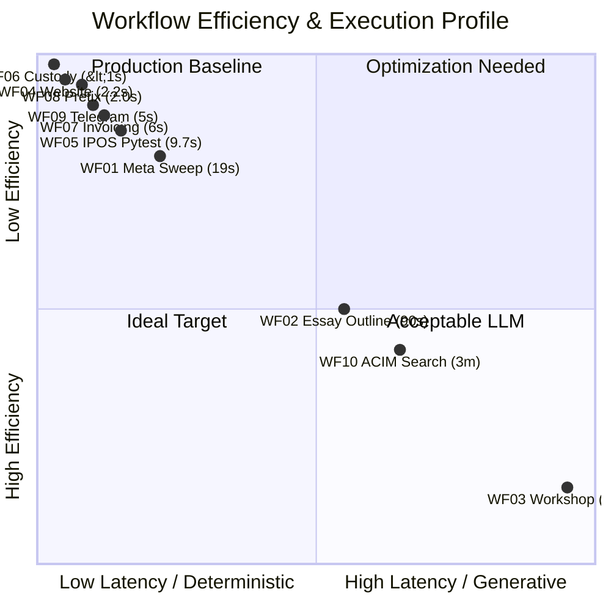

# Architecture Learnings & Remediation Index: Dual KI-Basis & Automation Engine

**Document ID:** ALR-000  
**Date:** 2026-09-07  
**Location:** `apex-meta/orchestration/new_final_v4/learnings_and_corrections/`  
**Authority:** Multi-Agent Orchestration Team (Antigravity CLI Lead, InfraAgent, IPOSAgent, ContentAgent)  

---

## 1. Executive Purpose

This dossier consolidates the architectural insights, latency bottlenecks, and structural remediations identified during the end-to-end multi-agent execution of the 10 sequential workflows defined in `00_META_PROGRAM_PLAN.md`.

While all 10 workflows passed 100% verification, real-world execution revealed critical performance disparities between **deterministic code execution** (<3 seconds) and **generative LLM evaluation** (up to 11.5 minutes). This repository provides actionable runbooks to:
1. Connect Tier 2 Hermes CLI to local high-speed models (Ollama `qwen3.5:9b`).
2. Implement resilient, zero-cost OpenRouter free-tier rotation with automatic failover.
3. Completely eradicate Windows-to-WSL 9p startup overhead.
4. Mandate chunked, staged generation to prevent SSE stream drops.

---

## 2. Dossier Document Structure

| Document | Focus & Domain | Target Architectural Level |
|---|---|---|
| [`00_INDEX_AND_EXECUTIVE_SUMMARY.md`](./00_INDEX_AND_EXECUTIVE_SUMMARY.md) | Executive summary, quadrant map & dossier index | All Tiers (Meta) |
| [`01_WORKFLOW_EFFICIENCY_MATRIX_AND_BOTTLENECK_AUDIT.md`](./01_WORKFLOW_EFFICIENCY_MATRIX_AND_BOTTLENECK_AUDIT.md) | Telemetry breakdown, execution times & actor audit | Tier 1 & Tier 2 Execution |
| [`02_ROOT_CAUSE_WF03_AND_WF10_LATENCY_ANALYSIS.md`](./02_ROOT_CAUSE_WF03_AND_WF10_LATENCY_ANALYSIS.md) | Analysis of 11.5m and 3m spikes (monolithic prompt, SSE drops) | Tier 2 Hermes Engine |
| [`03_LOCAL_OLLAMA_INTEGRATION_RUNBOOK.md`](./03_LOCAL_OLLAMA_INTEGRATION_RUNBOOK.md) | Windows Ollama bridge to WSL Hermes (`qwen3.5:9b`) | Tier 2 / Host OS Bridge |
| [`04_OPENROUTER_FREE_MODEL_POOL_AND_FALLBACK_ENGINE.md`](./04_OPENROUTER_FREE_MODEL_POOL_AND_FALLBACK_ENGINE.md) | Free-tier rotation (`:free`), quota tracking & failover | Tier 2 LLM Routing |
| [`05_EXT4_STARTUP_OPT_AND_9P_ZERO_TOUCH_GUIDE.md`](./05_EXT4_STARTUP_OPT_AND_9P_ZERO_TOUCH_GUIDE.md) | Elimination of `/mnt` startup check via `wsl --cd` | Tier 1 CLI Invocation |
| [`06_ACTIONABLE_LEARNINGS_AND_ARCHITECTURAL_INSTRUCTIONS.md`](./06_ACTIONABLE_LEARNINGS_AND_ARCHITECTURAL_INSTRUCTIONS.md) | Universal agent instructions for prompt chunking & templating | Tier 1 & Tier 2 Prompts |
| [`07_LEARNING_OVERENGINEERING_VS_LEAN_ARCHITECTURE.md`](./07_LEARNING_OVERENGINEERING_VS_LEAN_ARCHITECTURE.md) | Foundation principle: Deterministic code computes, LLM narrates | Architecture Governance |

---

## 3. Four-Tier Efficiency Spectrum

- **Tier A (Extreme / < 3s)**: WF04 (2.2s), WF08 (2.07s), WF06 (<1s). 100% deterministic code.
- **Tier B (High / 5s - 20s)**: WF05 (9.7s), WF07 (6s), WF09 (5s), WF01 (19s). Bounded local operations & REST APIs.
- **Tier C (Moderate / 1.5m - 3m)**: WF02 (90s), WF10 (3m). Cloud multi-turn agent tool-calling loops.
- **Tier D (High Latency Spike / > 10m)**: WF03 (11m 34s). Monolithic prompt + SSE stream drop.
