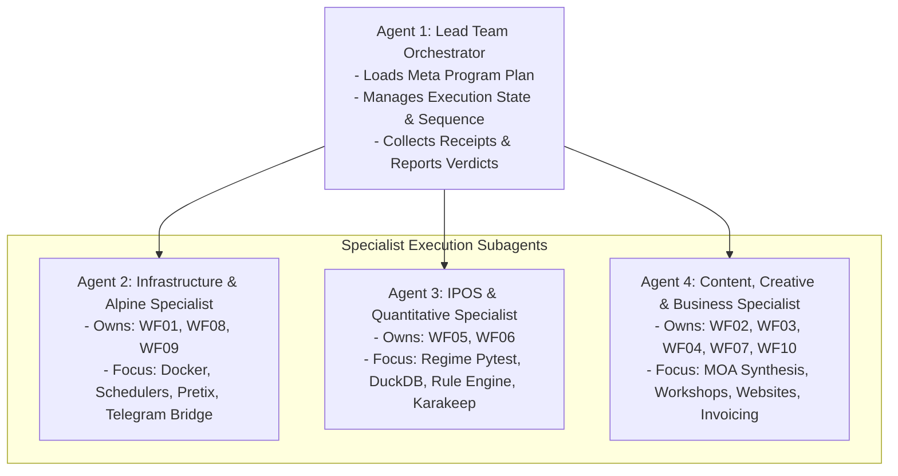

# Meta Program Plan: Full Architecture & Workflow Test Orchestration

**Document ID:** MPP-001  
**Date:** 2026-09-07  
**Authority:** Multi-Agent Orchestration Team (/teamwork-preview)  
**Scope:** Sequential, Non-Drifting Execution of 10 Isolated Workflow Test Plans across `apexai-os-meta`, `Investment`, `MasterOfArts`, `acim-secular`, and the Dual KI-Basis Stacks.

---

## 1. Executive Purpose & Governance

This Meta Program Plan is the single operational blueprint for the autonomous multi-agent orchestration team (`/teamwork-preview`). Its primary objective is to verify, test, and prove the entire three-tier architecture end-to-end without hallucinating efficiency or skipping verification gates.

### Orchestration Invariants:
1. **Sequential Execution**: Agents MUST execute each workflow plan iteratively and sequentially (WF01 through WF10). Do not attempt to run disparate pipelines concurrently to avoid race conditions.
2. **Explicit Evidence Capture**: Every test task must record actual command outputs, exit codes, and timestamps into an audit log (`TEST_RUN_RECEIPTS.md`).
3. **Strict Operator Pause Gates**: Agents must never guess credentials, invent tokens, or bypass required human design decisions. When a designated "Operator Interaction Point" is reached, the agent MUST halt and present the explicit question to the user.

---

## 2. Multi-Agent Team Roles & Responsibilities

---

## 3. Sequential Execution Schedule

| Step | Plan File | Domain | Primary Specialist | Target Stack / Environment |
|---|---|---|---|---|
| **Phase 1: Core OS & Infrastructure** |
| 01 | [`WF01_WEEKLY_META_ORCHESTRATION.md`](./WF01_WEEKLY_META_ORCHESTRATION.md) | Multi-Repo Governance | InfraAgent | All 4 Repos (`/root/workspaces/*`) + Host CLI |
| **Phase 2: IPOS Investment Operating System** |
| 02 | [`WF05_IPOS_WEEKLY_MACRO_REGIME.md`](./WF05_IPOS_WEEKLY_MACRO_REGIME.md) | Quantitative Macro | IPOSAgent | `Investment/` (.venv, DuckDB, Rules Engine) |
| 03 | [`WF06_IPOS_EVIDENCE_CUSTODY_WATCHDOG.md`](./WF06_IPOS_EVIDENCE_CUSTODY_WATCHDOG.md) | Research Custody | IPOSAgent | `Investment/` (Karakeep on ext4 + Hermes MCP) |
| **Phase 3: Content, Creative & Coaching** |
| 04 | [`WF02_CREATIVE_WRITING_SYNTHESIS.md`](./WF02_CREATIVE_WRITING_SYNTHESIS.md) | Creative Writing | ContentAgent | `MasterOfArts` (`Art/`, `Awakening/`) |
| 05 | [`WF03_TRANSCENDENTS_WORKSHOP_CONCEPT.md`](./WF03_TRANSCENDENTS_WORKSHOP_CONCEPT.md) | Masterclass Curriculum | ContentAgent | `acim-secular` -> `MasterOfArts/workshops/` |
| 06 | [`WF04_MOA_BUSINESS_WEBSITE_PIPELINE.md`](./WF04_MOA_BUSINESS_WEBSITE_PIPELINE.md) | Portfolio Staging | ContentAgent | `MasterOfArts/WEbsite/` + Nginx Edge :8084 |
| 07 | [`WF10_ACIM_SECULAR_CROSS_REFERENCE.md`](./WF10_ACIM_SECULAR_CROSS_REFERENCE.md) | Philosophical Corpus | ContentAgent | `acim-secular/` + Hermes SQLite Search |
| **Phase 4: Bookkeeping & Community Operations** |
| 08 | [`WF07_COACHING_LIFECYCLE_INVOICING.md`](./WF07_COACHING_LIFECYCLE_INVOICING.md) | Private Bookkeeping | ContentAgent | `MasterOfArts/Coaching/` + WSL2 KI-Basis |
| 09 | [`WF08_EQUINOX_PRETIX_TICKETING.md`](./WF08_EQUINOX_PRETIX_TICKETING.md) | Community Ticketing | InfraAgent | Windows Alpine Docker Desktop (`safer-space-ev`) |
| 10 | [`WF09_TELEGRAM_BOT_OFFLINE_INTAKE.md`](./WF09_TELEGRAM_BOT_OFFLINE_INTAKE.md) | Offline Message Queue | InfraAgent | `ki-basis/scripts/hermes_telegram_intake.py` |

---

## 4. Universal Pass / Fail & Remediation Protocol

1. **PASS**: Output matches expected criteria exactly. Receipt logged; proceed to next workflow.
2. **REMEDIATION (Self-Contained)**: Minor syntax, path, or configuration glitch. Specialist resolves issue, documents patch, and re-executes.
3. **HALT / OPERATOR INPUT**: Required API secret, external token (e.g. Telegram `@BotFather`), or business design choice missing. Subagent halts and prompts the operator directly with clear context.
