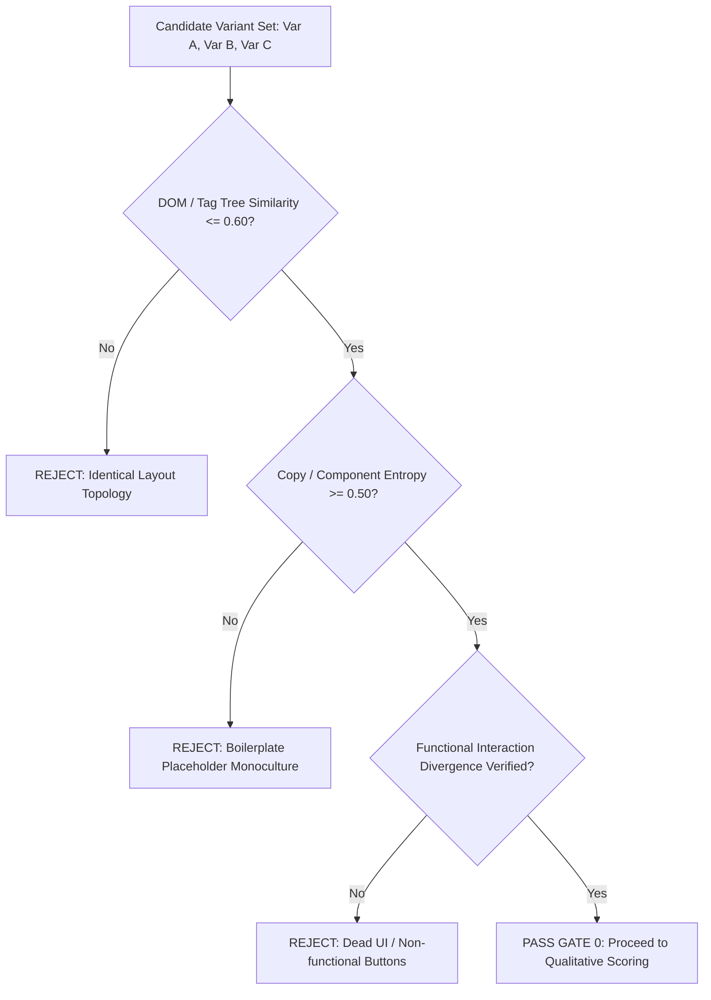

# Gate 0: Anti-Cosmetic Hard Gate & Structural Divergence Verification

**Document ID:** `TRAIN-002-ANTI-COSMETIC-HARD-GATES`  
**Target:** Reviewer Agents (R1–R4), Quality Assurance Hooks, CI/CD Gates  

---

## 1. Specification: Gate 0 Anti-Cosmetic Filter

Prior to scoring any artifact set on usability, aesthetic appeal, or alignment, the reviewing agent or test runner must execute **Gate 0**.



---

## 2. Automated Test Rule Schema

```yaml
gate_0_anti_cosmetic_rules:
  dom_tag_tree_similarity_max: 0.60
  component_archetype_overlap_max: 0.33
  text_jaccard_distance_min: 0.55
  on_rejection:
    verdict: "FAIL_COSMETIC_VARIATION"
    halt_execution: true
    remediation_required: "Re-generate variant using an alternative layout archetype."
```
