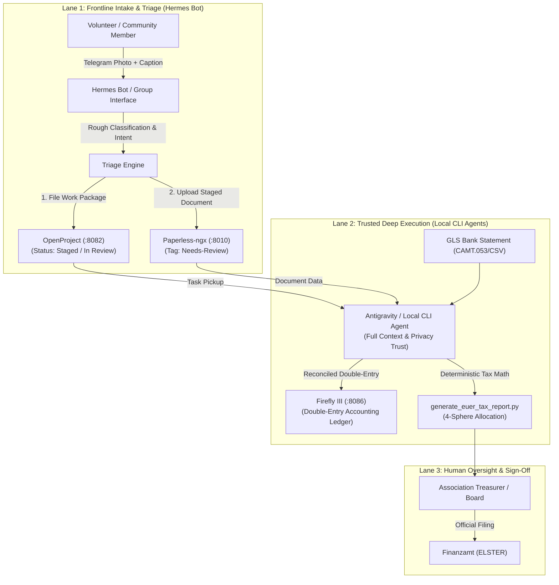

# KI Basis & Lika OS — Pragmatic Security & Tiered Governance
**Canonical Authority:** `ki-basis/AGENTS.md` • `ki-basis/AGENT-OPERATING-CONTEXT.md`  
**Governing Entities:** Safer Space e.V. • Temple of Lika • KI-Basis Stack  
**Scope:** Pragmatic Agent Tiering, Frontline Triage, Task Handoff, and Privacy Boundaries  
**Philosophy:** Usability First • Guard Against Over-Engineering • Tiered Autonomy  

---

## 1. Critical Assessment: Over-Correctiveness vs. Usable Reality

A security model that relies on **absolute prohibitions** ("an agent must never see any financial or personal data") fails the moment real humans interact with the platform:
- In production, a volunteer at a hardware store will take a photo of a Bauhaus receipt and message the Telegram bot: *"Hey, Sarah and I just bought 4 rolls of gaffer tape for €35 for the stage rigging."*
- An absolute prohibition forces the bot to throw a security error, refuse the message, or require complex client-side encryption that volunteers will not use.
- Over-engineering security purism cripples usability and creates shadow workflows (e.g. people reverting to unlogged WhatsApp DMs and lost paper slips).

### The Pragmatic Solution: The Tiered Intake & Handoff Pattern
Instead of crippling the frontline bot, we implement an **intake-and-triage hierarchy**:
1. **Frontline Triage (Hermes Bot):** Permissive, conversational, and forgiving. It accepts user receipts, ideas, and messages, understands rough intent, and **files a structured task**. It does *not* execute final financial mutations autonomously.
2. **Trusted Execution Enclave (Local CLI Agent / Antigravity):** High reasoning depth, local file access, and privacy trust. It picks up filed tasks, performs exact tax arithmetic, links bank accounts, and prepares filings.
3. **Human Governance (Treasurer / Board):** Final review and release of tax returns and major payments.

---

## 2. The Three Lanes of Agent Autonomy

| Autonomy Lane | Agent / Role | What It CAN Do | What It DOES NOT Do Alone |
| :--- | :--- | :--- | :--- |
| **Lane 1: Intake & Triage** | **Hermes Bot** (Telegram / OpenRouter) | - Ingest user messages, receipt photos, operational ideas, and questions. - Extract rough metadata (vendor, estimated total, date, team tag). - Chat informally with volunteers and answer event FAQs. - Stage files in Paperless (`Needs-Review`). - Create structured Work Packages in OpenProject. | - Does **not** modify bank accounts or post final ledger transactions in Firefly III. - Does **not** generate tax filings or calculate official VAT returns. - Does **not** make unreviewed legal or payment commitments. |
| **Lane 2: Trusted Execution** | **Local CLI Agents** (Antigravity, Codex, local scripts) | - Inspect filed tasks in OpenProject. - Reconcile receipts against GLS Bank statements. - Audit VAT rates (19% vs 7%) and allocate to the 4 statutory tax spheres. - Execute deterministic tax and EÜR generation scripts. | - Does not spam user chats or alter core governance rules without operator review. |
| **Lane 3: Human Oversight** | **Treasurer / Board** | - Approve quarterly VAT returns (*UStVA*) and annual *Anlage GemEÜR*. - Authorize banking transfers and legal contracts. | — |

---

## 3. Practical Intake & Triage Rules for Hermes

When volunteers or team leads interact with the Hermes bot:

1. **Permissive Acceptance:**
   - The bot welcomes whatever the user supplies: a blurry supermarket receipt, an idea for the cuddle puddle, an invoice PDF, or a question about shift times.
   - It never lectures the user about data sensitivity or refuses an input because it contains a name or store address.

2. **Rough Understanding, Not Deep Bookkeeping:**
   - Hermes identifies the rough category:
     - `Type: Expense / Receipt` (e.g. *"Bio-Großmarkt fruit purchase"*)
     - `Type: Idea / Improvement` (e.g. *"We need extra LED strip lights for the cage"*)
     - `Type: Shift / Operations Question` (e.g. *"When does Care Shift 2 start?"*)
   - If it is an expense, Hermes estimates the total and identifies the likely team (*Logistics*, *Care*, *Sound*).

3. **Handoff via Task Filing:**
   - Rather than attempting to balance the books, Hermes files a task:
     - **In OpenProject:** Creates a ticket under the appropriate team (e.g. `[Receipt Staged] Bio-Großmarkt Care Supplies €284.60`, Status: *New / Needs Review*).
     - **In Paperless-ngx:** Uploads the raw receipt image, applying the tag `STAGED-FOR-REVIEW`.
   - The bot replies to the user: *"Got it! Staged the Bio-Großmarkt receipt for the Care team. The treasurer / local system will review and reconcile it."*

---

## 4. Why This Eliminates Over-Engineering

1. **Zero Bot Frustration:** Users can use Telegram naturally without having to learn complex formatting, anonymization syntax, or security rules.
2. **Preserves Financial Integrity:** The association's balance sheet, tax calculations, and banking ledger remain 100% deterministic and isolated from LLM hallucinations or chat drift.
3. **Traceable Line of Custody:** Every receipt posted in chat gets a ticket in OpenProject and an immutable file in Paperless-ngx, making audit trails trivial for the annual EÜR.
4. **Leverages Local Strengths:** Hermes handles high-availability conversational intake; the local CLI handles heavy, trusted, privacy-sensitive operations.

---

## 5. Host & Network Enclave Security Standard

To support this pragmatic model safely, the infrastructure maintains clean network boundaries:
1. **Loopback-Only Service Surfaces:** OpenProject (`:8082`), Firefly III (`:8086`), Paperless-ngx (`:8010`), and Hermes API (`:8642`) bind strictly to `127.0.0.1`.
2. **Databases Internal-Only:** PostgreSQL and Valkey publish zero host ports.
3. **Container Isolation:** Hermes does not mount `/var/run/docker.sock`.
4. **Local Tax Execution:** All statutory calculations (`generate_euer_tax_report.py`) run as verified local scripts, ensuring zero dependence on external model calculations.
