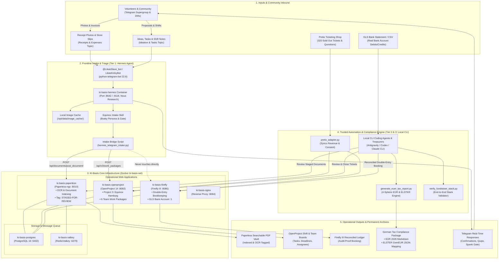

# Lika OS & KI-Basis System Architecture

A complete map of the current containerized stack, external inputs, internal service communication, automated bridges, and operational outputs for Safer Space e.V. and the Equinox 2026 event.

---

## 1. High-Level Architecture Diagram

---

## 2. Inventory of Stack Services

| Container Name | Service / Technology | Ports (Host:Container) | Primary Function | Connected Storage / Backends |
| :--- | :--- | :--- | :--- | :--- |
| **`ki-basis-postgres`** | PostgreSQL 16 Alpine | `Internal:5432` | Shared relational database for all apps | `postgres_data` volume |
| **`ki-basis-valkey`** | Valkey 8 (Redis) | `Internal:6379` | Asynchronous task broker & document queue | `valkey_data` volume |
| **`ki-basis-paperless`** | Paperless-ngx | `8010:8000` | Document ingestion, OCR, tag indexing (`STAGED-FOR-REVIEW`) | `paperless_media`, `paperless_data` |
| **`ki-basis-openproject`** | OpenProject 14 | `8082:80` | Event project management (Project 3: Equinox, 19+ work packages) | `openproject_assets` |
| **`ki-basis-firefly`** | Firefly III | `8086:8080` | Double-entry association ledger (GLS Bank e.V. account) | `firefly_upload` |
| **`ki-basis-nginx`** | Nginx Alpine | `8084:80` | Reverse proxy and centralized endpoint gateway | Docker network bridge |
| **`ki-basis-hermes`** | Nous Research Hermes Agent | `8642:8642`, `9119:9119` | Frontline messaging gateway, Telegram adapter, and AI intake | `hermes_data` (`/opt/data`) |

---

## 3. Data Inputs

1. **Telegram Community Messages (Frontline):**
   - **Receipt Photos:** Camera uploads of paper store slips, hardware invoices, catering receipts.
   - **Ideation Prompts:** Community proposals, volunteer shift requests, acoustic/sound coordination notes.
   - **Spank Reactions / Commands:** Interaction triggers (`👋`, `"behave"`, `"good bot"`) unlocking the playful gate.
2. **Pretix Ticketing Shop (Simulated & Real API):**
   - 320 sold-out tickets across 4 tiers (Supporter, Regular, Subsidized, Free Volunteer).
   - Gross ticket revenue (€11,300.00), payment fees, net bank payout (€10,833.90).
   - Attendee safety & consent question responses.
3. **Banking & Accounting Documents:**
   - Real-world PDF contracts (Venue Lease, Sixt 3.5t Transporter, Sound Equipment, DJ Bookings).
   - Bank statement debit feeds.

---

## 4. The Processing Pipeline (Tiered Autonomy Model)

The stack strictly enforces a **3-Tier Privacy and Safety Architecture**:

### Tier 1: Frontline Triage (Hermes Agent)
- **Scope:** Receives images and text from Telegram.
- **Action:**
  - Caches high-resolution images to `/opt/data/image_cache/`.
  - Calls `hermes_telegram_intake.py` to upload the receipt to Paperless-ngx with tag `STAGED-FOR-REVIEW` (Tag ID 6).
  - Creates a tracking ticket in OpenProject (`[Receipt Staged] ...`, Status: `New`).
  - Delivers playful, bratty feedback in chat.
- **Strict Boundary:** Hermes has **zero** write access to Firefly III. It cannot create financial transactions or alter accounting books.

### Tier 2: Automated Compilation & Compliance (Local CLI Scripts)
- **Scope:** Runs locally in a trusted Python environment.
- **Action:**
  - `pretix_adapter.py`: Ingests ticketing batches and maps fee structures.
  - `generate_euer_tax_report.py`: Aggregates reconciled transactions into the 4 non-profit German tax spheres:
    1. *Ideeller Bereich* (Donations, member dues, volunteer catering)
    2. *Zweckbetrieb* (Ticket sales, cultural sound & stage production)
    3. *Vermögensverwaltung* (Passive asset interest)
    4. *Wirtschaftlicher Geschäftsbetrieb* (Commercial bar margins)

### Tier 3: Human / Trusted Agent Ledger Finalization
- **Scope:** Association Treasurers & Local CLI Coding Agents (Antigravity / Codex).
- **Action:**
  - Reviews staged documents in Paperless-ngx.
  - Verifies exact VAT rate (7% / 19% / 0%) and vendor details.
  - Reconciles against official GLS Bank statement.
  - Formally books the double-entry transaction into Firefly III and marks the OpenProject task as `Closed`.

---

## 5. System Outputs & Deliverables

1. **Paperless-ngx Document Vault:** Permanent OCR-indexed digital archive of all event invoices and contracts.
2. **OpenProject Governance Boards:** Live Gantt charts, shift rosters, and work package boards across 6 operational teams.
3. **Firefly III Association Ledger:** Audit-proof double-entry transaction journal with category breakdowns.
4. **German Tax Package (Hamburg Finanzamt):**
   - Official 2026 EÜR Report (`EÜR_2026_Safer_Space_eV.md`).
   - ELSTER Form Mapping (`ELSTER_Anlage_GemEUR_2026_Mapping.json`).
5. **Telegram Event Channel:** Real-time conversational updates and interactive community assistance.
