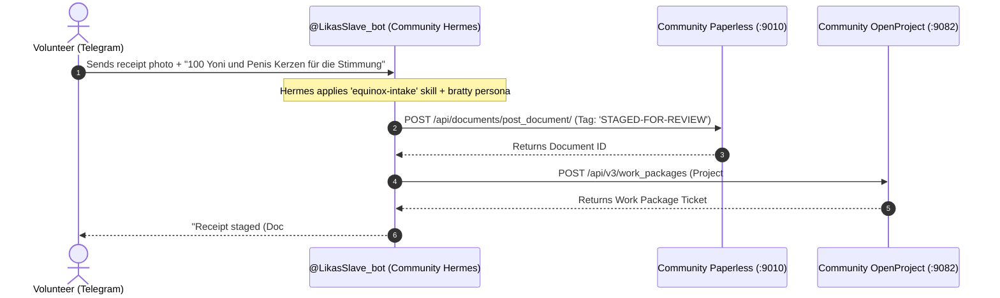

# Dual-Instance KI-Basis Architecture, Physical Storage & Security Isolation Specification

## 1. Executive Architectural Overview & Domain Separation

The **KI-Basis Platform** provides a containerized operational infrastructure on Windows 11 designed to host two completely independent operational domains side-by-side on a single Docker engine without cross-contamination[^compose-spec]:

```
                                  DOCKER ENGINE (Hyper-V Backend)
                                                 │
                   ┌─────────────────────────────┴─────────────────────────────┐
                   ▼                                                           ▼
    [INSTANCE 1: PRIVATE ENTREPRENEURSHIP]                      [INSTANCE 2: LIKA COMMUNITY]
    • Project: ki-basis-private                                 • Project: ki-basis-community
    • Config:  ki-basis/.env.private                            • Config:  ki-basis/.env.community
    • Ports:   Port Band 808x                                   • Ports:   Port Band 908x
      - OpenProject: :8082 (Private consulting)                   - OpenProject: :9082 (Safer Space e.V.)
      - Paperless:   :8010 (Private tax receipts)                 - Paperless:   :9010 (Event receipts)
      - Firefly III: :8086 (Commercial accounts)                  - Firefly III: :9086 (GLS Bank / Lika)
      - Hermes AI:   :8642 / :9119 (CLI & Local API)              - Hermes AI:   :9642 / :9219 (Telegram Bot)
    • Network: ki-basis-private-net                             • Network: ki-basis-community-net
    • Volumes: ki-basis-private-postgres-data                   • Volumes: ki-basis-community-postgres-data
               ki-basis-private-paperless-data                             ki-basis-community-paperless-data
```

### Institutional Domains:
1. **Private Entrepreneurship (`ki-basis-private`):** Commercial ventures, private consulting, client contracts, commercial bank accounts, proprietary tax receipts, and personal project management[^env-private].
2. **Community Operations (`ki-basis-community`):** Non-profit community operations (Safer Space e.V. / Lika), Equinox Fundraiser campaigns, Pretix ticketing integration, public volunteer receipts, and statutory non-profit bookkeeping (4-sphere EÜR & ELSTER GemEUR)[^env-community].

---

## 2. Physical Storage Reality vs. Git Blueprint Files

A critical distinction must be maintained between the **plain-text declarative blueprints** in the Git workspace and the **actual software binaries and databases** running on the host machine[^docker-vhdx]:

```
┌────────────────────────────────────────────────────────────────────────────────────────┐
│ 1. IN THE GIT REPOSITORY (C:\GitDev\apexai-os-meta\ki-basis\):                         │
│    • Contains ONLY plain-text declarative recipes and scripts:                         │
│      - compose.yaml (multi-tenant container definitions)                              │
│      - scripts/start-ki-basis.ps1 (lifecycle orchestration script)                     │
│      - docker/nginx/default.conf (reverse proxy routing definition)                    │
│      - .env.private & .env.community (local passwords — strictly .gitignored)          │
│    • NO application binaries, NO databases, NO documents exist in Git.                 │
└────────────────────────────────────────────────────────────────────────────────────────┘

┌────────────────────────────────────────────────────────────────────────────────────────┐
│ 2. PHYSICAL DISK STORAGE (C:\ProgramData\DockerDesktop\vm-data\DockerDesktop.vhdx):    │
│    • A dedicated 33.4 GB Hyper-V virtual hard disk on your Windows C: drive.           │
│    • Houses all 7 application container runtimes (PostgreSQL, Ruby, Python, PHP, Nginx)│
│    • Houses all persistent Docker Named Volumes:                                       │
│      - Postgres relational tables and pgvector embeddings                              │
│      - Scanned PDF files, OCR search indexes, and document thumbnails                  │
│      - OpenProject database records, attachments, and work package boards              │
│      - Hermes conversation memories, skills, and configuration state                   │
└────────────────────────────────────────────────────────────────────────────────────────┘
```

> [!IMPORTANT]
> **Data Protection & Git Safety:** Real credentials, database records, and scanned PDF documents are **never committed to Git**. Lines 49 & 52 of `.gitignore` strictly ignore all `.env` files. The database files live strictly inside the virtual disk image `DockerDesktop.vhdx`[^docker-vhdx].

---

## 3. The Dual-Instance Isolation Matrix

The two stacks achieve 100% data and process isolation through Docker Compose project namespacing, dedicated port bands, isolated bridge networks, and separate volume allocations[^compose-spec]:

| Architectural Component | Private Entrepreneurship (`ki-basis-private`) | Community Operations (`ki-basis-community`) | Isolation Guarantee |
| :--- | :--- | :--- | :--- |
| **Compose Project** | `ki-basis-private` | `ki-basis-community` | Independent lifecycle & container names |
| **Environment File** | `ki-basis/.env.private` | `ki-basis/.env.community` | Dedicated secret keys & DB passwords |
| **Docker Network** | `ki-basis-private-net` (`172.28.0.0/16`) | `ki-basis-community-net` (`172.29.0.0/16`) | Kernel-level Linux network namespace isolation |
| **PostgreSQL DB** | `ki-basis-private-postgres` (`:5432` internal) | `ki-basis-community-postgres` (`:5432` internal) | Zero shared database tables or roles |
| **Valkey Queue/Cache**| `ki-basis-private-valkey` (`:6379` internal) | `ki-basis-community-valkey` (`:6379` internal) | Separate job queues & cache keys |
| **Paperless-ngx** | `http://127.0.0.1:8010` | `http://127.0.0.1:9010` | Separate document storage & OCR pipelines |
| **OpenProject** | `http://127.0.0.1:8082` | `http://127.0.0.1:9082` | Separate work packages, projects & users |
| **Firefly III** | `http://127.0.0.1:8086` | `http://127.0.0.1:9086` | Separate bank accounts, ledgers & budgets |
| **Nginx Edge Proxy** | `http://127.0.0.1:8084` | `http://127.0.0.1:9084` | Dedicated edge entrypoints |
| **Hermes Gateway** | `http://127.0.0.1:8642` (API) / `:9119` (UI) | `http://127.0.0.1:9642` (API) / `:9219` (UI) | Separate agent states & memories |
| **Telegram Bot** | **DISABLED** (Internal CLI only) | **ACTIVE** (`@LikasSlave_bot`) | Community-only public intake interface |

---

## 4. Hermes AI Agent Separation & Execution Boundaries

Each instance runs its own dedicated **Hermes AI Agent** container with different execution capabilities, skills, and network permissions[^compose-spec]:

```
┌────────────────────────────────────────────────────────┐  ┌────────────────────────────────────────────────────────┐
│         PRIVATE HERMES (ki-basis-private-hermes)       │  │       COMMUNITY HERMES (ki-basis-community-hermes)     │
├────────────────────────────────────────────────────────┤  ├────────────────────────────────────────────────────────┤
│ • Mode: Local REST API & Operator CLI assistant        │  │ • Mode: Autonomous Telegram Frontline Gateway          │
│ • Network: ki-basis-private-net                        │  │ • Network: ki-basis-community-net                      │
│ • Telegram: DISABLED (Avoids bot token collisions)     │  │ • Telegram: ACTIVE (@LikasSlave_bot / LikasKinkyBot)   │
│ • Volume: ki-basis-private-hermes-data                 │  │ • Volume: ki-basis-community-hermes-data               │
│ • Scope:                                               │  │ • Scope:                                               │
│   - Private consulting repositories & research         │  │   - Equinox Fundraiser (Project #3 in OpenProject)     │
│   - Commercial accounting queries                      │  │   - Staging volunteer receipts in Paperless            │
│   - Personal project task automation                   │  │   - Autonomous Telegram triage via equinox-intake skill│
│ • Permission Boundary:                                 │  │ • Permission Boundary:                                 │
│   - Zero connection to Telegram                        │  │   - ZERO network route to ki-basis-private-net         │
│   - Zero access to Community DBs                       │  │   - ZERO access to private consulting ledgers or DBs   │
└────────────────────────────────────────────────────────┘  └────────────────────────────────────────────────────────┘
```

---

## 5. Security Architecture & Threat Model

### Threat 1: Compromise or Malicious Input to Telegram Bot
* **Scenario:** An external user sends a prompt injection, malicious payload, or exploit to `@LikasSlave_bot` on Telegram.
* **Mitigation:**
  1. `ki-basis-community-hermes` lives exclusively on `ki-basis-community-net`. It has no route, hostname, or IP access to the private database `ki-basis-private-postgres` or private services.
  2. The bot operates under the **Tiered Autonomy Model**: it can only create triage tickets (`STAGED-FOR-REVIEW`) and cannot autonomously mutate Firefly ledger balances.
  3. No private personal data, commercial bank tokens, or proprietary credentials exist in `ki-basis-community-hermes-data`.

### Threat 2: Local Wi-Fi Network Eavesdropping
* **Scenario:** Other computers or phones on your home/office Wi-Fi attempt to connect to OpenProject, Paperless, or the database.
* **Mitigation:**
  1. All published host ports are bound strictly to the `127.0.0.1` loopback interface.
  2. PostgreSQL (`:5432`) and Valkey (`:6379`) publish **zero host ports** and are accessible only across internal Docker networks.
  3. External connections from the LAN receive `Connection Refused`.

### Threat 3: Unintentional Public Sharing
* **Scenario:** Collaborators need access to Lika Community project boards via Tailscale.
* **Mitigation:**
  1. Tailscale Funnel / Serve is configured **only** for Community ports (`9082` for OpenProject, `9010` for Paperless).
  2. Private ports (`8082`, `8010`, `8086`) remain unmapped and locked to localhost.

---

## 6. Real-World User Stories & Workflows

### User Story 1: Volunteer Uploads an Equinox Candle Receipt via Telegram

* **Security Validation:** The transaction executed 100% inside `ki-basis-community-net`. Zero private bank accounts or commercial consulting files were involved.

---

### User Story 2: Operator Manages Private Consulting Finances
1. The operator opens `http://127.0.0.1:8086` in their local browser.
2. The operator creates a commercial consulting invoice and logs incoming client retainer fees.
3. Firefly III writes records directly to `ki-basis-private-postgres-data`.
4. **Security Validation:** The community Telegram bot has no API keys, no network route, and no visibility into this transaction.

---

## 7. Operational Control & Lifecycle Runbook

All lifecycle management is performed using [`ki-basis/scripts/start-ki-basis.ps1`](file:///c:/GitDev/apexai-os-meta/ki-basis/scripts/start-ki-basis.ps1)[^startup-script] and [`ki-basis/scripts/stop-ki-basis.ps1`](file:///c:/GitDev/apexai-os-meta/ki-basis/scripts/stop-ki-basis.ps1):

### Starting Instances:
```powershell
# Start ONLY Private Entrepreneurship (Port Band 808x)
.\ki-basis\scripts\start-ki-basis.ps1 -Instance private

# Start ONLY Community Operations (Port Band 908x)
.\ki-basis\scripts\start-ki-basis.ps1 -Instance community

# Start BOTH instances concurrently (Total 14 containers, zero port conflicts)
.\ki-basis\scripts\start-ki-basis.ps1 -Instance all
```

### Stopping Instances:
```powershell
# Stop Private instance cleanly
.\ki-basis\scripts\stop-ki-basis.ps1 -Instance private

# Stop Community instance cleanly
.\ki-basis\scripts\stop-ki-basis.ps1 -Instance community

# Stop all running KI-Basis containers
.\ki-basis\scripts\stop-ki-basis.ps1 -Instance all
```

### Health & Status Verification:
```powershell
# Inspect all running containers across both namespaces
docker ps --format "table {{.Names}}\t{{.Status}}\t{{.Ports}}"

# Verify Community Edge Proxy health endpoint
Invoke-WebRequest -Uri "http://127.0.0.1:9084/healthz" -UseBasicParsing

# Verify Private Edge Proxy health endpoint
Invoke-WebRequest -Uri "http://127.0.0.1:8084/healthz" -UseBasicParsing
```

---

[^compose-spec]: Defined in `ki-basis/compose.yaml` using dynamic `${COMPOSE_PROJECT_NAME}` variable interpolation for multi-tenant isolation.
[^env-private]: Configured in `ki-basis/.env.private` on Port Band `808x` with isolated database and Hermes credentials.
[^env-community]: Configured in `ki-basis/.env.community` on Port Band `908x` with `@LikasSlave_bot` Telegram integration.
[^docker-vhdx]: Persistent Docker VM storage located on host at `C:\ProgramData\DockerDesktop\vm-data\DockerDesktop.vhdx`.
[^startup-script]: Verified in `ki-basis/scripts/start-ki-basis.ps1`.
[^okf-spec]: Follows Google Cloud Open Knowledge Format (OKF) v0.2 specification standards.
