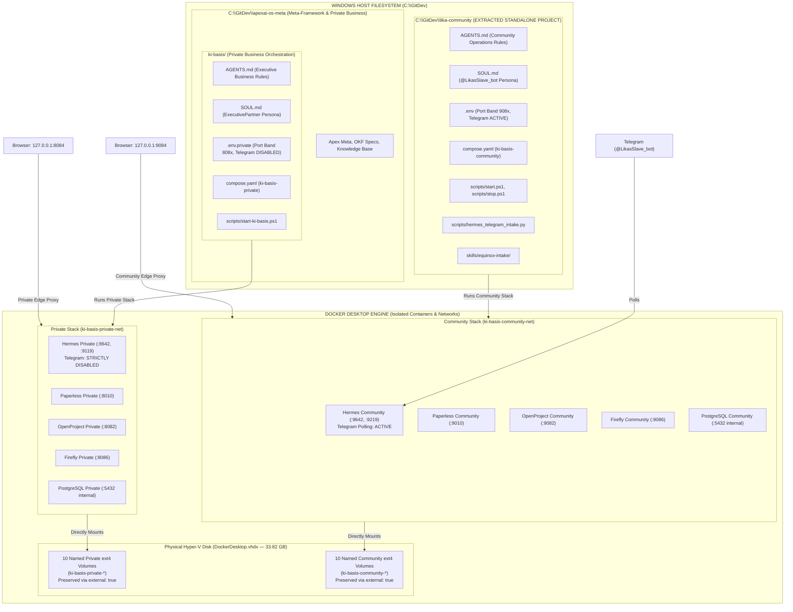

# Implementation Plan: Lika Community Extraction & Repo-Integrated Private Stack

Extract **ONLY** the Lika Community stack (`@LikasSlave_bot`, Safer Space e.V., Equinox 2026 Fundraiser) into a standalone external directory (`C:\GitDev\lika-community\`). Keep the **Private Business stack and Private Hermes** integrated directly inside `apexai-os-meta\ki-basis\` as one orchestration system among others.

---

## User Review Required

> [!IMPORTANT]
> **Key Architecture Alignment:**
> 1. **Zero New Clones for Private:** No `private-business` clone or external directory is created. Private business, tax ledgers, commercial consulting, and Private Hermes remain natively in `C:\GitDev\apexai-os-meta\ki-basis\`.
> 2. **Single Extraction Target:** Only `C:\GitDev\lika-community\` is initialized outside the repo.
> 3. **Complete Persona & Context Isolation:** Removing the community files from `apexai-os-meta` completely cleanses the meta-framework repo of `@LikasSlave_bot`, volunteer chats, and community receipts.

---

## User Stories & Operational Flows

### Story 1: Working on Private Business & Meta-Framework (In-Repo)
- **As an** entrepreneur, consultant, and meta-framework developer,
- **I open** `C:\GitDev\apexai-os-meta\` in Antigravity IDE,
- **I run** `ki-basis` via `.\ki-basis\scripts\start-ki-basis.ps1` (or local compose on Port Band 808x),
- **So that** Private Hermes acts as an executive partner and orchestration assistant, accesses private commercial notes, tax EÜR, and contracts on Port Band 808x, with Telegram strictly disabled, and **never** encounters community volunteer chatter, `@LikasSlave_bot`, or Equinox receipts.

### Story 2: Working on Lika Community / Safer Space e.V. (Standalone Project)
- **As a** community coordinator or volunteer manager for Safer Space e.V.,
- **I open** `C:\GitDev\lika-community\` in Antigravity IDE (or double-click `.\scripts\start.ps1`),
- **So that** the AI immediately scopes to `@LikasSlave_bot` (`SOUL.md`), routes only to Port Band 908x, manages Equinox tickets and volunteer receipts in Community Paperless and Community OpenProject, and physically **cannot** see, index, or access private business consulting, bank ledgers, or meta-framework code.

---

## Architecture Matrix: Where Software, Runtimes & Folders Live

| Component | In-Repo Private Stack (`apexai-os-meta\ki-basis\`) | Extracted Community Stack (`C:\GitDev\lika-community\`) |
| :--- | :--- | :--- |
| **Host Location** | `C:\GitDev\apexai-os-meta\ki-basis\` | `C:\GitDev\lika-community\` |
| **Workspace Role** | Core orchestration system & private business | Dedicated volunteer & community project |
| **AI Instruction Fence** | `ki-basis\AGENTS.md` (Executive business & system scope) | `lika-community\AGENTS.md` (Community ops & Equinox scope) |
| **Hermes Persona** | `ki-basis\SOUL.md`: ExecutivePartner | `lika-community\SOUL.md`: LikasKinkyBot (`@LikasSlave_bot`) |
| **Hermes Runtime** | Container: `ki-basis-private-hermes` (:8642 API / :9119 UI) | Container: `ki-basis-community-hermes` (:9642 API / :9219 UI) |
| **Telegram Polling** | **DISABLED** (`TELEGRAM_BOT_TOKEN=""`) | **ENABLED** (`@LikasSlave_bot` polling group `-1004343753692`) |
| **Paperless Instance** | Container: `ki-basis-private-paperless` (`http://127.0.0.1:8010`) | Container: `ki-basis-community-paperless` (`http://127.0.0.1:9010`) |
| **OpenProject Instance**| Container: `ki-basis-private-openproject` (`http://127.0.0.1:8082`) | Container: `ki-basis-community-openproject` (`http://127.0.0.1:9082`) |
| **Firefly III Instance** | Container: `ki-basis-private-firefly` (`http://127.0.0.1:8086`) | Container: `ki-basis-community-firefly` (`http://127.0.0.1:9086`) |
| **PostgreSQL Engine** | Container: `ki-basis-private-postgres` (Internal :5432) | Container: `ki-basis-community-postgres` (Internal :5432) |
| **Docker Storage** | Named Volumes: `ki-basis-private-*` (inside VHDX) | Named Volumes: `ki-basis-community-*` (inside VHDX) |

---

## Mermaid Architecture Diagram

---

## Step-by-Step Implementation Actions

### Phase 1: Create the Standalone Community Project (`C:\GitDev\lika-community\`)
1. Create root directory `C:\GitDev\lika-community\`.
2. Author dedicated community files:
   - `AGENTS.md`: Instruction boundary fencing the AI strictly to Safer Space e.V. and Port Band 908x.
   - `SOUL.md`: Dedicated `@LikasSlave_bot` persona (bratty server pet / kinky receipt triage).
   - `.env`: Configured for Port Band 908x with `TELEGRAM_BOT_TOKEN`, `OPENROUTER_API_KEY`, and community DB passwords.
   - `compose.yaml`: Standalone compose definition for `ki-basis-community` with all 10 volumes declared as `external: true` (pointing directly to existing `ki-basis-community-*` ext4 volumes).
   - `scripts/start.ps1` & `scripts/stop.ps1`: 1-click startup and shutdown scripts.
   - `scripts/hermes_telegram_intake.py`: Pinned receipt and task intake daemon.
   - `skills/equinox-intake/`: Move the community skill definition here.
   - `docker/nginx/default.conf`: Community-only edge dashboard on port 9084.
   - `docs/workflows/WF08_EQUINOX_PRETIX_TICKETING.md`: Integrated from Investment (Equinox Pretix intake & settlement).
   - `docs/workflows/WF09_TELEGRAM_BOT_OFFLINE_INTAKE.md`: Integrated from Investment (Telegram receipt & task intake protocol).
3. Initialize independent Git repository: `git init` in `C:\GitDev\lika-community\`.

### Phase 2: Relocate Workflow Files from `Investment` & Cleanse `Investment`
Relocate the workflow files created in `C:\GitDev\Investment\05_blueprint\research\2026-08-28-modular-rebuild\workflow_plans\` to their true home repositories:
- `00_META_PROGRAM_PLAN.md` -> `C:\GitDev\apexai-os-meta\docs\plans\`
- `WF01_WEEKLY_META_ORCHESTRATION.md` -> `C:\GitDev\apexai-os-meta\docs\workflows\`
- `WF02_CREATIVE_WRITING_SYNTHESIS.md` -> `C:\GitDev\MasterOfArts\docs\workflows\`
- `WF03_TRANSCENDENTS_WORKSHOP_CONCEPT.md` -> `C:\GitDev\MasterOfArts\workshops\plans\`
- `WF04_MOA_BUSINESS_WEBSITE_PIPELINE.md` -> `C:\GitDev\MasterOfArts\WEBSITE\`
- `WF07_COACHING_LIFECYCLE_INVOICING.md` -> `C:\GitDev\MasterOfArts\Coaching\`
- `WF08_EQUINOX_PRETIX_TICKETING.md` -> `C:\GitDev\lika-community\docs\workflows\`
- `WF09_TELEGRAM_BOT_OFFLINE_INTAKE.md` -> `C:\GitDev\lika-community\docs\workflows\`
- `WF10_ACIM_SECULAR_CROSS_REFERENCE.md` -> `C:\GitDev\acim-secular\docs\workflows\`
- **RETAIN IN INVESTMENT:** `WF05_IPOS_WEEKLY_MACRO_REGIME.md` and `WF06_IPOS_EVIDENCE_CUSTODY_WATCHDOG.md`.
- Delete the moved files from `Investment` to eliminate cross-repo confusion.

### Phase 3: Cleanse the In-Repo Private Stack (`C:\GitDev\apexai-os-meta\ki-basis\`)
1. Update `ki-basis/SOUL.md`: Set permanently to `ExecutivePartner` (business consulting, financial analysis, professional demeanor).
2. Update `ki-basis/AGENTS.md`: Strip out `@LikasSlave_bot` and community references; scope strictly to commercial ventures, tax accounting, and system orchestration.
3. Archive or remove community-specific scripts and skills from `ki-basis/` (`skills/equinox-intake/` and `scripts/hermes_telegram_intake.py` belong solely in `lika-community`).
4. Ensure `ki-basis/.env.private` remains the active private configuration, binding strictly to Port Band 808x with Telegram disabled.

### Phase 4: Zero-Data-Loss Verification & Smoke Test
1. Confirm existing volumes inside `DockerDesktop.vhdx` (33.82 GB) are safe and untouched.
2. Launch Community stack from `C:\GitDev\lika-community\` using `.\scripts\start.ps1`.
   - Verify `http://127.0.0.1:9084` -> Lika Community Edge opens.
   - Verify Paperless (`:9010`) -> Displays existing Safer Space e.V. receipts.
3. Launch Private stack from `ki-basis\` using `.\scripts\start-ki-basis.ps1` (or `docker compose -p ki-basis-private --env-file .env.private up -d`).
   - Verify `http://127.0.0.1:8084` -> Private Business Edge opens.
   - Verify Paperless (`:8010`) -> Displays existing private consulting and tax receipts.
4. Verify AI scoping:
   - In `C:\GitDev\lika-community\`: AI responds as `@LikasSlave_bot` with zero knowledge of private business.
   - In `C:\GitDev\apexai-os-meta\`: AI responds as professional system assistant / ExecutivePartner with zero community bot interference.
