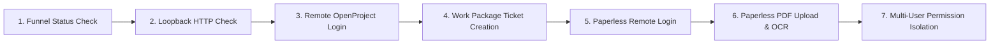

# Engineering Specification & Implementation Plan: Exposing KI-Basis Stack via Tailscale Funnel (Public HTTPS)

**Document Status:** DRAFT — OPERATOR REVIEW REQUIRED (Planning Only)  
**Target Platform:** Windows 11 Host + Docker Desktop (Hyper-V / WSL2 Backend)  
**Target Services:** OpenProject (`:8082`), Paperless-ngx (`:8010`), Hermes Dashboard (`:9119`)  
**Access Model:** Model B — Public HTTPS Web Links via Tailscale Funnel  

---

## 1. Executive Summary & Objective

The objective is to provide external collaborators and team members with secure, zero-install HTTPS web links to access **OpenProject** (project management), **Paperless-ngx** (document archive), and optionally **Hermes Dashboard** running in Docker on the operator's Windows 11 machine.

Collaborators will not need to install Tailscale, create Tailscale accounts, or configure VPNs. They will access the services directly through standard web browsers via **Tailscale Funnel** under the operator’s MagicDNS domain:
* **OpenProject:** `https://<node-name>.ts.net` (Port 443)
* **Paperless-ngx:** `https://<node-name>.ts.net:8443` (Port 8443)
* **Hermes Dashboard:** `https://<node-name>.ts.net:10000` (Port 10000)

---

## 2. Architectural Blueprint & Port Topology

### A. The Core Routing Mechanism

Tailscale Funnel routes public traffic from Tailscale's global Anycast Edge relays into the local Windows Tailscale daemon, which then proxies connections over the local loopback (`127.0.0.1`) into Docker Desktop.

```
┌─────────────────────────────────────────────────────────────────────────────┐
│                             PUBLIC INTERNET                                 │
│                                                                             │
│   Collaborator Browser 1                     Collaborator Browser 2         │
│   (https://<node>.ts.net)                    (https://<node>.ts.net:8443)   │
└───────────────────────┬──────────────────────────────────┬──────────────────┘
                        │                                  │
                        ▼                                  ▼
┌─────────────────────────────────────────────────────────────────────────────┐
│                    TAILSCALE ANYCAST EDGE SERVERS                           │
│   • Let's Encrypt TLS Termination                                           │
│   • WireGuard Encrypted Inbound Tunnel                                      │
└───────────────────────────────────────┬─────────────────────────────────────┘
                                        │ (WireGuard)
                                        ▼
┌─────────────────────────────────────────────────────────────────────────────┐
│                     OPERATOR WINDOWS 11 HOST                                │
│                                                                             │
│   Tailscale Daemon (Funnel Engine)                                          │
│   ├─ Port 443   ─────────► http://127.0.0.1:8082 (OpenProject)              │
│   ├─ Port 8443  ─────────► http://127.0.0.1:8010 (Paperless-ngx)            │
│   └─ Port 10000 ─────────► http://127.0.0.1:9119 (Hermes Dashboard)         │
│                                                                             │
│   ┌─────────────────────────────────────────────────────────────────────┐   │
│   │                      DOCKER ENGINE / HYPER-V                        │   │
│   │                                                                     │   │
│   │   [ki-basis-openproject]      [ki-basis-paperless]  [ki-basis-hermes]│  │
│   │      (Host Port :8082)           (Host Port :8010)   (Host Port :9119)│ │
│   │              ▲                           ▲                  ▲       │   │
│   │              └───────────────────────────┴──────────────────┘       │   │
│   │                                   │                                 │   │
│   │                         [ki-basis-postgres]                         │   │
│   │                         [ki-basis-valkey]                           │   │
│   └─────────────────────────────────────────────────────────────────────┘   │
└─────────────────────────────────────────────────────────────────────────────┘
```

### B. Why Port-Based Mapping (443 / 8443 / 10000) is Strictly Required

> [!IMPORTANT]
> **Technical Constraint:** Tailscale Funnel **only** permits public traffic on three ports: **443**, **8443**, and **10000**.
> 
> Attempting to use path-based routing (e.g. `https://<node>.ts.net/openproject` and `https://<node>.ts.net/paperless` on port 443) causes **severe frontend routing failures**:
> 1. OpenProject is an Angular/Rails Single Page App (SPA) that compiles static assets with root-relative paths (`/assets/...`). Subpaths break stylesheet loading unless deep base-href rewriting is implemented.
> 2. Paperless-ngx frontend assets (`/static/...`) and API endpoints (`/api/...`) fail under subpaths without complex reverse proxy rewrites.
> 
> **The Solution:** We dedicate:
> * **Port 443** $\rightarrow$ OpenProject (`127.0.0.1:8082`)
> * **Port 8443** $\rightarrow$ Paperless-ngx (`127.0.0.1:8010`)
> * **Port 10000** $\rightarrow$ Hermes Dashboard (`127.0.0.1:9119`)

---

## 3. Exhaustive Step-by-Step Execution Plan

### Step 1: Install Tailscale & Enable Funnel in Admin Console
1. Install Tailscale on Windows:
   ```powershell
   winget install Tailscale.Tailscale
   ```
2. Log into Tailscale Admin Console (`https://login.tailscale.com/admin/settings/general`).
3. Enable **MagicDNS** and **HTTPS Certificates**.
4. In **Access Controls (ACL policy)**, ensure the `funnel` node attribute is enabled:
   ```json
   {
     "nodeAttrs": [
       {
         "target": ["autogroup:member"],
         "attr": ["funnel"]
       }
     ]
   }
   ```

---

### Step 2: Configure Application Environment Variables

Before exposing the services, the Docker containers must be configured to trust the incoming Tailscale domain and handle HTTPS redirection correctly.

#### 1. OpenProject Adjustments (`ki-basis/.env` & `ki-basis/compose.yaml`):
```env
# OpenProject Host Configuration
OPENPROJECT_HOST__NAME=<your-tailscale-node>.ts.net
OPENPROJECT_HTTPS=true
```

#### 2. Paperless-ngx Adjustments (`ki-basis/.env` & `ki-basis/compose.yaml`):
```env
# Paperless CSRF & Host Trust Configuration
PAPERLESS_URL=https://<your-tailscale-node>.ts.net:8443
PAPERLESS_CSRF_TRUSTED_ORIGINS=https://<your-tailscale-node>.ts.net:8443,http://127.0.0.1:8010
PAPERLESS_CORS_ALLOWED_HOSTS=https://<your-tailscale-node>.ts.net:8443,http://127.0.0.1:8010
```

#### 3. Firefly III (Internal Protection):
* Keep Firefly III on `127.0.0.1:8086` **unexposed** to Funnel to keep association financials strictly local.

---

### Step 3: Recreate Docker Containers
Apply the environment changes to the running stack:
```powershell
docker compose -p ki-basis -f C:\GitDev\apexai-os-meta\ki-basis\compose.yaml up -d --force-recreate
```

---

### Step 4: Configure Tailscale Funnel Routing

Run in an **Administrator PowerShell** window:

```powershell
# 1. Map Port 443 (HTTPS) to OpenProject
tailscale funnel --bg --https=443 http://127.0.0.1:8082

# 2. Map Port 8443 (HTTPS) to Paperless-ngx
tailscale funnel --bg --https=8443 http://127.0.0.1:8010

# 3. Map Port 10000 (HTTPS) to Hermes Dashboard (Optional)
tailscale funnel --bg --https=10000 http://127.0.0.1:9119
```

Verify active routing state:
```powershell
tailscale funnel status
```

---

## 4. Comprehensive Risk Analysis & Failure Modes Matrix

| Risk Category | Failure Mode | Probability | Impact | Battle-Proven Mitigation |
| :--- | :--- | :---: | :---: | :--- |
| **Authentication & CSRF** | Django returns `403 CSRF verification failed` when team logs into Paperless. | **Medium** | **High** | Pre-configure `PAPERLESS_CSRF_TRUSTED_ORIGINS` with the exact HTTPS port `https://<node>.ts.net:8443`. |
| **Host Header Mismatch** | OpenProject returns `400 Bad Request` or infinite redirect loops. | **High (if unset)** | **High** | Set `OPENPROJECT_HOST__NAME=<node>.ts.net` and `OPENPROJECT_HTTPS=true` before starting Funnel. |
| **Laptop Power & Sleep** | Laptop closes or sleeps, dropping all collaborator connections instantly. | **High** | **Medium** | Inform team of working hours / uptime windows; configure Windows "Sleep when plugged in" settings. |
| **Public Exposure** | Unauthorized users find the `<node>.ts.net` URL on the internet. | **Low** | **High** | 1. Enforce strong, unique passwords for all OpenProject/Paperless accounts.<br>2. Restrict non-admin user roles in OpenProject (Member / Viewer only).<br>3. Keep Firefly III strictly off Funnel. |
| **Tailscale Bandwidth Limits** | Large PDF document uploads saturate Tailscale DERP relays. | **Low** | **Low** | Tailscale Funnel supports standard document sizes up to tens of MBs; DERP relays easily handle non-profit receipts. |
| **Windows Firewall Block** | Windows Defender blocks Tailscale from proxying to loopback ports. | **Low** | **Medium** | Tailscale runs locally with SYSTEM privileges; loopback traffic (`127.0.0.1`) is permitted by default on Windows. |

---

## 5. Feasibility & Success Probability Assessment

* **Overall Technical Feasibility:** **95% (High)**
  * Tailscale Funnel is a mature, production-grade feature supported natively on Windows.
  * Preserves Docker Desktop's `127.0.0.1` isolation without requiring risky host network reconfiguration.
* **Effort Required:** ~15–20 minutes total operator time.
* **Ongoing Financial Cost:** **0.00 € (Completely Free)**.

---

## 6. Seven-Point Verification & Test Suite

Once configured, the following sequential verification tests must be executed:



1. **Test 1: Funnel Status Verification**
   * Command: `tailscale funnel status`
   * *Pass Criteria:* Shows `443 -> 127.0.0.1:8082`, `8443 -> 127.0.0.1:8010`, and `10000 -> 127.0.0.1:9119` with status `Active`.
2. **Test 2: Localhost Loopback Integrity**
   * Command: `Invoke-WebRequest -Uri "http://127.0.0.1:8082" -UseBasicParsing`
   * *Pass Criteria:* Returns `200 OK`.
3. **Test 3: External OpenProject Access & TLS**
   * Action: Open `https://<node-name>.ts.net` from a mobile phone on cellular LTE (disconnect from local Wi-Fi).
   * *Pass Criteria:* Valid HTTPS green lock; OpenProject login page displays with stylesheets and images.
4. **Test 4: OpenProject Work Package Ticket Creation**
   * Action: Log in and create a test ticket in Project #3 (Fundraiser).
   * *Pass Criteria:* Ticket saves with ID; no CSRF token mismatch.
5. **Test 5: External Paperless-ngx Access**
   * Action: Open `https://<node-name>.ts.net:8443` from the mobile phone on LTE.
   * *Pass Criteria:* Paperless login page renders over HTTPS.
6. **Test 6: Paperless PDF Intake & CSRF Form Test**
   * Action: Log in and upload a test receipt PDF via the web UI.
   * *Pass Criteria:* Upload completes with `200 OK` (no `403 CSRF` error), OCR task enqueues in Valkey.
7. **Test 7: Multi-User Role Isolation Test**
   * Action: Create a secondary user account in OpenProject with role `Member` (non-admin). Log in with this account.
   * *Pass Criteria:* Secondary user can view and comment on project tasks, but cannot access system administration settings.

---

## 7. Rollback & Instant Disconnect Protocol

If the operator ever wants to revoke all public access immediately:

1. **Turn off Tailscale Funnel in 1 second:**
   ```powershell
   tailscale funnel reset
   ```
2. **Result:** All public HTTPS endpoints are instantly severed at the Tailscale edge. The local Docker stack remains 100% functional on `127.0.0.1`.
