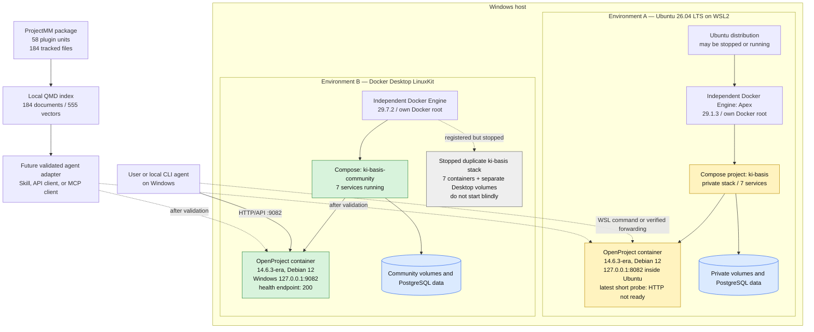
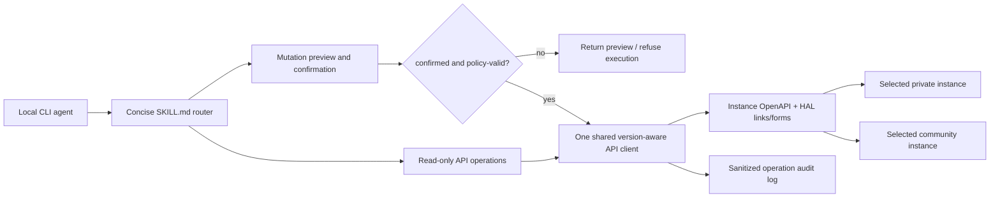

# Handover purpose

This is the starting packet for the next AI. Its job is to determine how the imported ProjectMM OpenProject package should become a portable, maintainable capability that local CLI agents can use against the installed OpenProject systems. The next AI is expected to analyze and propose before changing runtime infrastructure or enabling writes.

This document is an OKF 0.2 concept inside the bundle rooted at [index.md](index.md). OKF makes the knowledge navigable and machine-readable; it does not by itself turn the imported handlers into an Agent Skill.[^okf-spec]

# Executive readback

1. There are **two independent Docker Engines**, not merely two Compose projects on one engine.
2. The Ubuntu WSL2 distribution and its Docker objects still exist when Ubuntu is shown as `Stopped`. `Stopped` means its Linux processes are not executing; it does not mean its filesystem, Docker configuration, images, containers, or volumes were deleted.
3. Starting Ubuntu from the CLI starts its systemd Docker service. Containers configured with `restart: unless-stopped` can then start automatically.
4. Docker Desktop currently runs the healthy **community** stack on port band `90xx`.
5. Ubuntu WSL2 contains the **private** stack on port band `80xx`. During the latest short inspection its OpenProject container was running, but HTTP on `8082` was not ready before the inspection ended.
6. Docker Desktop also retains a **stopped duplicate private `ki-basis` stack** with separate Docker Desktop volumes. Do not start that duplicate casually.
7. Both observed OpenProject containers use OpenProject 14.6.3-era images and Debian 12 inside the OpenProject container. “Alpine environment” is not an accurate name for the Docker Desktop host: Docker Desktop uses LinuxKit, while individual nginx/Valkey images may be Alpine-based.
8. The imported package contains 58 AnythingLLM-style plugin units and is indexed locally by QMD. It is not yet a portable CLI Agent Skill or a safe write path.
9. Native OpenProject MCP is not available on these 14.6.3 instances. Official native MCP arrived much later, in OpenProject 17.2, as an Enterprise add-on.[^openproject-17-2][^openproject-mcp]
10. Authored architecture documents and the live machine disagree about the chosen dual-instance topology. Preserve that conflict for an operator decision; do not silently declare either side authoritative.

# Mental model: what “stopped” means

| Layer | What it is | What remains when stopped? |
|---|---|---|
| Windows host | The physical/host operating system | Everything on disk |
| WSL2 Ubuntu distribution | A Linux userspace and virtualized kernel environment | Ubuntu filesystem, settings, installed Docker, Compose files |
| Docker Engine | Daemon managing containers, networks, images, and volumes | Its data under its own Docker root remains on disk |
| Compose project | A named group of containers, networks, and volumes derived from YAML | Definitions and created Docker objects remain |
| Container | A runnable process plus container filesystem/configuration | Container object remains unless removed |
| Volume | Persistent application/database storage | Data remains independently of a running container |

Therefore “Ubuntu is stopped” and “the Ubuntu Docker/OpenProject system exists” are simultaneously true. A command such as `wsl -d Ubuntu ...` starts the distribution. In this installation that also starts Docker, and the private Compose containers have restart policies that bring them back.

# Verified live topology



## Engine A: Ubuntu WSL2 private system

Snapshot observations from 2026-09-25:

| Property | Observed value |
|---|---|
| WSL distribution | `Ubuntu`, WSL version 2 |
| OS | Ubuntu 26.04 LTS |
| Docker Engine name | `Apex` |
| Docker version | 29.1.3 |
| Docker root | `/var/lib/docker` |
| Compose project | `ki-basis` |
| Compose definition | `/mnt/c/GitDev/apexai-os-meta/ki-basis/compose.yaml` |
| Containers | 10 total; 7 running; 3 stopped at the refreshed snapshot |
| OpenProject | `ki-basis-openproject`, image `openproject/openproject:14` |
| OpenProject port | Ubuntu loopback `127.0.0.1:8082 -> 80` |
| Restart policy | `unless-stopped` |
| Latest OpenProject probe | connection reset / HTTP `000` about 30 seconds after startup |

The Compose definition and private operating context are the grounded configuration sources.[^private-compose][^private-context] The failed short HTTP probe is not enough to conclude that the installation is broken: the stack had only just auto-started and OpenProject initialization can take longer. It is enough to conclude that a CLI agent must use readiness checks and must not equate `container running` with `application ready`.

Accessing the Ubuntu Docker socket as the default WSL user returned permission denied in the latest inspection; `wsl -d Ubuntu -u root -- docker ...` worked. The next agent should diagnose group/session membership before prescribing `sudo` or permanently changing permissions.

## Engine B: Docker Desktop community system

Snapshot observations from 2026-09-25:

| Property | Observed value |
|---|---|
| Docker context | `desktop-linux` |
| Docker Engine name | `docker-desktop` |
| Docker version | 29.7.2 |
| Host implementation | Docker Desktop LinuxKit |
| Docker root | `/var/lib/docker` inside Docker Desktop |
| Compose project | `ki-basis-community` |
| Compose definition | `C:\GitDev\lika-community\compose.yaml` |
| Containers | 14 total; 7 running; 7 stopped |
| Community OpenProject | `ki-basis-community-openproject` |
| Community port | Windows loopback `127.0.0.1:9082 -> 80` |
| Health endpoint | `GET /health_checks/default` returned 200 |
| API root without credentials | `GET /api/v3` returned 401, as expected |
| Native MCP path | `GET /mcp` returned 404 |

The community repository explicitly assigns the `90xx` port band and provides start/stop scripts.[^community-compose][^community-agents][^community-readme]

## Stopped duplicate on Docker Desktop

Docker Desktop also reports Compose project `ki-basis` as `exited(7)`, using the private Compose file at `C:\GitDev\apexai-os-meta\ki-basis\compose.yaml`. Its seven stopped containers and Docker Desktop volumes are distinct from the private objects stored by the Ubuntu engine.

Do not run a broad `docker compose up` for this duplicate until an operator chooses which private installation is authoritative. Possible consequences include port collision on `8082`, two divergent private databases, and an agent writing to the wrong instance.

# Authored architecture versus observed runtime

The following conflict must be surfaced, not resolved by assumption:

- Authored private state describes Docker Desktop/Hyper-V as the target and says there should be one Docker Engine.[^docker-target-state]
- The architecture material says Alpine is an image choice, not the platform architecture.[^alpine-architecture]
- The dual-instance decision document selected two Compose projects on one engine and rejected separating private Ubuntu WSL2 from community Docker Desktop.[^dual-instance-adr]
- The live machine on 2026-09-25 has two engines: private on Ubuntu WSL2 and community on Docker Desktop. Docker Desktop additionally retains a stopped private duplicate.

The community repository is newer than those September 4–7 architecture documents. That chronology may explain the divergence, but it does not itself authorize a topology decision.

# Imported ProjectMM package

The tracked package is at `docs/ProjectMM/openproject/openproject/` and was pushed to `origin/master` in commit `b1860a8a256e4c9e4007f2430a956dc1e28c2aa8`.[^projectmm-commit]

## Inventory

| Item | Verified count |
|---|---:|
| Tracked files | 184 |
| `plugin.json` manifests | 58 |
| `handler.js` implementations | 58 |
| `package.json` files | 58 |
| Shared confirmation tests | 2 files |
| Node test assertions | 11 passing |

The package contains one plugin unit per OpenProject API surface. It targets AnythingLLM plugins.[^projectmm-package]

It is not a cross-client Agent Skill.[^agent-skills]

## What is useful

- Wide API-surface coverage across projects, work packages, users, relations, time entries, meetings, wiki pages, and other OpenProject resources.
- Machine-readable plugin manifests and explicit handler entry points.
- A shared two-phase write-confirmation helper.
- Tests for the shared confirmation logic and work-package behavior.
- HAL formatting notes and a smoke-test matrix.
- JavaScript is suitable for AST-aware QMD chunking.

## Blocking defects before agent adoption

### 1. Missing portable Agent Skill entry point

There is no root `SKILL.md` describing activation, operation selection, credentials, read-only behavior, and confirmation rules. Fifty-eight manifests are not a routing layer. The Agent Skills pattern expects concise progressive disclosure: a small `SKILL.md` with detailed references and scripts loaded only when needed.[^agent-skills]

### 2. Inconsistent API-client implementation

All 58 handlers import the confirmation helper, but only `openproject-root/handler.js` imports `_lib/opFetch.js`. The other 57 handlers implement direct `Authorization`/Basic-auth request logic independently. This creates duplicated behavior for authentication, errors, headers, pagination, retry, timeouts, and redaction.

### 3. Broken shared-client dependency

`_lib/opFetch.js` imports `../../../platform/api-client/apiClient.js`, which is not present in this package. The nominal shared path is therefore not portable as imported.

### 4. Write-confirmation contract conflict

Every plugin manifest describes `confirmed=true` as required for `POST`, `PATCH`, `PUT`, and `DELETE`. `_lib/opSkillWriteConfirm.js` intentionally requires confirmation only for `PATCH`, `PUT`, and `DELETE`, allowing `POST` without confirmation. Creation can be consequential, so the receiving AI must not guess which contract is intended.

Required operator decision:

- **Option A — recommended safe default:** confirm all mutations, including POST.
- Option B: permit explicitly classified, reversible POST operations without a second turn.
- Option C: use risk tiers per operation, supported by deterministic policy metadata.

Until decided, a new adapter should default to read-only and refuse mutating calls.

### 5. Incomplete smoke-test assets

`_docs/smoke-matrix.md` refers to `scripts/smoke-openproject-skills.cjs` and `CATALOG/plugin.json`; neither exists in the imported package. The two existing unit tests do not validate live API compatibility across the 58 plugins.

### 6. Version skew

The package appears broader/newer than the installed OpenProject 14.6.3 API surface. Every operation must be checked against the instance-provided OpenAPI document (`/api/v3/spec.json` or `/api/v3/spec.yml`) rather than assumed from current online documentation. OpenProject API v3 is HAL/HATEOAS: `_links` and form endpoints describe actions available to the authenticated user.[^openproject-api]

### 7. Native MCP is not an immediate escape hatch

Current OpenProject documentation describes `/mcp`, token/OAuth authentication, response formats, and tool enablement.[^openproject-mcp] The installed 14.6.3 community instance returns 404 at `/mcp`. That is consistent with MCP being introduced in 17.2.[^openproject-17-2] An upgrade is a separate infrastructure/product decision and may require Enterprise licensing.

# QMD index already prepared

QMD 2.8.3 is installed globally on Windows and its agent skill is installed at `C:\Users\gehma\.agents\skills\qmd\SKILL.md`.

| Property | Value |
|---|---|
| Collection | `leela-openproject-skills` |
| URI | `qmd://leela-openproject-skills/` |
| Source path | `C:\GitDev\Leela-Cloud-2026\docs\ProjectMM\openproject\openproject` |
| Mask | `**/*.{md,js,json,yaml,yml}` |
| Indexed documents | 184 |
| Embedded chunks/vectors | 555 |
| AST-aware JavaScript chunking | active |
| Context scopes | `/`, `/_lib`, `/_docs`, `/openproject-work-packages` |
| Index database | `C:\Users\gehma\.cache\qmd\index.sqlite` |

QMD combines lexical and semantic retrieval and supports AST-aware code chunking.[^qmd] Those features make it useful for this handler-heavy packet.

Useful commands:

```powershell
qmd status
qmd collection show leela-openproject-skills
qmd search "write confirmation policy" -c leela-openproject-skills
qmd query "How do handlers authenticate and execute mutations?" -c leela-openproject-skills
qmd get qmd://leela-openproject-skills/_lib/opSkillWriteConfirm.js
qmd update
qmd embed --chunk-strategy auto
```

QMD is a local retrieval index, not authority and not a replacement for opening the full source file before changing behavior. Its configuration is global/user-local and is not currently reproduced by repository bootstrap code.

# Recommended target capability

The receiving AI should evaluate three paths and recommend one explicitly:

| Path | Benefits | Costs/risks | Current fit |
|---|---|---|---|
| A. Portable Agent Skill over a shared API client | Works with local CLI agents; version-aware; can preserve confirmation controls | Requires consolidation and a real router/catalog | **Recommended for OpenProject 14.6.3** |
| B. Thin local MCP compatibility server over API v3 | Standard tool discovery for MCP-capable clients | New service to secure and maintain; must not pretend to be native OpenProject MCP | Consider only if multiple MCP clients need it |
| C. Upgrade to OpenProject 17.2+ native MCP | Official integration and permission-aware tools | Upgrade risk, Enterprise-add-on/licensing, migration, separate operator approval | Future option, not an implementation shortcut |

Recommended logical flow:



The shared client should own base-URL selection, authentication, redaction, TLS policy, timeouts, retries, pagination, HAL parsing, form validation, errors, capability discovery, confirmation, and audit metadata. OpenProject administration controls API-token availability and maximum page size.[^openproject-api-admin] The adapter must discover or configure those values rather than hard-code them.

# Security and operational constraints

- Never print, index, commit, or place API tokens/passwords in this handover.
- Read secrets from ignored environment/configuration surfaces already owned by each stack.
- Default to the community instance for harmless integration tests only if the operator accepts that target; do not infer that “community” means disposable.
- Treat private and community base URLs as explicit named profiles. Never select by whichever port happens to respond first.
- Require instance identity verification before writes: expected profile, base URL, API root identity, and optionally a configured instance marker.
- Use least-privilege OpenProject accounts/tokens. Authorization is determined by the authenticated user and reflected in HAL action links.[^openproject-api]
- Put destructive and high-impact writes behind explicit confirmation and preferably a dry-run/preview.
- Do not write directly to either PostgreSQL database.
- Do not start the stopped Docker Desktop private duplicate as part of package analysis.
- Do not modify the two external Compose repositories from this Leela handover task without separately granted scope.

# Reproduction commands

These commands avoid secret values. Commands that start Ubuntu are marked because inspection itself changes runtime state.

## Docker Desktop

```powershell
docker context show
docker info --format 'name={{.Name}} version={{.ServerVersion}} os={{.OperatingSystem}} root={{.DockerRootDir}}'
docker compose ls -a
docker ps -a --format 'table {{.Names}}\t{{.Image}}\t{{.Status}}\t{{.Ports}}'
Invoke-WebRequest -UseBasicParsing http://127.0.0.1:9082/health_checks/default
```

## Ubuntu WSL2

`wsl -l -v` is observational. `wsl -d Ubuntu ...` starts Ubuntu if stopped and may auto-start its Docker services.

```powershell
wsl -l -v
wsl -d Ubuntu -u root -- docker info
wsl -d Ubuntu -u root -- docker compose ls -a
wsl -d Ubuntu -u root -- docker ps -a
wsl -d Ubuntu -- curl -fsS --max-time 30 http://127.0.0.1:8082/health_checks/default
```

Do not use `docker compose down -v`; `-v` removes persistent volumes. Do not “clean up” the duplicate until its data ownership and retention requirements are known.

# Receiving-agent work order

## Phase 1 — ground and identify

1. Read this handover, then open every cited originating artifact needed for a decision.
2. Refresh both runtime inventories and record exact timestamps.
3. Determine whether Ubuntu remains running after the initiating WSL command exits.
4. Wait through a bounded startup window and diagnose the private OpenProject readiness path if it still fails.
5. Identify both OpenProject versions from authenticated API roots or container labels without exposing credentials.
6. Inventory Docker volumes and Compose labels on both engines; compare identities and sizes without dumping database contents.
7. Present the live-versus-authored topology conflict to the operator with a recommendation. Do not migrate or delete anything yet.

## Phase 2 — evaluate the package

1. Use QMD to rank relevant files, then open full source files for conclusions.
2. Generate a deterministic catalog of 58 plugins: operations, HTTP methods, endpoint templates, required arguments, mutation level, pagination behavior, and installed-version compatibility.
3. Validate manifests, JavaScript syntax, module dependencies, and handler exports.
4. Test the shared confirmation contract and enumerate every POST operation affected by the policy conflict.
5. Diff handler implementations to find duplicated client logic and one-off behavior.
6. Compare endpoints to each instance’s own `/api/v3/spec.json` or `/api/v3/spec.yml`.
7. Propose the minimal portable Skill structure; do not copy all implementation detail into `SKILL.md`.

## Phase 3 — design before implementation

Deliver an operator-reviewable design containing:

- selected topology and explicit instance profiles;
- chosen integration path (Agent Skill, compatibility MCP, or upgrade/native MCP);
- shared client interface;
- operation catalog and progressive-disclosure structure;
- authentication and secret flow;
- read/write risk classes and confirmation state machine;
- version/capability discovery;
- test pyramid from offline contract tests through opt-in live mutation tests;
- audit logging and redaction;
- rollback and migration boundaries;
- disposition of the stopped Docker Desktop private duplicate.

# Decisions the next AI must not invent

1. Which private deployment is authoritative: Ubuntu WSL2 or the stopped Docker Desktop copy?
2. Is the intended long-term topology one Docker Engine or two?
3. Must every POST require explicit confirmation?
4. May live tests create and delete disposable OpenProject data, and in which instance/project?
5. Should the deliverable remain a CLI Agent Skill, expose a compatibility MCP server, or depend on an approved OpenProject upgrade?
6. Which local CLI agents/clients must be supported first?
7. Is an OpenProject Enterprise license available or intended for native MCP?

# Completion criteria for the follow-on analysis

The analysis is complete only when another engineer or agent can:

- name the two Docker Engines and the three Compose registrations without confusing them;
- explain why “stopped” does not mean “absent”;
- select an OpenProject instance explicitly and verify its identity before writes;
- retrieve the relevant package code through QMD and then ground conclusions in full files;
- account for all 58 plugin units;
- state which operations are compatible with installed OpenProject 14.6.3;
- state one unambiguous write-confirmation policy;
- run offline tests without secrets;
- run opt-in live read tests safely;
- describe exactly what operator approval is still required before infrastructure changes or mutations.
