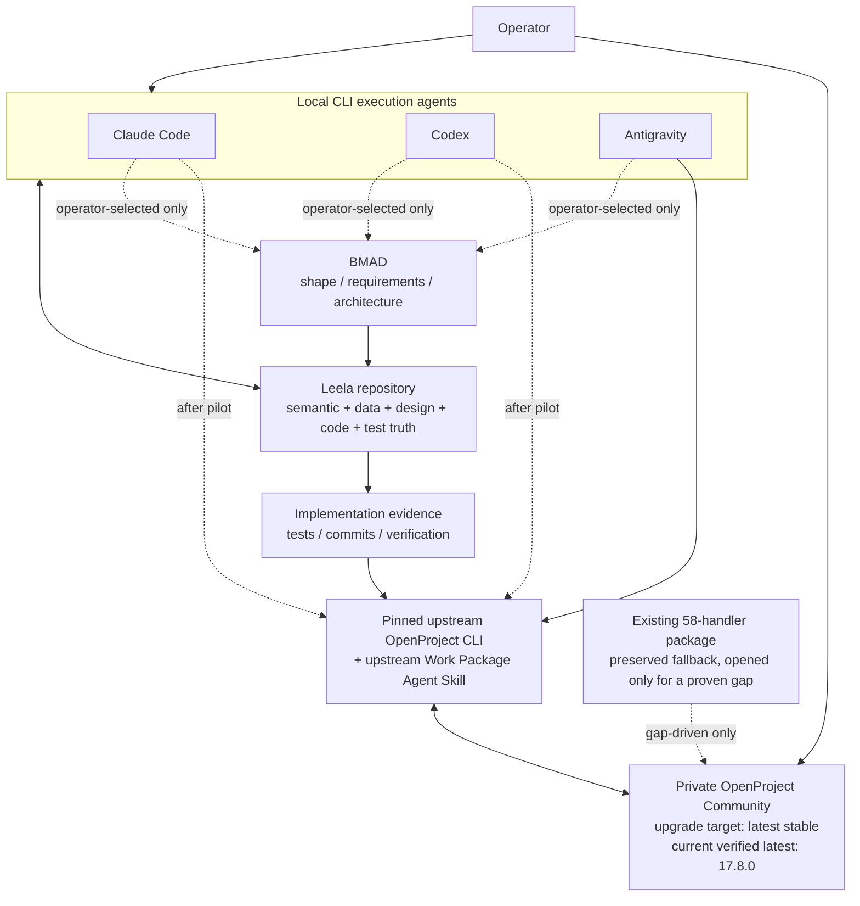

# Target state

> **✅ TARGET ACHIEVED — execution diverged on method (2026-09-28).** The accepted *target* (private
> OpenProject as Leela PM authority, on 17.8, with a dedicated agent identity) is realized, but two accepted
> *methods* changed in execution: **D3's in-place upgrade → a fresh 17.8 install** (`leela-op178-openproject`;
> v14 retired/deleted), and the integration is a **portable custom API-v3 skill**, not the upstream CLI. **D2's
> dedicated least-privilege identity is still open** (pilot uses the admin token) → program T13.
> **→ See `../DECISION-2026-09-28-pilot-execution-reconciliation.md`.**

This file is the current operator-accepted target for the Leela OpenProject integration workstream.

The prior handover remains required evidence for the existing machine topology, package inventory, QMD state, known defects, and migration hazards. It is no longer the place to infer unresolved target choices that the operator has now decided.

## Operator decisions accepted 2026-09-25

```yaml
operator_decisions:

  D1_openproject_host:
    status: accepted
    decision: private_openproject_is_the_Leela_PM_target
    current_reported_location:
      environment: Ubuntu_WSL2_private_stack
      compose_project: ki-basis
      approximate_existing_version: 14.6.3
      current_private_endpoint: "127.0.0.1:8082 inside Ubuntu"
    consequence:
      - community_9082_is_not_the_target_PM_authority
      - stopped_Docker_Desktop_private_duplicate_must_not_become_authoritative_by_accident

  D2_account_isolation:
    status: accepted
    decision: create_dedicated_Leela_OpenProject_agent_account
    intent:
      - account_and_token_are_used_only_for_Leela
      - do_not_reuse_broad_admin_credentials_for_agent_operation
      - scope_permissions_to_Leela_projects_and_required_operations
    exact_username: TBD
    exact_role_permissions: implementation_research_required

  D3_openproject_upgrade:
    status: accepted
    decision: upgrade_private_OpenProject_to_latest_stable_Community_release
    verified_current_latest_on_2026_09_25: "17.8.0"
    rule: >
      Before execution, re-check the current stable release and official supported
      upgrade path. Do not use a floating latest tag without understanding the
      migration path, backups, rollback boundary, and API changes.
    current_external_fact:
      release_date: "2026-09-02"
      source: https://www.openproject.org/docs/release-notes/17-8-0/

  D4_agent_rollout:
    status: accepted
    decision: prove_one_CLI_agent_first_then_generalize
    eventual_targets:
      - Claude_Code
      - Codex
      - Antigravity
    pilot_agent: Antigravity
    rule: >
      Prove the upstream CLI and Agent Skill route in Antigravity before
      generalizing it or adapting the existing handler package.

  D5_live_testing:
    status: accepted
    decision: prefer_live_end_to_end_testing_over_hypothetical_only_validation
    target: private_OpenProject
    safety_boundary:
      - create_or_select_explicit_Leela_test_project_before_mutation_tests
      - verify_instance_identity_before_every_write_test
      - never_use_the_stopped_duplicate
      - never_write_directly_to_PostgreSQL
      - do_not_expose_or_commit_tokens

  D6_write_autonomy:
    status: open
    question: >
      Which writes may an agent execute automatically versus requiring operator
      confirmation?
    note: >
      The operator has not selected a global policy yet. Do not invent one.
    temporary_policy_for_implementation_research:
      - reads_may_be_automated
      - live_mutation_tests_require_explicit_test_scope
      - destructive_or_high_impact_operations_require_operator_confirmation
      - preserve_the_existing_confirmation_conflict_as_a_design_issue

  D7_orchestration_target:
    status: accepted
    decision: OpenProject_plus_BMAD_plus_existing_CLI_agents
    roles:
      OpenProject:
        owns:
          - persistent_operational_PM
          - work_packages
          - hierarchy
          - priority
          - status
          - dependencies
          - blockers
          - milestones_and_schedules
          - Gantt
          - Kanban_and_visual_PM
          - operator_visible_progress
      BMAD:
        owns_method_for:
          - clarification
          - product_analysis
          - requirements
          - User_Story_refinement
          - architecture_reasoning
          - UX_reasoning
          - decomposition_when_selected
      CLI_agents:
        execute:
          - repository_research
          - PM_reads_and_writes
          - BMAD_workflows
          - implementation
          - tests
          - evidence_return_to_OpenProject
      repository:
        owns:
          - accepted_product_semantics
          - User_Stories_and_operator_decisions
          - cross_feature_contracts
          - data_architecture
          - design_and_UX_truth
          - code
          - tests
          - verification_and_materialization
    framework_invocation_policy:
      status: accepted
      decision: operator_explicit_only
      note: >
        BMAD may be used only when the operator explicitly selects it for the
        current task. The agent may recommend it but must not invoke it automatically.

  D8_MCP:
    status: accepted_target_boundary
    decision: MCP_is_not_required_for_v1
    facts:
      MCP_protocol: free_open_standard
      OpenProject_official_MCP: paid_Enterprise_add_on
    primary_target_path: >
      Antigravity -> pinned upstream OpenProject Agent Skill -> pinned compatible
      OpenProject CLI -> OpenProject REST API -> private OpenProject
    optional_future_path:
      - free_Community_MCP_adapter_if_it_proves_material_value
    rule: >
      Do not add an MCP server merely because MCP is standardized.
```

# Current target architecture



## Plain-language operating model

1. OpenProject is the operator-visible project-management cockpit and persistent work graph.
2. The repository remains the source of detailed Leela product, architecture, design, code, and verification truth.
3. A CLI agent starts from a selected OpenProject Work Package.
4. The OpenProject Agent Skill retrieves the Work Package, hierarchy, dependency and status information.
5. The agent follows qualified repository references and loads only the Leela truth required for the current task.
6. BMAD is available only when the operator explicitly selects it for the current task.
7. The CLI agent performs the actual repository work.
8. Evidence is written back to OpenProject and the Work Package state is updated according to the accepted write policy.
9. A fresh agent must be able to resume from OpenProject plus repository references without relying on chat history.

# Required starting evidence

The receiving AI MUST first read:

1. this file;
2. `../openproject-cli-agent-handover/index.md`;
3. `../openproject-cli-agent-handover/openproject-cli-agent-handover.md`;
4. `../openproject/` only through bounded, task-specific retrieval;
5. repository `AGENTS.md`;
6. `docs/orchestration/LEARNINGS_anti_drift.md`.

Do not reconstruct the environment from prior chat memory.

## Facts inherited from the prior evidence handover

Treat these as evidence to refresh, not permanent assumptions:

- two installed/running OpenProject environments were observed;
- two separate Docker Engines were observed;
- a stopped duplicate private stack exists on Docker Desktop;
- community OpenProject was reachable on Windows localhost `:9082`;
- private OpenProject existed in Ubuntu WSL2 around `:8082`;
- both observed OpenProject instances were approximately 14.6.3;
- the imported ProjectMM package contains 58 API handler units / manifests;
- QMD indexed 184 documents and 555 vectors;
- the imported package is not yet a portable Agent Skill;
- the package contains known shared-client, confirmation, smoke-test and version-skew defects.

# External facts to re-verify at execution time

## OpenProject

Current verification date: 2026-09-25.

- Latest stable release shown by official OpenProject release notes: 17.8.0.
- OpenProject 17.8 recommends updating to the newest version.
- Community 17.8 exposes Work Package relations in table columns.
- Community 17.3+ includes Action Board types that older 14.x Community installations did not provide.
- Official OpenProject MCP remains an Enterprise add-on and is not required for this architecture.

Primary sources:

- https://www.openproject.org/docs/release-notes/
- https://www.openproject.org/docs/release-notes/17-8-0/
- https://www.openproject.org/docs/api/
- https://www.openproject.org/docs/user-guide/agile-boards/
- https://www.openproject.org/docs/user-guide/gantt-chart/
- https://www.openproject.org/docs/installation-and-operations/operation/upgrading/

## BMAD

Verify current install/runtime support from:

- https://github.com/bmad-code-org/BMAD-METHOD
- https://github.com/bmad-code-org/bmad-plugins
- https://docs.bmad-method.org/

Current evidence supports Claude Code and Codex installation. Determine Antigravity support separately instead of assuming parity.

# Mission for the receiving AI

Produce the implementation-ready design and patch plan for the accepted target above.

Do not reopen accepted target choices merely because another architecture is theoretically possible.

Research remains required where implementation facts are unresolved.

# Execution route

The selected route is no longer an architecture bakeoff. Hand the planning assignment to another AI through:

- `../openproject-cli-antigravity-pilot/HANDOVER.md`

The child handover requires the receiving AI to research and author the implementation plan before any installation, upgrade, mutation, or handler change. The resulting plan must cover this sequence:

`../openproject-cli-antigravity-pilot/DRAFT-IMPLEMENTATION-PLAN.md` preserves earlier planning work as non-authoritative input. The receiving AI must verify and revise it rather than discard it or execute it as-is.

1. prove the local Antigravity host and isolate the target instance;
2. install pinned upstream artifacts without credentials or live calls;
3. prove the exact CLI/skill command contract;
4. authenticate and perform one read-only operation;
5. prepare and execute the OpenProject upgrade only when its own backup and rollback gate passes;
6. create the dedicated test identity and perform bounded, confirmed writes;
7. open the existing 58-handler package only for a capability gap demonstrated by the pilot;
8. prove one real Leela task and fresh-session resume.

The following are not prerequisites for the first install/read proof:

- a full environment rediscovery;
- a catalog of all 58 handlers;
- a broad macOS or Unix audit;
- a custom API client;
- an MCP adapter;
- a framework invocation.

The 58-handler package remains in scope as preserved evidence and fallback. Do not refactor, port, catalog, or patch it wholesale. Inspect only the exact handler needed for a demonstrated missing operation, and only audit portability on the execution path actually selected.

Repository policy remains patch-oriented: make minimal contextual edits to existing files, create new files only when the plan calls for them, do not modify Compose/runtime infrastructure before its explicit gate, and report blast radius before changing more than ten tracked files.

# Fallback custom-skill constraints

Apply this section only if the accepted implementation plan's gap-resolution phase proves a required gap and selects a custom skill or wrapper. Do not create one pre-emptively. Any custom Skill must use progressive disclosure.

Root `SKILL.md` should remain compact and contain:

- trigger conditions;
- target-instance selection;
- safety rules;
- operation routing;
- write-policy lookup;
- references/scripts index;
- verification requirement.

It must NOT contain all 58 API implementations.

Detailed API behavior, if required, belongs in:

- shared client;
- scripts;
- generated operation catalog;
- references loaded just-in-time.

# Context-management protocol

The receiving AI must keep the coordinator context thin.

Always retain only:

- target architecture;
- accepted operator decisions;
- current runtime summary;
- current phase;
- blockers;
- unresolved operator questions;
- next action.

When authoring each future phase, follow the child handover's research and interface-contract requirements:

```text
define bounded question
-> retrieve only required source files
-> perform external verification where needed
-> record fact/defect/decision
-> unload detailed source material
-> continue
```

Never load all 184 package files into one context.

A QMD hit is a retrieval lead, not sufficient grounding. Open the full originating file before acting on it.

# Questions still legitimately open

Only ask the operator when the answer materially changes implementation.

## OQ-01 — write autonomy

Which OpenProject mutations may run without confirmation?

Do not ask this abstractly. Present concrete examples and recommended risk classes.

# Explicitly closed questions

Do NOT ask again unless new evidence makes the accepted choice impossible.

- Which OpenProject becomes Leela PM? -> private system.
- Upgrade OpenProject? -> yes, to latest stable Community after safe migration research.
- Integrate every CLI agent simultaneously? -> no, prove one first.
- Which pilot agent? -> Antigravity.
- Use live tests? -> yes.
- Is paid native OpenProject MCP required? -> no.
- Target orchestration model? -> OpenProject + BMAD + existing CLI agents.
- May BMAD be invoked automatically? -> no; operator-explicit only.

# Definition of done

This planning handover is complete when the receiving AI produces and independently validates a researched implementation plan with explicit inputs, actions, transformations, outputs, handoffs, stop conditions, and rollback boundaries.

Runtime integration is a separate execution outcome and is complete only when:

- private OpenProject is upgraded through a verified supported path;
- dedicated Leela-only agent identity exists with appropriate least privilege;
- duplicate/private/community instances cannot be confused by the agent;
- one CLI agent can operate OpenProject live through the selected free integration path;
- every capability required by the proven route is tested;
- platform assumptions on the selected execution path are resolved for Windows;
- live Work Package CRUD, hierarchy, relations, status and evidence flows pass;
- current free Kanban and Gantt/dependency surfaces are verified in the upgraded instance;
- one real Leela task is grounded through OpenProject references into repository truth;
- a fresh agent can resume correctly without prior chat context;
- MCP is not required unless later evidence justifies it;
- unresolved write autonomy is presented to the operator with concrete operations and risk classes;
- exact patch plan, verification, rollback and executor instructions exist for every remaining implementation step.

# Immediate next action

Do not start coding the 58-handler package.

Give `../openproject-cli-antigravity-pilot/HANDOVER.md` to the receiving AI. Its first deliverable is the researched implementation plan. Do not install the CLI/skill, upgrade OpenProject, write Work Packages, or alter handlers until that plan has been reviewed and accepted. During planning, inspect a handler only when a concrete research question requires it, and keep that inspection read-only and bounded.
