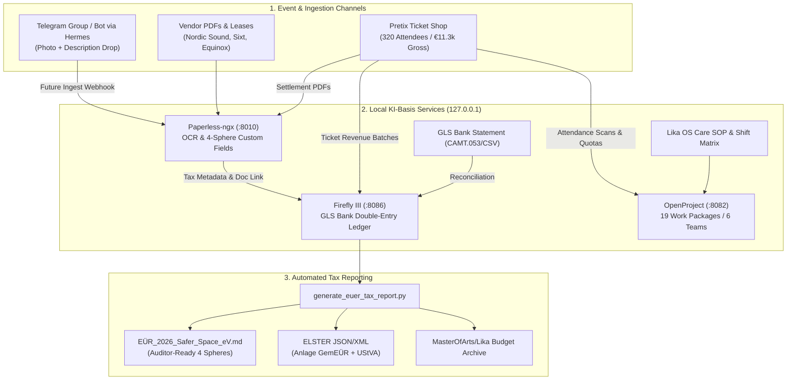

# Lika OS & Safer Space e.V. — Event Operations & Automated Tax Manual
**Event:** Fundraiser Hamburg — Equinox 2026  
**Host Entity:** Safer Space e.V. (Amtsgericht Hamburg VR 24198)  
**Community Brand:** Temple of Lika / Lika OS  
**Fiscal Year:** 2026 (Regelbesteuerung & Vorsteuerabzug)  
**Stack:** Pretix Ticketing • OpenProject • Firefly III • Paperless-ngx • Telegram/Hermes Interface  
**Status:** Live & Operational  

---

## 1. Executive Summary & Stack Architecture

This manual establishes the concrete operational blueprint for the **Hamburg Equinox Fundraiser** and the underlying infrastructure of **Safer Space e.V. (Temple of Lika)**. It unifies high-standard community event management (affirmative consent, volunteer fairness, venue relations) with a fully auditable, automated receipt-to-tax pipeline under German non-profit association tax law (*Gemeinnützigkeitsrecht*).



---

## 2. Event Management Blueprint: Equinox Hamburg 2026

### 2.1 Venue Profile & Spatial Layout
- **Venue:** Equinox Club Hamburg, Große Elbstraße 142, 22767 Hamburg.
- **Capacity:** Strictly capped at **320 attendees** via Pretix to ensure intimate, safe community density.
- **Spatial Zones:**
  1. *Main Dance Floor:* 12kW L-Acoustics audio system, moving-head LED lighting, calibrated to Hamburg noise limits ($\le 99\text{ dB(A) }L_{\text{eq}}$).
  2. *Elevated Pole Stage & Performance Cage:* Structural load-bearing rigging for sensual dance and artistic acrobatics.
  3. *Lika Care Station & Lower Lounge:* Quiet, softly lit recovery zone staffed by the Care Team with free water, electrolytes, organic fruit, and herbal teas.
  4. *Upper Retreat & Cuddle Puddle:* Padded, fabric-rich zone dedicated to consensual touch, relaxation, and conversation under continuous Care Host presence.
  5. *Equinox Bar:* Commercial beverage area operated by Equinox staff.

### 2.2 Venue Terms & Bar Turnover Guarantee (€7,500 Threshold)
- **Contractual Clause (§ 2 Mietvertrag):** A minimum bar turnover of **€7,500.00 brutto** is guaranteed by Safer Space e.V.
- **Venue Consideration:** Upon reaching this turnover, Equinox Event GmbH provides:
  - 4 certified door security bouncers for the entire night.
  - Complete post-event commercial cleaning.
  - All bar staffing, glassware, and beverage logistics.
- **Pragmatic Risk Management (No Overengineering):**
  - Expected bar spend: 320 guests $\times$ estimated €28.50 average consumption = **€9,120.00** (a safe €1,620 cushion above the guarantee).
  - The Door Lead and Equinox Shift Manager conduct simple, informal milestone check-ins at **23:30, 01:30, and 03:30** to confirm bar sales pace.
  - A refundable security deposit of €1,500 is held in escrow, returning zero liability to the e.V. books.

### 2.3 Pretix Ticketing & Door Check-In Protocol
- **Sales Tiers (Sold Out):**
  - *Early Bird:* 80 tickets @ €25.00 = €2,000.00
  - *Regular Tier:* 180 tickets @ €35.00 = €6,300.00
  - *Supporter Tier:* 60 tickets @ €50.00 = €3,000.00 (includes €15 voluntary solidarity donation)
  - **Total Gross:** €11,300.00 | **Net Payout:** €10,833.90 (after €466.10 Pretix/gateway fees).
- **Mandatory Consent Intake:** 100% of purchasers must explicitly accept the *Lika Community Awareness, Consent & Safer Space Code of Conduct* at checkout.
- **Door Check-in:**
  - 3 mobile devices equipped with the **PretixSCAN app** validate QR codes in <0.5 seconds with offline caching support.
  - Fast-track validation confirms consent agreement, dispenses fabric wristbands, and routes guests to coat check without queuing in the street.

### 2.4 Lika Shift Planning OS Governance v1.1
Integrated into OpenProject across 6 functional teams:
- **Core Circle & Production Lead:** Escalation bridge, legal authority, and financial release.
- **Venue Logistics & Infrastructure:** 12kW load-in, power distribution, and teardown.
- **Sound, Lighting & Visual Art:** Audio engineering, cage rigging, and decibel compliance.
- **Performers, DJs & Stage Management:** Lineup timing, green room hospitality, changeovers.
- **Lika Awareness, Care & Consent Team:** Active angels, cuddle puddle hosting, de-escalation.
- **Reception, Door & Bar Coordination:** Pretix scanner check-in, coat check, Equinox liaison.
- **Governance Rules:**
  - *Maximum 2 shifts* per volunteer.
  - *Mandatory 2-hour rest interval* between consecutive assignments.
  - *Dual-Confirmation Swap Protocol:* Swaps are invalid until logged in the channel and updated in OpenProject.

### 2.5 Care Team SOP & Incident Protocol
- Marked with discreet violet armbands, Care Angels provide proactive harm reduction and peer support.
- **De-escalation Steps:** Grounding in the Lower Lounge $\rightarrow$ active listening $\rightarrow$ safety assessment.
- **Boundary Violations:** Immediate escalation to Core Circle and Door Lead for guest ejection without debate.
- **Anonymized Care Log:** Incidents are recorded with timestamp, location, category (e.g. sensory overload, boundary concern), and resolution—strictly without storing identifying personal names to uphold trust and GDPR compliance.
- **Debriefing:** Mandatory group debrief at 05:45 with the Core Circle.

---

## 3. Real Lika Infrastructure: Receipt-to-Tax Engine

### 3.1 Future Telegram / Hermes Ingestion Interface
In future iterations, an autonomous Hermes skill will connect a dedicated Telegram group/supergroup:
1. **Intake:** A volunteer snaps a photo of a store receipt in Telegram and adds a brief description (e.g. `Bauhaus tape & cable ties €45.20 #logistics`).
2. **Hermes Automation:** Hermes listens via webhook, performs multimodal vision extraction via OpenRouter (`nvidia/nemotron-3.5-lightning:free`), validates the tax figures, and submits the file to Paperless-ngx via REST API (`/api/documents/post_document/`).
3. **Ledger Staging:** A Paperless post-consumption webhook pushes the metadata into Firefly III as a draft transaction referencing the Paperless document ID.

### 3.2 German Association Tax Model: The 2026 Transition
- **Prior Year Reality (2025):** 2025 ticket turnover was €26,670 (excluding €1,480 in voluntary donations).
- **The Threshold Effect:** Because 2025 revenue exceeded €25,000, Safer Space e.V. is **not Kleinunternehmer in 2026** (§ 19 UStG).
- **Turning Constraint into Advantage (Vorsteuerabzug):**
  - By operating under *Regelbesteuerung* in 2026, the e.V. deducts 19% *Vorsteuer* on production invoices:
    - Nordic Sound & Light PA: **€465.50 Vorsteuer refund**
    - Sixt Transporter Van: **€34.46 Vorsteuer refund**
    - Bio-Großmarkt Care Supplies: **€18.62 Vorsteuer refund**
    - **Total Vorsteuer Claimed:** **€518.58 saved directly on event costs!**
  - Output VAT on cultural tickets is taxed at the reduced 7% rate (§ 12 Abs. 2 Nr. 7a UStG / § 68 Nr. 7 AO), leaving a minimal net tax balance.
- **Reversion in 2027:** If total 2026 turnover remains below €25,000, the association automatically re-qualifies for *Kleinunternehmer* status in 2027.

### 3.3 The 4 Statutory Spheres in Safer Space e.V. Bookkeeping
1. **Ideeller Bereich (0% Tax):**
   - Pure donations without counter-performance (*ohne Gegenleistung*).
   - In Equinox 2026: **€900.00** from the Supporter ticket solidarity surcharge (60 tickets $\times$ €15 donation component).
2. **Vermögensverwaltung (0% / 7% Tax):**
   - Capital investments, long-term equipment leasing. (€0.00 for this event).
3. **Zweckbetrieb (7% Tax / Cultural Exemption):**
   - Cultural event operations promoting statutory purposes (§ 68 Nr. 7 AO).
   - Revenue: **€10,400.00** base ticket sales.
   - Operating Costs: **€5,632.00** (sound, artist honorariums, van, food, pretix fees).
   - *Vorsteuer* claimed: **€518.58**.
   - Net Zweckbetrieb Surplus: **+€4,768.00**.
4. **Wirtschaftlicher Geschäftsbetrieb - wGB (19% Tax):**
   - Commercial catering and merchandise.
   - Strictly **€0.00** on e.V. books: Equinox Event GmbH sells all beverages on its own commercial account.

---

## 4. Practical User Stories

### Story 1: Sarah — Awareness & Care Lead
> **Scene: Bio-Großmarkt Hamburg & Cuddle Puddle**  
> On Friday afternoon, Sarah buys electrolytes, bananas, vegan chocolates, and organic teas for the Care Station (€284.60). At the cash register, she snaps a photo with her smartphone and sends it to the Telegram group with the caption: *"Care supplies for Equinox"*.  
> Behind the scenes, the image is ingested into Paperless-ngx, OCR extracts the 7% food VAT (€18.62), and Firefly logs an expense under `Zweckbetrieb: Care & Awareness`.  
> At 01:00, Sarah is hosting the Cuddle Puddle. A guest feels dizzy and overwhelmed. Sarah guides them to the Lower Lounge, provides electrolyte water, and logs an anonymized entry: *"01:15 - Sensory exhaustion / De-escalated with electrolytes"*. Sarah finishes her shift at 03:00 and takes her mandatory 2-hour rest before joining the 05:45 debriefing.

### Story 2: Leon — Door Scanner & Bar Liaison
> **Scene: Equinox Club Entrance**  
> At 22:30, a line of 50 guests forms at the door. Leon opens the PretixSCAN app on an e.V. smartphone. As each attendee shows their ticket QR code, Leon scans it in under half a second. The screen flashes green with *"Consent Confirmed"*. Leon hands them an Equinox fabric wristband.  
> At 01:30, Leon conducts a quick 2-minute sync with Marco, the Equinox bar manager. Marco's till shows €4,850 in bar revenue. Leon notes this in OpenProject WP #56: *"Pace is strong; projected to hit ~€9,000 by 04:00, well past the €7,500 bar turnover guarantee."*

### Story 3: Jonas — Rigging & Sound Volunteer
> **Scene: Dance Floor & Stage Load-in**  
> At 14:30, Nordic Sound & Light arrives with an IVECO truck carrying 4x SB18 subs and ARCS line arrays. Jonas helps load in cables and checks the structural shackles for the performance cage.  
> Later, Jonas notices that his second shift on Saturday morning clashes with an urgent personal commitment. Following Lika OS Governance v1.1, he finds a replacement, posts a dual-confirmation message in the shift channel, and Area Lead updates OpenProject WP #45, ensuring zero coverage gaps during teardown.

### Story 4: Alex — Association Treasurer
> **Scene: Annual Tax Preparation**  
> In January, Alex sits down to prepare the tax return. Instead of sorting shoeboxes of faded receipts, Alex runs `python scripts/generate_euer_tax_report.py`.  
> The script pulls reconciled data from Firefly III and Paperless-ngx, generating:
> 1. `EÜR_2026_Safer_Space_eV.md`: Complete 4-sphere statement showing €900 donations, €10,400 cultural revenues, €518.58 claimed input VAT, and **€5,668.00 net community surplus**.
> 2. `ELSTER_Anlage_GemEUR_2026_Mapping.json`: Exact line-by-line figures ready for tax filing.  
> The audit report links every single expense to an immutable, OCR-indexed PDF in Paperless-ngx.

---

## 5. Verification & Stack Commands

### Running Stack Lifecycle
```powershell
# Start all 7 stack containers
.\ki-basis\scripts\start-ki-basis.ps1

# Stop stack
.\ki-basis\scripts\stop-ki-basis.ps1
```

### Running the Automated Tax & Audit Engines
```powershell
# 1. Regenerate Pretix Payout Statement & Quotations
python ki-basis\scripts\pretix_adapter.py

# 2. Run Unified Stack Verification Audit (Pretix, OpenProject, Firefly, Paperless)
python ki-basis\scripts\verify_fundraiser_stack.py

# 3. Generate Official 4-Sphere EÜR and ELSTER Tax Mapping
python ki-basis\scripts\generate_euer_tax_report.py
```

### Canonical File Mirror Locations
- Staged fixtures: [`ki-basis\fixtures\fundraiser_hamburg\`](file:///C:/GitDev/apexai-os-meta/ki-basis/fixtures/fundraiser_hamburg)
- Permanent Lika budget archive: [`C:\GitDev\MasterOfArts\Lika\Verein & Finances\Budgets\Fundraiser_Hamburg_2026\`](file:///C:/GitDev/MasterOfArts/Lika/Verein%20&%20Finances/Budgets/Fundraiser_Hamburg_2026)
